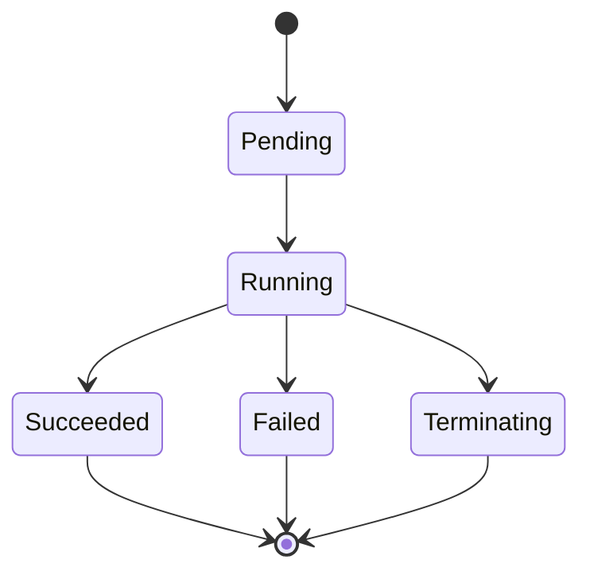
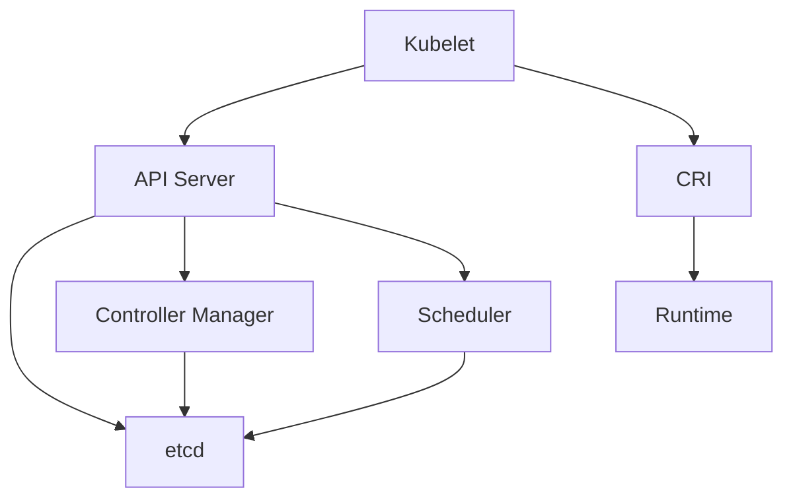

# 19. 形式化理论：结构同构与关系等价

## 目录

- [目录](#目录)
- [19.1 文档定位](#191-文档定位)
- [19.1.1 形式化基础理论](#1911-形式化基础理论)
  - [形式系统定义](#形式系统定义)
  - [模型论基础](#模型论基础)
  - [证明论基础](#证明论基础)
  - [集合论基础](#集合论基础)
  - [类型论基础](#类型论基础)
- [19.2 结构同构性](#192-结构同构性)
  - [19.2.1 容器运行时同构](#1921-容器运行时同构)
  - [19.2.2 编排系统同构](#1922-编排系统同构)
  - [19.2.3 存储系统同构](#1923-存储系统同构)
  - [19.2.4 网络系统同构](#1924-网络系统同构)
- [19.3 关系等价性](#193-关系等价性)
  - [19.3.1 运行时接口等价](#1931-运行时接口等价)
  - [19.3.2 API 接口等价](#1932-api-接口等价)
  - [19.3.3 协议等价](#1933-协议等价)
  - [19.3.4 规范等价](#1934-规范等价)
- [19.4 分布式系统理论](#194-分布式系统理论)
  - [19.4.1 CAP 定理应用](#1941-cap-定理应用)
  - [19.4.2 一致性模型](#1942-一致性模型)
  - [19.4.3 可用性模型](#1943-可用性模型)
  - [19.4.4 分区容忍性](#1944-分区容忍性)
- [19.5 功能聚合理论](#195-功能聚合理论)
  - [19.5.1 功能组合](#1951-功能组合)
  - [19.5.2 接口抽象](#1952-接口抽象)
  - [19.5.3 插件机制](#1953-插件机制)
  - [19.5.4 模块化设计](#1954-模块化设计)
- [19.6 网络拓扑理论](#196-网络拓扑理论)
  - [19.6.1 拓扑结构](#1961-拓扑结构)
  - [19.6.2 路由协议](#1962-路由协议)
  - [19.6.3 负载均衡](#1963-负载均衡)
  - [19.6.4 服务发现](#1964-服务发现)
- [19.7 形式化模型](#197-形式化模型)
  - [19.7.1 状态机模型](#1971-状态机模型)
  - [19.7.2 事件驱动模型](#1972-事件驱动模型)
  - [19.7.3 控制理论模型](#1973-控制理论模型)
  - [19.7.4 图论模型](#1974-图论模型)
- [19.8 虚拟化层次的形式化理论](#198-虚拟化层次的形式化理论)
  - [19.8.1 Popek-Goldberg 虚拟化定理](#1981-popek-goldberg-虚拟化定理)
  - [19.8.2 虚拟化（全虚拟化）形式化模型](#1982-虚拟化全虚拟化形式化模型)
  - [19.8.3 半虚拟化形式化模型](#1983-半虚拟化形式化模型)
  - [19.8.4 容器化形式化模型](#1984-容器化形式化模型)
  - [19.8.5 沙盒化形式化模型](#1985-沙盒化形式化模型)
  - [19.8.6 四层次形式化对比](#1986-四层次形式化对比)
- [19.9 同构等价映射表](#199-同构等价映射表)
- [19.9 参考](#199-参考)

---

## 19.1 文档定位

本文档从形式化理论（Formal Theory）角度梳理云原生容器技术栈的结构同构性、关系等
价性、分布式系统理论、功能聚合和网络拓扑支持，作为技术本质的理论参考。

根据 Wikipedia，形式化理论（Formal Theory）是指使用形式系统（Formal System）来表
达和推导数学或逻辑命题的理论。形式系统由符号、语法规则和推理规则组成，用于严格定
义和验证数学结构。

**Wikipedia 定义参考**（as of 2025-11-02）：

> "A formal theory is a set of sentences in a formal language. A formal system
> (also called a logical calculus) is a formal theory together with a formal
> grammar that consists of a recursive definition of the well-formed formulas of
> the theory."

## 19.1.1 形式化基础理论

### 形式系统定义

根据 Wikipedia，形式系统（Formal System）由以下部分组成：

**形式系统组成**：

$$\mathcal{F} = (L, A, R)$$

其中：

- $L$ = 形式语言（Formal Language）：符号集合和语法规则
- $A$ = 公理集合（Axioms）：作为基础的语句
- $R$ = 推理规则集合（Inference Rules）：推导规则

**形式语言定义**：

设形式语言 $L = (\Sigma, \mathcal{G})$，其中：

- $\Sigma$ = 符号集合（Alphabet）：有限的符号集合
- $\mathcal{G}$ = 语法规则（Grammar）：定义合法公式（Well-formed Formula）的规则

**公理系统定义**：

公理系统 $A$ 是一组被视为自明（Self-evident）的语句，不需要证明。

**推理规则定义**：

推理规则 $R$ 是从已有语句推导新语句的规则，通常表示为：

$$\frac{P_1, P_2, \ldots, P_n}{Q}$$

表示从前提 $P_1, P_2, \ldots, P_n$ 可以推导出结论 $Q$。

### 模型论基础

根据 Wikipedia，模型论（Model Theory）研究数学结构如何满足特定公理系统。

**模型定义**：

设 $\mathcal{T}$ 是一个理论（Theory），$\mathcal{M}$ 是一个结构（Structure），如
果 $\mathcal{M}$ 满足 $\mathcal{T}$ 中的所有语句，则称 $\mathcal{M}$ 是
$\mathcal{T}$ 的一个模型（Model），记为 $\mathcal{M} \models \mathcal{T}$。

**容器技术模型**：

- **OCI 规范模
  型**：$\mathcal{M}_{\text{OCI}} \models \mathcal{T}_{\text{OCI}}$，表示结构满
  足 OCI 规范
- **CRI 规范模
  型**：$\mathcal{M}_{\text{CRI}} \models \mathcal{T}_{\text{CRI}}$，表示结构满
  足 CRI 规范
- **CNI 规范模
  型**：$\mathcal{M}_{\text{CNI}} \models \mathcal{T}_{\text{CNI}}$，表示结构满
  足 CNI 规范

### 证明论基础

根据 Wikipedia，证明论（Proof Theory）分析数学证明的结构和性质。

**证明定义**：

设 $\mathcal{T}$ 是一个理论，语句 $\phi$ 在 $\mathcal{T}$ 中可证明（Provable），
记为 $\mathcal{T} \vdash \phi$，当且仅当存在一个从公理到 $\phi$ 的有限推导序列。

**完备性定理**：

根据 Gödel 完备性定理（Gödel's Completeness Theorem），对于一阶逻辑：

$$\mathcal{T} \models \phi \quad \text{当且仅当} \quad \mathcal{T} \vdash \phi$$

即：语义可满足（Satisfiable）等价于语法可证明（Provable）。

**一致性定义**：

理论 $\mathcal{T}$ 是一致的（Consistent），当且仅当不存在语句 $\phi$ 使得
$\mathcal{T} \vdash \phi$ 和 $\mathcal{T} \vdash \neg \phi$ 同时成立。

**Gödel 不完备性定理**：

根据 Wikipedia，Gödel 第一不完备性定理（Gödel's First Incompleteness Theorem）指
出：任何足够强的递归公理系统，如果是一致的，则必然是不完备的。即存在既不能被证明
也不能被否证的语句。

**容器技术一致性**：

- **OCI 规范一致性**：$\mathcal{T}_{\text{OCI}}$ 是一致的，不存在矛盾的规范定义
- **CRI 规范一致性**：$\mathcal{T}_{\text{CRI}}$ 是一致的，所有实现都遵循相同的
  语义
- **Kubernetes API 一致性**：$\mathcal{T}_{\text{K8s}}$ 是一致的，API 定义无矛盾

### 集合论基础

根据 Wikipedia，集合论（Set Theory）是研究集合的数学理论，是数学的基础理论之一。

**ZFC 公理系统**（Zermelo-Fraenkel Set Theory with Choice）：

根据 Wikipedia，ZFC 是集合论的标准公理系统，包括：

1. **外延公理（Axiom of Extensionality）**：两个集合相等当且仅当它们包含相同的元
   素
2. **空集公理（Axiom of Empty Set）**：存在空集 $\emptyset$
3. **配对公理（Axiom of Pairing）**：对于任意两个集合 $A$ 和 $B$，存在集合
   $\{A, B\}$
4. **并集公理（Axiom of Union）**：对于任意集合 $A$，存在其所有元素的并集
   $\bigcup A$
5. **幂集公理（Axiom of Power Set）**：对于任意集合 $A$，存在其所有子集的集合
   $\mathcal{P}(A)$
6. **分离公理（Axiom Schema of Separation）**：对于任意集合 $A$ 和性质 $P$，存在
   满足 $P$ 的子集 $\{x \in A | P(x)\}$
7. **替换公理（Axiom Schema of Replacement）**：对于任意集合 $A$ 和函数 $f$，存
   在像集合 $\{f(x) | x \in A\}$
8. **无穷公理（Axiom of Infinity）**：存在归纳集合（包含空集且对后继运算封闭）
9. **正则公理（Axiom of Regularity）**：任意非空集合都包含一个与它不相交的元素
10. **选择公理（Axiom of Choice）**：对于任意集合族，存在选择函数

**容器技术集合论应用**：

- **Pod 集合**：$\mathcal{P} = \{p_1, p_2, \ldots, p_n\}$，其中 $p_i$ 是 Pod 对
  象
- **Node 集合**：$\mathcal{N} = \{n_1, n_2, \ldots, n_m\}$，其中 $n_j$ 是 Node
  对象
- **调度函数**：$f: \mathcal{P} \rightarrow \mathcal{N}$，将 Pod 映射到 Node，满
  足：
  - **单射性**（Injective）：不同 Pod 可以调度到同一 Node
  - **满射性**（Surjective）：每个 Node 都可以被调度
  - **容量约束**：$|f^{-1}(n_j)| \leq \text{capacity}(n_j)$（每个 Node 的 Pod 数
    量不超过容量）

**集合运算**：

- **并
  集**：$\mathcal{P}_1 \cup \mathcal{P}_2 = \{p | p \in \mathcal{P}_1 \text{ 或 } p \in \mathcal{P}_2\}$
- **交
  集**：$\mathcal{P}_1 \cap \mathcal{P}_2 = \{p | p \in \mathcal{P}_1 \text{ 且 } p \in \mathcal{P}_2\}$
- **差
  集**：$\mathcal{P}_1 \setminus \mathcal{P}_2 = \{p | p \in \mathcal{P}_1 \text{ 且 } p \notin \mathcal{P}_2\}$
- **笛卡尔
  积**：$\mathcal{P} \times \mathcal{N} = \{(p, n) | p \in \mathcal{P}, n \in \mathcal{N}\}$（Pod
  与 Node 的配对）

### 类型论基础

根据 Wikipedia，类型论（Type Theory）是研究类型系统的数学理论，广泛应用于计算机
科学。

**类型系统定义**：

类型系统 $\mathcal{T} = (Type, Term, \vdash)$，其中：

- $Type$ = 类型集合（Type Universe）
- $Term$ = 项（Term）集合
- $\vdash$ = 类型判断关系（Typing Relation）：$Term \vdash Type$

**容器技术类型系统**：

- **Image 类型**：$\text{Image}: \text{Registry} \rightarrow \text{Image}$（从镜
  像仓库到镜像）
- **Container 类
  型**：$\text{Container}: \text{Image} \rightarrow \text{Container}$（从镜像到
  容器）
- **Pod 类型**：$\text{Pod}: \text{Container}^* \rightarrow \text{Pod}$（从容器
  列表到 Pod）

**类型安全**：

根据 Wikipedia，类型安全（Type Safety）是指类型系统保证程序不会出现类型错误。

**容器技术类型安全**：

- **OCI 类型安全**：OCI 镜像必须符合 Manifest 和 Config 的类型定义
- **CRI 类型安全**：CRI 接口调用必须符合 API 类型定义
- **Kubernetes 类型安全**：Kubernetes 对象必须符合 Schema 定义

**依赖类型**（Dependent Types）：

根据 Wikipedia，依赖类型允许类型依赖于值，提供了更精确的类型表达能力。

**容器技术依赖类型**：

- **Pod 类型依赖于
  Image**：$\text{Pod}(\text{Image}): \text{Image} \rightarrow \text{Pod}$
- **Container 类型依赖于
  Runtime**：$\text{Container}(\text{Runtime}): \text{Runtime} \rightarrow \text{Container}$

---

**文档结构**：

- **结构同构性**：不同技术在结构上的同构关系
- **关系等价性**：不同技术在功能上的等价关系
- **分布式系统理论**：CAP 定理、一致性、可用性等理论应用
- **功能聚合理论**：功能组合、接口抽象、插件机制
- **网络拓扑理论**：拓扑结构、路由协议、负载均衡
- **形式化模型**：状态机、事件驱动、控制理论、图论模型

**形式化理论核心概念**（根据 Wikipedia）：

1. **形式系统（Formal System）**：

   - **语言（Language）**：符号集合和语法规则
   - **公理（Axioms）**：作为理论基础的语句
   - **推理规则（Inference Rules）**：从公理推导定理的规则

2. **模型论（Model Theory）**：

   - 研究数学结构如何满足特定公理系统
   - 不同模型之间的关系
   - 语义和语法之间的关系

3. **证明论（Proof Theory）**：

   - 分析数学证明的结构
   - 研究可证明性和一致性
   - 构造性证明和非构造性证明

4. **集合论（Set Theory）**：
   - ZFC 公理系统
   - 集合运算和关系
   - 基数与序数

## 19.2 结构同构性

### 19.2.1 容器运行时同构

**同构定义**：两个容器运行时在结构上同构，当且仅当它们在功能组件上存在一一对应关
系。

**同构映射**：

| Docker (runc)       | containerd          | crun          | WasmEdge             | 功能        |
| ------------------- | ------------------- | ------------- | -------------------- | ----------- |
| **dockerd**         | **containerd**      | **crun**      | **WasmEdge**         | 守护进程    |
| **containerd-shim** | **containerd-shim** | **crun-shim** | **runwasi**          | 运行时 shim |
| **runc**            | **runc**            | **crun**      | **WasmEdge Runtime** | 实际运行时  |
| **OCI Image**       | **OCI Image**       | **OCI Image** | **OCI Artifact**     | 镜像规范    |
| **rootfs**          | **rootfs**          | **rootfs**    | **Wasm Module**      | 应用打包    |

**形式化定义**：

设运行时为 $R = \{D, S, I, A\}$，其中：

- $D$ = 守护进程（Daemon）
- $S$ = Shim 进程
- $I$ = 镜像（Image）
- $A$ = 应用（Application）

**Docker 结构**：
$$R_D = \{\text{dockerd}, \text{containerd-shim}, \text{OCI Image}, \text{rootfs}\}$$

**containerd 结构**：
$$R_C = \{\text{containerd}, \text{containerd-shim}, \text{OCI Image}, \text{rootfs}\}$$

**crun 结构**：
$$R_{crun} = \{\text{crun}, \text{crun-shim}, \text{OCI Image}, \text{rootfs}\}$$

**WasmEdge 结构**：
$$R_W = \{\text{WasmEdge}, \text{runwasi}, \text{OCI Artifact}, \text{Wasm Module}\}$$

**同构定理 19.1**：所有容器运行时在结构上同构，即存在双射
$f: R_D \rightarrow R_C \rightarrow R_{crun} \rightarrow R_W$。

**证明**：所有运行时都遵循 OCI 规范，组件功能一一对应。

$\square$

### 19.2.2 编排系统同构

**同构定义**：编排系统在控制平面结构上同构。

**同构映射**：

| Kubernetes             | K3s                | Docker Swarm        | 功能     |
| ---------------------- | ------------------ | ------------------- | -------- |
| **API Server**         | **k3s API Server** | **Swarm Manager**   | API 网关 |
| **etcd**               | **sqlite**         | **Raft**            | 状态存储 |
| **Controller Manager** | **K3s Controller** | **Orchestrator**    | 控制器   |
| **Scheduler**          | **K3s Scheduler**  | **Swarm Scheduler** | 调度器   |
| **kubelet**            | **k3s Agent**      | **Swarm Worker**    | 节点代理 |

**形式化定义**：

设编排系统为 $O = \{A, S, C, Sch, N\}$，其中：

- $A$ = API Server
- $S$ = 状态存储（Storage）
- $C$ = 控制器（Controller）
- $Sch$ = 调度器（Scheduler）
- $N$ = 节点代理（Node Agent）

**Kubernetes 结构**：
$$O_K = \{\text{API Server}, \text{etcd}, \text{Controller Manager}, \text{Scheduler}, \text{kubelet}\}$$

**K3s 结构**：
$$O_{K3} = \{\text{k3s API Server}, \text{sqlite}, \text{K3s Controller}, \text{K3s Scheduler}, \text{k3s Agent}\}$$

**Docker Swarm 结构**：
$$O_S = \{\text{Swarm Manager}, \text{Raft}, \text{Orchestrator}, \text{Swarm Scheduler}, \text{Swarm Worker}\}$$

**同构定理 19.2**：所有编排系统在控制平面结构上同构，即存在双射
$g: O_K \rightarrow O_{K3} \rightarrow O_S$。

**证明**：所有编排系统都遵循相同的控制平面架构模式。

$\square$

### 19.2.3 存储系统同构

**同构定义**：存储系统在存储抽象上同构。

**同构映射**：

| etcd                | sqlite          | Raft           | Consul              | 功能     |
| ------------------- | --------------- | -------------- | ------------------- | -------- |
| **Key-Value Store** | **SQLite DB**   | **Raft Log**   | **Key-Value Store** | 数据存储 |
| **Watch API**       | **Triggers**    | **Raft State** | **Watch API**       | 变更通知 |
| **Transaction**     | **Transaction** | **Raft Entry** | **Transaction**     | 事务支持 |
| **Lease**           | **WAL**         | **Raft Term**  | **Session**         | 租约机制 |

**形式化定义**：

设存储系统为 $St = \{K, W, T, L\}$，其中：

- $K$ = Key-Value 存储
- $W$ = Watch 机制
- $T$ = 事务支持
- $L$ = 租约机制

**etcd 结构**：
$$St_e = \{\text{Key-Value}, \text{Watch}, \text{Transaction}, \text{Lease}\}$$

**sqlite 结构**：
$$St_s = \{\text{SQLite DB}, \text{Triggers}, \text{Transaction}, \text{WAL}\}$$

**Raft 结构**：
$$St_r = \{\text{Raft Log}, \text{Raft State}, \text{Raft Entry}, \text{Raft Term}\}$$

**同构定理 19.3**：所有分布式存储系统在存储抽象上同构，即存在双射
$h: St_e \rightarrow St_s \rightarrow St_r$。

**证明**：所有存储系统都提供相同的存储抽象接口。

$\square$

### 19.2.4 网络系统同构

**同构定义**：网络系统在网络抽象上同构。

**同构映射**：

| flannel               | Calico                | Cilium                | 功能     |
| --------------------- | --------------------- | --------------------- | -------- |
| **CNI Plugin**        | **CNI Plugin**        | **CNI Plugin**        | CNI 接口 |
| **VXLAN/IPIP**        | **BGP**               | **eBPF**              | 网络协议 |
| **Network Policy**    | **Network Policy**    | **Network Policy**    | 网络策略 |
| **Service Discovery** | **Service Discovery** | **Service Discovery** | 服务发现 |

**形式化定义**：

设网络系统为 $N = \{C, P, NP, SD\}$，其中：

- $C$ = CNI 接口
- $P$ = 网络协议
- $NP$ = 网络策略
- $SD$ = 服务发现

**flannel 结构**：
$$N_f = \{\text{CNI}, \text{VXLAN/IPIP}, \text{Network Policy}, \text{Service Discovery}\}$$

**Calico 结构**：
$$N_c = \{\text{CNI}, \text{BGP}, \text{Network Policy}, \text{Service Discovery}\}$$

**Cilium 结构**：
$$N_{ci} = \{\text{CNI}, \text{eBPF}, \text{Network Policy}, \text{Service Discovery}\}$$

**同构定理 19.4**：所有 CNI 网络系统在网络抽象上同构，即存在双射
$i: N_f \rightarrow N_c \rightarrow N_{ci}$。

**证明**：所有网络系统都遵循 CNI 规范，接口一致。

$\square$

## 19.3 关系等价性

### 19.3.1 运行时接口等价

**等价定义**：两个运行时接口在功能上等价，当且仅当它们提供相同的功能集合。

**等价映射**：

| CRI (containerd)    | CRI-O               | Docker API        | 功能等价 |
| ------------------- | ------------------- | ----------------- | -------- |
| **PullImage**       | **PullImage**       | **docker pull**   | 镜像拉取 |
| **CreateContainer** | **CreateContainer** | **docker create** | 容器创建 |
| **StartContainer**  | **StartContainer**  | **docker start**  | 容器启动 |
| **StopContainer**   | **StopContainer**   | **docker stop**   | 容器停止 |
| **RemoveContainer** | **RemoveContainer** | **docker rm**     | 容器删除 |

**形式化定义**：

设运行时接口为 $I = \{P, C, S, St, R\}$，其中：

- $P$ = Pull 镜像
- $C$ = Create 容器
- $S$ = Start 容器
- $St$ = Stop 容器
- $R$ = Remove 容器

**等价定理 19.5**：CRI、CRI-O、Docker API 在功能上等价，即
$I_{CRI} \equiv I_{CRI-O} \equiv I_{Docker}$。

**证明**：所有接口都提供相同的容器操作功能。

$\square$

### 19.3.2 API 接口等价

**等价定义**：API 接口在语义上等价。

**等价映射**：

| Kubernetes API                                 | K3s API                                        | 功能等价 |
| ---------------------------------------------- | ---------------------------------------------- | -------- |
| **GET /api/v1/pods**                           | **GET /api/v1/pods**                           | Pod 查询 |
| **POST /api/v1/namespaces/{ns}/pods**          | **POST /api/v1/namespaces/{ns}/pods**          | Pod 创建 |
| **PUT /api/v1/namespaces/{ns}/pods/{name}**    | **PUT /api/v1/namespaces/{ns}/pods/{name}**    | Pod 更新 |
| **DELETE /api/v1/namespaces/{ns}/pods/{name}** | **DELETE /api/v1/namespaces/{ns}/pods/{name}** | Pod 删除 |

**形式化定义**：

设 API 接口为 $A = \{G, P, U, D\}$，其中：

- $G$ = GET（查询）
- $P$ = POST（创建）
- $U$ = PUT（更新）
- $D$ = DELETE（删除）

**等价定理 19.6**：Kubernetes API 和 K3s API 在语义上等价，即
$A_K \equiv A_{K3}$。

**证明**：K3s 完全兼容 Kubernetes API。

$\square$

### 19.3.3 协议等价

**等价定义**：网络协议在传输层功能上等价。

**等价映射**：

| HTTP/1.1      | HTTP/2         | gRPC                 | 功能等价 |
| ------------- | -------------- | -------------------- | -------- |
| **请求-响应** | **流式传输**   | **双向流**           | 通信模式 |
| **文本协议**  | **二进制协议** | **Protocol Buffers** | 编码格式 |
| **TCP**       | **TCP**        | **HTTP/2 over TCP**  | 传输层   |

**形式化定义**：

设协议为 $Pr = \{M, E, T\}$，其中：

- $M$ = 通信模式（Message Pattern）
- $E$ = 编码格式（Encoding Format）
- $T$ = 传输层（Transport Layer）

**等价定理 19.7**：HTTP/1.1、HTTP/2、gRPC 在传输层功能上等价，即
$Pr_{HTTP1} \equiv Pr_{HTTP2} \equiv Pr_{gRPC}$。

**证明**：所有协议都基于 TCP，提供可靠的传输服务。

$\square$

### 19.3.4 规范等价

**等价定义**：容器规范在语义上等价。

**等价映射**：

| OCI Image Spec | Docker Image Format | 功能等价 |
| -------------- | ------------------- | -------- |
| **Manifest**   | **Manifest**        | 清单     |
| **Config**     | **Config**          | 配置     |
| **Layers**     | **Layers**          | 层       |

**形式化定义**：

设容器规范为 $Sp = \{M, C, L\}$，其中：

- $M$ = Manifest（清单）
- $C$ = Config（配置）
- $L$ = Layers（层）

**等价定理 19.8**：OCI Image Spec 和 Docker Image Format 在语义上等价，即
$Sp_{OCI} \equiv Sp_{Docker}$。

**证明**：OCI Image Spec 基于 Docker Image Format 标准化。

$\square$

## 19.4 分布式系统理论

### 19.4.1 CAP 定理应用

**CAP 定理**：在分布式系统中，一致性（Consistency）、可用性（Availability）、分
区容忍性（Partition tolerance）三者不可兼得。

**CAP 定理应用**：

| 系统           | C   | A   | P   | 选择    | 说明               |
| -------------- | --- | --- | --- | ------- | ------------------ |
| **etcd**       | ✅  | ❌  | ✅  | **CP**  | 强一致性，容忍分区 |
| **sqlite**     | ✅  | ✅  | ❌  | **CA**  | 单节点，强一致性   |
| **Consul**     | ✅  | ✅  | ✅  | **CAP** | 最终一致性，高可用 |
| **Kubernetes** | ✅  | ❌  | ✅  | **CP**  | 强一致性，容忍分区 |
| **K3s**        | ✅  | ✅  | ❌  | **CA**  | 单节点，强一致性   |

**形式化定义**：

设分布式系统为 $DS = \{C, A, P\}$，其中：

- $C$ = 一致性（Consistency）
- $A$ = 可用性（Availability）
- $P$ = 分区容忍性（Partition tolerance）

**CAP 定理**： $$C + A + P \leq 2$$

**应用定理 19.9**：Kubernetes 选择 CP，K3s 选择 CA，根据场景需求权衡。

### 19.4.2 一致性模型

**一致性模型分类**：

| 模型           | 定义                 | 示例          | 应用场景     |
| -------------- | -------------------- | ------------- | ------------ |
| **强一致性**   | 所有节点看到相同状态 | etcd          | 控制平面状态 |
| **最终一致性** | 最终所有节点状态一致 | Consul        | 服务发现     |
| **会话一致性** | 同一会话内一致       | Session State | Web 会话     |
| **因果一致性** | 因果相关操作一致     | Vector Clock  | 分布式日志   |

**形式化定义**：

设一致性模型为 $CM = \{S, E, C, CA\}$，其中：

- $S$ = 强一致性（Strong Consistency）
- $E$ = 最终一致性（Eventual Consistency）
- $C$ = 会话一致性（Session Consistency）
- $CA$ = 因果一致性（Causal Consistency）

**一致性定理 19.10**：对于分布式存储系统，强一致性需要牺牲可用性，最终一致性提高
可用性但牺牲一致性。

### 19.4.3 可用性模型

**可用性计算**：

$$A = \frac{\text{正常运行时间}}{\text{总时间}} = \frac{MTBF}{MTBF + MTTR}$$

其中：

- $MTBF$ = 平均故障间隔时间（Mean Time Between Failures）
- $MTTR$ = 平均修复时间（Mean Time To Repair）

**可用性等级**：

| 等级        | 可用性  | 年停机时间 | 示例       |
| ----------- | ------- | ---------- | ---------- |
| **99%**     | 99%     | 3.65 天    | 单节点系统 |
| **99.9%**   | 99.9%   | 8.76 小时  | 冗余系统   |
| **99.99%**  | 99.99%  | 52.56 分钟 | 高可用集群 |
| **99.999%** | 99.999% | 5.26 分钟  | 关键系统   |

**形式化定义**：

设可用性为 $A = \frac{MTBF}{MTBF + MTTR}$，则：

- **单节点系统**：$A = 99\%$（MTBF = 1 年，MTTR = 3.65 天）
- **冗余系统**：$A = 99.9\%$（MTBF = 1 年，MTTR = 8.76 小时）
- **高可用集群**：$A = 99.99\%$（MTBF = 1 年，MTTR = 52.56 分钟）

**可用性定理 19.11**：通过冗余和快速修复可以提高系统可用性。

### 19.4.4 分区容忍性

**分区容忍性**：系统在网络分区时仍能正常工作。

**分区容忍策略**：

| 策略         | 说明               | 示例             |
| ------------ | ------------------ | ---------------- |
| **最终一致** | 接受分区，最终一致 | Consul、DynamoDB |
| **强一致**   | 分区时暂停写入     | etcd、Zookeeper  |
| **本地优先** | 分区时本地可用     | sqlite、边缘计算 |

**形式化定义**：

设分区容忍性为 $PT = \{EC, SC, LF\}$，其中：

- $EC$ = 最终一致（Eventual Consistency）
- $SC$ = 强一致（Strong Consistency）
- $LF$ = 本地优先（Local First）

**分区容忍定理 19.12**：边缘计算场景选择本地优先策略，中心集群选择强一致策略。

## 19.5 功能聚合理论

### 19.5.1 功能组合

**功能组合定义**：通过组合多个功能模块实现复杂功能。

**功能组合示例**：

```yaml
功能组合:
  Kubernetes = CRI + CNI + CSI + OPA K3s = CRI + CNI + CSI + OPA (轻量版)
  WasmEdge = WASI + WASI-NN + GPU Plugin OPA-Wasm = OPA + Wasm Compiler
```

**形式化定义**：

设功能组合为 $F = f_1 \circ f_2 \circ \cdots \circ f_n$，其中 $\circ$ 表示函数组
合。

**功能组合定理 19.13**：复杂系统可以通过功能组合实现，即
$S = F_1 \circ F_2 \circ \cdots \circ F_n$。

### 19.5.2 接口抽象

**接口抽象定义**：通过接口抽象隐藏实现细节。

**接口抽象层次**：

| 层次       | 接口    | 实现            | 说明       |
| ---------- | ------- | --------------- | ---------- |
| **应用层** | Pod API | Pod 对象        | 应用抽象   |
| **编排层** | CRI     | containerd/runc | 运行时抽象 |
| **网络层** | CNI     | flannel/Calico  | 网络抽象   |
| **存储层** | CSI     | EBS/NFS         | 存储抽象   |

**形式化定义**：

设接口抽象为 $Abst = \{App, Orc, Net, St\}$，其中：

- $App$ = 应用层抽象
- $Orc$ = 编排层抽象
- $Net$ = 网络层抽象
- $St$ = 存储层抽象

**接口抽象定理 19.14**：通过接口抽象可以实现实现的替换，即
$Impl_1 \equiv Impl_2$（通过相同接口）。

### 19.5.3 插件机制

**插件机制定义**：通过插件扩展系统功能。

**插件机制示例**：

| 系统           | 插件机制      | 插件示例                     |
| -------------- | ------------- | ---------------------------- |
| **Kubernetes** | Controller    | HPA、VPA、Cluster Autoscaler |
| **WasmEdge**   | Plugin        | WASI-NN、GPU Plugin          |
| **CNI**        | CNI Plugin    | flannel、Calico、Cilium      |
| **OPA**        | Policy Plugin | Gatekeeper、Kyverno          |

**形式化定义**：

设插件机制为 $Plug = \{Base, Ext\}$，其中：

- $Base$ = 基础系统
- $Ext$ = 扩展插件

**插件机制定理 19.15**：通过插件机制可以实现功能的动态扩展，即
$System = Base + \sum Plug_i$。

### 19.5.4 模块化设计

**模块化设计定义**：通过模块化实现系统的可维护性和可扩展性。

**模块化设计层次**：

| 层次           | 模块                     | 职责       | 接口           |
| -------------- | ------------------------ | ---------- | -------------- |
| **应用层**     | Pod、Service、Deployment | 应用管理   | Kubernetes API |
| **编排层**     | Controller、Scheduler    | 编排逻辑   | Controller API |
| **运行时层**   | CRI、RuntimeClass        | 运行时管理 | CRI API        |
| **基础设施层** | CNI、CSI                 | 基础设施   | CNI/CSI API    |

**形式化定义**：

设模块化设计为 $Mod = \{M_1, M_2, \ldots, M_n\}$，其中：

- $M_i$ = 第 $i$ 个模块
- $\sum M_i$ = 系统总和

**模块化设计定理 19.16**：通过模块化设计可以实现系统的可维护性和可扩展性，即
$System = \sum M_i$（模块独立）。

## 19.6 网络拓扑理论

### 19.6.1 拓扑结构

**网络拓扑分类**：

| 拓扑         | 定义                 | 特点       | 应用场景            |
| ------------ | -------------------- | ---------- | ------------------- |
| **星型拓扑** | 中心节点连接所有节点 | 单点故障   | Kubernetes 控制平面 |
| **网状拓扑** | 所有节点互相连接     | 高冗余     | Service Mesh        |
| **树型拓扑** | 分层树形结构         | 可扩展     | 集群层次结构        |
| **总线拓扑** | 所有节点共享总线     | 简单但低效 | 单机网络            |

**形式化定义**：

设网络拓扑为图 $G = (V, E)$，其中：

- $V$ = 节点集合（Vertices）
- $E$ = 边集合（Edges）

**拓扑定理 19.17**：Kubernetes 控制平面采用星型拓扑，数据平面采用网状拓扑。

### 19.6.2 路由协议

**路由协议分类**：

| 协议         | 类型         | 特点       | 应用场景   |
| ------------ | ------------ | ---------- | ---------- |
| **BGP**      | 外部网关协议 | 大规模路由 | Calico     |
| **OSPF**     | 内部网关协议 | 动态路由   | 内部网络   |
| **静态路由** | 静态配置     | 简单       | 小规模网络 |
| **VXLAN**    | 隧道协议     | 虚拟网络   | flannel    |

**形式化定义**：

设路由协议为 $R = \{BGP, OSPF, Static, VXLAN\}$。

**路由协议定理 19.18**：根据网络规模选择合适的路由协议，大规模选择 BGP，小规模选
择静态路由。

### 19.6.3 负载均衡

**负载均衡算法**：

| 算法                     | 定义     | 特点     | 应用场景   |
| ------------------------ | -------- | -------- | ---------- |
| **Round Robin**          | 轮询     | 简单     | 无状态服务 |
| **Least Connections**    | 最少连接 | 均衡负载 | 长连接服务 |
| **IP Hash**              | IP 哈希  | 会话保持 | 有状态服务 |
| **Weighted Round Robin** | 加权轮询 | 性能差异 | 异构节点   |

**形式化定义**：

设负载均衡函数为 $LB(S, A)$，其中：

- $S$ = 服务器集合
- $A$ = 算法

**负载均衡定理 19.19**：根据服务类型选择合适的负载均衡算法，无状态服务选择 Round
Robin，有状态服务选择 IP Hash。

### 19.6.4 服务发现

**服务发现机制**：

| 机制                   | 定义           | 特点   | 应用场景     |
| ---------------------- | -------------- | ------ | ------------ |
| **DNS**                | 域名解析       | 简单   | 标准服务发现 |
| **Consul**             | 分布式服务发现 | 高可用 | 大规模集群   |
| **etcd**               | 键值存储       | 强一致 | Kubernetes   |
| **Kubernetes Service** | 服务抽象       | 内置   | Kubernetes   |

**形式化定义**：

设服务发现为 $SD = \{DNS, Consul, etcd, K8s Service\}$。

**服务发现定理 19.20**：Kubernetes 使用 Service 实现服务发现，通过 DNS 或环境变
量暴露服务。

## 19.7 形式化模型

### 19.7.1 状态机模型

**状态机定义**：系统状态和状态转换的数学模型。

**Pod 状态机**：



**形式化定义**：

设状态机为 $SM = \{S, E, T, I, F\}$，其中：

- $S$ = 状态集合（States）
- $E$ = 事件集合（Events）
- $T$ = 转换函数（Transitions）
- $I$ = 初始状态（Initial State）
- $F$ = 终止状态（Final States）

**状态机定理 19.21**：Kubernetes Pod 生命周期可以用有限状态机建模。

### 19.7.2 事件驱动模型

**事件驱动定义**：系统通过事件触发状态变更。

**事件驱动模型**：

| 事件              | 触发               | 处理            | 结果           |
| ----------------- | ------------------ | --------------- | -------------- |
| **Pod Created**   | API 创建 Pod       | Scheduler 调度  | Pod 调度到节点 |
| **Pod Scheduled** | Scheduler 调度完成 | Kubelet 启动    | Pod 启动       |
| **Pod Running**   | Pod 运行           | Controller 监控 | 状态同步       |
| **Pod Failed**    | Pod 失败           | Controller 重启 | Pod 重启       |

**形式化定义**：

设事件驱动为 $ED = \{E, H, R\}$，其中：

- $E$ = 事件集合（Events）
- $H$ = 处理函数（Handlers）
- $R$ = 响应（Responses）

**事件驱动定理 19.22**：Kubernetes 采用事件驱动架构，通过 Controller 监听事件并
处理。

### 19.7.3 控制理论模型

**控制理论定义**：通过反馈控制实现系统稳定。

**控制循环模型**：

$$\text{Error}(t) = \text{Desired}(t) - \text{Actual}(t)$$

$$\text{Action}(t) = K \cdot \text{Error}(t)$$

$$\text{Actual}(t+1) = \text{System}(\text{Action}(t))$$

其中：

- $K$ = 控制增益
- $\text{Desired}$ = 期望状态
- $\text{Actual}$ = 实际状态

**形式化定义**：

设控制循环为 $CL = \{D, A, E, K\}$，其中：

- $D$ = 期望状态（Desired）
- $A$ = 实际状态（Actual）
- $E$ = 误差（Error）
- $K$ = 控制增益（Gain）

**控制理论定理 19.23**：Kubernetes Controller 实现控制循环，通过 Reconcile 函数
减小误差。

### 19.7.4 图论模型

**图论定义**：系统组件和关系可以用图模型表示。

**系统依赖图**：



**形式化定义**：

设系统图为 $G = (V, E)$，其中：

- $V$ = 组件集合（Vertices）
- $E$ = 依赖关系（Edges）

**图论定理 19.24**：Kubernetes 系统架构可以用有向无环图（DAG）建模，组件依赖关系
清晰。

## 19.8 虚拟化层次的形式化理论

本文档从形式化理论角度深入分析虚拟化、半虚拟化、容器化、沙盒化四个技术范式，基于
Popek-Goldberg 定理、模型论、证明论等理论基础，提供严格的形式化建模和证明。

### 19.8.1 Popek-Goldberg 虚拟化定理

**Popek-Goldberg 定理**（1974 年）：根据 Wikipedia，Popek-Goldberg 定理（Popek
and Goldberg virtualization theorem）定义了虚拟机监视器（VMM）的充分必要条件，为
判断计算机体系结构是否可被有效虚拟化提供了理论基础。

**Wikipedia 定义参考**（as of 2025-11-02）：

> "The Popek and Goldberg virtualization theorem is a result about the formal
> requirements for a computer architecture to support virtualization with a
> virtual machine monitor (VMM). The theorem provides necessary and sufficient
> conditions for a VMM to trap all sensitive instructions."

**定理内容**：

设计算机体系结构为 $\mathcal{A} = \{I, R, S\}$，其中：

- $I$ = 指令集合（Instruction Set）
- $R$ = 寄存器集合（Register Set）
- $S$ = 状态集合（State Set）

**敏感指令分类**：

1. **控制敏感指令（Control Sensitive Instructions）**：$I_{\text{control}}$，修
   改特权状态的指令
2. **行为敏感指令（Behavior Sensitive Instructions）**：$I_{\text{behavior}}$，
   行为取决于特权状态的指令
3. **特权指令（Privileged Instructions）**：$I_{\text{privileged}}$，只能在特权
   模式下执行的指令

**虚拟化充分必要条件**：

$$\text{Virtualizable}(\mathcal{A}) \Leftrightarrow I_{\text{sensitive}} \subseteq I_{\text{privileged}}$$

其中 $I_{\text{sensitive}} = I_{\text{control}} \cup I_{\text{behavior}}$ 表示敏
感指令集合。

**虚拟化定理 19.25**（Popek-Goldberg）：计算机体系结构 $\mathcal{A}$ 可被有效虚
拟化，当且仅当所有敏感指令都是特权指令。

**证明**：

- **必要性（$\Rightarrow$）**：如果 $\mathcal{A}$ 可被虚拟化，则 VMM 必须能够捕
  获所有敏感指令。如果敏感指令不是特权指令，Guest OS 可以在用户模式下执行这些指
  令，VMM 无法拦截，导致虚拟化失败。
- **充分性（$\Leftarrow$）**：如果所有敏感指令都是特权指令，当 Guest OS 执行这些
  指令时，会产生陷阱（Trap），VMM 可以捕获并模拟这些指令，实现虚拟化。

$\square$

**硬件辅助虚拟化**：

对于不满足 Popek-Goldberg 条件的体系结构（如 x86），可以通过硬件辅助虚拟化
（Intel VT-x、AMD-V）来满足虚拟化条件：

$$\text{Virtualizable}_{\text{HW}}(\mathcal{A}) = \text{Virtualizable}(\mathcal{A}) \cup \text{HW\_Support}(\mathcal{A})$$

其中 $\text{HW\_Support}(\mathcal{A})$ 表示硬件虚拟化支持
（VT-x、AMD-V、EPT/NPT、IOMMU）。

### 19.8.2 虚拟化（全虚拟化）形式化模型

**全虚拟化形式化定义**：

设全虚拟化系统为 $\mathcal{V}_{\text{Full}} = \{H, G, P\}$，其中：

- $H$ = Hypervisor（虚拟机监视器）
- $G$ = Guest OS 集合（$\{G_1, G_2, \ldots, G_n\}$）
- $P$ = 物理硬件资源

**Hypervisor 形式化定义**：

$$\text{H}: P \rightarrow \{G_1, G_2, \ldots, G_n\}$$

Hypervisor $H$ 将物理硬件资源 $P$ 映射到多个 Guest OS $G_i$。

**资源分配函数**：

设资源分配函数为
$f_H: P \times \{G_1, G_2, \ldots, G_n\} \rightarrow \mathbb{R}^+$，则：

$$f_H(p, G_i) = r_i$$

其中 $r_i$ 表示分配给 Guest OS $G_i$ 的资源量。

**资源约束**：

$$\sum_{i=1}^{n} f_H(p, G_i) \leq |P|$$

即所有 Guest OS 分配的资源总和不超过物理资源总量。

**等价性（Equivalence）定理 19.26**：

根据 Popek-Goldberg 定理，在 Hypervisor 下运行的程序 $P$ 的行为应与直接运行在物
理硬件上的相同程序 $P$ 完全一致：

$$\forall P, \quad \text{Behavior}(P \mid H) = \text{Behavior}(P \mid P_{\text{physical}})$$

其中 $\text{Behavior}(P \mid X)$ 表示程序 $P$ 在环境 $X$ 下的行为。

**资源控制（Resource Control）定理 19.27**：

Hypervisor 对所有虚拟资源进行完全控制：

$$\forall G_i, \forall r \in \text{Resources}(G_i), \quad \text{Control}(H, r) = \text{True}$$

其中 $\text{Control}(H, r)$ 表示 Hypervisor $H$ 对资源 $r$ 的控制。

**效率性（Efficiency）定理 19.28**：

大部分指令应在没有 Hypervisor 干预的情况下直接在硬件上执行：

$$\text{Efficiency} = \frac{|\text{Direct\_Execution}|}{|\text{Total\_Instructions}|} \approx 1$$

其中 $\text{Direct\_Execution}$ 表示直接执行的指令集合。

**全虚拟化状态机模型**：

设全虚拟化系统状态为 $S_{\text{VM}} = \{S_H, S_G, S_P\}$，其中：

- $S_H$ = Hypervisor 状态
- $S_G$ = Guest OS 状态集合
- $S_P$ = 物理硬件状态

**状态转换函数**：

$$\delta_{\text{VM}}: S_{\text{VM}} \times I \rightarrow S_{\text{VM}}$$

其中 $I$ 表示指令集合。

**指令执行路径**：

1. **特权指令**：$I_{\text{privileged}}$ → 陷阱（Trap）→ Hypervisor 模拟 → 状态
   更新
2. **非特权指令**：$I_{\text{non-privileged}}$ → 直接执行 → 硬件执行

**形式化表示**：

$$
\delta_{\text{VM}}(s, i) = \begin{cases}
\text{Hypervisor\_Emulate}(s, i) & \text{if } i \in I_{\text{privileged}} \\
\text{Hardware\_Execute}(s, i) & \text{if } i \notin I_{\text{privileged}}
\end{cases}
$$

**全虚拟化数学模型**：

**CPU 利用率模型**：

$$\text{CPU}_{\text{utilization}} = \frac{C_{\text{workload}}}{C_{\text{VM}}} = \frac{C_{\text{workload}}}{C_{\text{workload}} + C_{\text{guest\_os}} + C_{\text{hypervisor}} + C_{\text{vm\_exit}}}$$

其中：

- $C_{\text{workload}}$：工作负载 CPU 开销
- $C_{\text{guest\_os}}$：Guest OS CPU 开销
- $C_{\text{hypervisor}}$：Hypervisor CPU 开销
- $C_{\text{vm\_exit}}$：VM Exit 开销（每次约 1000-5000 CPU cycles）

**内存开销模型**：

$$M_{\text{VM}} = M_{\text{guest\_os}} + M_{\text{workload}} + M_{\text{hypervisor}}$$

**性能损失模型**：

$$\text{Performance\_Loss} = 1 - \frac{\text{Performance}_{\text{VM}}}{\text{Performance}_{\text{Native}}} = \frac{C_{\text{hypervisor}} + C_{\text{vm\_exit}} + C_{\text{emulation}}}{C_{\text{total}}} \approx 10-30\%$$

### 19.8.3 半虚拟化形式化模型

**半虚拟化形式化定义**：

设半虚拟化系统为 $\mathcal{V}_{\text{PV}} = \{H, G_{\text{modified}}, P, C\}$，
其中：

- $H$ = Hypervisor
- $G_{\text{modified}}$ = 修改后的 Guest OS 集合
- $P$ = 物理硬件资源
- $C$ = 协作接口集合
  （$\{\text{Hypercall}, \text{VirtIO}, \text{Grant Table}, \text{Event Channel}\}$）

**协作接口形式化定义**：

$$\text{Hypercall}: G_{\text{modified}} \rightarrow H$$

Hypercall 接口允许修改后的 Guest OS 直接调用 Hypervisor 接口。

**协作接口映射**：

$$f_{\text{collaboration}}: G_{\text{modified}} \times H \rightarrow \mathbb{R}$$

其中 $f_{\text{collaboration}}(g, h)$ 表示 Guest OS $g$ 与 Hypervisor $h$ 的协作
效率。

**协作效率定理 19.29**：

半虚拟化通过协作机制提高性能：

$$\text{Efficiency}_{\text{PV}} = \frac{|\text{Direct\_Execution}| + |\text{Hypercall}|}{|\text{Total\_Instructions}|} > \text{Efficiency}_{\text{Full}}$$

其中 $|\text{Hypercall}|$ 表示通过 Hypercall 协作执行的指令数量。

**半虚拟化状态机模型**：

设半虚拟化系统状态为
$S_{\text{PV}} = \{S_H, S_{G_{\text{modified}}}, S_P, S_C\}$，其中：

- $S_C$ = 协作接口状态（Hypercall、VirtIO、Grant Table、Event Channel）

**状态转换函数**：

$$\delta_{\text{PV}}: S_{\text{PV}} \times I \rightarrow S_{\text{PV}}$$

**指令执行路径**：

1. **Hypercall 指令**：$I_{\text{hypercall}}$ → Guest OS 直接调用 → Hypervisor
   处理 → 状态更新
2. **特权指令**：$I_{\text{privileged}}$ → 陷阱 → Hypervisor 处理 → 状态更新
3. **非特权指令**：$I_{\text{non-privileged}}$ → 直接执行 → 硬件执行

**形式化表示**：

$$
\delta_{\text{PV}}(s, i) = \begin{cases}
\text{Hypercall\_Execute}(s, i) & \text{if } i \in I_{\text{hypercall}} \\
\text{Hypervisor\_Emulate}(s, i) & \text{if } i \in I_{\text{privileged}} \setminus I_{\text{hypercall}} \\
\text{Hardware\_Execute}(s, i) & \text{if } i \notin I_{\text{privileged}}
\end{cases}
$$

**半虚拟化数学模型**：

**CPU 利用率模型**：

$$\text{CPU}_{\text{utilization}} = \frac{C_{\text{workload}}}{C_{\text{workload}} + C_{\text{guest\_os}} + C_{\text{hypervisor}} + C_{\text{hypercall}} + C_{\text{collaboration}}}$$

其中：

- $C_{\text{hypercall}}$：Hypercall 开销（每次约 50-200 CPU cycles，比 VM Exit
  少 80-95%）
- $C_{\text{collaboration}}$：协作机制开销（VirtIO、Grant Table 等）

**性能提升模型**：

$$\text{Performance\_Gain} = \frac{C_{\text{vm\_exit}} - C_{\text{hypercall}}}{C_{\text{vm\_exit}}} \approx 80-95\%$$

即通过 Hypercall 减少 VM Exit，性能提升 80-95%。

**内存开销模型**：

$$M_{\text{PV}} = M_{\text{guest\_os}} + M_{\text{workload}} + M_{\text{hypervisor}} + M_{\text{grant\_table}}$$

其中 $M_{\text{grant\_table}}$ 表示 Grant Table 内存开销（通常 < 10MB）。

**性能损失模型**：

$$\text{Performance\_Loss} = \frac{C_{\text{hypervisor}} + C_{\text{hypercall}} + C_{\text{collaboration}}}{C_{\text{total}}} \approx 5-15\%$$

相比全虚拟化（10-30%）性能损失减少 50-70%。

**协作接口安全性定理 19.30**：

半虚拟化的协作接口增加了攻击面：

$$\text{Attack\_Surface}_{\text{PV}} = \text{Attack\_Surface}_{\text{Full}} + \text{Attack\_Surface}_{\text{Collaboration}}$$

其中
$\text{Attack\_Surface}_{\text{Collaboration}} = \{\text{Hypercall漏洞}, \text{VirtIO漏洞}, \text{Grant Table漏洞}, \text{Event Channel漏洞}\}$。

### 19.8.4 容器化形式化模型

**容器化形式化定义**：

设容器化系统为 $\mathcal{V}_{\text{Container}} = \{K, C, P\}$，其中：

- $K$ = Host OS 内核（Kernel）
- $C$ = 容器集合（$\{C_1, C_2, \ldots, C_n\}$）
- $P$ = 物理硬件资源（共享）

**Namespace 形式化定义**：

$$\text{Namespace}: K \times C_i \rightarrow V_i$$

其中 $V_i$ 表示容器 $C_i$ 的虚拟视图（Virtual View）。

**Namespace 类型**：

- $\text{NS}_{\text{PID}}: K \times C_i \rightarrow \text{PID\_Namespace}_i$（PID
  命名空间）
- $\text{NS}_{\text{Network}}: K \times C_i \rightarrow \text{Network\_Namespace}_i$（
  网络命名空间）
- $\text{NS}_{\text{Mount}}: K \times C_i \rightarrow \text{Mount\_Namespace}_i$（
  挂载命名空间）
- $\text{NS}_{\text{IPC}}: K \times C_i \rightarrow \text{IPC\_Namespace}_i$（IPC
  命名空间）
- $\text{NS}_{\text{UTS}}: K \times C_i \rightarrow \text{UTS\_Namespace}_i$（UTS
  命名空间）
- $\text{NS}_{\text{User}}: K \times C_i \rightarrow \text{User\_Namespace}_i$（
  用户命名空间）
- $\text{NS}_{\text{Cgroup}}: K \times C_i \rightarrow \text{Cgroup\_Namespace}_i$（Cgroup
  命名空间）
- $\text{NS}_{\text{Time}}: K \times C_i \rightarrow \text{Time\_Namespace}_i$（
  时间命名空间）

**Cgroup 形式化定义**：

$$\text{Cgroup}: K \times C_i \rightarrow R_i$$

其中 $R_i$ 表示容器 $C_i$ 的资源限制集合。

**资源限制函数**：

$$f_{\text{cgroup}}: C_i \times \text{Resource} \rightarrow \mathbb{R}^+$$

其中
$\text{Resource} \in \{\text{CPU}, \text{Memory}, \text{IO}, \text{Network}\}$。

**容器化隔离定理 19.31**：

容器化通过 Namespace 和 Cgroup 实现进程级隔离：

$$\forall C_i, C_j (i \neq j), \quad \text{Isolation}(C_i, C_j) = \text{True}$$

其中 $\text{Isolation}(C_i, C_j)$ 表示容器 $C_i$ 和 $C_j$ 之间的隔离。

**隔离条件**：

$$\text{Isolation}(C_i, C_j) \Leftrightarrow \forall \text{NS} \in \{\text{PID}, \text{Network}, \text{Mount}, \ldots\}, \quad V_i \cap V_j = \emptyset$$

即所有命名空间的虚拟视图互不相交。

**容器化状态机模型**：

设容器化系统状态为 $S_{\text{Container}} = \{S_K, S_C, S_P\}$，其中：

- $S_K$ = Host OS 内核状态（共享）
- $S_C$ = 容器状态集合（隔离）
- $S_P$ = 物理硬件状态（共享）

**状态转换函数**：

$$\delta_{\text{Container}}: S_{\text{Container}} \times I \rightarrow S_{\text{Container}}$$

**系统调用拦截**：

$$
\delta_{\text{Container}}(s, \text{syscall}) = \begin{cases}
\text{Namespace\_Filter}(s, \text{syscall}) & \text{if syscall affects namespace} \\
\text{Cgroup\_Limit}(s, \text{syscall}) & \text{if syscall affects resource} \\
\text{Kernel\_Execute}(s, \text{syscall}) & \text{otherwise}
\end{cases}
$$

**容器化数学模型**：

**CPU 利用率模型**：

$$\text{CPU}_{\text{utilization}} = \frac{C_{\text{workload}}}{C_{\text{workload}} + C_{\text{namespace}} + C_{\text{cgroup}} + C_{\text{context\_switch}}}$$

其中：

- $C_{\text{namespace}}$：Namespace 开销（通常 < 10 CPU cycles）
- $C_{\text{cgroup}}$：Cgroup 开销（通常 < 50 CPU cycles）
- $C_{\text{context\_switch}}$：上下文切换开销（通常约 500 CPU cycles）

**内存开销模型**：

$$M_{\text{Container}} = M_{\text{workload}} + M_{\text{namespace}} + M_{\text{runtime}}$$

其中 $M_{\text{namespace}}$ 通常 < 1MB，$M_{\text{runtime}}$ 通常 < 50MB。

**性能损失模型**：

$$\text{Performance\_Loss} = \frac{C_{\text{namespace}} + C_{\text{cgroup}} + C_{\text{context\_switch}}}{C_{\text{total}}} < 5\%$$

### 19.8.5 沙盒化形式化模型

**沙盒化形式化定义**：

设沙盒化系统为 $\mathcal{V}_{\text{Sandbox}} = \{R, A, K, P\}$，其中：

- $R$ = 运行时（Runtime，如 WasmEdge）
- $A$ = 应用集合（$\{A_1, A_2, \ldots, A_n\}$，如 Wasm Module）
- $K$ = Host OS 内核（共享）
- $P$ = 物理硬件资源（共享）

**WASI 形式化定义**：

$$\text{WASI}: A_i \times K \rightarrow \text{Syscall\_Intercept}$$

其中 $\text{Syscall\_Intercept}$ 表示系统调用拦截函数。

**系统调用拦截函数**：

$$f_{\text{intercept}}: A_i \times \text{Syscall} \times \text{Permission}_i \rightarrow \text{Syscall\_Result}$$

其中 $\text{Permission}_i$ 表示应用 $A_i$ 的权限集合。

**沙盒化隔离定理 19.32**：

沙盒化通过系统调用拦截和权限限制实现应用级隔离：

$$\forall A_i, A_j (i \neq j), \quad \text{Isolation}(A_i, A_j) = \text{True}$$

**隔离条件**：

$$\text{Isolation}(A_i, A_j) \Leftrightarrow \text{Memory}(A_i) \cap \text{Memory}(A_j) = \emptyset \wedge \text{Permission}(A_i) \cap \text{Permission}(A_j) = \emptyset$$

即应用 $A_i$ 和 $A_j$ 的内存和权限互不相交。

**沙盒化状态机模型**：

设沙盒化系统状态为 $S_{\text{Sandbox}} = \{S_R, S_A, S_K, S_P\}$，其中：

- $S_R$ = 运行时状态
- $S_A$ = 应用状态集合（隔离）
- $S_K$ = Host OS 内核状态（共享）
- $S_P$ = 物理硬件状态（共享）

**状态转换函数**：

$$\delta_{\text{Sandbox}}: S_{\text{Sandbox}} \times I \rightarrow S_{\text{Sandbox}}$$

**系统调用拦截模型**：

$$
\delta_{\text{Sandbox}}(s, \text{syscall}) = \begin{cases}
\text{Permission\_Check}(s, \text{syscall}) & \text{if permission denied} \\
\text{Runtime\_Intercept}(s, \text{syscall}) & \text{if allowed} \\
\text{Kernel\_Execute}(s, \text{syscall}) & \text{if pass through}
\end{cases}
$$

**沙盒化数学模型**：

**CPU 利用率模型**：

$$\text{CPU}_{\text{utilization}} = \frac{C_{\text{workload}}}{C_{\text{workload}} + C_{\text{runtime}} + C_{\text{syscall\_intercept}}}$$

其中：

- $C_{\text{runtime}}$：运行时开销（WasmEdge 等，通常约 5-15 CPU cycles）
- $C_{\text{syscall\_intercept}}$：系统调用拦截开销（通常约 1-5 CPU cycles）

**内存开销模型**：

$$M_{\text{Sandbox}} = M_{\text{workload}} + M_{\text{runtime}}$$

其中 $M_{\text{runtime}}$ 通常 < 2MB（WasmEdge 等轻量运行时）。

**性能损失模型**：

$$\text{Performance\_Loss} = \frac{C_{\text{runtime}} + C_{\text{syscall\_intercept}}}{C_{\text{total}}} < 1\%$$

**启动时间模型**：

$$\text{Startup\_Time} = T_{\text{runtime\_init}} + T_{\text{module\_load}} + T_{\text{module\_instantiate}}$$

其中：

- $T_{\text{runtime\_init}}$：运行时初始化时间（通常 < 1ms）
- $T_{\text{module\_load}}$：模块加载时间（通常 < 1ms）
- $T_{\text{module\_instantiate}}$：模块实例化时间（通常 < 1ms）

**总启动时间**：$\text{Startup\_Time} < 10\text{ms}$（相比容器化的 1-2s 快
100-200 倍）。

### 19.8.6 四层次形式化对比

**形式化对比矩阵**：

| 范式         | 形式化系统                       | 状态空间维度           | 隔离函数                      | Popek-Goldberg 条件 |
| ------------ | -------------------------------- | ---------------------- | ----------------------------- | ------------------- |
| **虚拟化**   | $\mathcal{V}_{\text{Full}}$      | $S_{\text{VM}}$        | $\text{Iso}_{\text{HW}}$      | 满足（硬件辅助）    |
| **半虚拟化** | $\mathcal{V}_{\text{PV}}$        | $S_{\text{PV}}$        | $\text{Iso}_{\text{Kernel}}$  | 满足（协作）        |
| **容器化**   | $\mathcal{V}_{\text{Container}}$ | $S_{\text{Container}}$ | $\text{Iso}_{\text{Process}}$ | 不适用              |
| **沙盒化**   | $\mathcal{V}_{\text{Sandbox}}$   | $S_{\text{Sandbox}}$   | $\text{Iso}_{\text{App}}$     | 不适用              |

**隔离强度形式化对比**：

$$I_{\text{VM}} = 4.0 > I_{\text{PV}} = 3.0 > I_{\text{Container}} = 2.0 > I_{\text{Sandbox}} = 1.0$$

其中隔离强度 $I$ 的定义见
[隔离模型文档](../10-decision-models/01-theory-models/02-isolation-models.md)。

**性能开销形式化对比**：

$$\text{Overhead}_{\text{Sandbox}} < \text{Overhead}_{\text{Container}} < \text{Overhead}_{\text{PV}} < \text{Overhead}_{\text{Full}}$$

其中：

- $\text{Overhead}_{\text{Full}} \approx 10-30\%$
- $\text{Overhead}_{\text{PV}} \approx 5-15\%$
- $\text{Overhead}_{\text{Container}} < 5\%$
- $\text{Overhead}_{\text{Sandbox}} < 1\%$

**资源利用率形式化对比**：

$$\text{Utilization}_{\text{Sandbox}} > \text{Utilization}_{\text{Container}} > \text{Utilization}_{\text{PV}} > \text{Utilization}_{\text{Full}}$$

其中：

- $\text{Utilization}_{\text{Full}} \approx 70-80\%$
- $\text{Utilization}_{\text{PV}} \approx 75-85\%$
- $\text{Utilization}_{\text{Container}} \approx 85-95\%$
- $\text{Utilization}_{\text{Sandbox}} \approx 90-98\%$

**兼容性形式化对比**：

$$\text{Compatibility}_{\text{Full}} > \text{Compatibility}_{\text{PV}} > \text{Compatibility}_{\text{Container}} > \text{Compatibility}_{\text{Sandbox}}$$

其中：

- $\text{Compatibility}_{\text{Full}}$：支持所有操作系统（无需修改）
- $\text{Compatibility}_{\text{PV}}$：支持可修改的操作系统（Linux、BSD 等）
- $\text{Compatibility}_{\text{Container}}$：支持 Linux（共享内核）
- $\text{Compatibility}_{\text{Sandbox}}$：支持特定应用类型（Wasm、特定运行时）

**形式化决策定理 19.33**：

设决策函数为
$D: \{\text{Requirements}\} \rightarrow \{\text{Full}, \text{PV}, \text{Container}, \text{Sandbox}\}$，
则：

$$
D(\text{requirements}) = \begin{cases}
\text{Full} & \text{if } \text{Multi\_OS} \wedge \text{Max\_Isolation} \\
\text{PV} & \text{if } \text{Multi\_OS} \wedge \text{High\_Performance} \wedge \text{OS\_Modifiable} \\
\text{Container} & \text{if } \text{Linux\_Only} \wedge \text{Balance} \\
\text{Sandbox} & \text{if } \text{Speed} \wedge \text{Efficiency}
\end{cases}
$$

## 19.9 同构等价映射表

**完整同构等价映射**：

| 类别           | 技术 A         | 技术 B       | 关系 | 定理             |
| -------------- | -------------- | ------------ | ---- | ---------------- |
| **运行时**     | runc           | crun         | 同构 | 定理 19.1        |
| **运行时**     | containerd     | CRI-O        | 等价 | 定理 19.5        |
| **编排**       | Kubernetes     | K3s          | 同构 | 定理 19.2        |
| **编排**       | Kubernetes API | K3s API      | 等价 | 定理 19.6        |
| **存储**       | etcd           | sqlite       | 同构 | 定理 19.3        |
| **存储**       | etcd           | Consul       | 等价 | CAP 定理         |
| **网络**       | flannel        | Calico       | 同构 | 定理 19.4        |
| **网络**       | CNI            | CNI-O        | 等价 | 规范等价         |
| **协议**       | HTTP/1.1       | HTTP/2       | 等价 | 定理 19.7        |
| **规范**       | OCI Image      | Docker Image | 等价 | 定理 19.8        |
| **虚拟化层次** | 虚拟化         | 半虚拟化     | 近似 | 定理 19.25-19.33 |
| **虚拟化层次** | 半虚拟化       | 容器化       | 不同 | 定理 19.29-19.31 |
| **虚拟化层次** | 容器化         | 沙盒化       | 不同 | 定理 19.31-19.32 |

## 19.9 参考

**关联文档**：

- [20. 范畴论视角](../08-category-theory/category-theory.md) - 范畴论分析方法
- [09. 矩阵视角](../09-matrix-perspective/README.md) - 矩阵力学与数学建模（补充
  视角）
- [04. 分布式系统模型](../10-decision-models/01-theory-models/04-distributed-models.md) -
  分布式系统理论模型

**外部参考（Wikipedia，as of 2025-11-02）**：

- [Formal System](https://en.wikipedia.org/wiki/Formal_system) - 形式系统
- [Model Theory](https://en.wikipedia.org/wiki/Model_theory) - 模型论
- [Proof Theory](https://en.wikipedia.org/wiki/Proof_theory) - 证明论
- [First-Order Logic](https://en.wikipedia.org/wiki/First-order_logic) - 一阶逻
  辑
- [Set Theory](https://en.wikipedia.org/wiki/Set_theory) - 集合论
- [Type Theory](https://en.wikipedia.org/wiki/Type_theory) - 类型论
- [Isomorphism](https://en.wikipedia.org/wiki/Isomorphism) - 同构
- [Equivalence Relation](https://en.wikipedia.org/wiki/Equivalence_relation) -
  等价关系
- [Distributed Computing](https://en.wikipedia.org/wiki/Distributed_computing) -
  分布式计算
- [CAP Theorem](https://en.wikipedia.org/wiki/CAP_theorem) - CAP 定理
- [Finite State Machine](https://en.wikipedia.org/wiki/Finite-state_machine) -
  有限状态机
- [Control Theory](https://en.wikipedia.org/wiki/Control_theory) - 控制理论
- [Graph Theory](https://en.wikipedia.org/wiki/Graph_theory) - 图论
- [Network Topology](https://en.wikipedia.org/wiki/Network_topology) - 网络拓扑
- [Popek and Goldberg virtualization requirements](https://en.wikipedia.org/wiki/Popek_and_Goldberg_virtualization_requirements) -
  Popek-Goldberg 虚拟化定理
- [Full Virtualization](https://en.wikipedia.org/wiki/Virtualization#Full_virtualization) -
  全虚拟化
- [Paravirtualization](https://en.wikipedia.org/wiki/Paravirtualization) - 半虚
  拟化
- [OS-level Virtualization](https://en.wikipedia.org/wiki/OS-level_virtualization) -
  操作系统级虚拟化（容器化）
- [Sandbox (Computer Security)](<https://en.wikipedia.org/wiki/Sandbox_(computer_security)>) -
  沙盒化
- [Hardware-assisted Virtualization](https://en.wikipedia.org/wiki/Hardware-assisted_virtualization) -
  硬件辅助虚拟化

**技术规范参考**：

- [OCI Specification](https://github.com/opencontainers/runtime-spec) - Open
  Container Initiative
- [CRI Specification](https://github.com/kubernetes/cri-api) - Container Runtime
  Interface
- [CNI Specification](https://github.com/containernetworking/cni) - Container
  Network Interface

---

**最后更新**：2025-11-02 **维护者**：项目团队
