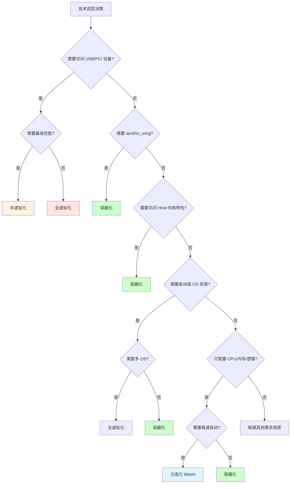

# 01. 技术决策模型与权衡框架

## 目录

- [目录](#目录)
- [01.1 概述](#011-概述)
- [01.2 决策模型分类](#012-决策模型分类)
  - [01.2.1 架构决策模型](#0121-架构决策模型)
  - [01.2.1.1 基于设备与内核特性的决策](#01211-基于设备与内核特性的决策)
    - [设备访问需求分析](#设备访问需求分析)
    - [内核特性需求分析](#内核特性需求分析)
    - [资源访问需求分析](#资源访问需求分析)
    - [综合决策树](#综合决策树)
  - [01.2.2 技术选型决策模型](#0122-技术选型决策模型)
  - [01.2.3 配置决策模型](#0123-配置决策模型)
- [01.3 权衡框架](#013-权衡框架)
  - [01.3.1 多维度权衡矩阵](#0131-多维度权衡矩阵)
  - [01.3.2 权衡决策树](#0132-权衡决策树)
    - [决策树应用示例](#决策树应用示例)
  - [01.3.3 权重设置](#0133-权重设置)
- [01.4 决策模型实例化](#014-决策模型实例化)
  - [01.4.1 边缘计算场景](#0141-边缘计算场景)
  - [01.4.2 企业级应用场景](#0142-企业级应用场景)
  - [01.4.3 云原生微服务场景](#0143-云原生微服务场景)
- [01.5 决策流程](#015-决策流程)
- [01.6 参考](#016-参考)

---

## 01.1 概述

**技术决策模型与权衡框架**是技术场景应用决策的核心工具。本文档提供系统化的技术决
策模型和权衡框架，帮助根据场景需求选择合适的技术范式。

**核心问题**：

- 如何根据场景需求选择虚拟化/容器化/沙盒化？
- 如何进行多维度权衡决策？
- 如何实例化决策模型到具体场景？

---

## 01.2 决策模型分类

### 01.2.1 架构决策模型

**架构决策模型**是最高层次的决策模型，用于选择虚拟化/容器化/沙盒化等基本技术范式
。

**决策维度**：

1. **资源约束**：CPU、内存、IO、网络、存储资源限制
2. **隔离需求**：隔离强度要求（硬件级/进程级/应用级）
3. **性能要求**：启动速度、运行性能、延迟要求
4. **兼容性要求**：OS 支持、应用兼容性
5. **成本约束**：部署成本、运维成本
6. **设备访问需求**：USB、PCI、GPU 等设备访问需求
7. **内核特性需求**：epoll、io_uring、eBPF 等内核特性需求

**决策规则**：

```text
if 需要 USB/PCI 设备访问:
    if 需要最高性能:
        return 半虚拟化
    else:
        return 全虚拟化
elif 需要 epoll/io_uring:
    return 容器化
elif 资源受限 and 性能要求高:
    return 沙盒化
elif 隔离要求高 and 兼容性要求高:
    return 虚拟化
elif 资源共享需求 and 标准化需求:
    return 容器化
```

**决策矩阵**：

| 场景需求            | 推荐范式        | 理由                   |
| ------------------- | --------------- | ---------------------- |
| 资源受限 + 高性能   | 沙盒化          | 资源效率最高，性能最优 |
| 强隔离 + 多 OS      | 虚拟化          | 硬件级隔离，多 OS 支持 |
| 资源共享 + 标准化   | 容器化          | 资源共享，OCI 标准     |
| 需要 USB/PCI 设备   | 虚拟化/半虚拟化 | 需要 Guest OS 和驱动   |
| 需要 epoll/io_uring | 容器化          | 需要直接内核访问       |

### 01.2.1.1 基于设备与内核特性的决策

> **详细分析**：参见
> [03.X 执行流与调度视角](../../03-architecture/execution-flow-scheduling.md#03x74-基于设备与内核特性的决策) -
> 从执行流视角分析设备访问和内核特性的决策

**设备访问决策**是架构决策的重要组成部分，基于应用对硬件设备和内核特性的访问需求
进行技术选择。

#### 设备访问需求分析

**设备访问能力矩阵**：

| 设备类型        | 全虚拟化    | 半虚拟化      | 容器化    | 沙盒化          |
| --------------- | ----------- | ------------- | --------- | --------------- |
| **USB 设备**    | ✅ 完全支持 | ✅ VirtIO-USB | ❌ 不支持 | ❌ 不支持       |
| **PCI 设备**    | ✅ 完全支持 | ✅ VirtIO-PCI | ❌ 不支持 | ❌ 不支持       |
| **GPU（直通）** | ✅ 完全支持 | ✅ 完全支持   | ✅ 部分   | ❌ 不支持       |
| **网络设备**    | ✅ 虚拟网卡 | ✅ VirtIO-Net | ✅ 直接   | ⚠️ 受限（WASI） |
| **存储设备**    | ✅ 虚拟硬盘 | ✅ VirtIO-Blk | ✅ 直接   | ⚠️ 受限（WASI） |
| **串口设备**    | ✅ 完全支持 | ✅ VirtIO-Con | ✅ 直接   | ⚠️ 受限（WASI） |

**设备访问决策规则**：

1. **需要 USB 设备访问** → 必须使用**虚拟化或半虚拟化**

   - **全虚拟化**：通过 USB passthrough 或虚拟 USB 控制器
   - **半虚拟化**：通过 VirtIO-USB（需要 Guest 驱动支持）
   - **容器化**：❌ 无法直接访问 USB 设备（无 Guest OS）
   - **沙盒化**：❌ 无法直接访问 USB 设备（无 Guest OS）

2. **不需要 I/O 设备，只需要 CPU、内存、硬盘** → 直接选择**容器化**

   - **CPU**：容器化直接使用 Host CPU，无开销
   - **内存**：容器化共享 Host 内存空间，高效
   - **硬盘**：容器化通过 Host 文件系统直接访问，无虚拟化开销

3. **需要网络 I/O 设备，需要 OS L4 层直接内核访问** → **容器化**

   - **epoll**：需要直接内核事件通知机制
   - **io_uring**：需要直接内核异步 I/O 接口
   - **容器化优势**：直接调用 Host 内核系统调用，无虚拟化层

#### 内核特性需求分析

**内核特性访问能力矩阵**：

| 内核特性      | 全虚拟化      | 半虚拟化      | 容器化  | 沙盒化          |
| ------------- | ------------- | ------------- | ------- | --------------- |
| **epoll**     | ✅ Guest 内核 | ✅ Guest 内核 | ✅ Host | ⚠️ 受限（WASI） |
| **io_uring**  | ✅ Guest 内核 | ✅ Guest 内核 | ✅ Host | ❌ 不支持       |
| **eBPF**      | ✅ Guest 内核 | ✅ Guest 内核 | ✅ Host | ⚠️ 受限（BPF）  |
| **cgroups**   | ✅ Guest 内核 | ✅ Guest 内核 | ✅ Host | ⚠️ 受限         |
| **seccomp**   | ✅ Guest 内核 | ✅ Guest 内核 | ✅ Host | ✅ 支持         |
| **namespace** | ✅ Guest 内核 | ✅ Guest 内核 | ✅ Host | ⚠️ 受限         |

**内核特性访问决策规则**：

1. **需要 epoll** → **容器化**（推荐）或虚拟化

   - **容器化**：直接调用 Host 内核 `epoll_wait()`，延迟低（~100 ns）
   - **全虚拟化**：Guest 内核调用，需要通过 VM-Exit（~1600-3100 ns）
   - **半虚拟化**：Guest 内核调用，通过 hypercall（~250-850 ns）
   - **沙盒化**：WASI 可能不支持原生 epoll，需要通过 Runtime 模拟

2. **需要 io_uring** → **容器化**（必需）

   - **容器化**：直接调用 Host 内核 `io_uring_setup()`，零开销
   - **全虚拟化/半虚拟化**：Guest 内核调用，有虚拟化开销
   - **沙盒化**：❌ Wasm/WASI 不支持 io_uring（需要内核 5.1+）

3. **需要 eBPF** → **容器化**（推荐）

   - **容器化**：直接使用 Host 内核 eBPF，完整功能
   - **全虚拟化/半虚拟化**：Guest 内核 eBPF，功能受限
   - **沙盒化**：可通过 seccomp-BPF 实现部分功能

**内核特性访问性能对比**：

| 内核特性     | 容器化延迟 | 全虚拟化延迟  | 半虚拟化延迟 | 性能比  |
| ------------ | ---------- | ------------- | ------------ | ------- |
| **epoll**    | ~100 ns    | ~1600-3100 ns | ~250-850 ns  | 16-31x  |
| **io_uring** | ~50 ns     | ~1600-3100 ns | ~250-850 ns  | 32-62x  |
| **eBPF**     | ~10-100 ns | ~1600-3100 ns | ~250-850 ns  | 16-310x |

#### 资源访问需求分析

**资源访问能力矩阵**：

| 资源类型     | 全虚拟化      | 半虚拟化       | 容器化       | 沙盒化          |
| ------------ | ------------- | -------------- | ------------ | --------------- |
| **CPU**      | ✅ 虚拟 CPU   | ✅ 虚拟 CPU    | ✅ 直接      | ✅ 直接         |
| **内存**     | ✅ 虚拟内存   | ✅ 虚拟内存    | ✅ 直接      | ✅ 受限         |
| **硬盘**     | ✅ 虚拟硬盘   | ✅ VirtIO-Blk  | ✅ 直接      | ⚠️ 受限（WASI） |
| **网络**     | ✅ 虚拟网卡   | ✅ VirtIO-Net  | ✅ 直接      | ⚠️ 受限（WASI） |
| **设备驱动** | ✅ Guest 驱动 | ✅ VirtIO 驱动 | ✅ Host 驱动 | ❌ 无驱动       |
| **OS 资源**  | ✅ Guest OS   | ✅ Guest OS    | ✅ Host OS   | ❌ 无 OS        |

**资源访问决策规则**：

1. **需要驱动访问（USB、PCI 设备）** → **虚拟化或半虚拟化**

   - **全虚拟化**：需要完整的 Guest OS 和驱动
   - **半虚拟化**：需要 Guest OS 和 VirtIO 驱动

2. **不需要驱动，只需要 OS 资源（系统调用）** → **容器化**

   - **容器化**：直接使用 Host OS 系统调用，无虚拟化层
   - 示例：文件系统操作、网络操作、进程管理等

3. **不需要驱动或 OS 资源，只需要逻辑改变** → **沙盒化**

   - **沙盒化（Wasm）**：纯计算逻辑，无系统调用
   - **沙盒化（gVisor）**：部分系统调用模拟，无需真实驱动
   - 示例：函数计算、业务逻辑处理、数据处理等

#### 综合决策树

**基于设备、内核特性、资源访问的综合决策树**：



**决策案例**：

##### 案例 1：USB 设备访问需求

- 需求：应用需要访问 USB 摄像头
- 决策：
  - 高性能需求 → 半虚拟化（VirtIO-USB，减少 VM-Exit）
  - 兼容性优先 → 全虚拟化（USB passthrough，无需修改 Guest）

##### 案例 2：高并发网络 I/O（epoll）

- 需求：高并发 Web 服务器，需要 epoll 实现事件驱动
- 决策：容器化
- 理由：直接内核访问，延迟最低（100 ns vs 1600-3100 ns，16-31x 性能提升）
- 适用场景：高并发网络服务、Web 服务器、API Gateway

##### 案例 3：异步 I/O（io_uring）

- 需求：高性能数据库，需要 io_uring 实现异步 I/O
- 决策：容器化（必需）
- 理由：io_uring 是 Linux 5.1+ 特性，需要直接内核访问
- 适用场景：高性能数据库、存储系统、文件服务器

##### 案例 4：纯计算逻辑（无 I/O）

- 需求：图像处理、数据计算，无需设备访问
- 决策：
  - 极速启动需求 → 沙盒化（Wasm）（启动 < 10ms）
  - 标准部署需求 → 容器化（启动 < 1s，资源利用率高）

##### 案例 5：边缘计算（资源受限）

- 需求：边缘设备，资源受限，需要处理网络数据
- 决策：
  - 资源极度受限 → 沙盒化（Wasm）（内存 < 10MB）
  - 资源一般受限 → 容器化（内存 > 50MB，需要网络 I/O）

### 01.2.2 技术选型决策模型

**技术选型决策模型**是具体技术选择的决策模型，例如 Docker vs
containerd、Kubernetes vs K3s。

**决策维度**：

1. **功能特性**：功能完整性、特性支持
2. **性能特性**：启动速度、运行性能
3. **成熟度**：技术成熟度、社区支持
4. **兼容性**：标准兼容性、生态兼容性
5. **运维复杂度**：部署复杂度、运维复杂度

**决策示例**：容器运行时选择

| 技术           | 功能特性 | 性能特性 | 成熟度 | 兼容性 | 运维复杂度 | 推荐场景       |
| -------------- | -------- | -------- | ------ | ------ | ---------- | -------------- |
| **Docker**     | 高       | 中       | 最高   | 最高   | 中         | 开发、生产     |
| **containerd** | 高       | 高       | 高     | 高     | 低         | 生产环境       |
| **crun**       | 中       | 高       | 中     | 中     | 低         | Wasm、边缘计算 |

### 01.2.3 配置决策模型

**配置决策模型**是参数配置选择的决策模型，例如资源限制、网络策略等。

**决策维度**：

1. **资源限制**：CPU、内存、IO 限制
2. **网络策略**：网络隔离、流量策略
3. **存储策略**：存储类型、存储大小
4. **安全策略**：安全上下文、权限控制

**决策示例**：资源限制配置

| 场景           | CPU 限制 | 内存限制 | IO 限制 | 理由               |
| -------------- | -------- | -------- | ------- | ------------------ |
| **边缘计算**   | 0.5 核   | 512MB    | 低      | 资源受限，最小配置 |
| **微服务**     | 2 核     | 2GB      | 中      | 标准配置，平衡性能 |
| **高负载应用** | 4 核     | 4GB      | 高      | 高性能，充足资源   |

---

## 01.3 权衡框架

### 01.3.1 多维度权衡矩阵

**多维度权衡矩阵**用于对比不同技术选项在各维度上的表现。

**决策维度矩阵**：

| 决策维度     | 虚拟化     | 容器化     | 沙盒化     |
| ------------ | ---------- | ---------- | ---------- |
| **资源效率** | ⭐⭐       | ⭐⭐⭐⭐   | ⭐⭐⭐⭐⭐ |
| **隔离强度** | ⭐⭐⭐⭐⭐ | ⭐⭐⭐     | ⭐⭐       |
| **启动速度** | ⭐⭐       | ⭐⭐⭐⭐   | ⭐⭐⭐⭐⭐ |
| **兼容性**   | ⭐⭐⭐⭐⭐ | ⭐⭐⭐⭐   | ⭐⭐⭐     |
| **安全边界** | ⭐⭐⭐⭐⭐ | ⭐⭐⭐     | ⭐⭐⭐⭐   |
| **设备访问** | ⭐⭐⭐⭐⭐ | ⭐⭐       | ⭐         |
| **内核特性** | ⭐⭐⭐     | ⭐⭐⭐⭐⭐ | ⭐⭐       |

**权衡评分模型**：

$$S_{\text{total}} = \sum_{i=1}^{n} w_i \cdot S_i$$

其中：

- $w_i$：维度 $i$ 的权重（$\sum w_i = 1$）
- $S_i$：维度 $i$ 的评分（1-5 星）

**示例评分（通用场景）**：

| 维度         | 权重 | 虚拟化评分 | 容器化评分 | 沙盒化评分 |
| ------------ | ---- | ---------- | ---------- | ---------- |
| **资源效率** | 0.2  | 2          | 4          | 5          |
| **隔离强度** | 0.3  | 5          | 3          | 2          |
| **启动速度** | 0.2  | 2          | 4          | 5          |
| **兼容性**   | 0.2  | 5          | 4          | 3          |
| **安全边界** | 0.1  | 5          | 3          | 4          |
| **总分**     | 1.0  | 3.7        | 3.6        | 4.0        |

**示例评分（设备访问场景）**：

| 维度         | 权重 | 虚拟化评分 | 容器化评分 | 沙盒化评分 |
| ------------ | ---- | ---------- | ---------- | ---------- |
| **设备访问** | 0.4  | 5          | 2          | 1          |
| **兼容性**   | 0.3  | 5          | 4          | 3          |
| **隔离强度** | 0.2  | 5          | 3          | 2          |
| **性能**     | 0.1  | 4          | 4          | 5          |
| **总分**     | 1.0  | **4.8**    | 3.1        | 2.3        |

**示例评分（内核特性场景，如高并发网络 I/O）**：

| 维度         | 权重 | 虚拟化评分 | 容器化评分 | 沙盒化评分 |
| ------------ | ---- | ---------- | ---------- | ---------- |
| **内核特性** | 0.4  | 3          | 5          | 2          |
| **性能**     | 0.3  | 3          | 5          | 4          |
| **资源效率** | 0.2  | 2          | 4          | 5          |
| **兼容性**   | 0.1  | 5          | 4          | 3          |
| **总分**     | 1.0  | 3.0        | **4.6**    | 3.5        |

### 01.3.2 权衡决策树

**权衡决策树**是根据场景需求逐步选择技术范式的决策树。

**完整决策树**：

```text
场景需求
├── 设备访问需求（优先判断）
│   ├── 需要 USB/PCI 设备
│   │   ├── 高性能 → 半虚拟化
│   │   └── 兼容性优先 → 全虚拟化
│   └── 不需要设备访问 → 继续判断
├── 内核特性需求（优先判断）
│   ├── 需要 epoll/io_uring
│   │   └── 容器化（直接内核访问，性能提升 16-62x）
│   └── 不需要内核特性 → 继续判断
├── 资源限制
│   ├── 资源充足 → 虚拟化
│   ├── 资源中等 → 容器化
│   └── 资源受限 → 沙盒化
├── 隔离要求
│   ├── 强隔离 → 虚拟化/Kata
│   ├── 中等隔离 → 容器化
│   └── 应用隔离 → 沙盒化
├── 性能要求
│   ├── 低延迟 → 沙盒化（Wasm）
│   ├── 中等延迟 → 容器化
│   └── 延迟不敏感 → 虚拟化
└── 兼容性要求
    ├── 多 OS → 虚拟化
    ├── Linux 一致 → 容器化
    └── 应用特定 → 沙盒化
```

#### 决策树应用示例

##### 示例 1：边缘计算平台

```text
场景: 边缘计算平台
├── 设备访问: 不需要设备访问
├── 内核特性: 不需要内核特性
├── 资源限制: 资源受限 → 沙盒化
├── 隔离要求: 轻量隔离 → 沙盒化
├── 性能要求: 低延迟 → 沙盒化（Wasm）
└── 兼容性要求: 应用特定 → 沙盒化

决策结果: 沙盒化（WasmEdge）
```

##### 示例 2：USB 摄像头应用

```text
场景: USB 摄像头应用
├── 设备访问: 需要 USB 设备 → 虚拟化/半虚拟化
│   └── 性能要求: 高性能 → 半虚拟化
├── 内核特性: 不需要内核特性
├── 资源限制: 资源充足
├── 隔离要求: 中等隔离
└── 兼容性要求: Linux 一致

决策结果: 半虚拟化（VirtIO-USB）
```

##### 示例 3：高并发 Web 服务器

```text
场景: 高并发 Web 服务器
├── 设备访问: 不需要设备访问
├── 内核特性: 需要 epoll → 容器化（直接内核访问）
├── 资源限制: 资源中等
├── 隔离要求: 中等隔离
├── 性能要求: 中等延迟
└── 兼容性要求: Linux 一致

决策结果: 容器化（直接 epoll，延迟 100 ns vs 1600-3100 ns）
```

##### 示例 4：高性能数据库

```text
场景: 高性能数据库
├── 设备访问: 不需要设备访问
├── 内核特性: 需要 io_uring → 容器化（必需，直接内核访问）
├── 资源限制: 资源充足
├── 隔离要求: 中等隔离
├── 性能要求: 高性能（异步 I/O）
└── 兼容性要求: Linux 一致

决策结果: 容器化（io_uring，延迟 50 ns vs 1600-3100 ns，32-62x 性能提升）
```

### 01.3.3 权重设置

**权重设置模型**用于根据场景特点设置不同维度的权重。

**权重设置规则**：

1. **资源受限场景**：

   - 资源效率权重：0.4
   - 启动速度权重：0.3
   - 隔离强度权重：0.2
   - 兼容性权重：0.1

2. **安全关键场景**：

   - 隔离强度权重：0.4
   - 安全边界权重：0.3
   - 兼容性权重：0.2
   - 资源效率权重：0.1

3. **性能关键场景**：
   - 启动速度权重：0.4
   - 资源效率权重：0.3
   - 隔离强度权重：0.2
   - 兼容性权重：0.1

**权重数学表达**：

设权重向量为 $\mathbf{w} = (w_1, w_2, \ldots, w_n)$，则：

$$\sum_{i=1}^{n} w_i = 1, \quad w_i \geq 0$$

**综合评分**：

$$S_{\text{total}} = \mathbf{w} \cdot \mathbf{S} = \sum_{i=1}^{n} w_i \cdot S_i$$

其中：

- $\mathbf{S} = (S_1, S_2, \ldots, S_n)$：各维度评分向量

---

## 01.4 决策模型实例化

### 01.4.1 边缘计算场景

**场景需求**：

- **资源受限**：ARM 设备、512MB-2GB 内存
- **低延迟要求**：< 10ms
- **快速启动**：冷启动 < 100ms
- **离线运行能力**：需要支持离线运行

**决策过程**：

1. **架构决策**：沙盒化（资源受限、低延迟、快速启动）
2. **技术选型**：WasmEdge + K3s（轻量、快速、边缘支持）
3. **配置决策**：最小资源限制、轻量网络策略

**权衡评估**：

| 维度         | 权重 | WasmEdge + K3s | Docker + K3s   | gVisor + K8s |
| ------------ | ---- | -------------- | -------------- | ------------ |
| **启动速度** | 0.4  | ⭐⭐⭐⭐⭐ (5) | ⭐⭐⭐ (3)     | ⭐⭐⭐⭐ (4) |
| **资源效率** | 0.3  | ⭐⭐⭐⭐⭐ (5) | ⭐⭐⭐ (3)     | ⭐⭐⭐ (3)   |
| **兼容性**   | 0.2  | ⭐⭐⭐ (3)     | ⭐⭐⭐⭐⭐ (5) | ⭐⭐⭐⭐ (4) |
| **隔离强度** | 0.1  | ⭐⭐ (2)       | ⭐⭐⭐ (3)     | ⭐⭐⭐⭐ (4) |
| **总分**     | 1.0  | **4.3**        | 3.5            | 3.7          |

**决策结果**：WasmEdge + K3s

**论证依据**：

1. **性能论证**：Wasm 冷启动 < 50ms，满足 < 100ms 要求
2. **资源论证**：Wasm 运行时占用 < 10MB，适合受限资源
3. **兼容性论证**：边缘应用多为 WebAssembly，兼容性可接受
4. **成本论证**：K3s 轻量，适合边缘设备

### 01.4.2 企业级应用场景

**场景需求**：

- **强隔离**：多租户安全隔离
- **多 OS 支持**：Windows/Linux
- **稳定可靠**：99.9% 可用性
- **易于运维**：统一管理

**决策过程**：

1. **架构决策**：虚拟化（强隔离、多 OS 支持）
2. **技术选型**：VMware/KVM + Kubernetes（成熟稳定、统一编排）
3. **配置决策**：高资源限制、强安全策略

**权衡评估**：

| 维度           | 权重 | VM + K8s       | Container + K8s | Kata + K8s     |
| -------------- | ---- | -------------- | --------------- | -------------- |
| **隔离强度**   | 0.4  | ⭐⭐⭐⭐⭐ (5) | ⭐⭐⭐ (3)      | ⭐⭐⭐⭐⭐ (5) |
| **兼容性**     | 0.3  | ⭐⭐⭐⭐⭐ (5) | ⭐⭐⭐⭐ (4)    | ⭐⭐⭐⭐ (4)   |
| **稳定性**     | 0.2  | ⭐⭐⭐⭐⭐ (5) | ⭐⭐⭐⭐⭐ (5)  | ⭐⭐⭐⭐ (4)   |
| **运维复杂度** | 0.1  | ⭐⭐⭐ (3)     | ⭐⭐⭐⭐⭐ (5)  | ⭐⭐⭐ (3)     |
| **总分**       | 1.0  | **4.8**        | 4.2             | 4.5            |

**决策结果**：VM + K8s（混合架构）

**论证依据**：

1. **隔离论证**：VM 提供硬件级隔离，安全边界清晰
2. **兼容性论证**：支持 Windows/Linux，满足多 OS 需求
3. **稳定性论证**：VM 技术成熟，稳定性高
4. **运维论证**：K8s 统一编排，运维复杂度可接受

### 01.4.3 云原生微服务场景

**场景需求**：

- **资源效率**：资源共享、成本优化
- **快速迭代**：快速部署、快速回滚
- **标准化**：OCI 标准、DevOps 流程

**决策过程**：

1. **架构决策**：容器化（资源共享、标准化）
2. **技术选型**：Docker/containerd + Kubernetes（标准、成熟）
3. **配置决策**：中等资源限制、标准网络策略

**权衡评估**：

| 维度         | 权重 | Container + K8s | WasmEdge + K8s | VM + K8s       |
| ------------ | ---- | --------------- | -------------- | -------------- |
| **资源效率** | 0.3  | ⭐⭐⭐⭐ (4)    | ⭐⭐⭐⭐⭐ (5) | ⭐⭐ (2)       |
| **标准化**   | 0.3  | ⭐⭐⭐⭐⭐ (5)  | ⭐⭐⭐ (3)     | ⭐⭐⭐⭐ (4)   |
| **快速迭代** | 0.2  | ⭐⭐⭐⭐ (4)    | ⭐⭐⭐⭐⭐ (5) | ⭐⭐ (2)       |
| **兼容性**   | 0.2  | ⭐⭐⭐⭐ (4)    | ⭐⭐⭐ (3)     | ⭐⭐⭐⭐⭐ (5) |
| **总分**     | 1.0  | **4.3**         | 4.2            | 3.2            |

**决策结果**：Container + K8s

**论证依据**：

1. **资源共享论证**：容器共享内核、文件系统，资源利用率高
2. **标准化论证**：OCI 标准、CRI 接口，标准化程度高
3. **快速迭代论证**：容器启动快、部署快，支持快速迭代
4. **生态论证**：容器生态成熟，工具链完善

---

## 01.5 决策流程

**标准化决策流程**：

```text
1. 场景需求分析
   ├── 业务需求识别（功能、性能、安全）
   ├── 技术约束识别（资源、网络、基础设施）
   └── 运营要求识别（部署、运维、可观测性）

2. 技术选项枚举
   ├── 虚拟化选项（VMware、KVM、Hyper-V）
   ├── 容器化选项（Docker、containerd、Podman）
   └── 沙盒化选项（WasmEdge、gVisor、Kata）

3. 多维度评估
   ├── 性能评估（启动速度、运行效率）
   ├── 资源评估（内存、CPU 占用）
   ├── 安全评估（隔离强度、攻击面）
   ├── 兼容性评估（OS 支持、应用兼容）
   └── 成本评估（部署成本、运维成本）

4. 权衡决策
   ├── 权重设置（根据场景特点）
   ├── 综合评分（多维度加权评分）
   └── 决策选择（选择最高分选项）

5. 实施方案
   ├── 技术栈组合（确定技术组合）
   ├── 配置方案（资源限制、网络策略）
   └── 验证方案（POC 验证）

6. 效果验证
   ├── 性能验证（启动速度、运行性能）
   ├── 功能验证（功能完整性）
   └── 成本验证（资源占用、运维成本）

7. 迭代优化
   ├── 问题识别（发现问题和不足）
   ├── 方案调整（优化配置、调整权重）
   └── 持续改进（持续优化决策模型）
```

---

## 01.6 参考

**关联文档**：

- **[场景分析论证](02-scenario-analysis.md)** - 技术场景分析论证模型
- **[概念演进脉络](03-concept-evolution.md)** - 技术概念定义脉络
- **[理论模型](../01-theory-models/)** - 技术范式背后的理论模型
- **[主文档](../decision-models.md)** - 完整技术决策模型文档

**外部参考**：

- [Decision-making](https://en.wikipedia.org/wiki/Decision-making)
- [Multi-criteria decision analysis](https://en.wikipedia.org/wiki/Multi-criteria_decision_analysis)

---

**最后更新**：2025-01-XX **维护者**：项目团队
