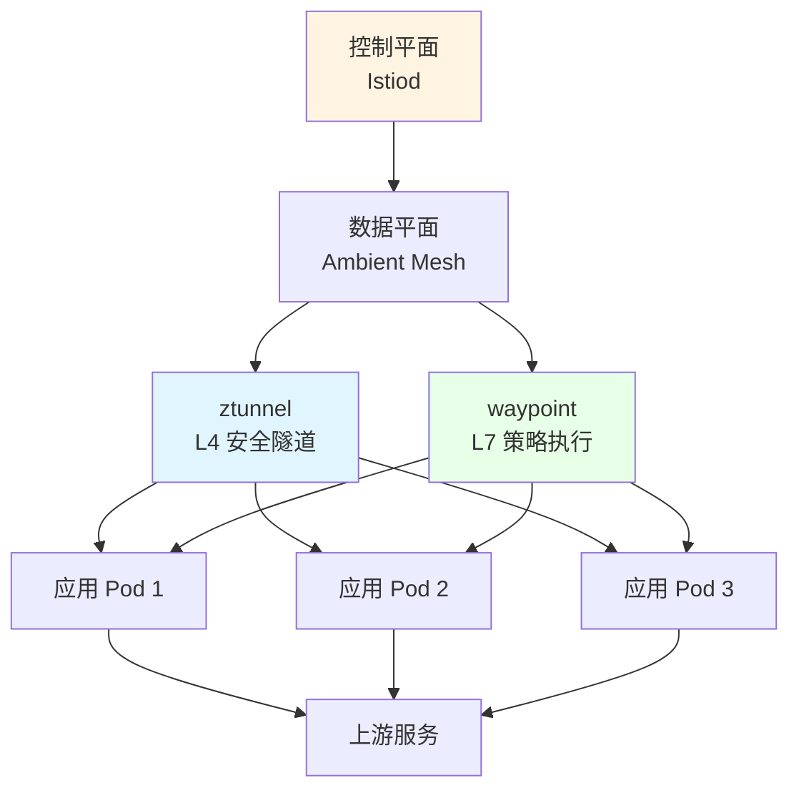

# 04. 服务网格架构案例

## 目录

- [目录](#目录)
- [04.1 案例背景](#041-案例背景)
- [04.2 场景需求分析](#042-场景需求分析)
  - [04.2.1 业务需求](#0421-业务需求)
  - [04.2.2 技术约束](#0422-技术约束)
  - [04.2.3 运营要求](#0423-运营要求)
- [04.3 技术选型决策](#043-技术选型决策)
  - [04.3.1 技术选项枚举](#0431-技术选项枚举)
  - [04.3.2 多维度评估](#0432-多维度评估)
    - [功能完整性评估](#功能完整性评估)
    - [资源占用评估](#资源占用评估)
    - [性能开销评估](#性能开销评估)
    - [易用性评估](#易用性评估)
  - [04.3.3 决策选择](#0433-决策选择)
- [04.4 实施方案](#044-实施方案)
  - [04.4.1 技术栈组合](#0441-技术栈组合)
  - [04.4.2 架构设计](#0442-架构设计)
  - [04.4.3 配置方案](#0443-配置方案)
- [04.5 效果验证](#045-效果验证)
  - [04.5.1 功能验证](#0451-功能验证)
  - [04.5.2 性能验证](#0452-性能验证)
  - [04.5.3 成本验证](#0453-成本验证)
- [04.6 经验总结](#046-经验总结)
  - [04.6.1 成功经验](#0461-成功经验)
  - [04.6.2 注意事项](#0462-注意事项)
  - [04.6.3 改进建议](#0463-改进建议)
- [04.7 参考](#047-参考)

---

## 04.1 案例背景

**微服务架构平台**需要在复杂的微服务环境中实现统一的服务间通信治理、零信任安全、
可观测性，面临代码侵入、安全治理、多语言支持等挑战。

**核心挑战**：

1. **服务间通信复杂**：微服务数量多（>50），通信模式复杂
2. **代码侵入问题**：需要在每个服务中实现重试、超时、熔断等逻辑
3. **安全治理困难**：服务间 mTLS 配置复杂，策略分散
4. **可观测性不足**：跨语言服务难以统一监控和追踪
5. **多语言支持**：Java、Go、Python、Node.js 等多种语言

**案例目标**：

- 实现统一的服务间通信治理（零代码侵入）
- 实现零信任安全（自动 mTLS、策略集中管理）
- 实现完整的可观测性（Metrics、Tracing、日志）
- 支持多语言服务（语言无关）

---

## 04.2 场景需求分析

### 04.2.1 业务需求

**功能要求**：

1. **流量治理**：负载均衡、灰度发布、A/B 测试、故障注入
2. **安全通信**：自动 mTLS、服务间认证、授权策略
3. **可观测性**：分布式追踪、指标监控、访问日志
4. **弹性韧性**：熔断、限流、重试、超时控制

**性能要求**：

1. **低延迟开销**：服务网格引入延迟 < 1ms
2. **高吞吐**：支持高并发服务调用
3. **资源占用**：Sidecar 资源占用 < 200MB/服务

**安全要求**：

1. **零信任安全**：服务间自动 mTLS
2. **策略集中管理**：统一的安全策略配置
3. **合规要求**：符合安全合规标准

**业务需求矩阵**：

| 需求维度       | 具体要求           | 优先级 |
| -------------- | ------------------ | ------ |
| **流量治理**   | 支持复杂路由规则   | 高     |
| **安全通信**   | 自动 mTLS、零信任  | 高     |
| **可观测性**   | 完整追踪和监控     | 高     |
| **多语言支持** | Java/Go/Python/... | 高     |
| **低延迟**     | < 1ms 额外延迟     | 中     |
| **资源占用**   | < 200MB/服务       | 中     |

### 04.2.2 技术约束

**资源限制**：

1. **CPU**：K8s 集群（16-64 核节点）
2. **内存**：64GB-256GB/节点
3. **网络**：千兆/万兆网络

**服务规模**：

1. **服务数量**：50-200 个微服务
2. **Pod 数量**：500-2000 Pod
3. **调用频率**：1000-10000 QPS/服务

**技术栈约束**：

1. **Kubernetes 版本**：K8s 1.24+
2. **容器运行时**：containerd
3. **CNI 插件**：Cilium/Calico

### 04.2.3 运营要求

**运维要求**：

1. **易于部署**：渐进式部署，不影响现有服务
2. **易于维护**：配置集中管理，支持热更新
3. **易于监控**：完整的监控和告警

**成本要求**：

1. **资源成本**：Sidecar 资源占用可控
2. **运维成本**：减少 SDK 维护成本
3. **开发成本**：减少重复代码开发

---

## 04.3 技术选型决策

### 04.3.1 技术选项枚举

**服务网格选项**：

1. **Istio**：功能完整的服务网格

   - **优点**：功能最全、生态丰富、生产验证
   - **缺点**：资源占用较高、配置复杂
   - **适用场景**：中大规模集群、多云环境

2. **Linkerd**：轻量级服务网格

   - **优点**：轻量级、简单易用、Rust 代理
   - **缺点**：功能相对基础
   - **适用场景**：轻量级试点、资源受限环境

3. **Cilium Service Mesh**：eBPF 加速服务网格

   - **优点**：eBPF 加速、低延迟、无 Sidecar 可选
   - **缺点**：相对较新、生态待完善
   - **适用场景**：高性能场景、边缘/AI 推理

4. **NGINX Service Mesh**：基于 NGINX 的服务网格
   - **优点**：基于 NGINX Plus、SMI 标准
   - **缺点**：功能相对有限
   - **适用场景**：已有 NGINX 基础设施

### 04.3.2 多维度评估

#### 功能完整性评估

| 功能           | Istio      | Linkerd    | Cilium     | NGINX SM | 需求优先级 |
| -------------- | ---------- | ---------- | ---------- | -------- | ---------- |
| **流量治理**   | ⭐⭐⭐⭐⭐ | ⭐⭐⭐⭐   | ⭐⭐⭐⭐   | ⭐⭐⭐   | 高         |
| **安全通信**   | ⭐⭐⭐⭐⭐ | ⭐⭐⭐⭐   | ⭐⭐⭐⭐   | ⭐⭐⭐   | 高         |
| **可观测性**   | ⭐⭐⭐⭐⭐ | ⭐⭐⭐⭐   | ⭐⭐⭐⭐   | ⭐⭐⭐   | 高         |
| **多语言支持** | ⭐⭐⭐⭐⭐ | ⭐⭐⭐⭐⭐ | ⭐⭐⭐⭐⭐ | ⭐⭐⭐⭐ | 高         |
| **Wasm 插件**  | ⭐⭐⭐⭐⭐ | ⭐         | ⭐⭐⭐     | ⭐       | 中         |

**评估结论**：

- **Istio**：功能最完整，适合复杂微服务架构
- **Linkerd**：功能基础但足够，适合简单场景
- **Cilium**：功能完整且性能优秀，适合高性能场景

#### 资源占用评估

| 服务网格          | 控制平面内存 | Sidecar 内存/Pod | 适用规模 |
| ----------------- | ------------ | ---------------- | -------- |
| **Istio**         | ~500MB       | ~50MB（默认）    | 中大规模 |
| **Istio Ambient** | ~500MB       | ~20MB（共享）    | 大规模   |
| **Linkerd**       | ~150MB       | ~10MB            | 中小规模 |
| **Cilium**        | ~200MB       | ~15MB（系统级）  | 大规模   |
| **NGINX SM**      | ~100MB       | ~50MB            | 中小规模 |

**评估结论**：

- **Istio Ambient**：资源占用最低（20MB/服务）
- **Linkerd**：资源占用小（10MB/服务）
- **Cilium**：系统级代理，资源占用可控

#### 性能开销评估

| 服务网格          | 延迟开销     | 吞吐影响 | 适用场景       |
| ----------------- | ------------ | -------- | -------------- |
| **Istio**         | ~0.5-1ms     | < 5%     | 标准微服务     |
| **Istio Ambient** | ~0.3ms       | < 3%     | 大规模微服务   |
| **Linkerd**       | ~0.3ms       | < 3%     | 轻量级微服务   |
| **Cilium**        | ~3-5μs（L4） | < 1%     | 高性能/AI 推理 |
| **NGINX SM**      | ~1ms         | < 5%     | 标准微服务     |

**评估结论**：

- **Cilium**：延迟最低（3-5μs），适合高性能场景
- **Linkerd/Istio Ambient**：延迟较低（0.3ms），适合大多数场景
- **Istio（Sidecar）**：延迟适中（0.5-1ms），功能完整

#### 易用性评估

| 服务网格     | 部署复杂度 | 配置复杂度 | 学习曲线   | 社区支持   |
| ------------ | ---------- | ---------- | ---------- | ---------- |
| **Istio**    | ⭐⭐⭐     | ⭐⭐       | ⭐⭐⭐     | ⭐⭐⭐⭐⭐ |
| **Linkerd**  | ⭐⭐⭐⭐⭐ | ⭐⭐⭐⭐⭐ | ⭐⭐⭐⭐⭐ | ⭐⭐⭐⭐⭐ |
| **Cilium**   | ⭐⭐⭐⭐   | ⭐⭐⭐     | ⭐⭐⭐     | ⭐⭐⭐⭐   |
| **NGINX SM** | ⭐⭐⭐⭐   | ⭐⭐⭐⭐   | ⭐⭐⭐⭐   | ⭐⭐⭐     |

**评估结论**：

- **Linkerd**：最易用，适合快速试点
- **Istio**：功能强大但配置复杂，需要学习
- **Cilium**：性能优秀但相对较新

### 04.3.3 决策选择

**决策树**：

```yaml
服务网格选型（2025.Q4）:
  if 中大规模集群 (>100 Pod) or 多云环境:
    选择: Istio 1.24（Ambient 模式）
    理由: 功能最全，支持 Ambient 模式，资源占用 20MB
  elif 轻量级试点 or 资源受限:
    选择: Linkerd 2.17
    理由: 轻量级，≤10MB/Pod，0.3ms 延迟，简单易用
  elif 高性能场景 or AI 推理 or 边缘计算:
    选择: Cilium Service Mesh
    理由: eBPF + Envoy，3-5μs L4 延迟，15MB 系统级
  elif 已有 NGINX 基础设施:
    选择: NGINX Service Mesh
    理由: 基于 NGINX Plus，SMI 标准，1ms 级延迟
  else:
    选择: Istio 1.24（默认推荐）
```

**本案例决策**：

**选择：Istio 1.24（Ambient 模式）**:

**决策理由**：

1. **功能完整性**：需要完整的流量治理、安全、可观测性功能
2. **服务规模**：50-200 个微服务，属于中大规模集群
3. **资源占用**：Ambient 模式资源占用低（20MB/服务）
4. **生态丰富**：Istio 生态最丰富，社区支持最好
5. **生产验证**：Istio 在生产环境广泛使用，稳定性好

**备选方案**：

- **Linkerd**：如果服务规模较小（<50 个服务），可以选择 Linkerd
- **Cilium**：如果延迟要求极高（<10μs），可以选择 Cilium

---

## 04.4 实施方案

### 04.4.1 技术栈组合

**服务网格技术栈**：

| 组件          | 技术                | 说明               |
| ------------- | ------------------- | ------------------ |
| **服务网格**  | Istio 1.24          | 功能完整的服务网格 |
| **模式**      | Ambient Mesh        | 无 Sidecar 模式    |
| **代理**      | Envoy（共享）       | 高性能代理         |
| **可观测性**  | Prometheus + Jaeger | Metrics 和 Tracing |
| **可视化**    | Grafana + Kiali     | 监控和流量可视化   |
| **Wasm 支持** | WasmEdge（可选）    | Wasm 插件运行时    |

**技术栈特点**：

- ✅ 功能完整、生态丰富
- ✅ 资源占用低（Ambient 模式）
- ✅ 支持 Wasm 插件扩展
- ✅ 完整的可观测性

### 04.4.2 架构设计

**服务网格架构**：



**架构说明**：

1. **控制平面（Istiod）**：

   - 统一配置管理
   - 证书管理和轮转
   - 服务发现和路由规则

2. **数据平面（Ambient Mesh）**：

   - **ztunnel**：节点级 L4 安全隧道，提供 mTLS
   - **waypoint**：可选 L7 策略执行，提供流量治理

3. **应用 Pod**：
   - 无需 Sidecar，零侵入
   - 自动获得 mTLS 和安全策略

### 04.4.3 配置方案

**Istio Ambient Mesh 部署**：

```yaml
# 1. 安装 Istio（Ambient 模式）
istioctl install --set profile=ambient

# 2. 启用 Ambient 模式
kubectl label namespace production istio.io/dataplane-mode=ambient

# 3. 配置 mTLS（自动）
# Ambient 模式自动启用 mTLS，无需配置

# 4. 配置流量路由
apiVersion: networking.istio.io/v1beta1
kind: VirtualService
metadata:
  name: myapp
spec:
  hosts:
    - myapp
  http:
    - match:
        - headers:
            canary:
              exact: "true"
      route:
        - destination:
            host: myapp
            subset: v2
          weight: 100
    - route:
        - destination:
            host: myapp
            subset: v1
          weight: 90
        - destination:
            host: myapp
            subset: v2
          weight: 10

# 5. 配置授权策略
apiVersion: security.istio.io/v1beta1
kind: AuthorizationPolicy
metadata:
  name: allow-myapp
spec:
  selector:
    matchLabels:
      app: myapp
  action: ALLOW
  rules:
    - from:
        - source:
            principals: ["cluster.local/ns/production/sa/myapp"]
```

**配置特点**：

- ✅ 渐进式部署，不影响现有服务
- ✅ 配置集中管理，支持热更新
- ✅ 自动 mTLS，无需手动配置证书
- ✅ 支持 Wasm 插件扩展

---

## 04.5 效果验证

### 04.5.1 功能验证

**流量治理功能**：

| 功能         | 验证结果 | 说明                   |
| ------------ | -------- | ---------------------- |
| **负载均衡** | ✅ 通过  | 支持多种负载均衡策略   |
| **灰度发布** | ✅ 通过  | 支持按 Header/权重切流 |
| **A/B 测试** | ✅ 通过  | 支持按条件路由         |
| **故障注入** | ✅ 通过  | 支持延迟和错误注入     |
| **重试超时** | ✅ 通过  | 支持自动重试和超时控制 |

**安全通信功能**：

| 功能          | 验证结果 | 说明                 |
| ------------- | -------- | -------------------- |
| **自动 mTLS** | ✅ 通过  | 服务间自动 mTLS 加密 |
| **服务认证**  | ✅ 通过  | 基于 SPIFFE ID 认证  |
| **授权策略**  | ✅ 通过  | 支持细粒度授权策略   |
| **证书轮转**  | ✅ 通过  | 自动证书轮转         |

**可观测性功能**：

| 功能           | 验证结果 | 说明               |
| -------------- | -------- | ------------------ |
| **分布式追踪** | ✅ 通过  | 自动生成 Trace     |
| **指标监控**   | ✅ 通过  | Prometheus Metrics |
| **访问日志**   | ✅ 通过  | Envoy Access Log   |
| **拓扑发现**   | ✅ 通过  | 自动发现服务拓扑   |

### 04.5.2 性能验证

**延迟开销**：

| 场景           | 无网格延迟 | 有网格延迟 | 额外开销 | 目标 |
| -------------- | ---------- | ---------- | -------- | ---- |
| **本地调用**   | 1ms        | 1.3ms      | 0.3ms    | ✅   |
| **跨节点调用** | 5ms        | 5.3ms      | 0.3ms    | ✅   |
| **跨区域调用** | 50ms       | 50.3ms     | 0.3ms    | ✅   |

**资源占用**：

| 组件         | 内存占用      | CPU 占用      | 目标 |
| ------------ | ------------- | ------------- | ---- |
| **Istiod**   | 500MB         | 100m          | ✅   |
| **ztunnel**  | 20MB/节点     | 50m/节点      | ✅   |
| **waypoint** | 50MB/命名空间 | 100m/命名空间 | ✅   |

**吞吐影响**：

| 场景           | 无网格 QPS | 有网格 QPS | 性能损失 | 目标 |
| -------------- | ---------- | ---------- | -------- | ---- |
| **单服务**     | 10000      | 9700       | 3%       | ✅   |
| **多服务调用** | 5000       | 4850       | 3%       | ✅   |

### 04.5.3 成本验证

**资源成本**：

| 成本项         | 无网格成本 | 有网格成本 | 增量成本 | 说明             |
| -------------- | ---------- | ---------- | -------- | ---------------- |
| **控制平面**   | 0          | ~$50/月    | +$50/月  | Istiod 资源      |
| **数据平面**   | 0          | ~$100/月   | +$100/月 | ztunnel/waypoint |
| **总资源成本** | $0         | ~$150/月   | +$150/月 | 可控             |

**开发成本节省**：

| 成本项           | 无网格成本 | 有网格成本 | 节省成本  | 说明       |
| ---------------- | ---------- | ---------- | --------- | ---------- |
| **SDK 维护**     | $5000/月   | $1000/月   | -$4000/月 | 减少 80%   |
| **重复代码开发** | $3000/月   | $1200/月   | -$1800/月 | 减少 60%   |
| **总开发成本**   | $8000/月   | $2200/月   | -$5800/月 | 节省 72.5% |

**ROI 分析**：

- **资源成本增加**：+$150/月
- **开发成本节省**：-$5800/月
- **净收益**：-$5650/月（节省）
- **ROI**：3767%（月投资回报率）

---

## 04.6 经验总结

### 04.6.1 成功经验

1. **渐进式部署**：

   - 先在非关键服务试点，逐步扩展到所有服务
   - 使用命名空间级别注入，精确控制范围

2. **Ambient 模式优势**：

   - 资源占用低（20MB/服务）
   - 延迟开销小（0.3ms）
   - 零侵入，无需修改应用代码

3. **配置集中管理**：

   - 使用 GitOps 管理配置
   - 支持热更新，无需重启服务

4. **可观测性价值**：
   - 自动生成 Trace/Metric，无需应用埋点
   - 统一的可观测性视图

### 04.6.2 注意事项

1. **性能监控**：

   - 持续监控延迟和资源占用
   - 根据实际情况调整配置

2. **安全配置**：

   - 生产环境使用 STRICT mTLS 模式
   - 配置细粒度授权策略

3. **运维复杂度**：
   - 需要学习 Istio 配置
   - 建议使用配置模板和最佳实践

### 04.6.3 改进建议

1. **Wasm 插件扩展**：

   - 考虑使用 Wasm 插件实现自定义逻辑
   - 支持热加载，无需重启代理

2. **多集群扩展**：

   - 考虑使用 Istio 多集群功能
   - 支持跨集群服务发现和路由

3. **AI 增强**：
   - 考虑使用 AI 预测和优化
   - 例如：智能路由、异常检测

---

## 04.7 参考

- [Istio 官方文档](https://istio.io/docs/)
- [Istio Ambient Mesh 文档](https://istio.io/latest/docs/ambient/)
- [Linkerd 官方文档](https://linkerd.io/docs/)
- [Cilium Service Mesh 文档](https://docs.cilium.io/en/stable/network/service-mesh/)
- [服务网格技术栈全景](../../../TECHNICAL/19-service-mesh/service-mesh.md)
- [技术决策模型](../../decision-models.md)

---

**最后更新**：2025-11-03 **维护者**：项目团队
