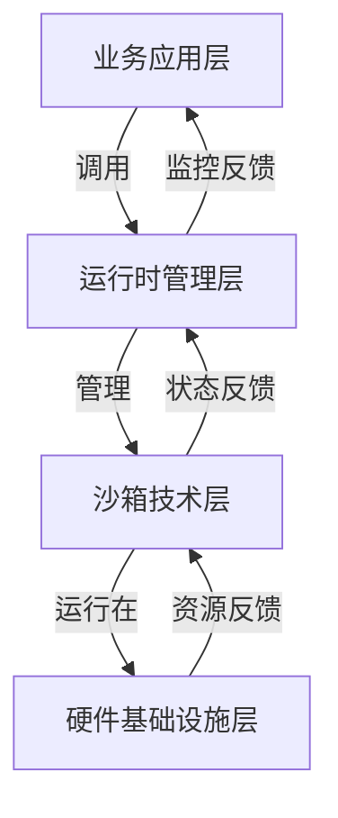

# 技术层次体系架构（四层演进模型）

**版本**：v1.0 **最后更新**：2025-11-07 **维护者**：项目团队

## 📑 目录

- [📑 目录](#-目录)
- [📖 概述](#-概述)
- [一、四层演进模型](#一四层演进模型)
  - [1.1 层次说明](#11-层次说明)
- [二、各层技术栈详解](#二各层技术栈详解)
  - [2.1 业务应用层（L4）](#21-业务应用层l4)
  - [2.2 运行时管理层（L3）](#22-运行时管理层l3)
  - [2.3 沙箱技术层（L2）](#23-沙箱技术层l2)
  - [2.4 硬件基础设施层（L1）](#24-硬件基础设施层l1)
- [三、层间交互关系](#三层间交互关系)
  - [3.1 垂直交互](#31-垂直交互)
  - [3.2 水平交互](#32-水平交互)
- [四、演进路径分析](#四演进路径分析)
  - [4.1 技术演进时间线](#41-技术演进时间线)
  - [4.2 演进驱动力](#42-演进驱动力)
  - [4.3 演进趋势](#43-演进趋势)
- [🔗 相关文档](#-相关文档)

---

## 📖 概述

本文档从**技术层次体系架构**的视角，分析虚拟化、容器化、沙盒化到 WASM 的四层演进
模型，揭示各技术层在软件架构中的定位和作用。

## 一、四层演进模型

```text
┌─────────────────────────────────────────────────────────────────┐
│                           业务应用层                              │
│  ┌─────────────┐  ┌─────────────┐  ┌─────────────┐            │
│  │ 微服务应用   │  │ Serverless  │  │ 边缘计算     │            │
│  │ API网关      │  │ 函数计算     │  │ IoT应用      │            │
│  └──────┬──────┘  └──────┬──────┘  └──────┬──────┘            │
└─────────│────────────────│───────────────│────────────────────┘
          │                │               │
┌─────────▼────────────────▼───────────────▼────────────────────┐
│                         运行时管理层                             │
│  ┌─────────────────┐  ┌─────────────────┐  ┌──────────────┐   │
│  │ 高阶容器运行时   │  │ 低阶容器运行时   │  │ Sandbox API  │   │
│  │ (containerd)    │  │ (runC/Kata)     │  │ (Kuasar)     │   │
│  └───────┬─────────┘  └────────┬────────┘  └──────┬───────┘   │
└──────────│─────────────────────│──────────────────│───────────┘
           │                     │                  │
┌──────────▼─────────────────────▼──────────────────▼───────────┐
│                          沙箱技术层                              │
│  ┌─────────────┐  ┌─────────────┐  ┌─────────────┐            │
│  │ 传统虚拟化   │  │ 容器化       │  │ 轻量沙盒     │            │
│  │ (KVM/Xen)   │  │ (Namespace)  │  │ WASM/Quark   │            │
│  │ 强隔离       │  │ 进程隔离     │  │ 应用内核     │            │
│  └──────┬──────┘  └──────┬──────┘  └──────┬──────┘            │
└─────────│────────────────│───────────────│────────────────────┘
          │                │               │
┌─────────▼────────────────▼───────────────▼────────────────────┐
│                          硬件基础设施层                          │
│  ┌─────────────┐  ┌─────────────┐  ┌─────────────┐            │
│  │ 物理服务器   │  │ 云计算资源   │  │ 边缘设备     │            │
│  │ CPU/内存/存储│  │ 弹性实例     │  │ ARM/RISC-V   │            │
│  └─────────────┘  └─────────────┘  └─────────────┘            │
└─────────────────────────────────────────────────────────────────┘
```

### 1.1 层次说明

**L4：业务应用层**:

- **定位**：直接面向业务需求的应用层
- **特征**：微服务、Serverless、边缘计算等应用形态
- **演进**：从单体应用 → 微服务 → 函数计算

**L3：运行时管理层**:

- **定位**：应用与底层技术的中间层
- **特征**：容器运行时、沙箱管理器
- **演进**：Docker → Containerd → Kuasar

**L2：沙箱技术层**:

- **定位**：提供隔离和资源管理的技术层
- **特征**：虚拟化、容器化、沙盒化
- **演进**：KVM → Namespace → WASM

**L1：硬件基础设施层**:

- **定位**：物理或虚拟化的硬件资源
- **特征**：CPU、内存、存储、网络
- **演进**：物理机 → 云资源 → 边缘设备

## 二、各层技术栈详解

### 2.1 业务应用层（L4）

| 应用类型     | 虚拟化时代       | 容器化时代   | 沙盒化时代      | WASM 时代       |
| ------------ | ---------------- | ------------ | --------------- | --------------- |
| **Web 应用** | Apache/PHP on VM | Nginx+微服务 | Podman 安全沙箱 | 边缘函数+CDN    |
| **数据处理** | Hadoop 物理集群  | Spark on K8s | Kata 安全计算   | 流式 WASM 函数  |
| **AI 推理**  | GPU 直通 VM      | Triton 容器  | 机密计算沙箱    | WASM AI Runtime |
| **IoT 场景** | 无               | 边缘 K3s     | 轻量沙盒        | 设备端 WASM     |
| **金融核心** | 大型机           | 容器化试点   | 合规沙盒        | 智能合约函数    |

### 2.2 运行时管理层（L3）

**高阶容器运行时（Containerd）**:

- **功能**：镜像管理、容器生命周期管理
- **接口**：CRI（Container Runtime Interface）
- **特点**：支持多种底层运行时

**低阶容器运行时（runC/Kata）**:

- **功能**：实际创建和管理容器进程
- **特点**：runC 轻量，Kata 安全增强

**Sandbox API（Kuasar）**:

- **功能**：统一管理多种沙箱类型
- **特点**：1:N 模型，支持 MicroVM、WASM 等

### 2.3 沙箱技术层（L2）

**传统虚拟化（KVM/Xen）**:

- **隔离级别**：硬件级隔离
- **启动时间**：分钟级
- **内存开销**：GB 级
- **适用场景**：传统应用迁移

**容器化（Namespace）**:

- **隔离级别**：进程级隔离
- **启动时间**：秒级
- **内存开销**：MB 级
- **适用场景**：微服务主流

**轻量沙盒（WASM/Quark）**:

- **隔离级别**：指令集级隔离
- **启动时间**：毫秒级
- **内存开销**：<1MB
- **适用场景**：函数计算/边缘

### 2.4 硬件基础设施层（L1）

**物理服务器**:

- **特征**：专用硬件资源
- **优势**：性能稳定，可控性强
- **劣势**：资源利用率低

**云计算资源**:

- **特征**：弹性实例，按需分配
- **优势**：弹性扩展，成本优化
- **劣势**：网络延迟，多租户干扰

**边缘设备**:

- **特征**：ARM/RISC-V 架构
- **优势**：低延迟，数据本地化
- **劣势**：资源受限，管理复杂

## 三、层间交互关系

### 3.1 垂直交互



### 3.2 水平交互

- **业务应用层**：微服务间通过 API 网关、服务网格通信
- **运行时管理层**：通过 CRI、Sandbox API 统一接口
- **沙箱技术层**：不同沙箱技术可共存，由运行时管理层统一调度

## 四、演进路径分析

### 4.1 技术演进时间线

| 时期          | 主导技术 | 关键特征               |
| ------------- | -------- | ---------------------- |
| **2010 前**   | 虚拟化   | 硬件级隔离，强安全边界 |
| **2014-2020** | 容器化   | 轻量级，秒级启动       |
| **2021-2024** | 沙盒化   | 安全增强，毫秒级启动   |
| **2025+**     | WASM     | 极致轻量，跨平台       |

### 4.2 演进驱动力

1. **隔离粒度细化**：从硬件级 → 进程级 → 指令集级
2. **启动开销降低**：从分钟级 → 秒级 → 毫秒级
3. **资源效率提升**：从 GB 级 → MB 级 → <1MB
4. **部署密度增加**：从 10-100 → 100-1000 → 10 万+

### 4.3 演进趋势

- **向下抽象**：应用层越来越不关心底层实现细节
- **向上统一**：运行时管理层提供统一接口
- **横向扩展**：支持多种沙箱技术共存

---

## 🔗 相关文档

- **[应用视角总览](../README.md)** - 应用视角文档集索引
- **[多维技术对比矩阵](../02-comparison-matrix/comparison-matrix.md)** - 详细技
  术对比
- **[业务应用架构映射](../03-business-architecture-mapping/business-architecture-mapping.md)** -
  技术层到架构层的映射
- **[系统视角：7 层 4 域模型](../../../system_view.md)** - 系统视角的技术栈分析

---

**最后更新**：2025-11-07 **维护者**：项目团队
