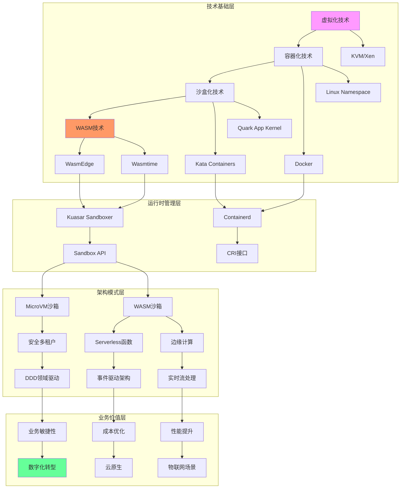

# 知识图谱构建

**版本**：v1.0 **最后更新**：2025-11-07 **维护者**：项目团队

## 📑 目录

- [📑 目录](#-目录)
- [📖 概述](#-概述)
- [一、技术生态知识图谱](#一技术生态知识图谱)
- [二、技术基础层](#二技术基础层)
  - [2.1 虚拟化技术](#21-虚拟化技术)
  - [2.2 容器化技术](#22-容器化技术)
  - [2.3 沙盒化技术](#23-沙盒化技术)
  - [2.4 WASM 技术](#24-wasm-技术)
- [三、运行时管理层](#三运行时管理层)
  - [3.1 Containerd](#31-containerd)
  - [3.2 Kuasar Sandboxer](#32-kuasar-sandboxer)
  - [3.3 Sandbox API](#33-sandbox-api)
- [四、架构模式层](#四架构模式层)
  - [4.1 安全多租户模式](#41-安全多租户模式)
  - [4.2 Serverless 函数模式](#42-serverless-函数模式)
  - [4.3 边缘计算模式](#43-边缘计算模式)
- [五、业务价值层](#五业务价值层)
  - [5.1 业务敏捷性](#51-业务敏捷性)
  - [5.2 成本优化](#52-成本优化)
  - [5.3 性能提升](#53-性能提升)
- [六、知识图谱应用](#六知识图谱应用)
  - [6.1 技术选型决策](#61-技术选型决策)
  - [6.2 技术演进规划](#62-技术演进规划)
  - [6.3 架构设计参考](#63-架构设计参考)
- [🔗 相关文档](#-相关文档)

---

## 📖 概述

本文档构建虚拟化、容器化、沙盒化到 WASM 的技术演进知识图谱，揭示技术生态的依赖关
系、演进路径和价值转化链。

## 一、技术生态知识图谱

## 二、技术基础层

### 2.1 虚拟化技术

**核心技术**：

- **KVM**：基于硬件的完全虚拟化
- **Xen**：半虚拟化和完全虚拟化
- **Hypervisor**：虚拟化监控程序

**技术特征**：

- 硬件级隔离
- 完整操作系统支持
- 强安全边界

**演进关系**：

- 虚拟化 → 容器化（共享内核优化）
- 虚拟化 → 沙盒化（轻量化虚拟化）

### 2.2 容器化技术

**核心技术**：

- **Docker**：容器化平台
- **Linux Namespace**：进程隔离
- **Cgroups**：资源限制

**技术特征**：

- 进程级隔离
- 轻量级启动
- 镜像复用

**演进关系**：

- 容器化 ← 虚拟化（性能优化）
- 容器化 → 沙盒化（安全增强）
- 容器化 → WASM（极致轻量）

### 2.3 沙盒化技术

**核心技术**：

- **Kata Containers**：轻量级虚拟机
- **Quark App Kernel**：应用内核
- **gVisor**：用户态内核

**技术特征**：

- 轻量化虚拟隔离
- 安全增强
- 兼容容器生态

**演进关系**：

- 沙盒化 ← 容器化（安全增强）
- 沙盒化 → WASM（极致轻量）

### 2.4 WASM 技术

**核心技术**：

- **WasmEdge**：边缘计算运行时
- **Wasmtime**：高性能运行时
- **WASI**：系统接口标准

**技术特征**：

- 指令集级隔离
- 跨平台执行
- 极致轻量

**演进关系**：

- WASM ← 沙盒化（极致优化）
- WASM ← 容器化（跨平台）

## 三、运行时管理层

### 3.1 Containerd

**定位**：高阶容器运行时

**功能**：

- 镜像管理
- 容器生命周期管理
- CRI 接口实现

**支持技术**：

- Docker 容器
- Kata 沙盒
- runC 运行时

### 3.2 Kuasar Sandboxer

**定位**：统一沙箱管理器

**功能**：

- 多沙箱类型统一管理
- 1:N 模型优化
- Sandbox API 实现

**支持技术**：

- MicroVM 沙箱
- WASM 沙箱
- 传统容器

### 3.3 Sandbox API

**定位**：沙箱管理标准化接口

**功能**：

- 统一沙箱创建接口
- 统一生命周期管理
- 统一资源管理

**标准化程度**：60%（2024）

## 四、架构模式层

### 4.1 安全多租户模式

**技术支撑**：MicroVM 沙箱

**架构特征**：

- 强隔离边界
- 独立内核
- 安全审计

**应用场景**：

- 金融核心系统
- 多租户 SaaS
- 合规要求高的场景

**领域模型影响**：

- DDD 限界上下文明确
- 子域隔离
- 防腐层强化

### 4.2 Serverless 函数模式

**技术支撑**：WASM 沙箱

**架构特征**：

- 函数级服务
- 事件驱动
- 按需扩展

**应用场景**：

- FaaS 平台
- API 网关
- 边缘计算

**领域模型影响**：

- 事件驱动架构
- 聚合根粒度细化
- 事件溯源

### 4.3 边缘计算模式

**技术支撑**：WASM 运行时

**架构特征**：

- 低延迟
- 数据本地化
- 离线能力

**应用场景**：

- IoT 设备
- CDN 边缘
- 移动端应用

**领域模型影响**：

- 实时流处理
- 事件驱动
- 本地优先

## 五、业务价值层

### 5.1 业务敏捷性

**技术路径**：DDD 领域驱动 → 业务敏捷性

**价值体现**：

- 快速响应业务变化
- 领域模型清晰
- 业务边界明确

**量化指标**：

- 版本发布周期：周级 → 小时级 → 分钟级
- 业务迭代速度：+30% → +60%

### 5.2 成本优化

**技术路径**：事件驱动架构 → 成本优化

**价值体现**：

- 资源利用率提升
- 按需付费
- 运维成本降低

**量化指标**：

- 基础设施成本：降低 90%+
- TCO：降低 67%+

### 5.3 性能提升

**技术路径**：实时流处理 → 性能提升

**价值体现**：

- 延迟降低
- 吞吐量提升
- 用户体验改善

**量化指标**：

- 启动延迟：800ms → 15ms
- 推理延迟：降低 85%

## 六、知识图谱应用

### 6.1 技术选型决策

**应用场景**：根据业务需求选择技术栈

**决策流程**：

1. 确定业务价值目标（敏捷性/成本/性能）
2. 回溯到架构模式层
3. 确定技术基础层
4. 选择运行时管理层

### 6.2 技术演进规划

**应用场景**：规划技术栈演进路径

**规划流程**：

1. 分析当前技术基础层
2. 确定目标业务价值
3. 规划演进路径
4. 评估演进成本

### 6.3 架构设计参考

**应用场景**：设计新系统架构

**参考流程**：

1. 确定业务场景
2. 选择架构模式
3. 选择技术栈
4. 设计领域模型

---

## 🔗 相关文档

- **[应用视角总览](../README.md)** - 应用视角文档集索引
- **[技术层次体系架构](../01-technical-layers/technical-layers.md)** - 四层演进
  模型
- **[业务应用架构映射](../03-business-architecture-mapping/business-architecture-mapping.md)** -
  技术到架构的映射
- **[决策树与行动建议](../14-decision-action/decision-action.md)** - 技术选型决
  策树

---

**最后更新**：2025-11-07 **维护者**：项目团队
