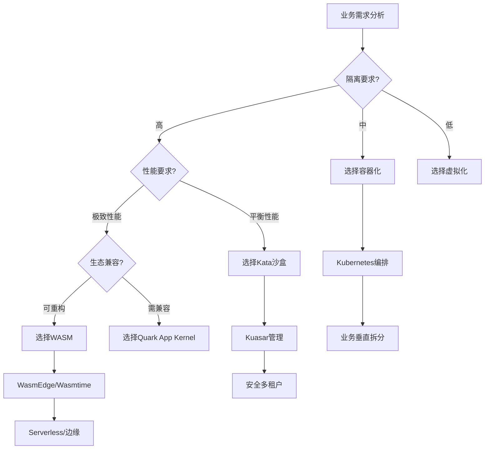

# 核心架构模型论证

**版本**：v1.0 **最后更新**：2025-11-07 **维护者**：项目团队

## 📑 目录

- [📑 目录](#-目录)
- [📖 概述](#-概述)
- [一、TOGAF 框架映射](#一togaf-框架映射)
  - [1.1 TOGAF 四层架构映射](#11-togaf-四层架构映射)
  - [1.2 业务架构演进](#12-业务架构演进)
  - [1.3 应用架构演进](#13-应用架构演进)
  - [1.4 数据架构演进](#14-数据架构演进)
  - [1.5 技术架构演进](#15-技术架构演进)
- [二、C4 模型适配性分析](#二c4-模型适配性分析)
  - [2.1 Context 层（系统上下文）](#21-context-层系统上下文)
  - [2.2 Container 层（容器/应用）](#22-container-层容器应用)
  - [2.3 Component 层（组件）](#23-component-层组件)
  - [2.4 Code 层（代码）](#24-code-层代码)
- [三、架构决策框架](#三架构决策框架)
  - [3.1 架构决策维度](#31-架构决策维度)
  - [3.2 架构决策矩阵](#32-架构决策矩阵)
  - [3.3 架构决策流程](#33-架构决策流程)
- [四、架构模式演进](#四架构模式演进)
  - [4.1 单体架构 → 微服务架构 → Serverless 架构](#41-单体架构--微服务架构--serverless-架构)
  - [4.2 同步架构 → 异步架构 → 事件驱动架构](#42-同步架构--异步架构--事件驱动架构)
- [🔗 相关文档](#-相关文档)

---

## 📖 概述

本文档从企业架构框架（TOGAF）和软件架构模型（C4）的视角，分析虚拟化、容器化、沙
盒化到 WASM 演进对架构设计的影响，提供架构决策框架。

## 一、TOGAF 框架映射

### 1.1 TOGAF 四层架构映射

| 架构维度     | 虚拟化时代    | 容器化时代    | WASM 时代          |
| ------------ | ------------- | ------------- | ------------------ |
| **业务架构** | 职能式组织    | 产品制/部落制 | 平台化生态         |
| **应用架构** | ERP/CRM 单体  | 微服务集群    | Serverless+API     |
| **数据架构** | 数据仓库      | 数据湖/中台   | 实时数据流         |
| **技术架构** | VMware+物理机 | K8s+容器      | WASM 运行时+边缘云 |

### 1.2 业务架构演进

**虚拟化时代（职能式组织）**:

- **组织模式**：按职能划分（开发、测试、运维）
- **业务边界**：物理边界（VM 边界）
- **协作方式**：瀑布式，文档驱动

**容器化时代（产品制/部落制）**:

- **组织模式**：按产品/业务线划分
- **业务边界**：服务边界（Container 边界）
- **协作方式**：敏捷式，代码驱动

**WASM 时代（平台化生态）**:

- **组织模式**：平台化，生态化
- **业务边界**：函数边界（Function 边界）
- **协作方式**：事件驱动，数据驱动

### 1.3 应用架构演进

**虚拟化时代（ERP/CRM 单体）**:

- **架构模式**：单体应用
- **部署方式**：物理机/虚拟机部署
- **扩展方式**：垂直扩展（Scale Up）

**容器化时代（微服务集群）**:

- **架构模式**：微服务架构
- **部署方式**：容器化部署
- **扩展方式**：水平扩展（Scale Out）

**WASM 时代（Serverless+API）**:

- **架构模式**：Serverless + API Gateway
- **部署方式**：函数化部署
- **扩展方式**：按需扩展（Scale to Zero）

### 1.4 数据架构演进

**虚拟化时代（数据仓库）**:

- **数据模式**：集中式数据管理
- **数据处理**：ETL 流程，批处理
- **数据一致性**：ACID 事务

**容器化时代（数据湖/中台）**:

- **数据模式**：分布式数据架构
- **数据处理**：流式处理，实时计算
- **数据一致性**：最终一致性

**WASM 时代（实时数据流）**:

- **数据模式**：超轻量数据流
- **数据处理**：事件流处理，边缘计算
- **数据一致性**：事件顺序保证

### 1.5 技术架构演进

**虚拟化时代（VMware+物理机）**:

- **基础设施**：物理服务器 + 虚拟化层
- **编排方式**：手动部署 + 脚本
- **监控方式**：传统监控工具

**容器化时代（K8s+容器）**:

- **基础设施**：云资源 + 容器编排
- **编排方式**：Kubernetes 自动编排
- **监控方式**：Prometheus + Grafana

**WASM 时代（WASM 运行时+边缘云）**:

- **基础设施**：边缘设备 + WASM 运行时
- **编排方式**：事件驱动编排
- **监控方式**：分布式追踪 + 实时监控

## 二、C4 模型适配性分析

### 2.1 Context 层（系统上下文）

**虚拟化时代**:

- **系统边界**：物理边界（数据中心）
- **外部系统**：通过 API 调用
- **用户交互**：Web 界面，客户端应用

**容器化时代**:

- **系统边界**：服务边界（微服务集群）
- **外部系统**：通过 API Gateway
- **用户交互**：Web/移动端，API 调用

**WASM 时代**:

- **系统边界**：函数边界（函数网格）
- **外部系统**：通过事件流
- **用户交互**：边缘设备，实时交互

**演进特征**：

- 系统边界从"服务"细化到"函数"
- 外部系统交互从 API 调用演变为事件流

### 2.2 Container 层（容器/应用）

**虚拟化时代**:

- **容器类型**：虚拟机（VM）
- **容器特征**：完整操作系统
- **容器管理**：Hypervisor

**容器化时代**:

- **容器类型**：Docker 容器
- **容器特征**：共享内核，轻量级
- **容器管理**：Containerd，Kubernetes

**WASM 时代**:

- **容器类型**：WASM 沙箱
- **容器特征**：指令集级隔离，极致轻量
- **容器管理**：Kuasar Sandboxer，Sandbox API

**演进特征**：

- 容器运行时从 Docker 演进为 Kuasar 多沙箱管理
- 支持 1:N 模型，大幅减少进程开销

### 2.3 Component 层（组件）

**虚拟化时代**:

- **组件类型**：应用模块
- **组件特征**：紧耦合，单体架构
- **组件通信**：进程内调用

**容器化时代**:

- **组件类型**：微服务组件
- **组件特征**：松耦合，服务化
- **组件通信**：REST/gRPC API

**WASM 时代**:

- **组件类型**：WASM 模块
- **组件特征**：可移植组件，跨语言
- **组件通信**：事件流，函数调用

**演进特征**：

- WASM 模块作为可移植组件，实现"一次编译，处处运行"
- 跨语言复用能力增强

### 2.4 Code 层（代码）

**虚拟化时代**:

- **代码特征**：传统编程语言
- **部署方式**：编译后部署到 VM
- **运行时**：操作系统运行时

**容器化时代**:

- **代码特征**：容器化应用
- **部署方式**：镜像化部署
- **运行时**：容器运行时

**WASM 时代**:

- **代码特征**：WASM 字节码
- **部署方式**：WASM 模块部署
- **运行时**：WASM 运行时

**演进特征**：

- 源码需适配 WASM 指令集
- 语言生态限制（Rust/C++/Go）
- 运行时安全性由沙箱保证

## 三、架构决策框架

### 3.1 架构决策维度

**技术维度**:

- 隔离级别要求
- 性能要求
- 安全要求
- 兼容性要求

**业务维度**:

- 业务敏捷性要求
- 成本要求
- 扩展性要求
- 可用性要求

**组织维度**:

- 团队技能水平
- 组织成熟度
- 投资预算
- 时间要求

### 3.2 架构决策矩阵

| 决策因素       | 虚拟化     | 容器化   | 沙盒化     | WASM       |
| -------------- | ---------- | -------- | ---------- | ---------- |
| **隔离要求**   | ⭐⭐⭐⭐⭐ | ⭐⭐     | ⭐⭐⭐⭐⭐ | ⭐⭐⭐⭐⭐ |
| **性能要求**   | ⭐⭐       | ⭐⭐⭐⭐ | ⭐⭐⭐     | ⭐⭐⭐⭐⭐ |
| **成本要求**   | ⭐⭐       | ⭐⭐⭐⭐ | ⭐⭐⭐     | ⭐⭐⭐⭐⭐ |
| **兼容性要求** | ⭐⭐⭐⭐⭐ | ⭐⭐⭐⭐ | ⭐⭐⭐     | ⭐⭐       |
| **敏捷性要求** | ⭐⭐       | ⭐⭐⭐⭐ | ⭐⭐⭐     | ⭐⭐⭐⭐⭐ |

### 3.3 架构决策流程

## 四、架构模式演进

### 4.1 单体架构 → 微服务架构 → Serverless 架构

**演进驱动力**：

- 业务复杂度增加
- 团队规模扩大
- 技术栈多样化
- 部署频率提升

**演进路径**：

1. **单体架构**（虚拟化时代）

   - 单一应用，集中部署
   - 技术栈统一
   - 部署周期长

2. **微服务架构**（容器化时代）

   - 服务拆分，独立部署
   - 技术栈多样化
   - 部署频率提升

3. **Serverless 架构**（WASM 时代）
   - 函数级服务，按需部署
   - 跨语言运行时
   - 极致弹性

### 4.2 同步架构 → 异步架构 → 事件驱动架构

**演进驱动力**：

- 系统规模扩大
- 响应时间要求提升
- 系统解耦需求

**演进路径**：

1. **同步架构**（虚拟化时代）

   - 直接调用
   - 强耦合
   - 阻塞等待

2. **异步架构**（容器化时代）

   - 消息队列
   - 松耦合
   - 非阻塞

3. **事件驱动架构**（WASM 时代）
   - 事件流
   - 完全解耦
   - 实时响应

---

## 🔗 相关文档

- **[应用视角总览](../README.md)** - 应用视角文档集索引
- **[业务应用架构映射](../03-business-architecture-mapping/business-architecture-mapping.md)** -
  技术到架构的映射
- **[演进路径与决策树](../07-evolution-decision-tree/evolution-decision-tree.md)** -
  技术演进决策树
- **[未来架构模型推演](../12-future-architecture/future-architecture.md)** - 未
  来架构模型

---

**最后更新**：2025-11-07 **维护者**：项目团队
