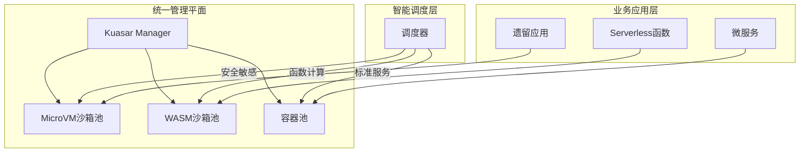

# 未来发展趋势与架构建议

**版本**：v1.0 **最后更新**：2025-11-07 **维护者**：项目团队

## 📑 目录

- [📑 目录](#-目录)
- [📖 概述](#-概述)
- [一、混合沙箱架构模式](#一混合沙箱架构模式)
  - [1.1 推荐方案](#11-推荐方案)
  - [1.2 架构设计](#12-架构设计)
  - [1.3 核心优势](#13-核心优势)
- [二、信息架构演进方向](#二信息架构演进方向)
  - [2.1 从"集中式"到"流动式"](#21-从集中式到流动式)
  - [2.2 数据同步机制](#22-数据同步机制)
  - [2.3 零信任架构](#23-零信任架构)
- [三、领域模型设计原则](#三领域模型设计原则)
  - [3.1 原子性](#31-原子性)
  - [3.2 可组合性](#32-可组合性)
  - [3.3 事件驱动](#33-事件驱动)
  - [3.4 防腐蚀层](#34-防腐蚀层)
- [四、实施路线图](#四实施路线图)
  - [4.1 阶段规划](#41-阶段规划)
  - [4.2 关键里程碑](#42-关键里程碑)
- [五、架构演进建议](#五架构演进建议)
  - [5.1 技术选型建议](#51-技术选型建议)
  - [5.2 组织能力建设](#52-组织能力建设)
  - [5.3 风险控制](#53-风险控制)
- [🔗 相关文档](#-相关文档)

---

## 📖 概述

本文档分析虚拟化、容器化、沙盒化到 WASM 演进的未来发展趋势，提供混合沙箱架构模式
、信息架构演进方向、领域模型设计原则等架构建议。

## 一、混合沙箱架构模式

### 1.1 推荐方案

**基于 Kuasar 的统一管理平面**，同时支持：

- **MicroVM 沙箱**：运行遗留应用和安全敏感服务
- **WASM 沙箱**：运行函数计算和事件驱动组件
- **传统容器**：运行标准微服务应用

### 1.2 架构设计

### 1.3 核心优势

**统一管理**：

- 单一管理平面
- 统一 API 接口
- 统一监控体系

**灵活调度**：

- 根据业务需求自动选择沙箱类型
- 基于 SLA 的智能路由
- 成本优化调度

**平滑演进**：

- 支持渐进式迁移
- 降低切换风险
- 保持业务连续性

## 二、信息架构演进方向

### 2.1 从"集中式"到"流动式"

**演进路径**：

1. **集中式**（虚拟化时代）

   - 数据仓库
   - ETL 流程
   - 批处理

2. **分布式**（容器化时代）

   - 数据湖/中台
   - 流式处理
   - 实时计算

3. **流动式**（WASM 时代）
   - 实时数据流
   - 事件流处理
   - 边缘计算

### 2.2 数据同步机制

**Kafka 等流式平台**：

- 实现跨沙箱数据流动
- 事件驱动架构
- 实时数据同步

**联邦查询**：

- 每个沙箱实例维护局部数据视图
- 分布式查询
- 数据本地化

### 2.3 零信任架构

**服务网格实现细粒度访问控制**：

- 基于身份的策略
- 动态权限管理
- 端到端加密

**数据隔离**：

- 沙箱级数据隔离
- 加密传输
- 审计日志

## 三、领域模型设计原则

### 3.1 原子性

**WASM 函数对应最小业务单元**：

- 单一职责原则
- 高内聚低耦合
- 易于测试和维护

**设计原则**：

- 函数粒度细化
- 业务逻辑封装
- 接口标准化

### 3.2 可组合性

**通过编排层组合函数为复杂流程**：

- 函数组合
- 工作流编排
- 事件驱动

**设计原则**：

- 函数可复用
- 组合灵活
- 编排可视化

### 3.3 事件驱动

**领域事件作为跨沙箱通信机制**：

- 事件发布订阅
- 事件溯源
- 最终一致性

**设计原则**：

- 事件定义清晰
- 事件版本管理
- 事件存储可靠

### 3.4 防腐蚀层

**沙箱边界处建立翻译层**：

- 协议转换
- 数据格式转换
- 接口适配

**设计原则**：

- 边界清晰
- 转换透明
- 性能优化

## 四、实施路线图

### 4.1 阶段规划

| 阶段        | 目标         | 关键技术        | 架构产出          |
| ----------- | ------------ | --------------- | ----------------- |
| **当前**    | 容器化改造   | Docker/K8s      | 微服务架构        |
| **6 个月**  | 引入沙盒增强 | Kata/Kuasar     | 安全多租户        |
| **12 个月** | WASM 试点    | WasmEdge        | Serverless 函数   |
| **18 个月** | 统一调度     | Kuasar 统一管理 | 混合沙箱架构      |
| **长期**    | 全面云原生   | WASM 优先       | 事件驱动+边缘智能 |

### 4.2 关键里程碑

**Milestone 1：沙盒化增强（6 个月）**:

- 部署 Kata 沙盒
- 建立沙盒管理平台
- 安全合规达标

**Milestone 2：WASM 试点（12 个月）**:

- 部署 WASM 运行时
- 试点边缘计算场景
- 建立开发工具链

**Milestone 3：统一调度（18 个月）**:

- 建立混合沙箱中台
- 实现智能调度
- 统一监控体系

**Milestone 4：全面云原生（长期）**:

- WASM 优先策略
- 事件驱动架构
- 边缘智能

## 五、架构演进建议

### 5.1 技术选型建议

**当前阶段（2025）**：

- **推荐**：容器化 + 沙盒化混合
- **理由**：平衡性能、安全、成本
- **重点**：建立统一管理平台

**中期阶段（2026-2027）**：

- **推荐**：WASM 试点 + 混合架构
- **理由**：探索新技术，降低风险
- **重点**：建立 WASM 生态

**长期阶段（2028+）**：

- **推荐**：WASM 优先 + 事件驱动
- **理由**：极致性能，成本优化
- **重点**：全面云原生

### 5.2 组织能力建设

**技术能力**：

- 沙盒技术栈
- WASM 开发能力
- 事件驱动架构设计

**组织架构**：

- 平台团队
- 运维团队
- 安全团队

**流程优化**：

- DevOps 流程
- 安全审计流程
- 监控告警流程

### 5.3 风险控制

**技术风险**：

- 技术选型验证
- 性能测试
- 安全测试

**业务风险**：

- 业务连续性保障
- 回滚方案
- 应急预案

**组织风险**：

- 团队能力提升
- 知识传承
- 文化变革

---

## 🔗 相关文档

- **[应用视角总览](../README.md)** - 应用视角文档集索引
- **[演进路径与决策树](../07-evolution-decision-tree/evolution-decision-tree.md)** -
  技术演进决策树
- **[未来架构模型推演](../12-future-architecture/future-architecture.md)** - 未
  来架构模型
- **[决策树与行动建议](../14-decision-action/decision-action.md)** - 技术选型决
  策树

---

**最后更新**：2025-11-07 **维护者**：项目团队
