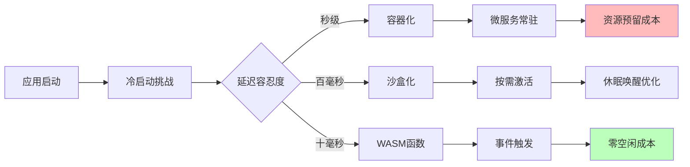

# 应用架构演进分析

**版本**：v1.0 **最后更新**：2025-11-07 **维护者**：项目团队

## 📑 目录

- [📑 目录](#-目录)
- [📖 概述](#-概述)
- [一、应用层穿透式演进矩阵](#一应用层穿透式演进矩阵)
  - [1.1 应用类型演进矩阵](#11-应用类型演进矩阵)
  - [1.2 应用特征演进](#12-应用特征演进)
- [二、应用启动范式迁移](#二应用启动范式迁移)
  - [2.1 启动范式演进](#21-启动范式演进)
  - [2.2 核心洞察](#22-核心洞察)
  - [2.3 启动时间对比](#23-启动时间对比)
- [三、应用类型演进路径](#三应用类型演进路径)
  - [3.1 Web 应用演进](#31-web-应用演进)
  - [3.2 数据处理应用演进](#32-数据处理应用演进)
  - [3.3 AI 推理应用演进](#33-ai-推理应用演进)
- [四、应用架构模式演进](#四应用架构模式演进)
  - [4.1 单体架构 → 微服务架构 → Serverless 架构](#41-单体架构--微服务架构--serverless-架构)
  - [4.2 同步架构 → 异步架构 → 事件驱动架构](#42-同步架构--异步架构--事件驱动架构)
- [🔗 相关文档](#-相关文档)

---

## 📖 概述

本文档从应用架构的视角，分析虚拟化、容器化、沙盒化到 WASM 演进对应用架构的影响，
包括应用类型、启动范式、架构模式等方面的演进路径。

## 一、应用层穿透式演进矩阵

### 1.1 应用类型演进矩阵

| 应用类型     | 虚拟化时代（2010 前） | 容器化时代（2014-2020） | 沙盒化时代（2021-2024） | WASM 时代（2025+） |
| ------------ | --------------------- | ----------------------- | ----------------------- | ------------------ |
| **Web 应用** | Apache/PHP on VM      | Nginx+微服务            | Podman 安全沙箱         | 边缘函数+CDN       |
| **数据处理** | Hadoop 物理集群       | Spark on K8s            | Kata 安全计算           | 流式 WASM 函数     |
| **AI 推理**  | GPU 直通 VM           | Triton 容器             | 机密计算沙箱            | WASM AI Runtime    |
| **IoT 场景** | 无                    | 边缘 K3s                | 轻量沙盒                | 设备端 WASM        |
| **金融核心** | 大型机                | 容器化试点              | 合规沙盒                | 智能合约函数       |
| **典型密度** | 10-50 实例/机         | 100-500 实例/机         | 1000-5000 实例/机       | 10 万+函数/机      |

### 1.2 应用特征演进

**虚拟化时代特征**：

- **部署方式**：物理机/虚拟机部署
- **扩展方式**：垂直扩展（Scale Up）
- **资源利用**：资源利用率低（10-30%）
- **启动时间**：分钟级

**容器化时代特征**：

- **部署方式**：容器化部署
- **扩展方式**：水平扩展（Scale Out）
- **资源利用**：资源利用率提升（50-70%）
- **启动时间**：秒级

**沙盒化时代特征**：

- **部署方式**：沙箱化部署
- **扩展方式**：按需扩展
- **资源利用**：资源利用率进一步提升（70-90%）
- **启动时间**：毫秒级

**WASM 时代特征**：

- **部署方式**：函数化部署
- **扩展方式**：按需扩展（Scale to Zero）
- **资源利用**：资源利用率极高（90%+）
- **启动时间**：<10ms

## 二、应用启动范式迁移

### 2.1 启动范式演进

### 2.2 核心洞察

**应用从"长期驻留"转向"瞬态执行"**，直接驱动成本模型从**资源预留**转向**按调用付
费**。

**演进路径**：

1. **长期驻留**（虚拟化/容器化）

   - 应用长期运行
   - 资源预留
   - 成本固定

2. **按需激活**（沙盒化）

   - 应用按需启动
   - 休眠唤醒优化
   - 成本降低

3. **事件触发**（WASM）
   - 应用事件触发
   - 零空闲成本
   - 成本最低

### 2.3 启动时间对比

| 技术类型       | 启动时间  | 冷启动时间 | 热启动时间 | 成本模型   |
| -------------- | --------- | ---------- | ---------- | ---------- |
| **传统虚拟化** | 30-60 秒  | 30-60 秒   | 10-20 秒   | 资源预留   |
| **容器化**     | 1-3 秒    | 1-3 秒     | 0.5-1 秒   | 资源预留   |
| **沙盒化**     | 200-500ms | 200-500ms  | 50-100ms   | 按需付费   |
| **WASM**       | <10ms     | <10ms      | <5ms       | 按调用付费 |

## 三、应用类型演进路径

### 3.1 Web 应用演进

**虚拟化时代**：

- **架构**：Apache/PHP on VM
- **部署**：单机部署
- **扩展**：垂直扩展

**容器化时代**：

- **架构**：Nginx+微服务
- **部署**：容器化部署
- **扩展**：水平扩展

**沙盒化时代**：

- **架构**：Podman 安全沙箱
- **部署**：沙箱化部署
- **扩展**：按需扩展

**WASM 时代**：

- **架构**：边缘函数+CDN
- **部署**：函数化部署
- **扩展**：按需扩展（Scale to Zero）

### 3.2 数据处理应用演进

**虚拟化时代**：

- **架构**：Hadoop 物理集群
- **处理模式**：批处理
- **延迟**：小时级

**容器化时代**：

- **架构**：Spark on K8s
- **处理模式**：批处理+流处理
- **延迟**：分钟级

**沙盒化时代**：

- **架构**：Kata 安全计算
- **处理模式**：流处理
- **延迟**：秒级

**WASM 时代**：

- **架构**：流式 WASM 函数
- **处理模式**：实时流处理
- **延迟**：毫秒级

### 3.3 AI 推理应用演进

**虚拟化时代**：

- **架构**：GPU 直通 VM
- **部署**：专用 GPU 服务器
- **成本**：高

**容器化时代**：

- **架构**：Triton 容器
- **部署**：容器化 GPU
- **成本**：中

**沙盒化时代**：

- **架构**：机密计算沙箱
- **部署**：安全沙箱
- **成本**：中

**WASM 时代**：

- **架构**：WASM AI Runtime
- **部署**：边缘设备
- **成本**：低

## 四、应用架构模式演进

### 4.1 单体架构 → 微服务架构 → Serverless 架构

**演进驱动力**：

- 业务复杂度增加
- 团队规模扩大
- 部署频率提升
- 成本优化需求

**演进路径**：

1. **单体架构**（虚拟化时代）

   - 单一应用
   - 集中部署
   - 技术栈统一

2. **微服务架构**（容器化时代）

   - 服务拆分
   - 独立部署
   - 技术栈多样化

3. **Serverless 架构**（WASM 时代）
   - 函数级服务
   - 按需部署
   - 跨语言运行时

### 4.2 同步架构 → 异步架构 → 事件驱动架构

**演进驱动力**：

- 系统规模扩大
- 响应时间要求提升
- 系统解耦需求

**演进路径**：

1. **同步架构**（虚拟化时代）

   - 直接调用
   - 强耦合
   - 阻塞等待

2. **异步架构**（容器化时代）

   - 消息队列
   - 松耦合
   - 非阻塞

3. **事件驱动架构**（WASM 时代）
   - 事件流
   - 完全解耦
   - 实时响应

---

## 🔗 相关文档

- **[应用视角总览](../README.md)** - 应用视角文档集索引
- **[业务应用架构映射](../03-business-architecture-mapping/business-architecture-mapping.md)** -
  技术到架构的映射
- **[业务价值定量论证模型](../10-business-value/business-value.md)** - 成本效益
  分析
- **[未来架构模型推演](../12-future-architecture/future-architecture.md)** - 未
  来架构模型

---

**最后更新**：2025-11-07 **维护者**：项目团队
