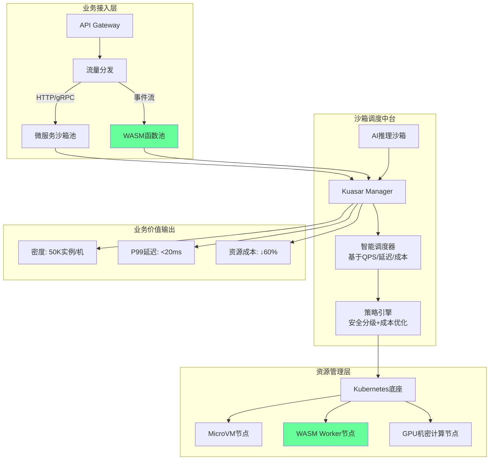

# 未来架构模型推演

**版本**：v1.0 **最后更新**：2025-11-07 **维护者**：项目团队

## 📑 目录

- [📑 目录](#-目录)
- [📖 概述](#-概述)
- [一、2026 年主流架构模型：混合沙箱中台](#一2026-年主流架构模型混合沙箱中台)
  - [1.1 架构设计](#11-架构设计)
  - [1.2 核心特征](#12-核心特征)
  - [1.3 关键指标](#13-关键指标)
- [二、2028 年颠覆模型：WASM 原生云](#二2028-年颠覆模型wasm-原生云)
  - [2.1 架构假设](#21-架构假设)
  - [2.2 技术栈重构](#22-技术栈重构)
  - [2.3 关键突破](#23-关键突破)
- [三、2030 年愿景：边缘智能网络](#三2030-年愿景边缘智能网络)
  - [3.1 架构愿景](#31-架构愿景)
  - [3.2 核心特征](#32-核心特征)
  - [3.3 应用场景](#33-应用场景)
- [四、架构演进路径](#四架构演进路径)
  - [4.1 演进时间线](#41-演进时间线)
  - [4.2 演进驱动力](#42-演进驱动力)
- [🔗 相关文档](#-相关文档)

---

## 📖 概述

本文档推演虚拟化、容器化、沙盒化到 WASM 演进的未来架构模型，包括 2026 年混合沙箱
中台、2028 年 WASM 原生云、2030 年边缘智能网络等架构愿景。

## 一、2026 年主流架构模型：混合沙箱中台

### 1.1 架构设计



### 1.2 核心特征

**三分调度**：

- **微服务任务**：标准容器/MicroVM 沙箱
- **WASM 任务**：WASM 沙箱
- **AI 任务**：GPU 机密计算沙箱

**统一编排**：

- Kubernetes 兼容层
- 统一 API 接口
- 统一监控体系

**智能路由**：

- 基于 SLA 自动选择沙箱类型
- 成本优化调度
- 性能优化调度

### 1.3 关键指标

**性能指标**：

- **部署密度**：50K 实例/机
- **P99 延迟**：<20ms
- **启动时间**：<10ms（WASM）

**成本指标**：

- **资源成本**：降低 60%
- **运维成本**：降低 40%
- **TCO**：降低 50%

## 二、2028 年颠覆模型：WASM 原生云

### 2.1 架构假设

**技术前提**：

- WASM 生态成熟（语言支持>15 种）
- 浏览器/服务器运行时统一
- 硬件加速指令集普及

### 2.2 技术栈重构

```text
┌─────────────────────────────────────────┐
│ 业务代码 → WASM模块（跨平台编译）        │
├─────────────────────────────────────────┤
│ 编排层   →  WAMR（WASM微运行时）        │
├─────────────────────────────────────────┤
│ 基础设施 → WASM-Optimized硬件          │
└─────────────────────────────────────────┘
```

### 2.3 关键突破

**零信任默认**：

- 每个函数独立沙箱
- 默认安全隔离
- 细粒度权限控制

**即时迁移**：

- WASM 快照跨 CPU 架构迁移
- 无状态函数迁移
- 边缘到云端无缝迁移

**成本趋零**：

- 边缘设备执行，无需中心云
- 按调用付费，零空闲成本
- 资源利用率 99%+

## 三、2030 年愿景：边缘智能网络

### 3.1 架构愿景

**边缘智能网络**：

- **计算**：边缘设备 + WASM 运行时
- **存储**：分布式存储 + 区块链
- **网络**：5G/6G + 边缘计算
- **AI**：边缘 AI + 联邦学习

### 3.2 核心特征

**去中心化**：

- 无中心云依赖
- 边缘设备自治
- P2P 网络通信

**智能化**：

- 边缘 AI 推理
- 联邦学习训练
- 自适应调度

**安全性**：

- 零信任架构
- 端到端加密
- 区块链验证

### 3.3 应用场景

**IoT 全场景**：

- 智能家居
- 工业物联网
- 车联网

**边缘计算**：

- CDN 边缘
- 移动边缘
- 企业边缘

**AI 推理**：

- 设备端 AI
- 实时推理
- 隐私保护

## 四、架构演进路径

### 4.1 演进时间线

**2025**：

- 混合沙箱架构
- WASM 试点
- 边缘计算探索

**2026**：

- 混合沙箱中台成熟
- WASM 生态完善
- 边缘计算普及

**2027**：

- WASM 原生云萌芽
- 边缘智能网络探索
- 去中心化架构实验

**2028**：

- WASM 原生云成熟
- 边缘智能网络试点
- 去中心化架构应用

**2029-2030**：

- 边缘智能网络成熟
- 全面去中心化
- 智能化自治

### 4.2 演进驱动力

**技术驱动力**：

- WASM 生态成熟
- 边缘设备能力提升
- 网络技术发展

**业务驱动力**：

- 成本优化需求
- 延迟降低需求
- 隐私保护需求

**社会驱动力**：

- 数字化转型
- 边缘计算普及
- 智能化需求

---

## 🔗 相关文档

- **[应用视角总览](../README.md)** - 应用视角文档集索引
- **[未来趋势预测模型](../11-trend-prediction/trend-prediction.md)** - 技术趋势
  预测
- **[业务场景演进预测](../13-scenario-evolution/scenario-evolution.md)** - 场景
  化渗透率预测
- **[未来发展趋势与架构建议](../08-future-trends/future-trends.md)** - 未来架构
  建议

---

**最后更新**：2025-11-07 **维护者**：项目团队
