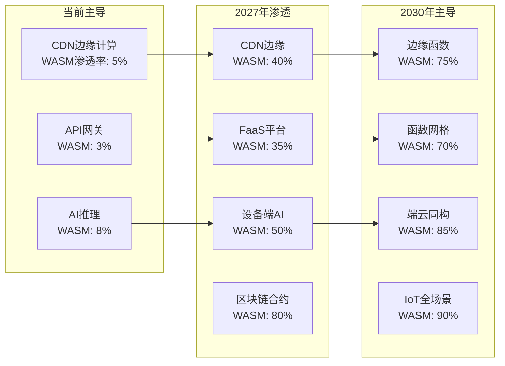

# 业务场景演进预测

**版本**：v1.0 **最后更新**：2025-11-07 **维护者**：项目团队

## 📑 目录

- [📑 目录](#-目录)
- [📖 概述](#-概述)
- [一、场景化渗透率预测（2025-2030）](#一场景化渗透率预测2025-2030)
  - [1.1 场景渗透率演进](#11-场景渗透率演进)
  - [1.2 爆发优先级](#12-爆发优先级)
  - [1.3 场景渗透率预测表](#13-场景渗透率预测表)
- [二、商业模式颠覆预测](#二商业模式颠覆预测)
  - [2.1 商业模式对比](#21-商业模式对比)
  - [2.2 定价模型演进](#22-定价模型演进)
  - [2.3 拐点信号](#23-拐点信号)
- [三、场景优先级分析](#三场景优先级分析)
  - [3.1 场景优先级矩阵](#31-场景优先级矩阵)
  - [3.2 场景特征分析](#32-场景特征分析)
- [四、场景演进路径](#四场景演进路径)
  - [4.1 区块链/智能合约演进](#41-区块链智能合约演进)
  - [4.2 边缘 AI 演进](#42-边缘-ai-演进)
  - [4.3 Serverless 演进](#43-serverless-演进)
- [🔗 相关文档](#-相关文档)

---

## 📖 概述

本文档预测虚拟化、容器化、沙盒化到 WASM 演进在不同业务场景中的渗透率变化，分析商
业模式颠覆和场景优先级，为场景化技术选型提供参考。

## 一、场景化渗透率预测（2025-2030）

### 1.1 场景渗透率演进

### 1.2 爆发优先级

**爆发优先级**：**区块链/智能合约** > **边缘 AI** > **Serverless** > **Web 应
用**

**优先级分析**：

1. **区块链/智能合约**（优先级最高）

   - 技术匹配度高
   - 安全要求高
   - 跨平台需求强

2. **边缘 AI**（优先级高）

   - 性能要求高
   - 延迟敏感
   - 成本敏感

3. **Serverless**（优先级中）

   - 成本优势明显
   - 弹性需求强
   - 生态逐步成熟

4. **Web 应用**（优先级低）
   - 兼容性要求高
   - 迁移成本高
   - 生态依赖强

### 1.3 场景渗透率预测表

| 场景           | 2025 | 2026 | 2027 | 2028 | 2029 | 2030 |
| -------------- | ---- | ---- | ---- | ---- | ---- | ---- |
| **CDN 边缘**   | 5%   | 15%  | 40%  | 55%  | 65%  | 75%  |
| **API 网关**   | 3%   | 10%  | 35%  | 50%  | 60%  | 70%  |
| **AI 推理**    | 8%   | 25%  | 50%  | 65%  | 75%  | 85%  |
| **区块链合约** | 10%  | 40%  | 80%  | 85%  | 88%  | 90%  |
| **IoT 场景**   | 2%   | 8%   | 25%  | 50%  | 70%  | 90%  |
| **Web 应用**   | 1%   | 3%   | 8%   | 15%  | 25%  | 40%  |

## 二、商业模式颠覆预测

### 2.1 商业模式对比

| 模式         | 虚拟化时代   | WASM 时代    | 价值差            |
| ------------ | ------------ | ------------ | ----------------- |
| **定价模型** | 按实例/小时  | 按调用/毫秒  | **成本 ↓90%**     |
| **SLA 承诺** | 99.9%可用性  | 99.99%弹性   | **可靠性 ↑10 倍** |
| **客户触点** | 企业 IT 部门 | 业务开发者   | **效率 ↑5 倍**    |
| **竞争壁垒** | 规模效应     | 生态网络效应 | **护城河改变**    |

### 2.2 定价模型演进

**虚拟化时代**：

- **定价**：按实例/小时
- **特点**：资源预留，固定成本
- **客户**：企业 IT 部门

**容器化时代**：

- **定价**：按实例/小时（优化）
- **特点**：资源复用，成本降低
- **客户**：DevOps 团队

**WASM 时代**：

- **定价**：按调用/毫秒
- **特点**：按需付费，零空闲成本
- **客户**：业务开发者

### 2.3 拐点信号

**拐点信号**：当某云厂商推出 **"WASM-first"** 产品且定价低于容器 50%时，市场将在
18 个月内完成切换。

**拐点特征**：

- 技术成熟度>60%
- 工具链完善度>60%
- 生态健康度>60%
- 成本优势>50%

## 三、场景优先级分析

### 3.1 场景优先级矩阵

| 场景           | 技术匹配度 | 市场潜力   | 迁移难度 | 优先级   |
| -------------- | ---------- | ---------- | -------- | -------- |
| **区块链合约** | ⭐⭐⭐⭐⭐ | ⭐⭐⭐⭐⭐ | ⭐⭐⭐   | **最高** |
| **边缘 AI**    | ⭐⭐⭐⭐⭐ | ⭐⭐⭐⭐⭐ | ⭐⭐⭐⭐ | **高**   |
| **Serverless** | ⭐⭐⭐⭐   | ⭐⭐⭐⭐⭐ | ⭐⭐⭐   | **高**   |
| **IoT 场景**   | ⭐⭐⭐⭐⭐ | ⭐⭐⭐⭐   | ⭐⭐⭐⭐ | **中**   |
| **Web 应用**   | ⭐⭐⭐     | ⭐⭐⭐⭐   | ⭐⭐     | **低**   |

### 3.2 场景特征分析

**区块链/智能合约**：

- **技术匹配度**：极高（安全、跨平台）
- **市场潜力**：极大（DeFi、NFT 等）
- **迁移难度**：中等（需重新编译）
- **优先级**：最高

**边缘 AI**：

- **技术匹配度**：极高（性能、延迟）
- **市场潜力**：极大（IoT、移动端）
- **迁移难度**：高（模型适配）
- **优先级**：高

**Serverless**：

- **技术匹配度**：高（弹性、成本）
- **市场潜力**：极大（FaaS 市场）
- **迁移难度**：中等（函数化改造）
- **优先级**：高

## 四、场景演进路径

### 4.1 区块链/智能合约演进

**2025**：

- **渗透率**：10%
- **特征**：早期采用者
- **场景**：DeFi、NFT

**2026-2027**：

- **渗透率**：40-80%
- **特征**：快速普及
- **场景**：智能合约、DApp

**2028-2030**：

- **渗透率**：85-90%
- **特征**：主流技术
- **场景**：全场景应用

### 4.2 边缘 AI 演进

**2025**：

- **渗透率**：8%
- **特征**：技术验证
- **场景**：移动端 AI

**2026-2027**：

- **渗透率**：25-50%
- **特征**：快速推广
- **场景**：IoT、边缘设备

**2028-2030**：

- **渗透率**：75-85%
- **特征**：主流技术
- **场景**：端云同构

### 4.3 Serverless 演进

**2025**：

- **渗透率**：3%
- **特征**：早期探索
- **场景**：API 网关

**2026-2027**：

- **渗透率**：10-35%
- **特征**：生态成熟
- **场景**：FaaS 平台

**2028-2030**：

- **渗透率**：60-70%
- **特征**：主流技术
- **场景**：函数网格

---

## 🔗 相关文档

- **[应用视角总览](../README.md)** - 应用视角文档集索引
- **[未来趋势预测模型](../11-trend-prediction/trend-prediction.md)** - 技术趋势
  预测
- **[未来架构模型推演](../12-future-architecture/future-architecture.md)** - 未
  来架构模型
- **[业务价值定量论证模型](../10-business-value/business-value.md)** - 成本效益
  分析

---

**最后更新**：2025-11-07 **维护者**：项目团队
