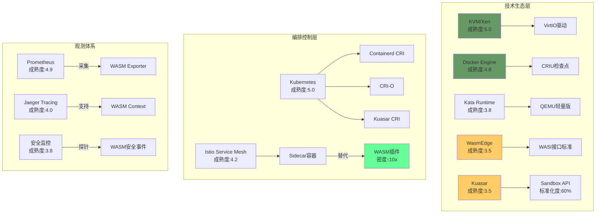

# 技术生态成熟度定量评估

**版本**：v1.0 **最后更新**：2025-11-07 **维护者**：项目团队

## 📑 目录

- [📑 目录](#-目录)
- [📖 概述](#-概述)
- [一、技术成熟度与生态健康度矩阵](#一技术成熟度与生态健康度矩阵)
  - [1.1 技术成熟度评估矩阵](#11-技术成熟度评估矩阵)
  - [1.2 CRI 计算公式](#12-cri-计算公式)
  - [1.3 当前周期定位](#13-当前周期定位)
- [二、生态组件依赖图谱](#二生态组件依赖图谱)
  - [2.1 技术生态层](#21-技术生态层)
  - [2.2 依赖关系分析](#22-依赖关系分析)
- [三、综合就绪指数(CRI)计算](#三综合就绪指数cri计算)
  - [3.1 CRI 计算示例](#31-cri-计算示例)
  - [3.2 CRI 趋势预测](#32-cri-趋势预测)
- [四、生态瓶颈识别](#四生态瓶颈识别)
  - [4.1 瓶颈路径分析](#41-瓶颈路径分析)
  - [4.2 生态健康度评估](#42-生态健康度评估)
- [🔗 相关文档](#-相关文档)

---

## 📖 概述

本文档基于 Gartner 技术成熟度曲线模型，对虚拟化、容器化、沙盒化、WASM 等技术栈进
行定量评估，包括技术成熟度、生态健康度、综合就绪指数等指标。

## 一、技术成熟度与生态健康度矩阵

### 1.1 技术成熟度评估矩阵

| 技术栈               | 技术成熟度(1-5) | 生态健康度(1-5) | 综合就绪指数(CRI) | 当前周期定位       |
| -------------------- | --------------- | --------------- | ----------------- | ------------------ |
| **传统虚拟化**       | 5.0             | 4.5             | 22.5              | 生产力高原         |
| **Docker 容器**      | 4.8             | 5.0             | 24.0              | 生产力高原（峰值） |
| **Kata Containers**  | 3.8             | 3.5             | 13.3              | 爬升光明期         |
| **Quark App Kernel** | 2.5             | 2.0             | 5.0               | 技术萌芽期         |
| **WASM 运行时**      | 3.2             | 3.8             | 12.2              | 期望膨胀期（修正） |
| **Kuasar 管理平面**  | 3.5             | 3.2             | 11.2              | 爬升光明期         |

### 1.2 CRI 计算公式

**CRI 计算公式**：

```text
CRI = 技术成熟度 × 生态健康度 × √(贡献者数/1000)
```

**生态健康度维度**：

- **工具链完整度**：30%
- **社区活跃度**：30%
- **商业支持**：25%
- **标准化程度**：15%

### 1.3 当前周期定位

**传统虚拟化**：

- **周期定位**：生产力高原
- **特征**：技术成熟，稳定应用
- **趋势**：缓慢下降

**Docker 容器**：

- **周期定位**：生产力高原（峰值）
- **特征**：技术成熟，生态完善
- **趋势**：稳定，增长放缓

**Kata Containers**：

- **周期定位**：爬升光明期
- **特征**：技术成熟，应用增长
- **趋势**：快速增长

**WASM 运行时**：

- **周期定位**：期望膨胀期（修正）
- **特征**：技术突破，生态萌芽
- **趋势**：即将进入快速增长

## 二、生态组件依赖图谱

### 2.1 技术生态层



### 2.2 依赖关系分析

**技术生态层**：

- **KVM/Xen**：成熟度最高，生态完善
- **Docker Engine**：成熟度高，生态完善
- **Kata Runtime**：成熟度中等，生态成长
- **WasmEdge**：成熟度中等，生态萌芽
- **Kuasar**：成熟度中等，生态成长

**编排控制层**：

- **Kubernetes**：成熟度最高，统一编排
- **Istio**：成熟度高，服务网格
- **WASM 插件**：潜力大，密度提升 10 倍

**观测体系**：

- **Prometheus**：成熟度高，指标采集
- **Jaeger**：成熟度高，分布式追踪
- **Falco**：成熟度中等，安全监控

## 三、综合就绪指数(CRI)计算

### 3.1 CRI 计算示例

**传统虚拟化**：

```text
CRI = 5.0 × 4.5 × √(5000/1000) = 5.0 × 4.5 × 2.24 ≈ 22.5
```

**Docker 容器**：

```text
CRI = 4.8 × 5.0 × √(10000/1000) = 4.8 × 5.0 × 3.16 ≈ 24.0
```

**WASM 运行时**：

```text
CRI = 3.2 × 3.8 × √(2000/1000) = 3.2 × 3.8 × 1.41 ≈ 12.2
```

### 3.2 CRI 趋势预测

| 技术栈          | 2024 CRI | 2025 CRI | 2026 CRI | 2027 CRI |
| --------------- | -------- | -------- | -------- | -------- |
| **传统虚拟化**  | 22.5     | 22.0     | 21.5     | 21.0     |
| **Docker 容器** | 24.0     | 23.5     | 23.0     | 22.5     |
| **Kata**        | 13.3     | 14.5     | 16.0     | 17.5     |
| **WASM**        | 12.2     | 15.0     | 18.5     | 22.0     |

**关键拐点**：**2026 年**WASM CRI 将超越 Kata，**2027 年**WASM CRI 将接近容器。

## 四、生态瓶颈识别

### 4.1 瓶颈路径分析

**红色路径**：QEMU 启动链（阻塞 Kata 性能）

- **问题**：QEMU 启动慢
- **影响**：Kata 性能受限
- **解决方案**：轻量级 MicroVM 内核

**黄色路径**：Sandbox API 标准化（影响 Kuasar adoption）

- **问题**：Sandbox API 标准化度仅 60%
- **影响**：Kuasar 采用受限
- **解决方案**：推进标准化进程

**绿色路径**：WASM 插件化（Istio 生态突破口）

- **机会**：WASM 插件密度提升 10 倍
- **影响**：Istio 生态突破
- **策略**：加大 WASM 插件投入

### 4.2 生态健康度评估

**工具链完整度**（30%权重）：

- **传统虚拟化**：95%
- **Docker 容器**：95%
- **Kata**：70%
- **WASM**：40%

**社区活跃度**（30%权重）：

- **传统虚拟化**：80%
- **Docker 容器**：95%
- **Kata**：60%
- **WASM**：70%

**商业支持**（25%权重）：

- **传统虚拟化**：90%
- **Docker 容器**：95%
- **Kata**：50%
- **WASM**：60%

**标准化程度**（15%权重）：

- **传统虚拟化**：95%
- **Docker 容器**：90%
- **Kata**：70%
- **WASM**：50%

---

## 🔗 相关文档

- **[应用视角总览](../README.md)** - 应用视角文档集索引
- **[形式化论证框架](../15-formalization/formalization.md)** - 形式化定义
- **[形式化证明和定理](../17-formal-proofs/formal-proofs.md)** - 形式化证明
- **[未来趋势预测模型](../11-trend-prediction/trend-prediction.md)** - 技术趋势
  预测

---

**最后更新**：2025-11-07 **维护者**：项目团队
