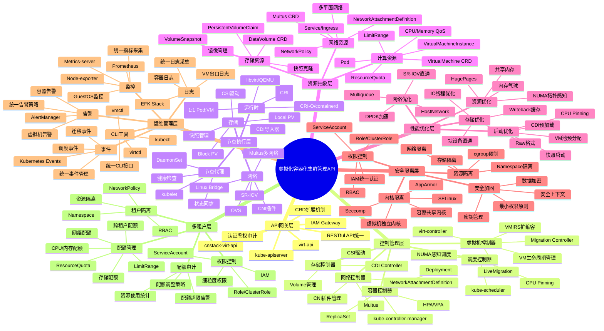

# 二、系统架构思维导图

> **文档版本**：v1.1 **最后更新：2025-11-15 **维护者**：项目团队

---

## 📑 目录

- [二、系统架构思维导图](#二系统架构思维导图)
  - [📑 目录](#-目录)
  - [概述](#概述)
  - [系统架构思维导图](#系统架构思维导图)
  - [架构层次说明](#架构层次说明)
    - [1. API 网关层](#1-api-网关层)
    - [2. 控制管理层](#2-控制管理层)
    - [3. 节点执行层](#3-节点执行层)
    - [4. 资源抽象层](#4-资源抽象层)
    - [5. 运维管理层](#5-运维管理层)
    - [6. 多租户层](#6-多租户层)
  - [新增维度说明](#新增维度说明)
    - [性能优化层](#性能优化层)
    - [安全隔离层](#安全隔离层)
    - [运维管理层扩展](#运维管理层扩展)
    - [多租户层扩展](#多租户层扩展)
  - [相关文档](#相关文档)

---

## 概述

本文档通过思维导图的形式展示虚拟化容器化集群管理 API 的系统架构，从 API 网关层到
多租户层的完整架构视图。

## 系统架构思维导图

---

## 架构层次说明

### 1. API 网关层

**功能**：提供统一的 API 入口，处理认证、鉴权、审计等操作。

**组件**：

- **kube-apiserver**：Kubernetes 原生 API 服务器
- **virt-api**：KubeVirt 扩展 API 服务器
- **cnstack-virt-api**：OpenShift CNV 增强 API 服务器
- **IAM Gateway**：统一身份认证和授权网关

**关键特性**：

- 统一 REST 风格 API
- CRD 扩展机制
- 认证鉴权审计

### 2. 控制管理层

**功能**：管理资源生命周期，实现声明式 API 的控制器模式。

**组件**：

- **虚拟机控制器**：
  - virt-controller：管理 VM 生命周期
  - VMIRS 扩缩容：水平扩缩容控制器
- **容器控制器**：
  - kube-controller-manager：Kubernetes 原生控制器
  - ReplicaSet/Deployment：副本集和部署控制器
- **迁移控制器**：
  - Migration Controller：实时迁移控制器
  - LiveMigration：热迁移功能
- **网络控制器**：
  - Multus：多网络 CNI 插件
  - NetworkAttachmentDefinition：网络附件定义
- **存储控制器**：
  - CDI Controller：容器数据导入器
  - Volume 管理：存储卷管理

**关键特性**：

- 控制器模式复用
- 声明式 API 设计
- 状态同步机制

### 3. 节点执行层

**功能**：在节点上执行资源创建、管理、监控等操作。

**组件**：

- **节点代理**：
  - kubelet：Kubernetes 节点代理
  - virt-handler：虚拟机节点代理（DaemonSet）
  - 状态同步：定期同步资源状态
- **运行时**：
  - Container Runtime (CRI)：容器运行时接口
  - libvirt/QEMU：虚拟机运行时
  - virt-launcher：1:1 Pod:VM 映射
- **网络**：
  - CNI 插件：容器网络接口
  - Linux Bridge：Linux 网桥
  - SR-IOV：单根 I/O 虚拟化
- **存储**：
  - CSI 驱动：容器存储接口
  - Local PV：本地持久化卷
  - Block PV：块设备持久化卷

**关键特性**：

- DaemonSet 部署模式
- Pod 映射为 VMI
- 运行时抽象统一

### 4. 资源抽象层

**功能**：提供计算、网络、存储资源的统一抽象。

**组件**：

- **计算资源**：
  - VirtualMachine CRD：虚拟机自定义资源
  - VirtualMachineInstance：虚拟机实例
  - Pod：容器组
  - CPU/Memory QoS：资源质量服务
- **网络资源**：
  - NetworkAttachmentDefinition：网络附件定义
  - Multus CRD：多网络 CRD
  - Service/Ingress：服务和入口
  - 多平面网络：多网络平面支持
- **存储资源**：
  - DataVolume CRD：数据卷 CRD
  - PersistentVolumeClaim：持久化卷声明
  - 镜像管理：镜像管理功能
  - 快照克隆：快照和克隆功能

**关键特性**：

- CRD 扩展机制
- 资源模型对齐
- 统一资源抽象

### 5. 运维管理层

**功能**：提供监控、日志、事件、告警等运维管理功能。

**组件**：

- **监控**：
  - Prometheus：监控指标采集
  - GuestOS 监控：虚拟机操作系统监控
  - Node-exporter：节点指标导出器
- **日志**：
  - EFK Stack：Elasticsearch、Fluentd、Kibana 日志栈
  - 容器日志：容器日志采集
  - VM 串口日志：虚拟机串口日志
- **事件**：
  - Kubernetes Events：Kubernetes 事件
  - 迁移事件：虚拟机迁移事件
  - 调度事件：资源调度事件
- **告警**：
  - AlertManager：告警管理器
  - 虚拟机告警：虚拟机相关告警

**关键特性**：

- 统一监控指标采集
- 统一日志采集
- 统一事件管理

### 6. 多租户层

**功能**：提供租户隔离、配额管理、权限控制等多租户功能。

**组件**：

- **租户隔离**：
  - Namespace：命名空间隔离
  - RBAC：基于角色的访问控制
  - NetworkPolicy：网络策略隔离
- **配额管理**：
  - ResourceQuota：资源配额
  - LimitRange：资源限制范围
  - 跨租户配额：跨租户配额管理
- **权限控制**：
  - IAM：身份和访问管理
  - ServiceAccount：服务账户
  - Role/ClusterRole：角色和集群角色

**关键特性**：

- 完全复用 K8s 原语
- 统一配额管理
- 统一权限控制

---

## 新增维度说明

### 性能优化层

**新增维度**：在原有架构基础上，新增性能优化层，涵盖启动优化、网络优化、存储优化
和资源优化四个维度。

**关键特性**：

- **启动优化**：VM 池预分配、快照启动、CDI 预加载、CPU Pinning
- **网络优化**：SR-IOV 直通、DPDK 加速、Multiqueue、HostNetwork
- **存储优化**：Raw 格式、块设备直通、Writeback 缓存、IO 线程优化
- **资源优化**：NUMA 拓扑感知、内存气球、共享内存、HugePages

### 安全隔离层

**新增维度**：在原有架构基础上，新增安全隔离层，涵盖内核隔离、资源隔离、权限控制
和安全加固四个维度。

**关键特性**：

- **内核隔离**：容器共享内核 vs 虚拟机独立内核，Seccomp、AppArmor、SELinux
- **资源隔离**：Namespace 隔离、cgroup 限制、网络隔离、存储隔离
- **权限控制**：RBAC、ServiceAccount、Role/ClusterRole、IAM 统一认证
- **安全加固**：最小权限原则、安全上下文、密钥管理、数据加密

### 运维管理层扩展

**扩展内容**：在原有运维管理层基础上，扩展了监控、日志、事件、告警和 CLI 工具的
统一管理。

**关键特性**：

- **统一指标采集**：Prometheus 统一采集容器和虚拟机指标
- **统一日志采集**：EFK Stack 统一采集容器和虚拟机日志
- **统一事件管理**：Kubernetes Events 统一管理容器和虚拟机事件
- **统一告警策略**：AlertManager 统一管理容器和虚拟机告警
- **统一 CLI 接口**：kubectl、virtctl、vmctl 统一命令行接口

### 多租户层扩展

**扩展内容**：在原有多租户层基础上，扩展了配额审计功能。

**关键特性**：

- **资源使用统计**：实时统计各租户的资源使用情况
- **配额超限告警**：当租户资源使用超过配额时自动告警
- **配额调整策略**：支持动态调整租户配额策略

---

## 相关文档

- [核心功能架构矩阵对比](../01-core-architecture/01-architecture-matrix.md) - 功
  能域对比矩阵
- [核心功能知识图谱](../01-core-architecture/03-knowledge-graph.md) - 功能知识图
  谱
- [网络功能同构矩阵](../02-isomorphic-functions/01-network-isomorphism.md) - 网
  络功能同构分析
- [存储功能同构矩阵](../02-isomorphic-functions/02-storage-isomorphism.md) - 存
  储功能同构分析
- [多租户与配额同构](../02-isomorphic-functions/03-multi-tenant-quota.md) - 多租
  户配额同构分析

---

**最后更新：2025-11-15 **维护者**：项目团队
