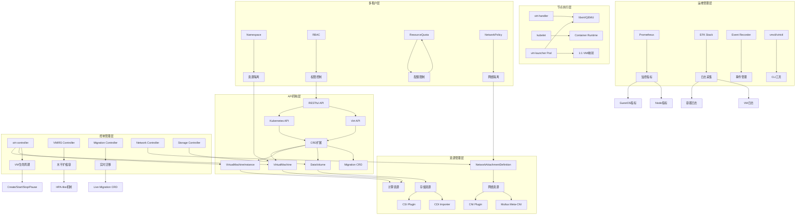

# 三、核心功能知识图谱

> **文档版本**：v1.1 **最后更新**：2025-11-10 **维护者**：项目团队

---

## 📑 目录

- [三、核心功能知识图谱](#三核心功能知识图谱)
  - [📑 目录](#-目录)
  - [概述](#概述)
  - [核心功能知识图谱](#核心功能知识图谱)
  - [知识图谱层次说明](#知识图谱层次说明)
    - [1. API 同构层](#1-api-同构层)
    - [2. 资源管理层](#2-资源管理层)
    - [3. 控制管理层](#3-控制管理层)
    - [4. 节点执行层](#4-节点执行层)
    - [5. 多租户层](#5-多租户层)
    - [6. 运维管理层](#6-运维管理层)
  - [关键关系分析](#关键关系分析)
    - [1. API 同构关系](#1-api-同构关系)
    - [2. 资源管理关系](#2-资源管理关系)
    - [3. 控制管理关系](#3-控制管理关系)
    - [4. 节点执行关系](#4-节点执行关系)
    - [5. 多租户关系](#5-多租户关系)
    - [6. 运维管理关系](#6-运维管理关系)
  - [相关文档](#相关文档)

---

## 概述

本文档通过知识图谱的形式展示虚拟化容器化集群管理 API 的核心功能及其关系，从 API
同构层到运维管理层的完整知识体系。

## 核心功能知识图谱

---

## 知识图谱层次说明

### 1. API 同构层

**核心概念**：

- **RESTful API**：统一的 REST 风格 API 接口
- **Kubernetes API**：Kubernetes 原生 API
- **Virt API**：KubeVirt 扩展 API
- **CRD 扩展**：自定义资源定义扩展机制

**关键资源**：

- **VirtualMachine**：虚拟机资源定义
- **VirtualMachineInstance**：虚拟机实例资源
- **DataVolume**：数据卷资源
- **Migration CRD**：迁移自定义资源

**关系说明**：

- RESTful API 是统一的 API 接口风格
- Kubernetes API 和 Virt API 都基于 RESTful API
- CRD 扩展机制允许扩展 Kubernetes API
- VirtualMachine、VirtualMachineInstance、DataVolume、Migration CRD 都是通过 CRD
  扩展定义的资源

### 2. 资源管理层

**核心概念**：

- **计算资源**：CPU、内存等计算资源
- **存储资源**：持久化存储资源
- **网络资源**：网络连接资源

**关键组件**：

- **CSI Plugin**：容器存储接口插件
- **CDI Importer**：容器数据导入器
- **CNI Plugin**：容器网络接口插件
- **Multus Meta-CNI**：多网络元 CNI 插件
- **NetworkAttachmentDefinition**：网络附件定义

**关系说明**：

- VirtualMachine 和 VirtualMachineInstance 都映射到计算资源
- DataVolume 映射到存储资源，通过 CSI Plugin 和 CDI Importer 管理
- NetworkAttachmentDefinition 映射到网络资源，通过 CNI Plugin 和 Multus Meta-CNI
  管理

### 3. 控制管理层

**核心概念**：

- **virt-controller**：虚拟机控制器
- **VMIRS Controller**：虚拟机实例副本集控制器
- **Migration Controller**：迁移控制器
- **Network Controller**：网络控制器
- **Storage Controller**：存储控制器

**关键功能**：

- **VM 生命周期**：虚拟机的创建、启动、停止、暂停等生命周期管理
- **水平扩缩容**：基于 HPA 机制的虚拟机水平扩缩容
- **实时迁移**：虚拟机的实时迁移功能

**关系说明**：

- virt-controller 管理 VirtualMachine 和 VirtualMachineInstance 的生命周期
- VMIRS Controller 实现虚拟机的水平扩缩容
- Migration Controller 实现虚拟机的实时迁移
- Network Controller 管理 NetworkAttachmentDefinition
- Storage Controller 管理 DataVolume

### 4. 节点执行层

**核心概念**：

- **virt-handler**：虚拟机节点代理
- **kubelet**：Kubernetes 节点代理
- **libvirt/QEMU**：虚拟机运行时
- **Container Runtime**：容器运行时
- **virt-launcher Pod**：虚拟机启动器 Pod

**关键功能**：

- **1:1 VMI 映射**：每个 VirtualMachineInstance 对应一个 virt-launcher Pod

**关系说明**：

- virt-handler 通过 libvirt/QEMU 管理虚拟机运行时
- kubelet 通过 Container Runtime 管理容器运行时
- virt-launcher Pod 作为 VirtualMachineInstance 的载体，实现 1:1 映射

### 5. 多租户层

**核心概念**：

- **Namespace**：命名空间，提供资源隔离
- **RBAC**：基于角色的访问控制
- **ResourceQuota**：资源配额
- **NetworkPolicy**：网络策略

**关键功能**：

- **资源隔离**：通过 Namespace 实现资源隔离
- **权限控制**：通过 RBAC 实现权限控制
- **配额限制**：通过 ResourceQuota 实现配额限制
- **网络隔离**：通过 NetworkPolicy 实现网络隔离

**关系说明**：

- Namespace 提供资源隔离，影响 VirtualMachine 等资源的访问
- RBAC 提供权限控制，影响 API 访问
- ResourceQuota 提供配额限制，影响资源使用
- NetworkPolicy 提供网络隔离，影响 NetworkAttachmentDefinition 的使用

### 6. 运维管理层

**核心概念**：

- **Prometheus**：监控指标采集系统
- **EFK Stack**：Elasticsearch、Fluentd、Kibana 日志栈
- **Event Recorder**：事件记录器
- **vmctl/virtctl**：命令行工具

**关键功能**：

- **监控指标**：通过 Prometheus 采集 GuestOS 指标和 Node 指标
- **日志采集**：通过 EFK Stack 采集容器日志和 VM 日志
- **事件管理**：通过 Event Recorder 管理 Kubernetes Events
- **CLI 工具**：通过 vmctl/virtctl 提供命令行管理工具

**关系说明**：

- Prometheus 采集监控指标，包括 GuestOS 指标和 Node 指标
- EFK Stack 采集日志，包括容器日志和 VM 日志
- Event Recorder 记录事件，包括 Kubernetes Events
- vmctl/virtctl 提供 CLI 工具，用于管理虚拟机和容器

---

## 关键关系分析

### 1. API 同构关系

**关系链**：RESTful API → Kubernetes API/Virt API → CRD 扩展 →
VirtualMachine/VirtualMachineInstance/DataVolume/Migration CRD

**说明**：

- 所有 API 都基于 RESTful API 风格
- Kubernetes API 和 Virt API 通过 CRD 扩展机制统一管理
- VirtualMachine、VirtualMachineInstance、DataVolume、Migration CRD 都是通过 CRD
  扩展定义的资源

### 2. 资源管理关系

**关系链**：VirtualMachine/VirtualMachineInstance → 计算资源；DataVolume → 存储
资源 → CSI Plugin/CDI Importer；NetworkAttachmentDefinition → 网络资源 → CNI
Plugin/Multus Meta-CNI

**说明**：

- VirtualMachine 和 VirtualMachineInstance 映射到计算资源
- DataVolume 映射到存储资源，通过 CSI Plugin 和 CDI Importer 管理
- NetworkAttachmentDefinition 映射到网络资源，通过 CNI Plugin 和 Multus Meta-CNI
  管理

### 3. 控制管理关系

**关系链**：virt-controller → VirtualMachine/VirtualMachineInstance → VM 生命周
期；VMIRS Controller → 水平扩缩容；Migration Controller → 实时迁移

**说明**：

- virt-controller 管理 VirtualMachine 和 VirtualMachineInstance 的生命周期
- VMIRS Controller 实现虚拟机的水平扩缩容
- Migration Controller 实现虚拟机的实时迁移

### 4. 节点执行关系

**关系链**：virt-handler → libvirt/QEMU；kubelet → Container
Runtime；virt-launcher Pod → libvirt/QEMU → 1:1 VMI 映射

**说明**：

- virt-handler 通过 libvirt/QEMU 管理虚拟机运行时
- kubelet 通过 Container Runtime 管理容器运行时
- virt-launcher Pod 作为 VirtualMachineInstance 的载体，实现 1:1 映射

### 5. 多租户关系

**关系链**：Namespace → 资源隔离 → VirtualMachine；RBAC → 权限控制 →
API；ResourceQuota → 配额限制；NetworkPolicy → 网络隔离 →
NetworkAttachmentDefinition

**说明**：

- Namespace 提供资源隔离，影响 VirtualMachine 等资源的访问
- RBAC 提供权限控制，影响 API 访问
- ResourceQuota 提供配额限制
- NetworkPolicy 提供网络隔离，影响 NetworkAttachmentDefinition 的使用

### 6. 运维管理关系

**关系链**：Prometheus → 监控指标 → GuestOS 指标/Node 指标；EFK Stack → 日志采集
→ 容器日志/VM 日志；Event Recorder → 事件管理

**说明**：

- Prometheus 采集监控指标，包括 GuestOS 指标和 Node 指标
- EFK Stack 采集日志，包括容器日志和 VM 日志
- Event Recorder 记录事件，包括 Kubernetes Events

---

## 相关文档

- [核心功能架构矩阵对比](../01-core-architecture/01-architecture-matrix.md) - 功
  能域对比矩阵
- [系统架构思维导图](../01-core-architecture/02-system-architecture.md) - 系统架
  构可视化
- [网络功能同构矩阵](../02-isomorphic-functions/01-network-isomorphism.md) - 网
  络功能同构分析
- [存储功能同构矩阵](../02-isomorphic-functions/02-storage-isomorphism.md) - 存
  储功能同构分析
- [多租户与配额同构](../02-isomorphic-functions/03-multi-tenant-quota.md) - 多租
  户配额同构分析

---

**最后更新**：2025-11-10 **维护者**：项目团队
