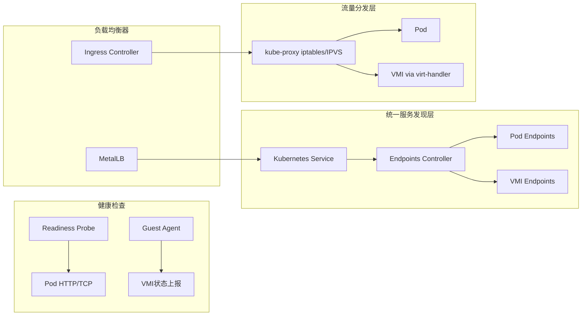

# 2. 负载均衡统一架构

> **文档版本**：v1.0 **最后更新**：2025-11-15 **维护者**：项目团队

---

## 📑 目录

- [2. 负载均衡统一架构](#2-负载均衡统一架构)
  - [📑 目录](#-目录)
  - [概述](#概述)
  - [负载均衡统一架构](#负载均衡统一架构)
  - [关键点](#关键点)
    - [关键设计要点](#关键设计要点)
  - [关键技术分析](#关键技术分析)
    - [1. 统一服务发现层](#1-统一服务发现层)
    - [2. 流量分发层](#2-流量分发层)
    - [3. 健康检查](#3-健康检查)
    - [4. 负载均衡器](#4-负载均衡器)
  - [相关文档](#相关文档)
  - [2025 年最新实践](#2025-年最新实践)
    - [负载均衡统一架构最佳实践（2025）](#负载均衡统一架构最佳实践2025)
  - [实际应用案例](#实际应用案例)
    - [案例 1：统一负载均衡管理（2025）](#案例-1统一负载均衡管理2025)
    - [案例 2：Ingress 统一负载均衡（2025）](#案例-2ingress-统一负载均衡2025)

---

## 概述

本文档分析虚拟化容器化集群管理 API 中负载均衡的统一架构，展示容器和虚拟机如何通
过统一的服务发现和负载均衡机制实现流量分发。

## 负载均衡统一架构



---

## 关键点

虚拟机通过 `virt-handler` 将 GuestOS 内服务端口映射到 `virt-launcher` Pod 网络命
名空间，完全复用 Kubernetes Service 负载均衡机制。

### 关键设计要点

1. **统一服务发现**：容器和虚拟机都使用 Kubernetes Service 进行服务发现
2. **统一流量分发**：kube-proxy 统一处理容器和虚拟机的流量分发
3. **统一健康检查**：Readiness Probe 和 Guest Agent 统一进行健康检查
4. **统一负载均衡器**：Ingress Controller 和 MetalLB 统一提供负载均衡服务

---

## 关键技术分析

### 1. 统一服务发现层

**Kubernetes Service**：

```yaml
apiVersion: v1
kind: Service
metadata:
  name: test-service
spec:
  selector:
    app: test
  ports:
    - port: 80
      targetPort: 8080
  type: ClusterIP
```

**Endpoints Controller**：

```yaml
apiVersion: v1
kind: Endpoints
metadata:
  name: test-service
subsets:
  - addresses:
      - ip: 10.244.1.5
        targetRef:
          kind: Pod
          name: test-pod
    ports:
      - port: 8080
  - addresses:
      - ip: 10.244.2.3
        targetRef:
          kind: VirtualMachineInstance
          name: test-vmi
    ports:
      - port: 8080
```

**说明**：

- Kubernetes Service 统一管理容器和虚拟机的服务发现
- Endpoints Controller 统一管理 Pod Endpoints 和 VMI Endpoints
- 服务发现机制完全统一，容器和虚拟机共享同一套服务发现机制

### 2. 流量分发层

**kube-proxy iptables/IPVS**：

```yaml
apiVersion: v1
kind: ConfigMap
metadata:
  name: kube-proxy-config
  namespace: kube-system
data:
  config.yaml: |
    mode: "ipvs"
    ipvs:
      scheduler: "rr"
    clusterCIDR: "10.244.0.0/16"
```

**Pod 流量分发**：

```bash
# iptables 规则示例
-A KUBE-SERVICES -d 10.96.0.1/32 -p tcp -m tcp --dport 80 -j KUBE-SVC-XXXXX
-A KUBE-SVC-XXXXX -m statistic --mode random --probability 0.5 -j KUBE-SEP-YYYYY
-A KUBE-SEP-YYYYY -p tcp -m tcp -j DNAT --to-destination 10.244.1.5:8080
```

**VMI 流量分发**：

```bash
# iptables 规则示例
-A KUBE-SERVICES -d 10.96.0.1/32 -p tcp -m tcp --dport 80 -j KUBE-SVC-XXXXX
-A KUBE-SVC-XXXXX -m statistic --mode random --probability 0.5 -j KUBE-SEP-ZZZZZ
-A KUBE-SEP-ZZZZZ -p tcp -m tcp -j DNAT --to-destination 10.244.2.3:8080
```

**说明**：

- kube-proxy 统一处理容器和虚拟机的流量分发
- iptables/IPVS 规则统一管理容器和虚拟机的流量路由
- 流量分发机制完全统一，容器和虚拟机共享同一套流量分发机制

### 3. 健康检查

**Pod Readiness Probe**：

```yaml
apiVersion: v1
kind: Pod
metadata:
  name: test-pod
spec:
  containers:
    - name: test
      image: nginx:alpine
      readinessProbe:
        httpGet:
          path: /health
          port: 8080
        initialDelaySeconds: 10
        periodSeconds: 5
```

**VMI Guest Agent**：

```yaml
apiVersion: kubevirt.io/v1
kind: VirtualMachineInstance
metadata:
  name: test-vmi
spec:
  domain:
    devices:
      interfaces:
        - name: default
          masquerade: {}
    networks:
      - name: default
        pod: {}
  readinessProbe:
    guestAgentPing: {}
    initialDelaySeconds: 10
    periodSeconds: 5
```

**说明**：

- Pod 使用 Readiness Probe 进行健康检查
- VMI 使用 Guest Agent 进行健康检查
- 健康检查机制统一，容器和虚拟机共享同一套健康检查机制

### 4. 负载均衡器

**Ingress Controller**：

```yaml
apiVersion: networking.k8s.io/v1
kind: Ingress
metadata:
  name: test-ingress
spec:
  rules:
    - host: test.example.com
      http:
        paths:
          - path: /
            pathType: Prefix
            backend:
              service:
                name: test-service
                port:
                  number: 80
```

**MetalLB**：

```yaml
apiVersion: v1
kind: Service
metadata:
  name: test-service
spec:
  selector:
    app: test
  ports:
    - port: 80
      targetPort: 8080
  type: LoadBalancer
```

**说明**：

- Ingress Controller 统一提供 HTTP/HTTPS 负载均衡服务
- MetalLB 统一提供 Layer 4 负载均衡服务
- 负载均衡器统一，容器和虚拟机共享同一套负载均衡服务

---

## 相关文档

- [核心功能架构矩阵对比](../01-core-architecture/01-architecture-matrix.md) - 功
  能域对比矩阵
- [扩缩容机制对比](../03-dynamic-management/01-scaling-mechanism.md) - 扩缩容机
  制
- [实时迁移功能扩展](../03-dynamic-management/03-live-migration.md) - 实时迁移功
  能

---

## 2025 年最新实践

### 负载均衡统一架构最佳实践（2025）

**2025 年趋势**：负载均衡统一架构的深度优化

**实践要点**：

- **统一服务发现**：容器和虚拟机通过 Kubernetes Service 统一服务发现
- **智能负载均衡**：使用 AI 技术进行智能负载均衡决策
- **性能优化**：优化负载均衡的性能和效率

**代码示例**：

```python
# 2025 年智能负载均衡管理工具
class IntelligentLoadBalancer:
    def __init__(self):
        self.metrics_collector = MetricsCollector()
        self.ai_router = AIRouter()
        self.health_checker = HealthChecker()

    def route_traffic(self, service_name, request):
        """智能路由流量"""
        # 收集指标
        metrics = self.metrics_collector.collect(service_name)

        # 健康检查
        healthy_endpoints = self.health_checker.get_healthy_endpoints(service_name)

        # AI 路由决策
        target_endpoint = self.ai_router.route(request, healthy_endpoints, metrics)

        return target_endpoint
```

## 实际应用案例

### 案例 1：统一负载均衡管理（2025）

**场景**：使用统一的机制管理容器和虚拟机的负载均衡

**实现方案**：

```yaml
# 统一 Service 配置
apiVersion: v1
kind: Service
metadata:
  name: unified-service
spec:
  selector:
    app: test
  ports:
    - port: 80
      targetPort: 8080
  type: ClusterIP
---
# Pod 后端
apiVersion: v1
kind: Pod
metadata:
  name: test-pod
  labels:
    app: test
spec:
  containers:
    - name: test
      image: nginx:alpine
      readinessProbe:
        httpGet:
          path: /health
          port: 8080
---
# VMI 后端
apiVersion: kubevirt.io/v1
kind: VirtualMachineInstance
metadata:
  name: test-vmi
  labels:
    app: test
spec:
  domain:
    devices:
      interfaces:
        - name: default
          masquerade: {}
    networks:
      - name: default
        pod: {}
  readinessProbe:
    guestAgentPing: {}
```

**效果**：

- 统一服务发现：容器和虚拟机通过 Service 统一服务发现
- 统一流量分发：kube-proxy 统一处理流量分发
- 统一健康检查：Readiness Probe 和 Guest Agent 统一健康检查

### 案例 2：Ingress 统一负载均衡（2025）

**场景**：使用 Ingress 统一管理容器和虚拟机的 HTTP/HTTPS 负载均衡

**实现方案**：

```yaml
# Ingress 统一配置
apiVersion: networking.k8s.io/v1
kind: Ingress
metadata:
  name: unified-ingress
spec:
  rules:
    - host: app.example.com
      http:
        paths:
          - path: /
            pathType: Prefix
            backend:
              service:
                name: unified-service
                port:
                  number: 80
```

**效果**：

- Ingress 统一提供 HTTP/HTTPS 负载均衡
- 容器和虚拟机共享同一套负载均衡服务
- 负载均衡配置统一管理

---

**最后更新**：2025-11-15 **维护者**：项目团队
