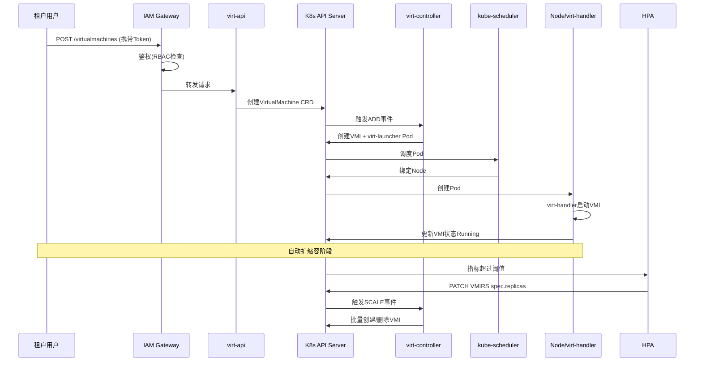

# 场景：创建多租户虚拟机并自动扩缩容

> **文档版本**：v1.0 **最后更新**：2025-11-10 **维护者**：项目团队

---

## 📑 目录

- [📑 目录](#-目录)
- [概述](#概述)
- [场景描述](#场景描述)
- [API 调用流程](#api-调用流程)
- [关键技术分析](#关键技术分析)
  - [1. 身份认证和授权](#1-身份认证和授权)
  - [2. 创建 VirtualMachine CRD](#2-创建-virtualmachine-crd)
  - [3. 创建 VMI 和 virt-launcher Pod](#3-创建-vmi-和-virt-launcher-pod)
  - [4. 调度和启动](#4-调度和启动)
  - [5. 自动扩缩容](#5-自动扩缩容)
- [相关文档](#相关文档)

---

## 概述

本文档展示一个典型场景：创建多租户虚拟机并自动扩缩容的完整 API 调用流程，通过序
列图展示各个组件之间的交互。

## 场景描述

**业务场景**：租户用户需要创建一个虚拟机，并配置自动扩缩容功能。

**技术需求**：

1. 通过 IAM Gateway 进行身份认证和授权
2. 创建 VirtualMachine CRD
3. 自动创建 VMI 和 virt-launcher Pod
4. 配置 HPA 实现自动扩缩容

## API 调用流程



---

## 关键技术分析

### 1. 身份认证和授权

**IAM Gateway**：

```yaml
apiVersion: v1
kind: ServiceAccount
metadata:
  name: tenant-a-user
  namespace: tenant-a
---
apiVersion: rbac.authorization.k8s.io/v1
kind: Role
metadata:
  name: tenant-a-operator
  namespace: tenant-a
rules:
  - apiGroups: ["kubevirt.io"]
    resources: ["virtualmachines"]
    verbs: ["get", "list", "create", "update"]
---
apiVersion: rbac.authorization.k8s.io/v1
kind: RoleBinding
metadata:
  name: tenant-a-binding
  namespace: tenant-a
subjects:
  - kind: ServiceAccount
    name: tenant-a-user
roleRef:
  kind: Role
  name: tenant-a-operator
  apiGroup: rbac.authorization.k8s.io
```

**说明**：

- IAM Gateway 统一进行身份认证和授权
- RBAC 机制统一管理容器和虚拟机的访问权限
- 角色绑定统一管理租户权限

### 2. 创建 VirtualMachine CRD

**API 请求**：

```bash
POST /apis/kubevirt.io/v1/namespaces/tenant-a/virtualmachines
```

**请求体**：

```yaml
apiVersion: kubevirt.io/v1
kind: VirtualMachine
metadata:
  name: test-vm
  namespace: tenant-a
spec:
  running: true
  template:
    metadata:
      labels:
        app: test
    spec:
      domain:
        resources:
          requests:
            memory: "1Gi"
            cpu: "1"
        devices:
          disks:
            - name: bootdisk
              disk:
                bus: virtio
          volumes:
            - name: bootdisk
              containerDisk:
                image: ubuntu:22.04
```

**说明**：

- virt-api 接收请求，创建 VirtualMachine CRD
- VirtualMachine CRD 定义虚拟机的期望状态
- virt-controller 监听 VirtualMachine CRD 变化

### 3. 创建 VMI 和 virt-launcher Pod

**virt-controller 处理**：

```yaml
# virt-controller 自动创建 VMI
apiVersion: kubevirt.io/v1
kind: VirtualMachineInstance
metadata:
  name: test-vmi
  namespace: tenant-a
  labels:
    app: test
spec:
  domain:
    resources:
      requests:
        memory: "1Gi"
        cpu: "1"
    devices:
      disks:
        - name: bootdisk
          disk:
            bus: virtio
      volumes:
        - name: bootdisk
          containerDisk:
            image: ubuntu:22.04

# virt-controller 自动创建 virt-launcher Pod
apiVersion: v1
kind: Pod
metadata:
  name: virt-launcher-test-vmi-xxxxx
  namespace: tenant-a
  labels:
    kubevirt.io: virt-launcher
    kubevirt.io/domain: test-vmi
spec:
  containers:
    - name: compute
      image: kubevirt/virt-launcher:latest
```

**说明**：

- virt-controller 监听 VirtualMachine CRD 变化
- 自动创建 VMI 和 virt-launcher Pod
- virt-launcher Pod 作为 VMI 的 1:1 载体

### 4. 调度和启动

**kube-scheduler 调度**：

```yaml
apiVersion: v1
kind: Pod
metadata:
  name: virt-launcher-test-vmi-xxxxx
  namespace: tenant-a
spec:
  nodeName: node-1
  containers:
    - name: compute
      image: kubevirt/virt-launcher:latest
```

**virt-handler 启动**：

```bash
# virt-handler 在节点上启动 VMI
virt-handler start test-vmi
```

**说明**：

- kube-scheduler 统一调度 virt-launcher Pod
- virt-handler 在节点上启动 VMI
- VMI 状态更新为 Running

### 5. 自动扩缩容

**HPA 配置**：

```yaml
apiVersion: autoscaling/v2
kind: HorizontalPodAutoscaler
metadata:
  name: test-hpa
  namespace: tenant-a
spec:
  scaleTargetRef:
    apiVersion: kubevirt.io/v1
    kind: VirtualMachineInstanceReplicaSet
    name: test-vmirs
  minReplicas: 1
  maxReplicas: 10
  metrics:
    - type: Resource
      resource:
        name: cpu
        target:
          type: Utilization
          averageUtilization: 70
```

**说明**：

- HPA 监听指标变化，自动调整副本数
- VMIRS 管理虚拟机副本
- 自动扩缩容确保资源利用率最优

---

## 相关文档

- [核心功能架构矩阵对比](../01-core-architecture/01-architecture-matrix.md) - 功
  能域对比矩阵
- [多租户与配额同构](../02-isomorphic-functions/03-multi-tenant-quota.md) - 多租
  户配额同构分析
- [扩缩容机制对比](../03-dynamic-management/01-scaling-mechanism.md) - 扩缩容机
  制

---

**最后更新**：2025-11-10 **维护者**：项目团队
