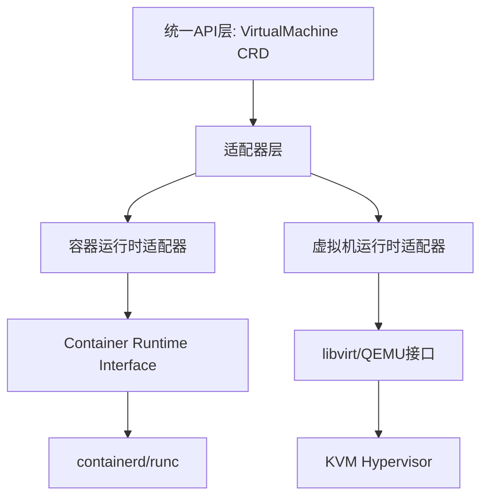

# 11.2 适配器模式：统一异构运行时

> **文档版本**：v1.0 **最后更新：2025-11-15 **维护者**：项目团队

---

## 📑 目录

- [11.2 适配器模式：统一异构运行时](#112-适配器模式统一异构运行时)
  - [📑 目录](#-目录)
  - [概述](#概述)
  - [问题描述](#问题描述)
  - [解决方案](#解决方案)
    - [适配器模式架构](#适配器模式架构)
  - [实现细节](#实现细节)
    - [统一运行时接口](#统一运行时接口)
    - [容器运行时适配器](#容器运行时适配器)
    - [虚拟机运行时适配器](#虚拟机运行时适配器)
    - [适配器工厂](#适配器工厂)
  - [相关文档](#相关文档)
  - [2025 年最新实践](#2025-年最新实践)
    - [适配器模式最佳实践（2025）](#适配器模式最佳实践2025)
  - [实际应用案例](#实际应用案例)
    - [案例 1：统一运行时接口（2025）](#案例-1统一运行时接口2025)

---

## 概述

本文档分析适配器模式在统一异构运行时中的应用，展示如何通过适配器模式统一容器和虚
拟机的运行时接口。

## 问题描述

**问题**：容器和虚拟机运行时接口不同，如何统一管理？

**差异点**：

- **容器运行时**：Container Runtime Interface (CRI)
- **虚拟机运行时**：libvirt/QEMU 接口
- **接口差异**：容器和虚拟机运行时接口完全不同

## 解决方案

**解决方案**：适配器模式 + CRD 抽象层

### 适配器模式架构



---

## 实现细节

### 统一运行时接口

```go
// 统一运行时接口
type RuntimeAdapter interface {
    Create(ctx context.Context, spec *RuntimeSpec) (*RuntimeStatus, error)
    Delete(ctx context.Context, id string) error
    GetStatus(ctx context.Context, id string) (*RuntimeStatus, error)
}

// 运行时规范
type RuntimeSpec struct {
    ID          string
    ContainerSpec *ContainerSpec
    VMXML      string
}

// 运行时状态
type RuntimeStatus struct {
    Phase string
    ID    string
}
```

### 容器运行时适配器

```go
// 容器运行时适配器
type ContainerRuntimeAdapter struct {
    client containerd.Client
}

func (r *ContainerRuntimeAdapter) Create(ctx context.Context, spec *RuntimeSpec) (*RuntimeStatus, error) {
    // 转换为containerd容器规范
    container, err := r.client.NewContainer(ctx, spec.ID, containerd.WithSpec(spec.ContainerSpec))
    if err != nil {
        return nil, err
    }

    // 启动容器
    task, err := container.NewTask(ctx, cio.NewCreator(cio.WithStdio))
    if err != nil {
        return nil, err
    }

    err = task.Start(ctx)
    if err != nil {
        return nil, err
    }

    return &RuntimeStatus{Phase: "Running", ID: container.ID()}, nil
}

func (r *ContainerRuntimeAdapter) Delete(ctx context.Context, id string) error {
    container, err := r.client.LoadContainer(ctx, id)
    if err != nil {
        return err
    }

    task, err := container.Task(ctx, nil)
    if err != nil {
        return err
    }

    err = task.Kill(ctx, syscall.SIGTERM)
    if err != nil {
        return err
    }

    _, err = task.Wait(ctx)
    if err != nil {
        return err
    }

    return container.Delete(ctx)
}

func (r *ContainerRuntimeAdapter) GetStatus(ctx context.Context, id string) (*RuntimeStatus, error) {
    container, err := r.client.LoadContainer(ctx, id)
    if err != nil {
        return nil, err
    }

    task, err := container.Task(ctx, nil)
    if err != nil {
        return nil, err
    }

    status, err := task.Status(ctx)
    if err != nil {
        return nil, err
    }

    return &RuntimeStatus{Phase: status.Status.String(), ID: container.ID()}, nil
}
```

### 虚拟机运行时适配器

```go
// 虚拟机运行时适配器
type VirtualMachineRuntimeAdapter struct {
    libvirt *libvirt.Connect
}

func (r *VirtualMachineRuntimeAdapter) Create(ctx context.Context, spec *RuntimeSpec) (*RuntimeStatus, error) {
    // 转换为libvirt域定义
    domain, err := r.libvirt.DomainDefineXML(spec.VMXML)
    if err != nil {
        return nil, err
    }

    // 启动虚拟机
    err = domain.Create()
    if err != nil {
        return nil, err
    }

    uuid, err := domain.GetUUIDString()
    if err != nil {
        return nil, err
    }

    return &RuntimeStatus{Phase: "Running", ID: uuid}, nil
}

func (r *VirtualMachineRuntimeAdapter) Delete(ctx context.Context, id string) error {
    domain, err := r.libvirt.LookupDomainByUUIDString(id)
    if err != nil {
        return err
    }

    err = domain.Destroy()
    if err != nil {
        return err
    }

    err = domain.Undefine()
    if err != nil {
        return err
    }

    return nil
}

func (r *VirtualMachineRuntimeAdapter) GetStatus(ctx context.Context, id string) (*RuntimeStatus, error) {
    domain, err := r.libvirt.LookupDomainByUUIDString(id)
    if err != nil {
        return nil, err
    }

    state, _, err := domain.GetState()
    if err != nil {
        return nil, err
    }

    uuid, err := domain.GetUUIDString()
    if err != nil {
        return nil, err
    }

    phase := mapLibvirtStateToPhase(state)

    return &RuntimeStatus{Phase: phase, ID: uuid}, nil
}

func mapLibvirtStateToPhase(state libvirt.DomainState) string {
    switch state {
    case libvirt.DOMAIN_RUNNING:
        return "Running"
    case libvirt.DOMAIN_SHUTOFF:
        return "Stopped"
    case libvirt.DOMAIN_PAUSED:
        return "Paused"
    default:
        return "Unknown"
    }
}
```

### 适配器工厂

```go
// 适配器工厂
type RuntimeAdapterFactory struct {
    containerAdapter *ContainerRuntimeAdapter
    vmAdapter        *VirtualMachineRuntimeAdapter
}

func NewRuntimeAdapterFactory() (*RuntimeAdapterFactory, error) {
    // 创建容器运行时适配器
    client, err := containerd.New("/run/containerd/containerd.sock")
    if err != nil {
        return nil, err
    }

    containerAdapter := &ContainerRuntimeAdapter{client: client}

    // 创建虚拟机运行时适配器
    conn, err := libvirt.NewConnect("qemu:///system")
    if err != nil {
        return nil, err
    }

    vmAdapter := &VirtualMachineRuntimeAdapter{libvirt: conn}

    return &RuntimeAdapterFactory{
        containerAdapter: containerAdapter,
        vmAdapter:        vmAdapter,
    }, nil
}

func (f *RuntimeAdapterFactory) GetAdapter(runtimeType string) RuntimeAdapter {
    switch runtimeType {
    case "container":
        return f.containerAdapter
    case "virtualmachine":
        return f.vmAdapter
    default:
        return nil
    }
}
```

---

## 相关文档

- [核心功能架构矩阵对比](../01-core-architecture/01-architecture-matrix.md) - 功
  能域对比矩阵
- [声明式 API 设计模式](../07-api-design-patterns/01-declarative-api.md) - 声明
  式 API
- [策略模式：多租户配额策略](../07-api-design-patterns/03-strategy-pattern.md) -
  策略模式
- [观察者模式：统一事件通知](../07-api-design-patterns/04-observer-pattern.md) -
  观察者模式

---

## 2025 年最新实践

### 适配器模式最佳实践（2025）

**2025 年趋势**：适配器模式的深度应用

**实践要点**：

- **统一运行时接口**：通过适配器模式统一容器和虚拟机的运行时接口
- **运行时适配器**：容器运行时适配器和虚拟机运行时适配器
- **适配器工厂**：使用适配器工厂创建适配器

**代码示例**：

```python
# 2025 年适配器模式应用工具
class RuntimeAdapterFactory:
    def __init__(self):
        self.container_adapter = ContainerRuntimeAdapter()
        self.vm_adapter = VMRuntimeAdapter()

    def create_adapter(self, workload_type):
        """创建运行时适配器"""
        if workload_type == 'container':
            return self.container_adapter
        elif workload_type == 'vm':
            return self.vm_adapter
        else:
            raise ValueError(f"Unknown workload type: {workload_type}")
```

## 实际应用案例

### 案例 1：统一运行时接口（2025）

**场景**：使用适配器模式统一容器和虚拟机的运行时接口

**实现方案**：

```yaml
# 统一运行时接口
apiVersion: kubevirt.io/v1
kind: VirtualMachine
metadata:
  name: test-vm
spec:
  running: true
  template:
    spec:
      domain:
        resources:
          requests:
            memory: "2Gi"
            cpu: "2"
```

**效果**：

- 统一运行时接口：通过适配器模式统一容器和虚拟机的运行时接口
- 运行时适配器：容器运行时适配器和虚拟机运行时适配器
- 适配器工厂：使用适配器工厂创建适配器

---

**最后更新**：2025-11-15 **维护者**：项目团队
