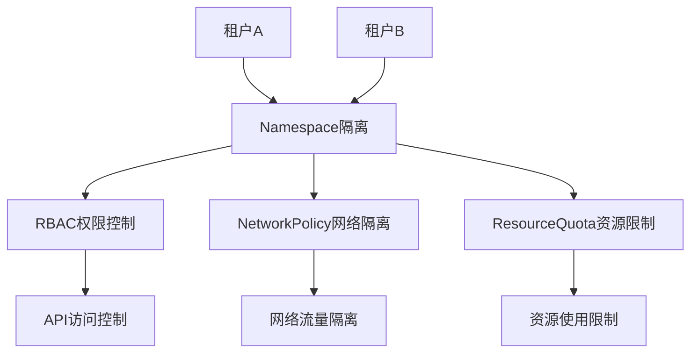

# 14.1 多租户安全隔离

> **文档版本**：v1.0 **最后更新：2025-11-15 **维护者**：项目团队

---

## 📑 目录

- [14.1 多租户安全隔离](#141-多租户安全隔离)
  - [📑 目录](#-目录)
  - [概述](#概述)
  - [安全威胁模型](#安全威胁模型)
  - [安全加固配置](#安全加固配置)
    - [多租户安全隔离配置](#多租户安全隔离配置)
  - [关键技术分析](#关键技术分析)
    - [1. Namespace 隔离](#1-namespace-隔离)
    - [2. RBAC 权限控制](#2-rbac-权限控制)
    - [3. NetworkPolicy 网络隔离](#3-networkpolicy-网络隔离)
    - [4. ResourceQuota 资源限制](#4-resourcequota-资源限制)
  - [相关文档](#相关文档)
  - [2025 年最新实践](#2025-年最新实践)
    - [多租户安全隔离最佳实践（2025）](#多租户安全隔离最佳实践2025)
  - [实际应用案例](#实际应用案例)
    - [案例 1：多租户安全隔离配置（2025）](#案例-1多租户安全隔离配置2025)

---

## 概述

本文档分析多租户安全隔离的设计和实现，展示如何通过
Namespace、RBAC、NetworkPolicy 等机制实现多租户安全隔离。

## 安全威胁模型



---

## 安全加固配置

### 多租户安全隔离配置

```yaml
# 多租户安全隔离配置
apiVersion: v1
kind: Namespace
metadata:
  name: tenant-a
  labels:
    security-tier: high
---
# RBAC权限控制
apiVersion: rbac.authorization.k8s.io/v1
kind: Role
metadata:
  name: tenant-a-operator
  namespace: tenant-a
rules:
  - apiGroups: ["kubevirt.io"]
    resources: ["virtualmachines"]
    verbs: ["get", "list", "create", "update"]
    # 限制：不能删除其他租户的VM
    resourceNames: ["tenant-a-*"]
---
# NetworkPolicy网络隔离
apiVersion: networking.k8s.io/v1
kind: NetworkPolicy
metadata:
  name: tenant-a-isolation
  namespace: tenant-a
spec:
  podSelector: {}
  policyTypes:
    - Ingress
    - Egress
  ingress:
    - from:
        - namespaceSelector:
            matchLabels:
              name: tenant-a # 仅允许同租户访问
  egress:
    - to: [] # 允许所有出站流量
---
# ResourceQuota资源限制
apiVersion: v1
kind: ResourceQuota
metadata:
  name: tenant-a-quota
  namespace: tenant-a
spec:
  hard:
    requests.cpu: "10"
    requests.memory: 20Gi
    count/virtualmachines.kubevirt.io: "5"
    count/pods: "20"
```

---

## 关键技术分析

### 1. Namespace 隔离

**机制**：通过 Namespace 实现资源隔离

**配置**：

```yaml
apiVersion: v1
kind: Namespace
metadata:
  name: tenant-a
  labels:
    security-tier: high
```

**说明**：

- Namespace 提供逻辑隔离
- 不同租户使用不同的 Namespace
- 资源隔离通过 Namespace 实现

### 2. RBAC 权限控制

**机制**：通过 RBAC 实现权限控制

**配置**：

```yaml
apiVersion: rbac.authorization.k8s.io/v1
kind: Role
metadata:
  name: tenant-a-operator
  namespace: tenant-a
rules:
  - apiGroups: ["kubevirt.io"]
    resources: ["virtualmachines"]
    verbs: ["get", "list", "create", "update"]
    resourceNames: ["tenant-a-*"]
```

**说明**：

- RBAC 提供细粒度权限控制
- 限制租户只能访问自己的资源
- 权限控制通过 Role 和 RoleBinding 实现

### 3. NetworkPolicy 网络隔离

**机制**：通过 NetworkPolicy 实现网络隔离

**配置**：

```yaml
apiVersion: networking.k8s.io/v1
kind: NetworkPolicy
metadata:
  name: tenant-a-isolation
  namespace: tenant-a
spec:
  podSelector: {}
  policyTypes:
    - Ingress
    - Egress
  ingress:
    - from:
        - namespaceSelector:
            matchLabels:
              name: tenant-a
  egress:
    - to: []
```

**说明**：

- NetworkPolicy 提供网络流量隔离
- 限制租户之间的网络通信
- 网络隔离通过 NetworkPolicy 实现

### 4. ResourceQuota 资源限制

**机制**：通过 ResourceQuota 实现资源限制

**配置**：

```yaml
apiVersion: v1
kind: ResourceQuota
metadata:
  name: tenant-a-quota
  namespace: tenant-a
spec:
  hard:
    requests.cpu: "10"
    requests.memory: 20Gi
    count/virtualmachines.kubevirt.io: "5"
    count/pods: "20"
```

**说明**：

- ResourceQuota 提供资源使用限制
- 限制租户的资源使用量
- 资源限制通过 ResourceQuota 实现

---

## 相关文档

- [核心功能架构矩阵对比](../01-core-architecture/01-architecture-matrix.md) - 功
  能域对比矩阵
- [虚拟机安全加固](../10-security-design/02-vm-hardening.md) - 虚拟机安全加固
- [数据加密与密钥管理](../10-security-design/03-data-encryption.md) - 数据加密
- [多租户与配额同构](../02-isomorphic-functions/03-multi-tenant-quota.md) - 多租
  户配额同构分析

---

## 2025 年最新实践

### 多租户安全隔离最佳实践（2025）

**2025 年趋势**：多租户安全隔离的深度优化

**实践要点**：

- **统一隔离**：通过 Namespace、RBAC、NetworkPolicy 统一隔离
- **安全审计**：实时审计租户操作和资源使用
- **自动化合规**：使用 AI 技术自动化合规检查

**代码示例**：

```python
# 2025 年多租户安全隔离管理工具
class MultiTenantIsolationManager:
    def __init__(self):
        self.namespace_manager = NamespaceManager()
        self.rbac_manager = RBACManager()
        self.network_policy_manager = NetworkPolicyManager()
        self.audit_manager = AuditManager()

    def create_tenant(self, tenant_config):
        """创建租户"""
        # 创建 Namespace
        namespace = self.namespace_manager.create(tenant_config)

        # 配置 RBAC
        rbac = self.rbac_manager.configure(tenant_config)

        # 配置 NetworkPolicy
        network_policy = self.network_policy_manager.configure(tenant_config)

        # 启用审计
        self.audit_manager.enable(namespace)

        return namespace, rbac, network_policy
```

## 实际应用案例

### 案例 1：多租户安全隔离配置（2025）

**场景**：使用统一的机制实现多租户安全隔离

**实现方案**：

```yaml
# Namespace 隔离
apiVersion: v1
kind: Namespace
metadata:
  name: tenant-a
  labels:
    security-tier: high
---
# RBAC 权限控制
apiVersion: rbac.authorization.k8s.io/v1
kind: Role
metadata:
  name: tenant-a-operator
  namespace: tenant-a
rules:
  - apiGroups: ["kubevirt.io"]
    resources: ["virtualmachines"]
    verbs: ["get", "list", "create", "update"]
---
# NetworkPolicy 网络隔离
apiVersion: networking.k8s.io/v1
kind: NetworkPolicy
metadata:
  name: tenant-a-isolation
  namespace: tenant-a
spec:
  podSelector: {}
  policyTypes:
    - Ingress
    - Egress
  ingress:
    - from:
        - namespaceSelector:
            matchLabels:
              name: tenant-a
```

**效果**：

- 统一隔离：通过 Namespace、RBAC、NetworkPolicy 统一隔离
- 安全审计：实时审计租户操作
- 自动化合规：自动化合规检查

---

**最后更新**：2025-11-15 **维护者**：项目团队
