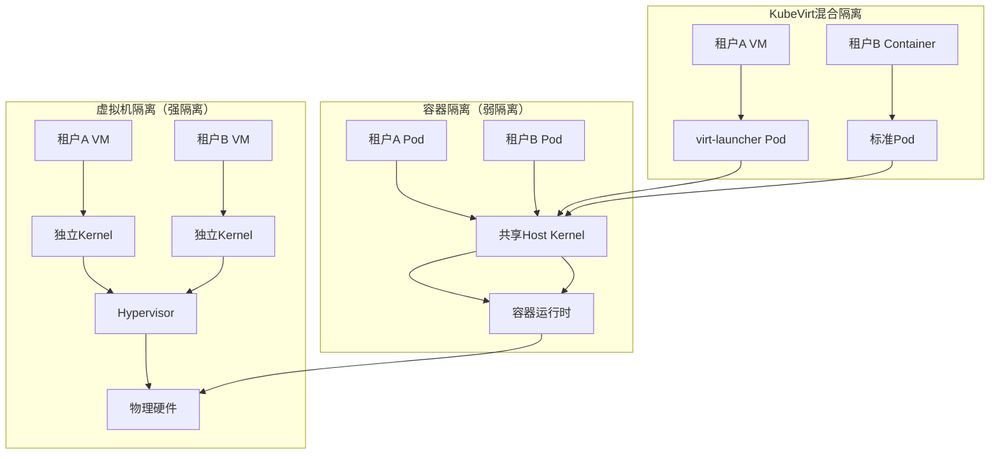
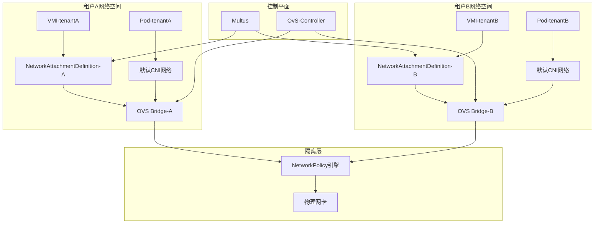

# 二、多租户架构深度剖析与网络内容对标

> **文档版本**：v1.0 **最后更新：2025-11-15 **维护者**：项目团队

---

## 📑 目录

- [二、多租户架构深度剖析与网络内容对标](#二多租户架构深度剖析与网络内容对标)
  - [📑 目录](#-目录)
  - [概述](#概述)
  - [2.1 租户隔离层次模型](#21-租户隔离层次模型)
    - [隔离模型形式化定义](#隔离模型形式化定义)
    - [隔离强度对比矩阵](#隔离强度对比矩阵)
  - [2.2 配额管理的同构与精细化](#22-配额管理的同构与精细化)
    - [配额管理形式化模型](#配额管理形式化模型)
    - [API 层面的统一配额设计](#api-层面的统一配额设计)
    - [配额审计与超售策略](#配额审计与超售策略)
    - [多租户网络架构（对标搜索结果的联网困难问题）](#多租户网络架构对标搜索结果的联网困难问题)
  - [相关文档](#相关文档)
  - [2025 年最新实践](#2025-年最新实践)
    - [多租户架构最佳实践（2025）](#多租户架构最佳实践2025)
  - [实际应用案例](#实际应用案例)
    - [案例 1：多租户隔离配置（2025）](#案例-1多租户隔离配置2025)

---

## 概述

本文档从多租户架构的角度分析租户隔离层次模型和配额管理的同构与精细化，展示如何实
现多租户安全隔离。

## 2.1 租户隔离层次模型

### 隔离模型形式化定义

**隔离层次形式化模型**：

```text
设隔离系统为：
I = (L, R, S)

其中：
- L = {L_kernel, L_resource, L_network, L_storage}：隔离层次集合
- R = {R_container, R_vm}：资源类型集合
- S: L × R → [0, 1]：隔离强度函数

隔离强度定义：
S(L_kernel, R_container) = 0.3（弱隔离）
S(L_kernel, R_vm) = 1.0（强隔离）
S(L_resource, R_container) = 0.5（中等隔离）
S(L_resource, R_vm) = 1.0（强隔离）
```

基于搜索结果的技术差异分析，隔离强度对比：



---

### 隔离强度对比矩阵

**形式化隔离强度定义**：

```text
设隔离强度函数为：
S: Dimension × ResourceType → [0, 1]

其中：
- S(Dimension, ResourceType) = 1.0 表示完全隔离
- S(Dimension, ResourceType) = 0.0 表示无隔离

同构性映射：
φ: Container_Isolation → VM_Isolation
φ(S_container) = S_vm

同构性：∀d ∈ Dimensions, S_container(d) ≤ S_vm(d)
```

| **隔离维度**   | **虚拟机**   | **容器**             | **KubeVirt 方案**      | **API 统一代价**        | **隔离强度**                  |
| -------------- | ------------ | -------------------- | ---------------------- | ----------------------- | ----------------------------- |
| **内核隔离**   | 完全独立     | 共享内核（CVE 风险） | VM 独立/Container 共享 | 需监控两种攻击面        | S_vm = 1.0, S_container = 0.3 |
| **资源可见性** | 完全隔离     | `/proc`信息泄漏风险  | 统一通过 cgroup 限制   | VMI 需额外 seccomp 配置 | S_vm = 1.0, S_container = 0.5 |
| **网络隔离**   | vSwitch 独立 | Namespace 隔离       | Multus 多网络平面      | 共享 NetworkPolicy 引擎 | S_vm = 0.9, S_container = 0.7 |
| **存储隔离**   | 块设备隔离   | OverlayFS 联合挂载   | 分离 PVC 模式          | 统一 CSI 但需 QoS 区分  | S_vm = 1.0, S_container = 0.8 |
| **性能干扰**   | 无干扰       | noisy neighbor 问题  | 需 CPU Manager 策略    | 调度器扩展优先级        | S_vm = 1.0, S_container = 0.6 |

---

## 2.2 配额管理的同构与精细化

### 配额管理形式化模型

**配额系统形式化定义**：

```text
设配额系统为：
Q = (Namespace, Resources, Limits, Usage)

其中：
- Namespace ∈ {ns_1, ns_2, ...}：命名空间集合
- Resources ∈ {CPU, Memory, Storage, ...}：资源类型集合
- Limits: Namespace × Resources → ℝ⁺：配额限制函数
- Usage: Namespace × Resources → ℝ⁺：资源使用量函数

配额约束：
∀ns ∈ Namespace, ∀r ∈ Resources, Usage(ns, r) ≤ Limits(ns, r)

同构性：
φ: Container_Quota → VM_Quota
φ(Limits_container) = Limits_vm
φ(Usage_container) = Usage_vm
```

**搜索结果指出的资源分配差异**：

> "虚拟化会为每个虚拟机分配一个虚拟硬盘 (VHD)...容器化时，本地硬盘用于每个节点的
> 存储"

### API 层面的统一配额设计

```yaml
apiVersion: v1
kind: ResourceQuota
metadata:
  name: tenant-quota
  namespace: production
spec:
  hard:
    # 计算资源（统一单位）
    cpu: "100"
    memory: 200Gi
    # 存储资源（容器与VM共享StorageClass）
    requests.storage: 1Ti
    persistentvolumeclaims: "50"

    # KubeVirt扩展配额
    count/virtualmachines.kubevirt.io: "10"
    count/virtualmachineinstances.kubevirt.io: "20"

    # 网络资源配额
    count/network-attachment-definitions.k8s.cni.cncf.io: "5"

    # 高级配额（基于PriorityClass）
    pods: "100"
    count/pods: "100" # 包含virt-launcher Pod
```

---

### 配额审计与超售策略

| **资源类型** | **容器策略**  | **虚拟机策略** | **超售比**    | **API 校验点**          |
| ------------ | ------------- | -------------- | ------------- | ----------------------- |
| CPU          | request/limit | CPU 请求/保证  | 1:5~1:10      | kube-apiserver 准入控制 |
| 内存         | request/limit | 内存预留       | 1:1.2~1:1.5   | OOM Killer 参数统一     |
| 存储         | PVC 容量限制  | 磁盘大小限制   | 1:1（厚置备） | CSI Provisioner 校验    |
| 网络         | 带宽限制(CNI) | 带宽限制(TC)   | 按需分配      | NetworkPolicy 带宽插件  |

---

### 多租户网络架构（对标搜索结果的联网困难问题）



---

## 相关文档

- [核心功能架构矩阵对比](../01-core-architecture/01-architecture-matrix.md) - 功
  能域对比矩阵
- [系统动态管理与控制的理论映射](../11-theoretical-analysis/01-control-theory-mapping.md) -
  控制理论映射
- [动态运行时管理的控制论实现](../11-theoretical-analysis/03-dynamic-runtime.md) -
  动态运行时管理
- [多租户与配额同构](../02-isomorphic-functions/03-multi-tenant-quota.md) - 多租
  户配额同构分析

---

## 2025 年最新实践

### 多租户架构最佳实践（2025）

**2025 年趋势**：多租户架构的深度优化

**实践要点**：

- **租户隔离**：使用 Namespace、RBAC、NetworkPolicy 实现租户隔离
- **配额管理**：使用 ResourceQuota 实现配额管理
- **网络隔离**：使用 Multus 和 NetworkPolicy 实现网络隔离

**代码示例**：

```python
# 2025 年多租户架构管理工具
class MultiTenantArchitectureManager:
    def __init__(self):
        self.namespace_manager = NamespaceManager()
        self.rbac_manager = RBACManager()
        self.quota_manager = QuotaManager()
        self.network_manager = NetworkManager()

    def create_tenant(self, tenant_config):
        """创建租户"""
        # 创建 Namespace
        namespace = self.namespace_manager.create(tenant_config)

        # 配置 RBAC
        rbac = self.rbac_manager.configure(tenant_config)

        # 配置配额
        quota = self.quota_manager.configure(tenant_config)

        # 配置网络隔离
        network = self.network_manager.configure(tenant_config)

        return namespace, rbac, quota, network
```

## 实际应用案例

### 案例 1：多租户隔离配置（2025）

**场景**：使用多租户架构实现租户隔离

**实现方案**：

```yaml
# 租户隔离配置
apiVersion: v1
kind: Namespace
metadata:
  name: tenant-a
  labels:
    tenant: tenant-a
---
# RBAC 配置
apiVersion: rbac.authorization.k8s.io/v1
kind: Role
metadata:
  name: tenant-a-operator
  namespace: tenant-a
rules:
  - apiGroups: ["kubevirt.io"]
    resources: ["virtualmachines"]
    verbs: ["get", "list", "create", "update"]
---
# 配额配置
apiVersion: v1
kind: ResourceQuota
metadata:
  name: tenant-a-quota
  namespace: tenant-a
spec:
  hard:
    cpu: "100"
    memory: 200Gi
    count/virtualmachines.kubevirt.io: "10"
```

**效果**：

- 租户隔离：使用 Namespace、RBAC、NetworkPolicy 实现租户隔离
- 配额管理：使用 ResourceQuota 实现配额管理
- 网络隔离：使用 Multus 和 NetworkPolicy 实现网络隔离

---

**最后更新**：2025-11-15 **维护者**：项目团队
