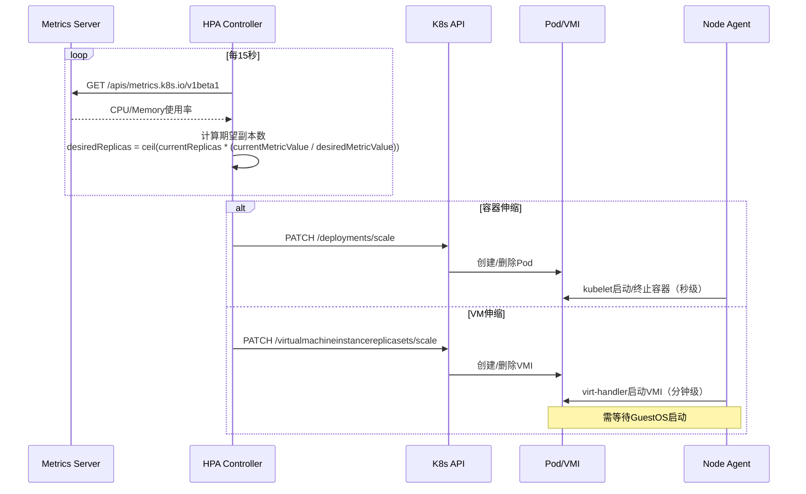
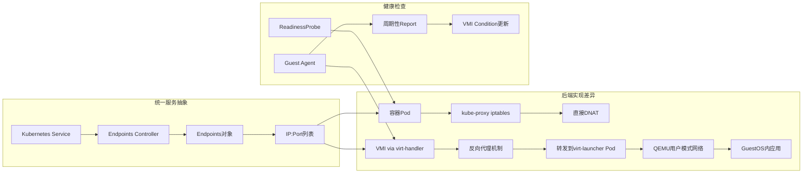

# 三、动态运行时管理的控制论实现

> **文档版本**：v1.0 **最后更新：2025-11-15 **维护者**：项目团队

---

## 📑 目录

- [三、动态运行时管理的控制论实现](#三动态运行时管理的控制论实现)
  - [📑 目录](#-目录)
  - [概述](#概述)
  - [3.1 弹性伸缩的闭环控制](#31-弹性伸缩的闭环控制)
    - [形式化控制模型](#形式化控制模型)
    - [伸缩延迟差异的根因分析](#伸缩延迟差异的根因分析)
  - [3.2 负载均衡的统一与差异](#32-负载均衡的统一与差异)
    - [负载均衡形式化模型](#负载均衡形式化模型)
    - [负载均衡性能对比](#负载均衡性能对比)
  - [相关文档](#相关文档)
  - [2025 年最新实践](#2025-年最新实践)
    - [动态运行时管理最佳实践（2025）](#动态运行时管理最佳实践2025)
  - [实际应用案例](#实际应用案例)
    - [案例 1：弹性伸缩配置（2025）](#案例-1弹性伸缩配置2025)

---

## 概述

本文档从控制论的角度分析动态运行时管理的实现，展示如何通过闭环控制实现弹性伸缩和
负载均衡。

## 3.1 弹性伸缩的闭环控制

### 形式化控制模型

**闭环控制系统形式化定义**：

```text
设弹性伸缩系统为：
ẋ(t) = f(x(t), u(t), d(t))
y(t) = g(x(t))
e(t) = r(t) - y(t)
u(t) = K·e(t)

其中：
- x(t) ∈ ℝⁿ：当前副本数、资源使用量
- r(t) ∈ ℝ：期望资源使用率（如 70% CPU）
- y(t) ∈ ℝ：实际资源使用率
- e(t) ∈ ℝ：误差信号
- u(t) ∈ ℤ：控制输出（副本数调整）
- K：控制增益（HPA 算法参数）
- d(t)：扰动项（负载波动、节点故障）
```

**HPA 控制器工作流程**（容器与 VM 对比）：



---

### 伸缩延迟差异的根因分析

**形式化延迟模型**：

```text
设伸缩延迟为：
T_scale = T_prepare + T_start + T_ready

其中：
- T_prepare：镜像/磁盘准备时间
- T_start：运行时启动时间
- T_ready：应用就绪时间

容器延迟模型：
T_container = T_image + T_fork + T_app
其中 T_image ∈ [0, 5s], T_fork ∈ [1, 2s], T_app ∈ [5, 30s]

虚拟机延迟模型：
T_vm = T_disk + T_qemu + T_app
其中 T_disk ∈ [30, 180s], T_qemu ∈ [20, 45s], T_app ∈ [5, 30s]

同构性：T_container << T_vm（10-180 倍差异）
```

| **阶段**   | **容器耗时**      | **虚拟机耗时**             | **API 同构代价**     | **形式化表示**      |
| ---------- | ----------------- | -------------------------- | -------------------- | ------------------- |
| 镜像准备   | 0-5s（层缓存）    | 30-180s（磁盘镜像下载）    | CDI 预加载优化       | T_image << T_disk   |
| 运行时启动 | 1-2s（进程 fork） | 20-45s（QEMU 初始化+BIOS） | 使用 QEMU 快照加速   | T_fork << T_qemu    |
| 应用就绪   | 5-30s（应用启动） | 5-30s（应用启动）          | 统一 ReadinessProbe  | T_app ≈ T_app       |
| **总计**   | **6-37s**         | **55-255s**                | **伸缩策略需差异化** | T_container << T_vm |

**搜索结果验证**："容器轻量且部署速度快...虚拟机每个实例的大小可能为 GB，而容器
的大小可能仅为 MB" → **伸缩策略必须考虑启动时间差异**

---

## 3.2 负载均衡的统一与差异

### 负载均衡形式化模型

**统一负载均衡抽象**：

```text
设负载均衡器为函数：
LB: Request → Backend

其中：
- Request ∈ {HTTP_Request, TCP_Connection, ...}
- Backend ∈ {Pod_IP:Port, VMI_IP:Port, ...}

负载均衡策略：
LB(request) = select_backend(request, backends, strategy)

其中 strategy ∈ {RoundRobin, LeastConn, IPHash, ...}
```

**Service 负载均衡架构**：



---

### 负载均衡性能对比

**形式化性能模型**：

```text
设负载均衡性能为：
P = (Latency, Throughput, Connections)

容器性能：
P_container = (L_dnat, T_dnat, C_dnat)
其中 L_dnat ≈ 0.1ms, T_dnat ≥ 10Gbps, C_dnat ≥ 100k

虚拟机性能：
P_vm = (L_proxy, T_proxy, C_proxy)
其中 L_proxy ∈ [0.5, 1ms], T_proxy ∈ [2, 5Gbps], C_proxy ∈ [20k, 50k]

性能损失：
ΔL = L_proxy / L_dnat ≈ 5-10
ΔT = T_proxy / T_dnat ≈ 0.2-0.5
ΔC = C_proxy / C_dnat ≈ 0.2-0.5
```

| **指标** | **容器（DNAT）** | **虚拟机（反向代理）** | **性能损失** | **优化方案**     | **形式化表示** |
| -------- | ---------------- | ---------------------- | ------------ | ---------------- | -------------- |
| 延迟     | 0.1ms            | 0.5-1ms                | 5-10 倍      | SR-IOV 直通      | ΔL ≈ 5-10      |
| 吞吐量   | 10Gbps+          | 2-5Gbps                | 50-80%       | DPDK 加速        | ΔT ≈ 0.2-0.5   |
| 连接数   | 100k+            | 20k-50k                | 50-80%       | 使用 HostNetwork | ΔC ≈ 0.2-0.5   |

**搜索结果验证**："联网非常困难，需要网桥或 macvlan 驱动程序将容器网络接口映射到
主机接口" → KubeVirt 通过`virt-handler`解决该问题，但引入额外转发开销

---

## 相关文档

- [核心功能架构矩阵对比](../01-core-architecture/01-architecture-matrix.md) - 功
  能域对比矩阵
- [系统动态管理与控制的理论映射](../11-theoretical-analysis/01-control-theory-mapping.md) -
  控制理论映射
- [多租户架构深度剖析](../11-theoretical-analysis/02-multi-tenant-architecture.md) -
  多租户架构
- [存储 IO 路径的同构与性能博弈](../11-theoretical-analysis/04-storage-io-path.md) -
  存储 IO 路径

---

## 2025 年最新实践

### 动态运行时管理最佳实践（2025）

**2025 年趋势**：动态运行时管理的深度优化

**实践要点**：

- **弹性伸缩**：使用 HPA 实现弹性伸缩
- **负载均衡**：使用 Service 和 Ingress 实现负载均衡
- **性能优化**：优化伸缩延迟和负载均衡性能

**代码示例**：

```python
# 2025 年动态运行时管理工具
class DynamicRuntimeManager:
    def __init__(self):
        self.hpa_manager = HPAManager()
        self.lb_manager = LoadBalancerManager()
        self.metrics_manager = MetricsManager()

    def manage_runtime(self, workload_config):
        """管理运行时"""
        # 弹性伸缩
        hpa = self.hpa_manager.create_hpa(workload_config)

        # 负载均衡
        lb = self.lb_manager.create_load_balancer(workload_config)

        # 性能监控
        metrics = self.metrics_manager.collect_metrics(workload_config)

        return hpa, lb, metrics
```

## 实际应用案例

### 案例 1：弹性伸缩配置（2025）

**场景**：使用 HPA 实现弹性伸缩

**实现方案**：

```yaml
# HPA 配置
apiVersion: autoscaling/v2
kind: HorizontalPodAutoscaler
metadata:
  name: app-hpa
spec:
  scaleTargetRef:
    apiVersion: apps/v1
    kind: Deployment
    name: app
  minReplicas: 1
  maxReplicas: 10
  metrics:
    - type: Resource
      resource:
        name: cpu
        target:
          type: Utilization
          averageUtilization: 70
```

**效果**：

- 弹性伸缩：使用 HPA 实现弹性伸缩
- 负载均衡：使用 Service 和 Ingress 实现负载均衡
- 性能优化：优化伸缩延迟和负载均衡性能

---

**最后更新**：2025-11-15 **维护者**：项目团队
