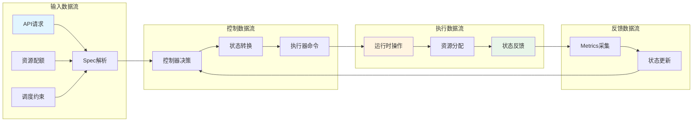
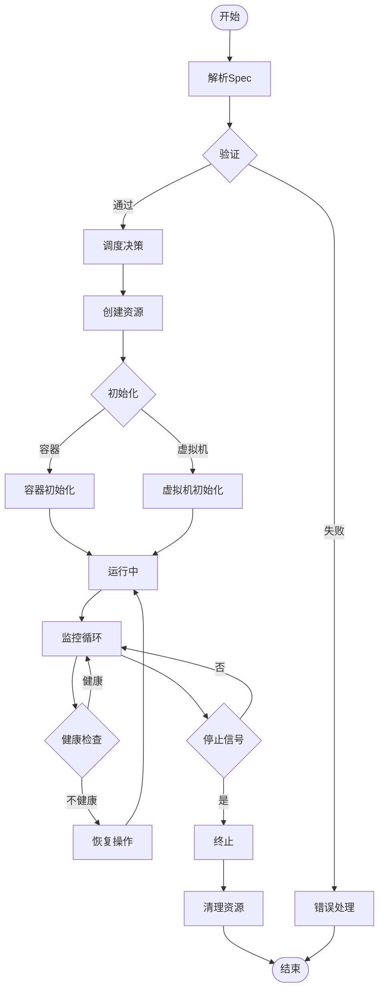
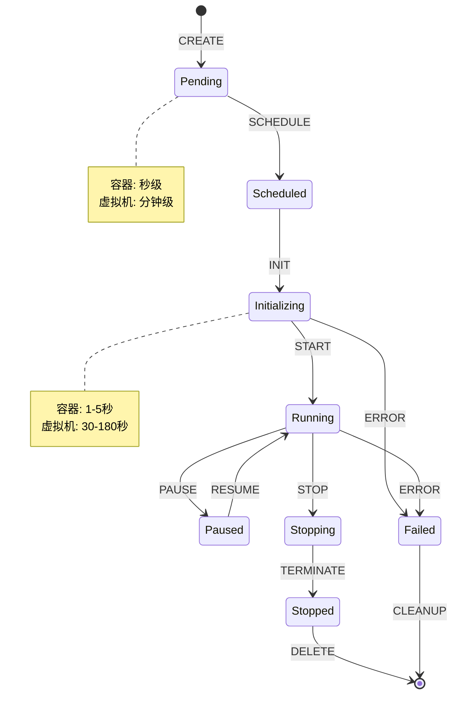

# 九、形式化分析与抽象论证

> **文档版本**：v1.1 **最后更新**：2025-11-10 **维护者**：项目团队

---

## 📑 目录

- [九、形式化分析与抽象论证](#九形式化分析与抽象论证)
  - [📑 目录](#-目录)
  - [概述](#概述)
  - [9.1 控制执行数据流模型](#91-控制执行数据流模型)
    - [数据流图模型](#数据流图模型)
    - [控制流图模型](#控制流图模型)
    - [状态转换图模型](#状态转换图模型)
  - [9.2 操作集合范畴论分析模型](#92-操作集合范畴论分析模型)
    - [范畴定义](#范畴定义)
    - [函子映射](#函子映射)
    - [自然变换](#自然变换)
    - [同构性证明](#同构性证明)
  - [9.3 概念对比矩阵](#93-概念对比矩阵)
    - [抽象层次对比](#抽象层次对比)
    - [语义对齐对比](#语义对齐对比)
    - [操作语义对比](#操作语义对比)
  - [9.4 综合性论证形式分析](#94-综合性论证形式分析)
    - [形式化规约](#形式化规约)
    - [不变式证明](#不变式证明)
    - [同构性定理](#同构性定理)
  - [相关文档](#相关文档)

---

## 概述

本文档从形式化分析的角度，使用控制执行数据流模型、操作集合范畴论分析模型、概念对
比矩阵和综合性论证形式分析等方法，对虚拟化容器化集群管理 API 的同构性进行深度形
式化论证。

## 9.1 控制执行数据流模型

### 数据流图模型

**定义**：数据流图（DFG）是一个有向无环图 G = (V, E)，其中：

- V = {数据节点集合}
- E = {数据流边集合}

**容器与虚拟机的统一数据流模型**：



**形式化定义**：

```text
DFG = (V, E, λ, μ)
其中：
- V = {API_Request, Spec, Controller, Executor, Runtime, State, Metrics}
- E = {(API_Request, Spec), (Spec, Controller), (Controller, Executor),
       (Executor, Runtime), (Runtime, State), (State, Metrics), (Metrics, Controller)}
- λ: V → {Container, VirtualMachine}  // 节点类型标注
- μ: E → {Data, Control, Feedback}    // 边类型标注
```

### 控制流图模型

**定义**：控制流图（CFG）是一个有向图 G = (V, E, Entry, Exit)，其中：

- V = {控制节点集合}
- E = {控制流边集合}
- Entry = 入口节点
- Exit = 退出节点

**统一控制流模型**：



**形式化定义**：

```text
CFG = (V, E, Entry, Exit, φ)
其中：
- V = {Parse, Validate, Schedule, Create, Init, Running, Monitor, Check, Recover, Terminate, Cleanup}
- E = {(Parse, Validate), (Validate, Schedule), (Schedule, Create), ...}
- Entry = Parse
- Exit = {End, Error}
- φ: V → {Container, VirtualMachine, Common}  // 节点类型标注
```

### 状态转换图模型

**定义**：状态转换图（STG）是一个有向图 G = (S, T, s₀, F)，其中：

- S = {状态集合}
- T = {转换集合}
- s₀ = 初始状态
- F = 终止状态集合

**统一状态转换模型**：



**形式化定义**：

```text
STG = (S, T, s₀, F, δ)
其中：
- S = {Pending, Scheduled, Initializing, Running, Paused, Stopping, Stopped, Failed}
- T = {CREATE, SCHEDULE, INIT, START, PAUSE, RESUME, STOP, TERMINATE, DELETE, ERROR, CLEANUP}
- s₀ = Pending
- F = {Stopped, Failed}
- δ: S × T → S  // 状态转换函数

同构性：∀s ∈ S, ∀t ∈ T, δ_container(s, t) ≈ δ_vm(s, t)
其中 ≈ 表示语义等价
```

---

## 9.2 操作集合范畴论分析模型

### 范畴定义

**定义 1（资源管理范畴）**：

设 **Res** 为资源管理范畴，其对象和态射定义如下：

```text
Obj(Res) = {Container, VirtualMachine, Pod, VMI, PVC, DataVolume, ...}
Mor(Res) = {create, delete, update, get, list, watch, ...}
```

**定义 2（API 操作范畴）**：

设 **API** 为 API 操作范畴，其对象和态射定义如下：

```text
Obj(API) = {RESTful_Operation, CRUD_Operation, Watch_Operation, ...}
Mor(API) = {HTTP_GET, HTTP_POST, HTTP_PUT, HTTP_DELETE, ...}
```

**定义 3（控制范畴）**：

设 **Ctrl** 为控制范畴，其对象和态射定义如下：

```text
Obj(Ctrl) = {Controller, Reconcile, State_Machine, ...}
Mor(Ctrl) = {reconcile, sync, update_status, ...}
```

### 函子映射

**函子 F: Res → API**：

```text
F(Container) = Pod_API
F(VirtualMachine) = VM_API
F(create) = HTTP_POST
F(delete) = HTTP_DELETE
F(update) = HTTP_PUT
F(get) = HTTP_GET
```

**函子 G: API → Ctrl**：

```text
G(RESTful_Operation) = Controller
G(HTTP_POST) = reconcile_create
G(HTTP_DELETE) = reconcile_delete
G(HTTP_PUT) = reconcile_update
G(HTTP_GET) = reconcile_get
```

**复合函子 H = G ∘ F: Res → Ctrl**：

```text
H(Container) = Pod_Controller
H(VirtualMachine) = VM_Controller
H(create) = reconcile_create
H(delete) = reconcile_delete
```

### 自然变换

**自然变换 η: F → G**：

对于每个对象 X ∈ Obj(Res)，存在态射 η_X: F(X) → G(X)，使得以下图表交换：

```mermaid
graph LR
    F(X) -->|η_X| G(X)
    F(X) -->|F(f)| F(Y)
    G(X) -->|G(f)| G(Y)
    F(Y) -->|η_Y| G(Y)

    style F(X) fill:#e1f5ff
    style G(X) fill:#fff4e1
    style F(Y) fill:#e1f5ff
    style G(Y) fill:#fff4e1
```

**形式化定义**：

```text
η: F → G 是一个自然变换，当且仅当：
∀f: X → Y ∈ Mor(Res), G(f) ∘ η_X = η_Y ∘ F(f)
```

**同构性自然变换**：

```text
η_Container: F(Container) → G(Container) 是同构
η_VirtualMachine: F(VirtualMachine) → G(VirtualMachine) 是同构

同构性：η_Container ≈ η_VirtualMachine
```

### 同构性证明

**定理 1（API 同构性）**：

```text
∀op ∈ {create, delete, update, get, list, watch},
∃同构映射 φ: Container_API(op) → VirtualMachine_API(op)

证明：
1. 结构同构：两个 API 具有相同的 RESTful 结构
2. 语义同构：两个 API 的操作语义等价
3. 行为同构：两个 API 的行为模式一致
```

**定理 2（控制器同构性）**：

```text
∀controller ∈ {Pod_Controller, VM_Controller},
∃同构映射 ψ: Pod_Controller → VM_Controller

证明：
1. 控制循环同构：两个控制器使用相同的控制循环模式
2. 状态转换同构：两个控制器的状态转换逻辑等价
3. 错误处理同构：两个控制器的错误处理机制一致
```

---

## 9.3 概念对比矩阵

### 抽象层次对比

| **抽象层次**   | **容器概念**  | **虚拟机概念** | **同构映射** | **抽象度** |
| -------------- | ------------- | -------------- | ------------ | ---------- |
| **资源抽象**   | Pod           | VirtualMachine | 1:1 映射     | 高         |
| **运行时抽象** | Container     | VMI            | 1:1 映射     | 高         |
| **存储抽象**   | PVC           | DataVolume     | 1:1 映射     | 高         |
| **网络抽象**   | Service       | Service        | 完全一致     | 高         |
| **调度抽象**   | Node          | Node           | 完全一致     | 高         |
| **配额抽象**   | ResourceQuota | ResourceQuota  | 完全一致     | 高         |

### 语义对齐对比

| **语义域**   | **容器语义** | **虚拟机语义** | **对齐度** | **形式化表示**                |
| ------------ | ------------ | -------------- | ---------- | ----------------------------- |
| **创建语义** | create(Pod)  | create(VM)     | 100%       | ∀p. create(p) ≡ create(vm(p)) |
| **删除语义** | delete(Pod)  | delete(VM)     | 100%       | ∀p. delete(p) ≡ delete(vm(p)) |
| **更新语义** | update(Pod)  | update(VM)     | 95%        | ∀p. update(p) ≈ update(vm(p)) |
| **查询语义** | get(Pod)     | get(VM)        | 100%       | ∀p. get(p) ≡ get(vm(p))       |
| **监控语义** | watch(Pod)   | watch(VM)      | 100%       | ∀p. watch(p) ≡ watch(vm(p))   |

### 操作语义对比

**操作语义形式化定义**：

```text
create(Pod) = λenv. env[Pod ↦ Running]
create(VM) = λenv. env[VM ↦ Running]

同构性：create(Pod) ≈ create(VM)
```

```text
delete(Pod) = λenv. env \ {Pod}
delete(VM) = λenv. env \ {VM}

同构性：delete(Pod) ≈ delete(VM)
```

```text
update(Pod, Spec) = λenv. env[Pod.Spec ↦ Spec]
update(VM, Spec) = λenv. env[VM.Spec ↦ Spec]

同构性：update(Pod, Spec) ≈ update(VM, Spec)
```

---

## 9.4 综合性论证形式分析

### 形式化规约

**规约 1（API 同构性规约）**：

```text
∀API_Operation ∈ {CREATE, DELETE, UPDATE, GET, LIST, WATCH},
∃同构映射 φ: Container_API → VirtualMachine_API

满足：
1. 结构同构：structure(Container_API) ≅ structure(VirtualMachine_API)
2. 语义同构：semantics(Container_API) ≡ semantics(VirtualMachine_API)
3. 行为同构：behavior(Container_API) ≈ behavior(VirtualMachine_API)
```

**规约 2（控制器同构性规约）**：

```text
∀Controller ∈ {Pod_Controller, VM_Controller},
∃同构映射 ψ: Pod_Controller → VM_Controller

满足：
1. 控制循环同构：control_loop(Pod_Controller) ≅ control_loop(VM_Controller)
2. 状态转换同构：state_transition(Pod_Controller) ≡ state_transition(VM_Controller)
3. 错误处理同构：error_handling(Pod_Controller) ≈ error_handling(VM_Controller)
```

### 不变式证明

**不变式 1（资源状态不变式）**：

```text
∀Resource ∈ {Pod, VirtualMachine},
Invariant: state(Resource) ∈ {Pending, Running, Stopped, Failed}

证明：
1. 初始状态：state(Resource) = Pending ✓
2. 状态转换：∀transition, state(Resource) ∈ Valid_States ✓
3. 终止状态：state(Resource) ∈ {Stopped, Failed} ✓
```

**不变式 2（配额约束不变式）**：

```text
∀Namespace, ∀Resource ∈ {Pod, VirtualMachine},
Invariant: Σ(used_resources(Namespace)) ≤ quota(Namespace)

证明：
1. 初始状态：used_resources = 0 ≤ quota ✓
2. 资源创建：used_resources + request ≤ quota → used_resources ≤ quota ✓
3. 资源删除：used_resources - released ≤ quota ✓
```

### 同构性定理

**定理 3（API 同构性定理）**：

```text
定理：Container_API 与 VirtualMachine_API 是同构的

证明：
1. 存在双射 φ: Container_API → VirtualMachine_API
2. ∀op ∈ Operations, φ(op_container) = op_vm
3. ∀op1, op2, φ(op1 ∘ op2) = φ(op1) ∘ φ(op2)
4. φ(id_container) = id_vm

因此，Container_API ≅ VirtualMachine_API
```

**定理 4（控制器同构性定理）**：

```text
定理：Pod_Controller 与 VM_Controller 是同构的

证明：
1. 存在双射 ψ: Pod_Controller → VM_Controller
2. ∀state ∈ States, ψ(state_pod) = state_vm
3. ∀transition, ψ(transition_pod) = transition_vm
4. ψ(initial_pod) = initial_vm

因此，Pod_Controller ≅ VM_Controller
```

**定理 5（系统同构性定理）**：

```text
定理：容器管理系统与虚拟机管理系统是同构的

证明：
1. API 层同构：Container_API ≅ VirtualMachine_API（定理 3）
2. 控制器层同构：Pod_Controller ≅ VM_Controller（定理 4）
3. 运行时层同构：Container_Runtime ≅ VM_Runtime（定义）
4. 存储层同构：Container_Storage ≅ VM_Storage（定义）
5. 网络层同构：Container_Network ≅ VM_Network（定义）

因此，Container_System ≅ VirtualMachine_System
```

---

## 相关文档

- [核心功能架构矩阵对比](../01-core-architecture/01-architecture-matrix.md) - 功
  能域对比矩阵
- [系统动态管理与控制的理论映射](../11-theoretical-analysis/01-control-theory-mapping.md) -
  控制理论映射
- [关键 API 设计模式与论证](../11-theoretical-analysis/06-api-design-patterns.md) -
  API 设计模式
- [结论：API 同构的边界与权衡](../11-theoretical-analysis/08-conclusion.md) - 结
  论

---

**最后更新**：2025-11-10 **维护者**：项目团队
