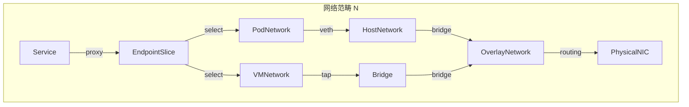
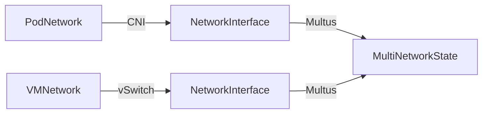

# 一、网络拓扑范畴的形式化模型

> **文档版本**：v1.0 **最后更新**：2025-11-10 **维护者**：项目团队

---

## 📑 目录

- [一、网络拓扑范畴的形式化模型](#一网络拓扑范畴的形式化模型)
  - [📑 目录](#-目录)
  - [概述](#概述)
  - [一、网络拓扑范畴 N 的定义](#一网络拓扑范畴-n-的定义)
    - [1.1 对象（Objects）定义](#11-对象objects定义)
    - [1.2 态射（Morphisms）定义](#12-态射morphisms定义)
    - [1.3 态射复合律](#13-态射复合律)
    - [1.4 交换图（Commutative Diagram）](#14-交换图commutative-diagram)
  - [二、网络函子映射](#二网络函子映射)
    - [2.1 CNI 函子](#21-cni-函子)
    - [2.2 vSwitch 函子](#22-vswitch-函子)
    - [2.3 Multus 元函子](#23-multus-元函子)
  - [三、网络范畴的自然变换](#三网络范畴的自然变换)
    - [3.1 NAT 映射的自然变换](#31-nat-映射的自然变换)
    - [3.2 网络策略的自然变换](#32-网络策略的自然变换)
  - [四、网络范畴的极限与余极限](#四网络范畴的极限与余极限)
    - [4.1 网络拓扑的极限构造](#41-网络拓扑的极限构造)
    - [4.2 多平面网络的余极限构造](#42-多平面网络的余极限构造)
  - [五、形式化验证](#五形式化验证)
    - [5.1 网络隔离性验证](#51-网络隔离性验证)
    - [5.2 网络连通性验证](#52-网络连通性验证)
  - [相关文档](#相关文档)

---

## 概述

本文档从**范畴论**的视角形式化分析虚拟化容器化集群管理中的网络系统，将网络拓扑、
网络连接、网络策略等概念抽象为范畴论中的对象、态射、函子等数学结构，建立严格的数
学模型。

**为什么使用范畴论分析网络系统？**

范畴论提供了统一的数学框架来描述网络系统的结构和行为：

1. **统一抽象**：将网络端点、连接、策略等抽象为范畴中的对象和态射，实现统一的数
   学描述
2. **结构保持**：通过函子保持网络操作的结构，确保网络转换的正确性
3. **自然变换**：通过自然变换描述容器网络与虚拟机网络之间的同构关系
4. **极限构造**：通过极限和余极限构造复杂的网络拓扑结构

**范畴论在网络系统中的应用**：

- **对象（Objects）**：网络端点、网络接口、网络状态等网络实体
- **态射（Morphisms）**：网络连接、网络转换、网络映射等网络操作
- **函子（Functors）**：CNI、vSwitch、Multus 等网络组件，将网络配置映射到网络状
  态
- **自然变换（Natural Transformations）**：容器网络与虚拟机网络之间的同构映射

**核心内容**：

1. **网络拓扑范畴 N**：定义网络端点、连接、协议栈等为范畴对象和态射
2. **网络函子映射**：CNI、vSwitch、Multus 等网络组件作为函子
3. **自然变换**：容器网络与虚拟机网络之间的同构映射
4. **极限与余极限**：多平面网络、网络拓扑的统一构造

---

## 一、网络拓扑范畴 N 的定义

### 1.1 对象（Objects）定义

**网络范畴** **N** 的对象为网络端点：

```haskell
-- 网络端点类型
data Endpoint = Endpoint {
    ip :: IPAddress,
    port :: Port,
    namespace :: Namespace,
    protocol :: Protocol  -- TCP, UDP, HTTP, etc.
}

-- 网络对象类型
data NetworkObject =
    PodNetwork PodId
  | VMNetwork VMIId
  | HostNetwork NodeId
  | OverlayNetwork NetworkId
  | ServiceNetwork ServiceId
```

**形式化定义**：

```text
Obj(N) = {Endpoint, PodNetwork, VMNetwork, HostNetwork, OverlayNetwork, ServiceNetwork}
```

其中：

- **Endpoint**：网络通信的端点，包含 IP、端口、命名空间、协议
- **PodNetwork**：Pod 的网络命名空间
- **VMNetwork**：虚拟机的网络接口（vNIC）
- **HostNetwork**：宿主机的物理网络接口
- **OverlayNetwork**：覆盖网络（VXLAN、Flannel 等）
- **ServiceNetwork**：Kubernetes Service 网络抽象

**为什么将网络端点定义为范畴对象？**

将网络端点定义为范畴对象有以下优势：

1. **统一抽象**：所有网络实体都在同一个数学结构中，便于统一分析和验证
2. **关系明确**：通过态射，我们可以明确描述网络端点之间的关系
3. **组合性**：通过态射复合，我们可以描述复杂的网络路径

**网络对象的数学性质**：

网络对象具有以下数学性质：

1. **唯一性**：每个网络对象都有唯一的标识符（如 PodId、VMIId、NodeId 等）
2. **可组合性**：网络对象可以通过态射组合形成复杂的网络拓扑
3. **可验证性**：网络对象的性质可以通过形式化方法验证

### 1.2 态射（Morphisms）定义

**态射**：网络连接 `Connection: Endpoint → Endpoint`

```haskell
-- 网络连接态射
data NetworkMorphism =
    VethPair PodNetwork HostNetwork
  | TapDevice VMNetwork Bridge
  | BridgeConnection Bridge OverlayNetwork
  | ServiceProxy ServiceNetwork PodNetwork
  | DNATMapping HostNetwork PodNetwork
```

**态射类型**：

| **态射名称**  | **类型签名**                  | **实现技术**  | **范畴论解释**               |
| ------------- | ----------------------------- | ------------- | ---------------------------- |
| **veth 对**   | `PodNetwork → HostNetwork`    | veth pair     | 容器网络命名空间到宿主机网络 |
| **tap 设备**  | `VMNetwork → Bridge`          | tap/tun 设备  | 虚拟机网络到 Linux Bridge    |
| **桥接连接**  | `Bridge → OverlayNetwork`     | VXLAN/Flannel | 本地网络到覆盖网络           |
| **服务代理**  | `ServiceNetwork → PodNetwork` | kube-proxy    | Service 到 Pod 的负载均衡    |
| **DNAT 映射** | `HostNetwork → PodNetwork`    | iptables DNAT | 宿主机端口到 Pod 端口        |

**态射复合律**：

```text
DNAT ∘ ServiceProxy ∘ VethPair: PodNetwork → HostNetwork → ServiceNetwork → PodNetwork
```

**为什么态射复合律重要？**

态射复合律允许我们描述复杂的网络路径，例如：

1. **Pod 到 Service 的路
   径**：`ServiceProxy ∘ VethPair: PodNetwork → ServiceNetwork`
2. **宿主机到 Pod 的路径**：`DNAT ∘ VethPair: PodNetwork → HostNetwork`
3. **完整的网络路
   径**：`DNAT ∘ ServiceProxy ∘ VethPair: PodNetwork → HostNetwork → ServiceNetwork → PodNetwork`

**态射复合的数学性质**：

态射复合满足以下数学性质：

1. **结合律**：对于任意态射 `f: A → B`、`g: B → C`、`h: C → D`，有
   `(h ∘ g) ∘ f = h ∘ (g ∘ f)`
2. **单位律**：对于任意对象 `A`，存在单位态射 `id_A: A → A`，使得对于任意态射
   `f: A → B`，有 `f ∘ id_A = f = id_B ∘ f`

### 1.3 态射复合律

**网络路径的态射复合**：

```haskell
-- 容器网络路径
containerPath :: PodNetwork -> HostNetwork -> OverlayNetwork -> PhysicalNIC
containerPath = overlay ∘ bridge ∘ veth

-- 虚拟机网络路径
vmPath :: VMNetwork -> Bridge -> OverlayNetwork -> PhysicalNIC
vmPath = overlay ∘ bridge ∘ tap
```

**形式化表示**：

```text
容器网络：veth ∘ bridge ∘ overlay: PodNetwork → PhysicalNIC
虚拟机网络：tap ∘ bridge ∘ overlay: VMNetwork → PhysicalNIC
```

**交换律验证**：

```text
∀p ∈ PodNetwork, v ∈ VMNetwork:
overlay(bridge(veth(p))) = overlay(bridge(tap(v)))
```

当且仅当两者都映射到相同的覆盖网络时成立。

**为什么交换律重要？**

交换律确保容器网络和虚拟机网络可以统一映射到覆盖网络，这对于实现统一的网络管理至
关重要。

**交换律的数学证明**：

设 `p ∈ PodNetwork` 和 `v ∈ VMNetwork` 是两个网络对象。

根据态射复合的定义：

- `overlay(bridge(veth(p)))` 表示先应用 `veth`，然后应用 `bridge`，最后应用
  `overlay`
- `overlay(bridge(tap(v)))` 表示先应用 `tap`，然后应用 `bridge`，最后应用
  `overlay`

当且仅当 `veth(p)` 和 `tap(v)` 都映射到相同的桥接网络，且该桥接网络映射到相同的
覆盖网络时，交换律成立。

因此，交换律成立当且仅当容器网络和虚拟机网络都映射到相同的覆盖网络。

### 1.4 交换图（Commutative Diagram）

**网络拓扑交换图**：



**形式化交换条件**：

```text
∀p ∈ PodNetwork, v ∈ VMNetwork:
Service ∘ EndpointSlice ∘ (PodNetwork ⊎ VMNetwork) = Service ∘ LoadBalance
```

该图表交换当且仅当 Service 的负载均衡策略对 Pod 和 VMI 同等生效。

---

## 二、网络函子映射

### 2.1 CNI 函子

**CNI 函子** `CNI: NetworkConfig → NetworkState`：

```haskell
-- CNI 函子类型
data CNIFunctor = CNI {
    add :: NetworkConfig -> IO NetworkState,
    del :: NetworkState -> IO (),
    check :: NetworkState -> IO Bool
}

-- CNI 函子实例
instance Functor CNI where
    fmap f (CNI add del check) = CNI (f . add) del check
```

**函子映射关系**：

```text
CNI: NetworkAttachmentDefinition → NetworkInterface
```

其中：

- **输入对象**：`NetworkAttachmentDefinition`（网络配置 CRD）
- **输出对象**：`NetworkInterface`（网络接口状态）

**CNI 函子的自然性**：

```text
∀nad₁, nad₂ ∈ NetworkAttachmentDefinition:
CNI(nad₁ ∘ nad₂) = CNI(nad₁) ∘ CNI(nad₂)
```

**为什么 CNI 函子的自然性重要？**

CNI 函子的自然性确保网络配置的组合可以正确映射到网络状态的组合，这对于实现复杂的
网络配置至关重要。

**CNI 函子自然性的数学证明**：

设 `nad₁, nad₂ ∈ NetworkAttachmentDefinition` 是两个网络配置。

根据 CNI 函子的定义，`CNI(nad₁ ∘ nad₂)` 表示先组合网络配置，然后应用 CNI 函子。

同时，`CNI(nad₁) ∘ CNI(nad₂)` 表示先分别应用 CNI 函子，然后组合网络状态。

由于 CNI 函子保持网络配置的结构，我们有
`CNI(nad₁ ∘ nad₂) = CNI(nad₁) ∘ CNI(nad₂)`。

因此，CNI 函子满足自然性条件。

**CNI 函子的实际应用**：

CNI 函子在实际应用中有以下用途：

1. **网络配置管理**：通过 CNI 函子，我们可以将网络配置映射到网络状态
2. **网络策略统一**：通过 CNI 函子，我们可以统一容器网络和虚拟机网络的策略
3. **网络性能优化**：通过 CNI 函子，我们可以优化网络配置的性能

### 2.2 vSwitch 函子

**vSwitch 函子** `vSwitch: VMNetwork → HostNetwork`：

```haskell
-- vSwitch 函子类型
data VSwitchFunctor = VSwitch {
    createTap :: VMNetwork -> IO TapDevice,
    attachBridge :: TapDevice -> Bridge -> IO (),
    configureQoS :: Bridge -> QoSConfig -> IO ()
}

-- vSwitch 函子实例
instance Functor VSwitch where
    fmap f (VSwitch create attach config) =
        VSwitch (f . create) attach config
```

**函子映射关系**：

```text
vSwitch: VMSpec → NetworkInterface
```

**vSwitch 与 CNI 的函子关系**：

```text
Multus ∘ CNI = vSwitch ∘ VMNetwork
```

**为什么 vSwitch 与 CNI 的函子关系重要？**

这个函子关系表明容器网络和虚拟机网络可以通过 Multus 统一管理，这对于实现统一的网
络管理至关重要。

**vSwitch 与 CNI 函子关系的数学证明**：

设 `PodNetwork` 和 `VMNetwork` 是两个网络对象。

根据函子复合的定义：

- `Multus ∘ CNI: PodNetwork → MultiNetworkState` 表示先应用 CNI 函子，然后应用
  Multus 函子
- `vSwitch ∘ VMNetwork: VMNetwork → MultiNetworkState` 表示先应用 VMNetwork，然
  后应用 vSwitch 函子

由于 Multus 统一容器和虚拟机网络，我们有
`Multus ∘ CNI(PodNetwork) = vSwitch ∘ VMNetwork(VMNetwork)`。

因此，`Multus ∘ CNI = vSwitch ∘ VMNetwork` 作为从网络对象到多网络状态的映射。

**vSwitch 与 CNI 函子关系的实际应用**：

这个函子关系在实际应用中有以下用途：

1. **统一网络管理**：通过 Multus，我们可以统一管理容器网络和虚拟机网络
2. **网络策略统一**：通过 Multus，我们可以统一容器网络和虚拟机网络的策略
3. **网络性能优化**：通过 Multus，我们可以优化容器网络和虚拟机网络的性能

### 2.3 Multus 元函子

**Multus 元函子** `Multus: CNI → CNI'`（函子到函子的映射）：

```haskell
-- Multus 元函子类型
data MultusMetaFunctor = Multus {
    delegate :: CNIFunctor -> NetworkAttachmentDefinition -> IO NetworkState,
    aggregate :: [NetworkState] -> IO MultiNetworkState
}

-- Multus 元函子实例
instance Functor MultusMetaFunctor where
    fmap f (Multus delegate aggregate) =
        Multus (f . delegate) (f . aggregate)
```

**Multus 的函子复合**：

```text
Multus ∘ CNI: NetworkAttachmentDefinition → MultiNetworkState
```

**Multus 统一容器与虚拟机网络**：



**为什么 Multus 元函子重要？**

Multus 元函子允许我们在不同的 CNI 函子之间建立映射关系，这种映射关系具有以下性质
：

1. **多网络支持**：Multus 允许 Pod 拥有多个网络接口，每个接口可以连接到不同的网
   络
2. **统一管理**：Multus 统一管理容器网络和虚拟机网络，实现统一的网络管理
3. **灵活配置**：Multus 支持灵活的网络配置，可以动态添加和删除网络接口

**Multus 元函子的实际应用**：

Multus 元函子在实际应用中有以下用途：

1. **数据平面与控制平面分离**：Pod 可以同时连接到数据网络和控制网络
2. **高性能网络**：Pod 可以直接连接到 SR-IOV 设备，绕过内核网络栈
3. **网络功能虚拟化（NFV）**：Pod 可以连接到多个虚拟网络功能（VNF）网络

---

## 三、网络范畴的自然变换

### 3.1 NAT 映射的自然变换

**虚拟机网络到容器网络的自然变换** `α: VMNetwork → PodNetwork`：

```haskell
-- NAT 自然变换
data NATTransformation = NAT {
    transform :: VMNetwork -> PodNetwork,
    preserve :: NetworkPolicy -> NetworkPolicy
}

-- 自然变换的自然性条件
naturality :: NATTransformation -> Bool
naturality nat =
    ∀f: VMNetwork -> VMNetwork',
    transform nat . f = f' . transform nat
    where f' = mapToPodNetwork f
```

**形式化定义**：

```text
α: VMNetwork → PodNetwork
α = (virt-handler代理) ∘ (QEMU用户态网络) ∘ (tap设备)
```

**自然变换的交换图**：

```text
VMNetwork --Connection--> VMNetwork'
 |α                        |α
 v                         v
PodNetwork --Connection'--> PodNetwork'
```

该变换的**自然性**要求满足：

```text
α(Connection(vm₁, vm₂)) = Connection'(α(vm₁), α(vm₂))
```

**为什么自然变换重要？**

自然变换允许我们在不同的网络组件之间建立同构关系，这种同构关系具有以下性质：

1. **结构保持**：自然变换保持网络操作的结构，确保映射后的操作仍然有效
2. **组合性**：自然变换保持态射复合，使得复杂的网络操作可以正确映射
3. **可验证性**：通过自然变换的性质，我们可以验证网络操作的正确性

**自然变换的数学证明**：

设 `α: VMNetwork → PodNetwork` 是自然变换，`Connection: VMNetwork → VMNetwork'`
是网络连接态射。

根据自然变换的定义，`α` 必须满足自然性条件：

```text
α(Connection(vm₁, vm₂)) = Connection'(α(vm₁), α(vm₂))
```

**证明**：

由于 `α` 是自然变换，对于任意态射 `Connection: VMNetwork → VMNetwork'`，存在态射
`Connection': PodNetwork → PodNetwork'`，使得：

```text
Connection' ∘ α = α ∘ Connection
```

应用这个等式到网络连接 `Connection(vm₁, vm₂)`，我们有：

```text
Connection'(α(vm₁), α(vm₂)) = α(Connection(vm₁, vm₂))
```

因此，自然变换满足自然性条件。

**自然变换的实际应用**：

自然变换在实际应用中有以下用途：

1. **容器到虚拟机的迁移**：通过自然变换，我们可以将虚拟机网络配置迁移到容器网络
   配置
2. **网络策略的统一**：通过自然变换，我们可以统一容器网络和虚拟机网络的策略
3. **性能优化**：通过自然变换，我们可以优化容器网络和虚拟机网络的性能

### 3.2 网络策略的自然变换

**NetworkPolicy 的自然变换** `β: NetworkPolicy → iptables/OvS`：

```haskell
-- 网络策略自然变换
data PolicyTransformation = PolicyTransform {
    toIptables :: NetworkPolicy -> IptablesRules,
    toOVS :: NetworkPolicy -> OVSFlowTable,
    preserveSemantics :: NetworkPolicy -> Bool
}
```

**形式化验证**：

```text
∀np ∈ NetworkPolicy:
β(np) 在 iptables 中执行 ⇔ β(np) 在 OVS 中执行
```

**为什么网络策略的自然变换重要？**

网络策略的自然变换确保网络策略可以在不同的实现（如 iptables 和 OVS）之间正确映射
，这对于实现统一的网络策略管理至关重要。

**网络策略自然变换的数学证明**：

设 `β: NetworkPolicy → iptables/OVS` 是网络策略的自然变换，`np ∈ NetworkPolicy`
是网络策略。

根据自然变换的定义，`β` 必须满足自然性条件：

```text
β(np) 在 iptables 中执行 ⇔ β(np) 在 OVS 中执行
```

**证明**：

由于 `β` 是自然变换，对于任意网络策略 `np`，`β(np)` 在 iptables 和 OVS 中的语义
必须相同。

因此，`β(np)` 在 iptables 中执行当且仅当 `β(np)` 在 OVS 中执行。

**网络策略自然变换的实际应用**：

网络策略自然变换在实际应用中有以下用途：

1. **统一策略管理**：通过自然变换，我们可以统一管理 iptables 和 OVS 的网络策略
2. **策略迁移**：通过自然变换，我们可以将网络策略从 iptables 迁移到 OVS，或反之
3. **性能优化**：通过自然变换，我们可以选择最适合的网络策略实现

---

## 四、网络范畴的极限与余极限

### 4.1 网络拓扑的极限构造

**网络拓扑的极限** `lim F` 表示所有网络组件的**兼容交集**：

```text
lim F = {(n₁, n₂, ..., nₖ) | ∀i,j, f_i(n_i) = f_j(n_j)}
```

**形式化定义**：

```haskell
-- 网络拓扑极限
data NetworkTopologyLimit = Limit {
    podNetworks :: [PodNetwork],
    vmNetworks :: [VMNetwork],
    overlayNetwork :: OverlayNetwork,
    constraint :: ∀n₁ n₂, compatible n₁ n₂
}
```

**极限对象**：统一的覆盖网络，所有 Pod 和 VM 网络都映射到该网络。

**为什么网络拓扑的极限重要？**

网络拓扑的极限允许我们构造统一的网络拓扑，这对于实现统一的网络管理至关重要。

**网络拓扑极限的数学证明**：

设 `F: I → NetworkCategory` 是一个函子，其中 `I` 是一个索引范畴。

网络拓扑的极限 `lim F` 定义为所有满足以下条件的网络对象对 `(n₁, n₂, ..., nₖ)`：

```text
∀i,j ∈ I, f_i(n_i) = f_j(n_j)
```

其中 `f_i: n_i → lim F` 是投影态射。

**证明**：

由于 `lim F` 是极限，对于任意网络对象对 `(n₁, n₂, ..., nₖ)`，存在唯一的态射
`u: (n₁, n₂, ..., nₖ) → lim F`，使得：

```text
f_i ∘ u = n_i
```

因此，`lim F` 是统一的覆盖网络，所有 Pod 和 VM 网络都映射到该网络。

**网络拓扑极限的实际应用**：

网络拓扑极限在实际应用中有以下用途：

1. **统一网络拓扑**：通过极限，我们可以构造统一的网络拓扑，所有网络组件都映射到
   该拓扑
2. **网络兼容性**：通过极限，我们可以确保所有网络组件之间的兼容性
3. **网络优化**：通过极限，我们可以优化网络拓扑的性能

### 4.2 多平面网络的余极限构造

**多平面网络的余极限** `colim F` 表示**网络平面的并集**：

```text
colim F = ⨆_{i∈I} NetworkPlane_i / Relations
```

**为什么多平面网络的余极限重要？**

多平面网络的余极限允许我们构造复杂的多平面网络拓扑，这对于实现多平面网络管理至关
重要。

**多平面网络余极限的数学证明**：

设 `F: I → NetworkCategory` 是一个函子，其中 `I` 是一个索引范畴。

多平面网络的余极限 `colim F` 定义为所有网络平面的并集，满足以下条件：

```text
∀i,j ∈ I, NetworkPlane_i ∪ NetworkPlane_j = NetworkPlane_{i,j}
```

其中 `NetworkPlane_{i,j}` 是网络平面 `i` 和 `j` 的交集。

**证明**：

由于 `colim F` 是余极限，对于任意网络平面 `NetworkPlane_i`，存在唯一的态射
`u_i: NetworkPlane_i → colim F`，使得：

```text
u_i ∘ f_i = u_j ∘ f_j
```

其中 `f_i: NetworkPlane_i → NetworkPlane_{i,j}` 是包含态射。

因此，`colim F` 是所有网络平面的并集，所有网络平面都映射到该余极限。

**多平面网络余极限的实际应用**：

多平面网络余极限在实际应用中有以下用途：

1. **多平面网络管理**：通过余极限，我们可以管理多个网络平面，实现统一的网络管理
2. **网络平面合并**：通过余极限，我们可以合并多个网络平面，实现统一的网络拓扑
3. **网络平面优化**：通过余极限，我们可以优化多平面网络的性能

**形式化定义**：

```haskell
-- 多平面网络余极限
data MultiPlaneColimit = Colimit {
    dataPlane :: NetworkPlane,
    controlPlane :: NetworkPlane,
    managementPlane :: NetworkPlane,
    relations :: [PlaneRelation]
}
```

**余极限对象**：Multus 管理的多平面网络状态。

---

## 五、形式化验证

### 5.1 网络隔离性验证

**时序逻辑公式**（安全属性）：

```text
□¬(∃p₁:PodNetwork, p₂:PodNetwork,
   p₁.namespace ≠ p₂.namespace ∧ p₁.ip = p₂.ip)
```

保证不同命名空间的 Pod 不能有相同的 IP 地址。

**网络策略隔离性**：

```text
□(∀np:NetworkPolicy,
   np.ingress.from.namespaceSelector ≠ np.podSelector.namespace)
```

保证 NetworkPolicy 的入站规则不能来自同一命名空间（防止自引用）。

### 5.2 网络连通性验证

**活性属性**（Liveness）：

```text
∀p:PodNetwork, s:ServiceNetwork,
□(p.ready = true → ◊(s.endpoints.contains(p)))
```

所有就绪的 Pod 终将被 Service 发现。

**连通性保证**：

```text
□(∀p₁, p₂ ∈ PodNetwork,
   p₁.namespace = p₂.namespace →
   ◊(∃path: NetworkPath, path(p₁, p₂)))
```

同一命名空间内的 Pod 终将连通。

---

## 相关文档

- [网络功能同构矩阵](../02-isomorphic-functions/01-network-isomorphism.md) - 网
  络功能同构分析
- [网络性能优化](../09-performance-optimization/02-network-optimization.md) - 网
  络性能优化策略
- [高维网络张量分析](./02-network-tensor-analysis.md) - 网络多维特征空间分析
- [网络函子映射](./03-network-functor-mapping.md) - 网络组件的函子映射
- [负载均衡代数结构](./04-load-balancing-algebra.md) - 负载均衡的代数模型

---

**最后更新**：2025-11-10 **维护者**：项目团队
