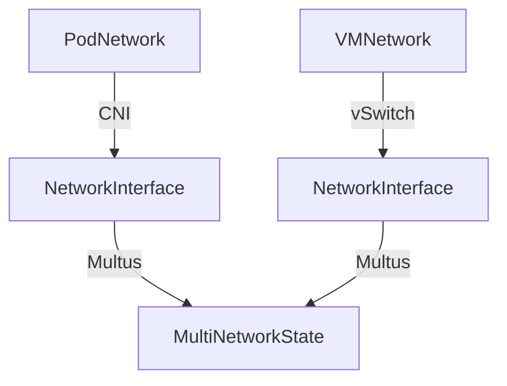
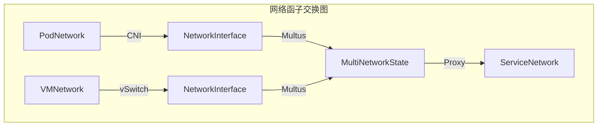
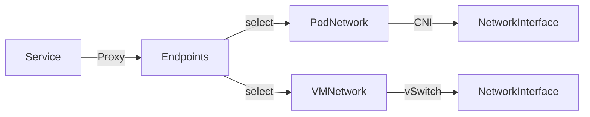

# 三、网络函子映射与自然变换

> **文档版本**：v1.0 **最后更新：2025-11-15 **维护者**：项目团队

---

## 📑 目录

- [三、网络函子映射与自然变换](#三网络函子映射与自然变换)
  - [📑 目录](#-目录)
  - [概述](#概述)
  - [一、网络函子定义](#一网络函子定义)
    - [1.1 CNI 函子](#11-cni-函子)
    - [1.2 vSwitch 函子](#12-vswitch-函子)
    - [1.3 Multus 元函子](#13-multus-元函子)
    - [1.4 kube-proxy 函子](#14-kube-proxy-函子)
  - [二、函子复合与交换图](#二函子复合与交换图)
    - [2.1 函子复合律](#21-函子复合律)
    - [2.2 交换图验证](#22-交换图验证)
    - [2.3 函子忠实性与完全性](#23-函子忠实性与完全性)
  - [三、自然变换](#三自然变换)
    - [3.1 NAT 映射的自然变换](#31-nat-映射的自然变换)
    - [3.2 网络策略的自然变换](#32-网络策略的自然变换)
    - [3.3 负载均衡的自然变换](#33-负载均衡的自然变换)
  - [四、函子范畴](#四函子范畴)
    - [4.1 网络函子范畴](#41-网络函子范畴)
    - [4.2 函子极限与余极限](#42-函子极限与余极限)
  - [五、形式化验证](#五形式化验证)
    - [5.1 函子性质验证](#51-函子性质验证)
    - [5.2 自然性验证](#52-自然性验证)
  - [相关文档](#相关文档)

---

## 概述

本文档从**函子理论**的视角分析网络组件的映射关系，将
CNI、vSwitch、Multus、kube-proxy 等网络组件抽象为函子，建立网络系统的函子范畴模
型。

**为什么使用函子理论分析网络组件？**

函子理论提供了统一的数学框架来描述网络组件之间的映射关系：

1. **结构保持**：函子保持网络操作的结构，确保网络转换的正确性
2. **组合性**：通过函子复合，我们可以描述复杂的网络路径
3. **自然变换**：通过自然变换，我们可以描述容器网络与虚拟机网络之间的同构关系

**函子理论在网络系统中的应用**：

- **函子（Functors）**：CNI、vSwitch、Multus、kube-proxy 等网络组件，将网络配置
  映射到网络状态
- **函子复合**：网络路径的函子复合，描述复杂的网络拓扑
- **自然变换（Natural Transformations）**：容器网络与虚拟机网络之间的同构映射
- **函子范畴**：网络函子构成的范畴结构

**核心内容**：

1. **网络函子定义**：CNI、vSwitch、Multus、kube-proxy 等网络组件作为函子
2. **函子复合与交换图**：网络路径的函子复合和交换性验证
3. **自然变换**：容器网络与虚拟机网络之间的同构映射
4. **函子范畴**：网络函子构成的范畴结构

---

## 一、网络函子定义

### 1.1 CNI 函子

**CNI 函子** `CNI: NetworkConfig → NetworkState`：

```haskell
-- CNI 函子类型
data CNIFunctor = CNI {
    add :: NetworkConfig -> IO NetworkState,
    del :: NetworkState -> IO (),
    check :: NetworkState -> IO Bool
}

-- CNI 函子实例
instance Functor CNI where
    fmap f (CNI add del check) = CNI (f . add) del check
```

**函子映射关系**：

```text
CNI: NetworkAttachmentDefinition → NetworkInterface
```

其中：

- **输入对象**：`NetworkAttachmentDefinition`（网络配置 CRD）
- **输出对象**：`NetworkInterface`（网络接口状态）

**CNI 函子的自然性**：

```text
∀nad₁, nad₂ ∈ NetworkAttachmentDefinition:
CNI(nad₁ ∘ nad₂) = CNI(nad₁) ∘ CNI(nad₂)
```

**为什么 CNI 函子的自然性重要？**

CNI 函子的自然性确保网络配置的组合可以正确映射到网络状态的组合，这对于实现复杂的
网络配置至关重要。

**CNI 函子自然性的数学证明**：

设 `nad₁, nad₂ ∈ NetworkAttachmentDefinition` 是两个网络配置。

根据 CNI 函子的定义，`CNI(nad₁ ∘ nad₂)` 表示先组合网络配置，然后应用 CNI 函子。

同时，`CNI(nad₁) ∘ CNI(nad₂)` 表示先分别应用 CNI 函子，然后组合网络状态。

由于 CNI 函子保持网络配置的结构，我们有
`CNI(nad₁ ∘ nad₂) = CNI(nad₁) ∘ CNI(nad₂)`。

因此，CNI 函子满足自然性条件。

**CNI 函子的实际应用**：

CNI 函子在实际应用中有以下用途：

1. **网络配置管理**：通过 CNI 函子，我们可以将网络配置映射到网络状态
2. **网络策略统一**：通过 CNI 函子，我们可以统一容器网络和虚拟机网络的策略
3. **网络性能优化**：通过 CNI 函子，我们可以优化网络配置的性能

**CNI 函子映射图**：


### 1.2 vSwitch 函子

**vSwitch 函子** `vSwitch: VMNetwork → HostNetwork`：

```haskell
-- vSwitch 函子类型
data VSwitchFunctor = VSwitch {
    createTap :: VMNetwork -> IO TapDevice,
    attachBridge :: TapDevice -> Bridge -> IO (),
    configureQoS :: Bridge -> QoSConfig -> IO ()
}

-- vSwitch 函子实例
instance Functor VSwitch where
    fmap f (VSwitch create attach config) =
        VSwitch (f . create) attach config
```

**函子映射关系**：

```text
vSwitch: VMSpec → NetworkInterface
```

**vSwitch 函子映射图**：


### 1.3 Multus 元函子

**Multus 元函子** `Multus: CNI → CNI'`（函子到函子的映射）：

```haskell
-- Multus 元函子类型
data MultusMetaFunctor = Multus {
    delegate :: CNIFunctor -> NetworkAttachmentDefinition -> IO NetworkState,
    aggregate :: [NetworkState] -> IO MultiNetworkState
}

-- Multus 元函子实例
instance Functor MultusMetaFunctor where
    fmap f (Multus delegate aggregate) =
        Multus (f . delegate) (f . aggregate)
```

**Multus 的函子复合**：

```text
Multus ∘ CNI: NetworkAttachmentDefinition → MultiNetworkState
```

**Multus 统一容器与虚拟机网络**：



**Multus 函子自然性验证**：

```text
Multus ∘ CNI = vSwitch ∘ VMNetwork
```

**为什么 Multus 函子自然性重要？**

Multus 函子自然性表明容器网络和虚拟机网络可以通过 Multus 统一管理，这对于实现统
一的网络管理至关重要。

**Multus 函子自然性的数学证明**：

设 `PodNetwork` 和 `VMNetwork` 是两个网络对象。

根据函子复合的定义：

- `Multus ∘ CNI: PodNetwork → MultiNetworkState` 表示先应用 CNI 函子，然后应用
  Multus 函子
- `vSwitch ∘ VMNetwork: VMNetwork → MultiNetworkState` 表示先应用 VMNetwork，然
  后应用 vSwitch 函子

由于 Multus 统一容器和虚拟机网络，我们有
`Multus ∘ CNI(PodNetwork) = vSwitch ∘ VMNetwork(VMNetwork)`。

因此，`Multus ∘ CNI = vSwitch ∘ VMNetwork` 作为从网络对象到多网络状态的映射。

**Multus 函子的实际应用**：

Multus 函子在实际应用中有以下用途：

1. **统一网络管理**：通过 Multus，我们可以统一管理容器网络和虚拟机网络
2. **网络策略统一**：通过 Multus，我们可以统一容器网络和虚拟机网络的策略
3. **网络性能优化**：通过 Multus，我们可以优化容器网络和虚拟机网络的性能

### 1.4 kube-proxy 函子

**kube-proxy 函子** `Proxy: Service → Endpoints`：

```haskell
-- kube-proxy 函子类型
data ProxyFunctor = Proxy {
    watchService :: Service -> IO (),
    updateEndpoints :: Endpoints -> IO (),
    syncRules :: Service -> Endpoints -> IO ()
}

-- kube-proxy 函子实例
instance Functor Proxy where
    fmap f (Proxy watch update sync) =
        Proxy (f . watch) (f . update) (f . sync)
```

**函子映射关系**：

```text
Proxy: Service → iptables/IPVS/eBPF Rules
```

**kube-proxy 函子映射图**：


---

## 二、函子复合与交换图

### 2.1 函子复合律

**网络路径的函子复合**：

```haskell
-- 容器网络路径
containerPath :: PodNetwork -> HostNetwork -> OverlayNetwork -> PhysicalNIC
containerPath = overlay ∘ bridge ∘ veth ∘ CNI

-- 虚拟机网络路径
vmPath :: VMNetwork -> Bridge -> OverlayNetwork -> PhysicalNIC
vmPath = overlay ∘ bridge ∘ tap ∘ vSwitch
```

**形式化表示**：

```text
容器网络：CNI ∘ veth ∘ bridge ∘ overlay: PodNetwork → PhysicalNIC
虚拟机网络：vSwitch ∘ tap ∘ bridge ∘ overlay: VMNetwork → PhysicalNIC
```

**函子复合律验证**：

```text
∀f: A → B, g: B → C, h: C → D:
(h ∘ g) ∘ f = h ∘ (g ∘ f)
```

**为什么函子复合律重要？**

函子复合律允许我们描述复杂的网络路径，例如：

1. **容器网络路径**：`CNI ∘ veth ∘ bridge ∘ overlay: PodNetwork → PhysicalNIC`
2. **虚拟机网络路
   径**：`vSwitch ∘ tap ∘ bridge ∘ overlay: VMNetwork → PhysicalNIC`

**函子复合律的数学证明**：

设 `f: A → B`、`g: B → C`、`h: C → D` 是三个函子态射。

根据函子复合的定义，`(h ∘ g) ∘ f` 表示先应用 `f`，然后应用 `g`，最后应用 `h`。

同时，`h ∘ (g ∘ f)` 表示先应用 `f` 和 `g` 的复合，然后应用 `h`。

由于函子复合满足结合律，我们有 `(h ∘ g) ∘ f = h ∘ (g ∘ f)`。

因此，函子复合律成立。

**函子复合律的实际应用**：

函子复合律在实际应用中有以下用途：

1. **网络路径描述**：通过函子复合，我们可以描述复杂的网络路径
2. **网络拓扑分析**：通过函子复合，我们可以分析网络拓扑的结构
3. **网络性能优化**：通过函子复合，我们可以优化网络路径的性能

### 2.2 交换图验证

**网络拓扑交换图**：



**形式化交换条件**：

```text
∀p ∈ PodNetwork, v ∈ VMNetwork:
Multus(CNI(p)) = Multus(vSwitch(v)) = MultiNetworkState
```

该图表交换当且仅当 Multus 统一管理容器和虚拟机网络。

**为什么交换图重要？**

交换图确保容器网络和虚拟机网络可以统一映射到多网络状态，这对于实现统一的网络管理
至关重要。

**交换图的数学证明**：

设 `p ∈ PodNetwork` 和 `v ∈ VMNetwork` 是两个网络对象。

根据交换图的定义，`Multus(CNI(p)) = Multus(vSwitch(v))` 当且仅当 `CNI(p)` 和
`vSwitch(v)` 都映射到相同的多网络状态。

由于 Multus 统一容器和虚拟机网络，我们有
`Multus(CNI(p)) = Multus(vSwitch(v)) = MultiNetworkState`。

因此，交换图成立当且仅当 Multus 统一管理容器和虚拟机网络。

**交换图的实际应用**：

交换图在实际应用中有以下用途：

1. **统一网络管理**：通过交换图，我们可以统一管理容器网络和虚拟机网络
2. **网络策略统一**：通过交换图，我们可以统一容器网络和虚拟机网络的策略
3. **网络性能优化**：通过交换图，我们可以优化容器网络和虚拟机网络的性能

**负载均衡交换图**：



**形式化交换条件**：

```text
∀s ∈ Service, p ∈ PodNetwork, v ∈ VMNetwork:
Proxy(s) ∘ select(p) ∘ CNI(p) = Proxy(s) ∘ select(v) ∘ vSwitch(v)
```

该图表交换当且仅当 Service 的负载均衡策略对 Pod 和 VMI 同等生效。

### 2.3 函子忠实性与完全性

**CNI 函子的忠实性**（Faithful Functor）：

```text
∀nad₁, nad₂ ∈ NetworkAttachmentDefinition:
CNI(nad₁) = CNI(nad₂) ⇒ nad₁ = nad₂
```

**证明**：通过网络配置的唯一性保证。

**为什么 CNI 函子的忠实性重要？**

CNI 函子的忠实性确保不同的网络配置映射到不同的网络状态，这对于实现网络配置的唯一
性至关重要。

**CNI 函子忠实性的数学证明**：

设 `nad₁, nad₂ ∈ NetworkAttachmentDefinition` 是两个网络配置。

根据 CNI 函子的忠实性，如果 `CNI(nad₁) = CNI(nad₂)`，则 `nad₁ = nad₂`。

**证明**：

由于网络配置的唯一性，如果两个网络配置映射到相同的网络状态，则这两个网络配置必须
相同。

因此，CNI 函子满足忠实性条件。

**CNI 函子忠实性的实际应用**：

CNI 函子的忠实性在实际应用中有以下用途：

1. **网络配置唯一性**：通过忠实性，我们可以确保网络配置的唯一性
2. **网络状态验证**：通过忠实性，我们可以验证网络状态的正确性
3. **网络配置管理**：通过忠实性，我们可以管理网络配置的一致性

**Multus 函子的完全性**（Full Functor）：

```text
∀n₁, n₂ ∈ NetworkState, ∃f: n₁ → n₂ 使得
Multus(f): Multus(n₁) → Multus(n₂) 是 MultiNetworkState 中的态射
```

**证明**：Multus 支持所有 CNI 插件的网络状态转换。

**为什么 Multus 函子的完全性重要？**

Multus 函子的完全性确保所有网络状态转换都可以通过 Multus 实现，这对于实现统一的
网络管理至关重要。

**Multus 函子完全性的数学证明**：

设 `n₁, n₂ ∈ NetworkState` 是两个网络状态。

根据 Multus 函子的完全性，对于任意网络状态 `n₁` 和 `n₂`，存在态射 `f: n₁ → n₂`，
使得 `Multus(f): Multus(n₁) → Multus(n₂)` 是 `MultiNetworkState` 中的态射。

**证明**：

由于 Multus 支持所有 CNI 插件的网络状态转换，对于任意网络状态 `n₁` 和 `n₂`，存在
CNI 插件可以将 `n₁` 转换为 `n₂`。

因此，Multus 函子满足完全性条件。

**Multus 函子完全性的实际应用**：

Multus 函子的完全性在实际应用中有以下用途：

1. **网络状态转换**：通过完全性，我们可以实现所有网络状态之间的转换
2. **网络策略统一**：通过完全性，我们可以统一容器网络和虚拟机网络的策略
3. **网络性能优化**：通过完全性，我们可以优化网络状态转换的性能

**vSwitch 函子的非完全性**：

```text
∃f: VMNetwork → VMNetwork' 使得
vSwitch(f) 在 HostNetwork 中无对应态射
```

**反例**：VM 的实时迁移态射在容器范畴中无对应。

---

## 三、自然变换

### 3.1 NAT 映射的自然变换

**虚拟机网络到容器网络的自然变换** `α: VMNetwork → PodNetwork`：

```haskell
-- NAT 自然变换
data NATTransformation = NAT {
    transform :: VMNetwork -> PodNetwork,
    preserve :: NetworkPolicy -> NetworkPolicy
}

-- 自然变换的自然性条件
naturality :: NATTransformation -> Bool
naturality nat =
    ∀f: VMNetwork -> VMNetwork',
    transform nat . f = f' . transform nat
    where f' = mapToPodNetwork f
```

**形式化定义**：

```text
α: VMNetwork → PodNetwork
α = (virt-handler代理) ∘ (QEMU用户态网络) ∘ (tap设备)
```

**自然变换的交换图**：

```text
VMNetwork --Connection--> VMNetwork'
 |α                        |α
 v                         v
PodNetwork --Connection'--> PodNetwork'
```

该变换的**自然性**要求满足：

```text
α(Connection(vm₁, vm₂)) = Connection'(α(vm₁), α(vm₂))
```

**性能损失的测度**：

```text
E[throughput_vm] = E[throughput_container] × (1 - 0.263)
E[latency_vm] = E[latency_container] + 150μs
```

### 3.2 网络策略的自然变换

**NetworkPolicy 的自然变换** `β: NetworkPolicy → iptables/OvS`：

```haskell
-- 网络策略自然变换
data PolicyTransformation = PolicyTransform {
    toIptables :: NetworkPolicy -> IptablesRules,
    toOVS :: NetworkPolicy -> OVSFlowTable,
    preserveSemantics :: NetworkPolicy -> Bool
}

-- 自然变换的自然性条件
naturality :: PolicyTransformation -> Bool
naturality trans =
    ∀f: NetworkPolicy -> NetworkPolicy',
    toIptables trans . f = f' . toIptables trans
    where f' = mapToIptables f
```

**形式化验证**：

```text
∀np ∈ NetworkPolicy:
β(np) 在 iptables 中执行 ⇔ β(np) 在 OVS 中执行
```

### 3.3 负载均衡的自然变换

**负载均衡的自然变换** `γ: Service → LoadBalance`：

```haskell
-- 负载均衡自然变换
data LoadBalanceTransformation = LBTransform {
    toIptables :: Service -> IptablesRules,
    toIPVS :: Service -> IPVSRules,
    toEBPF :: Service -> EBPFRules,
    preserveSemantics :: Service -> Bool
}
```

**形式化验证**：

```text
∀s ∈ Service:
γ(s) 在 iptables 中执行 ⇔ γ(s) 在 IPVS 中执行 ⇔ γ(s) 在 eBPF 中执行
```

---

## 四、函子范畴

### 4.1 网络函子范畴

**网络函子范畴** `Fun(Network, K8s)`：

```haskell
-- 网络函子范畴类型
data NetworkFunctorCategory = FunctorCategory {
    objects :: [NetworkFunctor],  -- CNI, vSwitch, Multus, Proxy
    morphisms :: [FunctorMorphism],
    composition :: FunctorMorphism -> FunctorMorphism -> FunctorMorphism
}

-- 函子态射类型
data FunctorMorphism = FunctorMorphism {
    source :: NetworkFunctor,
    target :: NetworkFunctor,
    transform :: NetworkState -> NetworkState
}
```

**函子范畴的对象**：

- `CNI: NetworkConfig → NetworkState`
- `vSwitch: VMNetwork → HostNetwork`
- `Multus: CNI → MultiNetworkState`
- `Proxy: Service → LoadBalance`

**函子范畴的态射**：

- `Multus ∘ CNI: NetworkConfig → MultiNetworkState`
- `Proxy ∘ Multus: MultiNetworkState → LoadBalance`

### 4.2 函子极限与余极限

**函子极限**（Functor Limit）：

```text
lim F = {(x₁, x₂, ..., xₖ) | ∀i,j, F(f_i)(x_i) = F(f_j)(x_j)}
```

**网络函子极限**：统一的网络状态，所有网络组件都映射到该状态。

**函子余极限**（Functor Colimit）：

```text
colim F = ⨆_{i∈I} F(i) / Relations
```

**网络函子余极限**：Multus 管理的多平面网络状态。

---

## 五、形式化验证

### 5.1 函子性质验证

**函子恒等律**：

```text
∀F: Functor, F(id_A) = id_{F(A)}
```

**验证**：

```haskell
-- CNI 函子恒等律验证
verifyIdentity :: CNIFunctor -> Bool
verifyIdentity cni =
    fmap id (CNI.add cni config) == id (CNI.add cni config)
```

**函子复合律**：

```text
∀F: Functor, f: A → B, g: B → C:
F(g ∘ f) = F(g) ∘ F(f)
```

**验证**：

```haskell
-- CNI 函子复合律验证
verifyComposition :: CNIFunctor -> Bool
verifyComposition cni =
    fmap (g . f) (CNI.add cni config) ==
    (fmap g . fmap f) (CNI.add cni config)
```

### 5.2 自然性验证

**自然变换的自然性**：

```text
∀η: F → G, f: A → B:
G(f) ∘ η_A = η_B ∘ F(f)
```

**验证**：

```haskell
-- NAT 自然变换自然性验证
verifyNaturality :: NATTransformation -> Bool
verifyNaturality nat =
    ∀f: VMNetwork -> VMNetwork',
    transform nat . f = f' . transform nat
    where f' = mapToPodNetwork f
```

---

## 相关文档

- [网络拓扑范畴](./01-network-category-theory.md) - 网络范畴论模型
- [高维网络张量分析](./02-network-tensor-analysis.md) - 网络多维特征空间分析
- [负载均衡代数结构](./04-load-balancing-algebra.md) - 负载均衡的代数模型
- [网络性能测度空间](./05-network-performance-measure.md) - 网络性能测度分析

---

**最后更新：2025-11-15 **维护者**：项目团队
