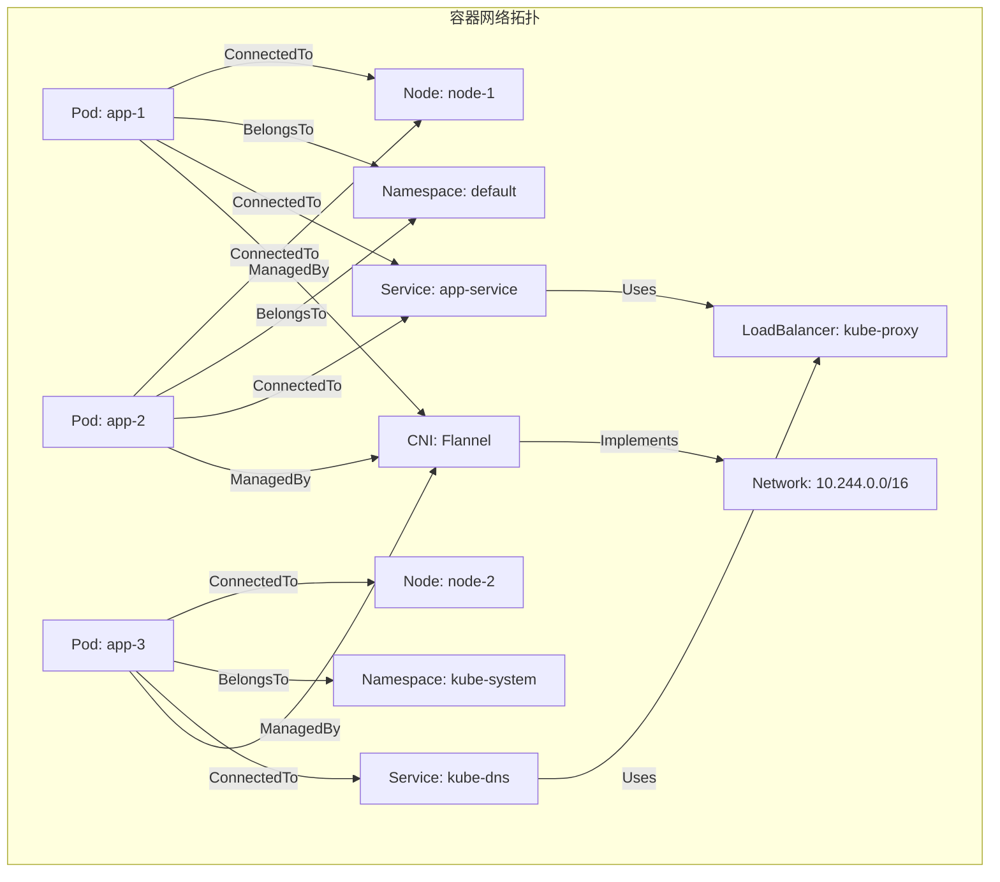
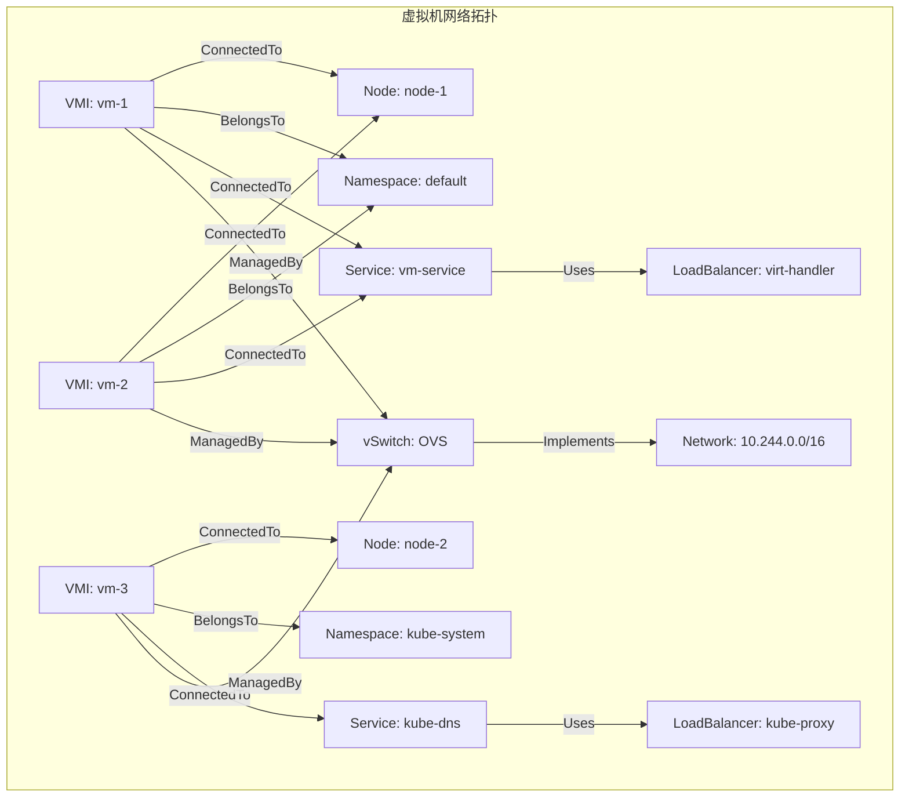
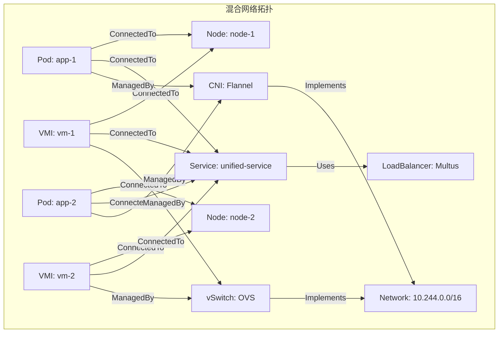
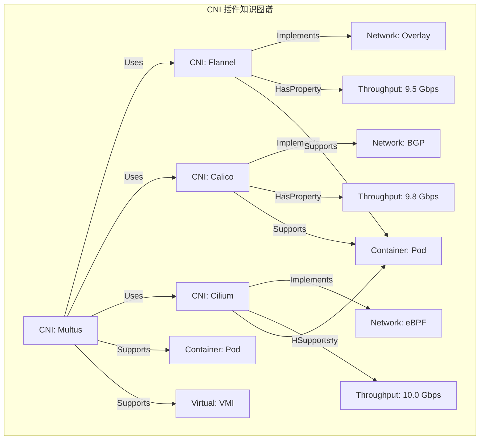
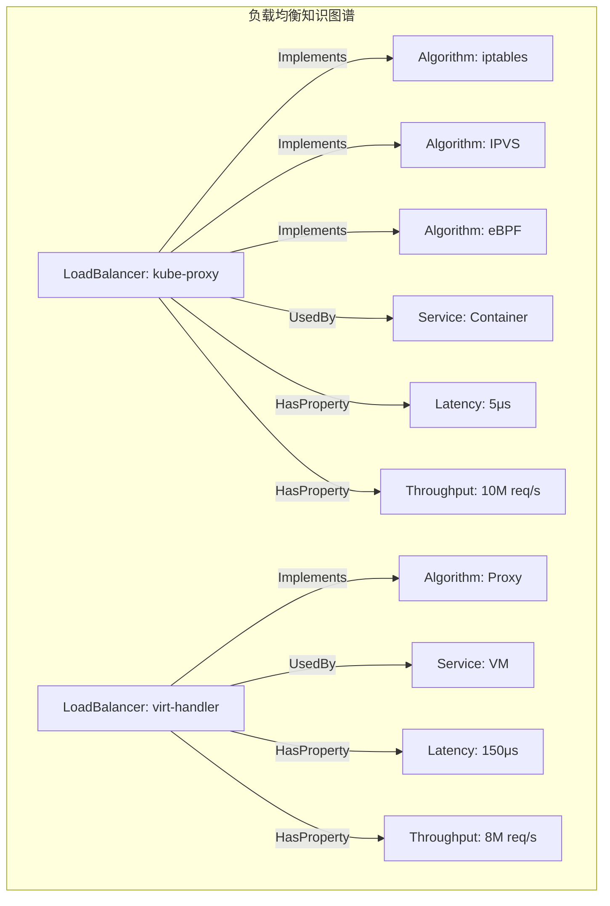
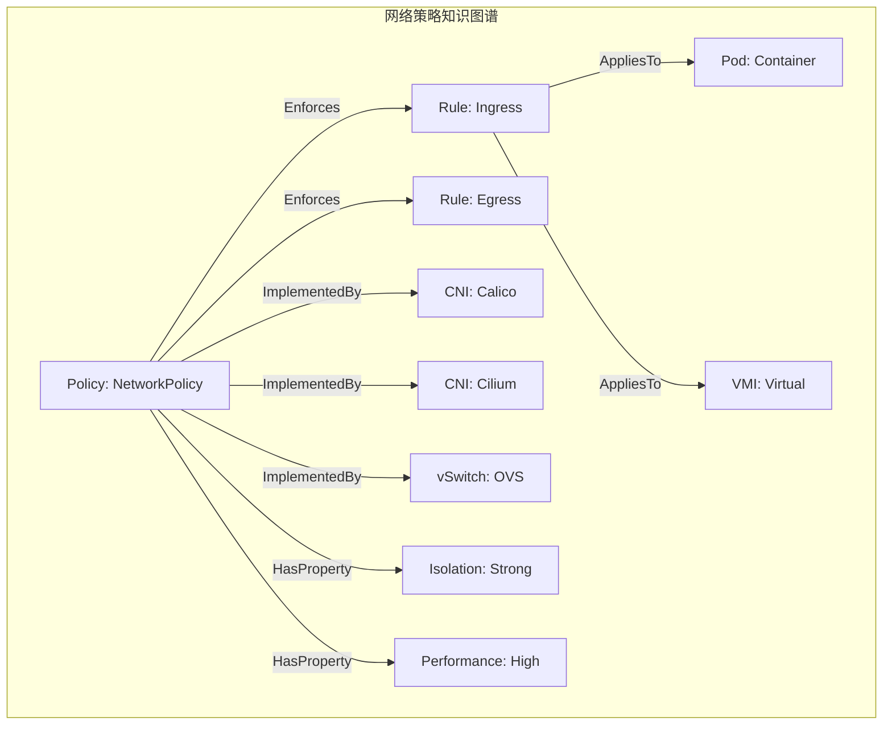
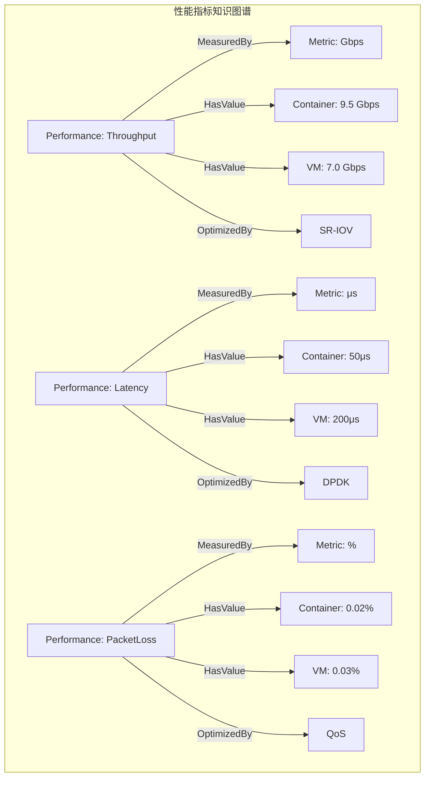
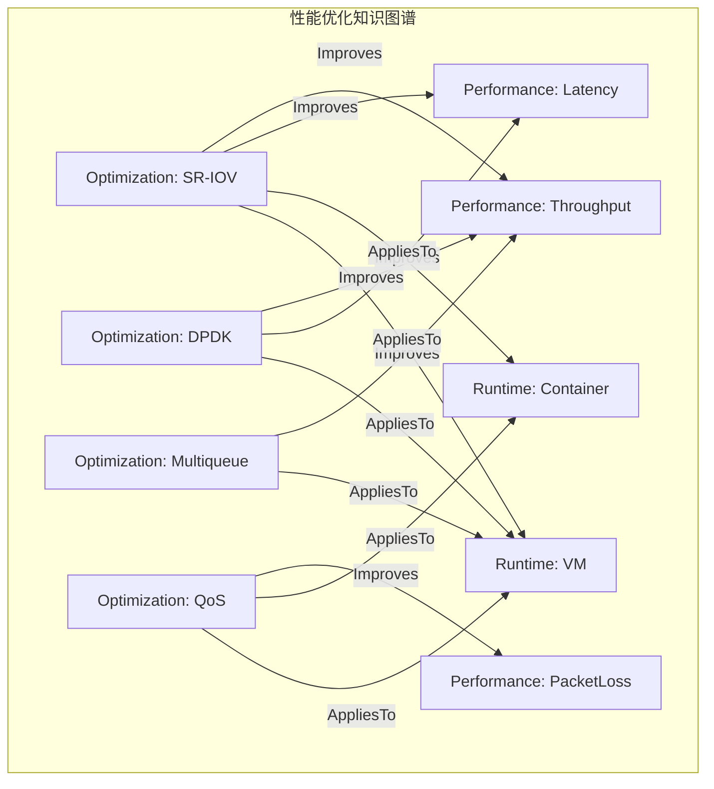

# 六、网络知识图谱

> **文档版本**：v1.0 **最后更新**：2025-11-10 **维护者**：项目团队

---

## 📑 目录

- [📑 目录](#-目录)
- [概述](#概述)
- [一、网络知识图谱结构](#一网络知识图谱结构)
  - [1.1 实体（Entities）定义](#11-实体entities定义)
  - [1.2 关系（Relations）定义](#12-关系relations定义)
  - [1.3 属性（Properties）定义](#13-属性properties定义)
- [二、网络拓扑知识图谱](#二网络拓扑知识图谱)
  - [2.1 容器网络拓扑](#21-容器网络拓扑)
  - [2.2 虚拟机网络拓扑](#22-虚拟机网络拓扑)
  - [2.3 混合网络拓扑](#23-混合网络拓扑)
- [三、网络组件知识图谱](#三网络组件知识图谱)
  - [3.1 CNI 插件知识图谱](#31-cni-插件知识图谱)
  - [3.2 负载均衡知识图谱](#32-负载均衡知识图谱)
  - [3.3 网络策略知识图谱](#33-网络策略知识图谱)
- [四、网络性能知识图谱](#四网络性能知识图谱)
  - [4.1 性能指标知识图谱](#41-性能指标知识图谱)
  - [4.2 性能优化知识图谱](#42-性能优化知识图谱)
- [五、网络知识图谱查询](#五网络知识图谱查询)
  - [5.1 SPARQL 查询](#51-sparql-查询)
  - [5.2 图遍历算法](#52-图遍历算法)
  - [5.3 知识推理](#53-知识推理)
- [相关文档](#相关文档)

---

## 概述

本文档从**知识图谱**的视角构建网络系统的知识表示，将网络实体、关系、属性等抽象为
图结构，建立网络系统的知识图谱模型。

**为什么使用知识图谱表示网络系统？**

知识图谱提供了统一的图结构来描述网络系统的知识和关系：

1. **知识表示**：通过实体、关系、属性，我们可以统一表示网络系统的知识
2. **关系建模**：通过图结构，我们可以建模网络实体之间的关系
3. **知识推理**：通过图遍历和推理，我们可以发现网络系统中的隐含关系

**知识图谱在网络系统中的应用**：

- **实体（Entities）**：网络实体，如
  Pod、VMI、Node、Service、Network、CNI、Policy
- **关系（Relations）**：网络关系，如
  ConnectedTo、BelongsTo、ManagedBy、Implements、Uses、Enforces
- **属性（Properties）**：网络属性，如
  HasIP、HasPort、HasProtocol、HasThroughput、HasLatency、HasPacketLoss

**核心内容**：

1. **网络知识图谱结构**：实体、关系、属性的定义
2. **网络拓扑知识图谱**：容器、虚拟机、混合网络拓扑
3. **网络组件知识图谱**：CNI 插件、负载均衡、网络策略
4. **网络性能知识图谱**：性能指标、性能优化
5. **网络知识图谱查询**：SPARQL 查询、图遍历算法、知识推理

---

## 一、网络知识图谱结构

### 1.1 实体（Entities）定义

**网络实体类型**：

```haskell
-- 网络实体类型
data NetworkEntity =
    PodEntity PodId
  | VMIEntity VMIId
  | NodeEntity NodeId
  | ServiceEntity ServiceId
  | NetworkEntity NetworkId
  | CNIEntity CNIId
  | PolicyEntity PolicyId
```

**实体属性**：

| **实体类型** | **属性**         | **类型** | **说明**   |
| ------------ | ---------------- | -------- | ---------- |
| **Pod**      | namespace        | String   | 命名空间   |
| **Pod**      | ip               | IP       | IP 地址    |
| **Pod**      | networkInterface | String   | 网络接口   |
| **VMI**      | namespace        | String   | 命名空间   |
| **VMI**      | ip               | IP       | IP 地址    |
| **VMI**      | vNIC             | String   | 虚拟网卡   |
| **Node**     | nodeIP           | IP       | 节点 IP    |
| **Node**     | networkPlugin    | String   | 网络插件   |
| **Service**  | clusterIP        | IP       | 集群 IP    |
| **Service**  | loadBalancer     | String   | 负载均衡器 |
| **Network**  | cidr             | CIDR     | 网段       |
| **Network**  | plugin           | String   | CNI 插件   |
| **CNI**      | type             | String   | 插件类型   |
| **CNI**      | version          | String   | 版本号     |
| **Policy**   | ingress          | Rules    | 入站规则   |
| **Policy**   | egress           | Rules    | 出站规则   |

**为什么网络实体重要？**

网络实体允许我们统一表示网络系统中的所有对象，这对于构建知识图谱至关重要。

**网络实体的数学性质**：

网络实体具有以下数学性质：

1. **唯一性**：每个网络实体都有唯一的标识符（如 PodId、VMIId、NodeId 等）
2. **可组合性**：网络实体可以通过关系组合形成复杂的网络拓扑
3. **可查询性**：网络实体可以通过图查询算法进行查询

**网络实体的实际应用**：

网络实体在实际应用中有以下用途：

1. **知识表示**：通过实体，我们可以表示网络系统中的所有对象
2. **关系建模**：通过实体，我们可以建模网络实体之间的关系
3. **知识推理**：通过实体，我们可以进行知识推理

### 1.2 关系（Relations）定义

**网络关系类型**：

```haskell
-- 网络关系类型
data NetworkRelation =
    ConnectedTo Entity Entity
  | BelongsTo Entity Entity
  | ManagedBy Entity Entity
  | Implements Entity Entity
  | Uses Entity Entity
  | Enforces Entity Entity
```

**关系定义**：

| **关系名称**    | **类型签名**             | **说明**            |
| --------------- | ------------------------ | ------------------- |
| **ConnectedTo** | `Pod → Node`             | Pod 连接到节点      |
| **ConnectedTo** | `VMI → Node`             | VMI 连接到节点      |
| **ConnectedTo** | `Pod → Service`          | Pod 连接到服务      |
| **ConnectedTo** | `VMI → Service`          | VMI 连接到服务      |
| **BelongsTo**   | `Pod → Namespace`        | Pod 属于命名空间    |
| **BelongsTo**   | `VMI → Namespace`        | VMI 属于命名空间    |
| **ManagedBy**   | `Pod → CNI`              | Pod 由 CNI 管理     |
| **ManagedBy**   | `VMI → vSwitch`          | VMI 由 vSwitch 管理 |
| **Implements**  | `CNI → Network`          | CNI 实现网络        |
| **Uses**        | `Service → LoadBalancer` | 服务使用负载均衡器  |
| **Enforces**    | `Policy → Pod`           | 策略应用于 Pod      |
| **Enforces**    | `Policy → VMI`           | 策略应用于 VMI      |

**为什么网络关系重要？**

网络关系允许我们描述网络实体之间的连接和依赖关系，这对于构建知识图谱至关重要。

**网络关系的数学性质**：

网络关系具有以下数学性质：

1. **有向性**：网络关系是有向的，如 `Pod → Node` 表示 Pod 连接到节点
2. **传递性**：某些网络关系是传递的，如 `Pod → Service → LoadBalancer`
3. **可组合性**：网络关系可以通过关系组合形成复杂的网络路径

**网络关系的实际应用**：

网络关系在实际应用中有以下用途：

1. **关系建模**：通过关系，我们可以建模网络实体之间的连接和依赖关系
2. **路径查找**：通过关系，我们可以查找网络拓扑路径
3. **知识推理**：通过关系，我们可以进行知识推理

### 1.3 属性（Properties）定义

**网络属性类型**：

```haskell
-- 网络属性类型
data NetworkProperty =
    HasIP Entity IP
  | HasPort Entity Port
  | HasProtocol Entity Protocol
  | HasThroughput Entity Double
  | HasLatency Entity Double
  | HasPacketLoss Entity Double
```

**属性定义**：

| **属性名称**      | **类型签名**        | **说明**     |
| ----------------- | ------------------- | ------------ |
| **HasIP**         | `Entity → IP`       | 实体有 IP    |
| **HasPort**       | `Entity → Port`     | 实体有端口   |
| **HasProtocol**   | `Entity → Protocol` | 实体有协议   |
| **HasThroughput** | `Entity → Double`   | 实体有吞吐量 |
| **HasLatency**    | `Entity → Double`   | 实体有延迟   |
| **HasPacketLoss** | `Entity → Double`   | 实体有丢包率 |

**为什么网络属性重要？**

网络属性允许我们描述网络实体的特征和性能指标，这对于构建知识图谱至关重要。

**网络属性的数学性质**：

网络属性具有以下数学性质：

1. **类型性**：每个网络属性都有特定的类型（如 IP、Port、Protocol、Double 等）
2. **可查询性**：网络属性可以通过图查询算法进行查询
3. **可聚合性**：网络属性可以通过聚合函数进行聚合

**网络属性的实际应用**：

网络属性在实际应用中有以下用途：

1. **特征描述**：通过属性，我们可以描述网络实体的特征
2. **性能指标**：通过属性，我们可以描述网络实体的性能指标
3. **知识查询**：通过属性，我们可以进行知识查询

---

## 二、网络拓扑知识图谱

### 2.1 容器网络拓扑

**容器网络拓扑图**：



**容器网络拓扑知识图谱**：

```turtle
@prefix net: <http://example.org/network#> .
@prefix pod: <http://example.org/pod#> .
@prefix node: <http://example.org/node#> .

pod:app-1 net:connectedTo node:node-1 .
pod:app-1 net:belongsTo net:namespace:default .
pod:app-1 net:managedBy net:cni:flannel .
pod:app-1 net:hasIP "10.244.1.10" .
pod:app-1 net:connectedTo net:service:app-service .

net:service:app-service net:uses net:loadBalancer:kube-proxy .
net:cni:flannel net:implements net:network:10.244.0.0/16 .
```

### 2.2 虚拟机网络拓扑

**虚拟机网络拓扑图**：



**虚拟机网络拓扑知识图谱**：

```turtle
@prefix net: <http://example.org/network#> .
@prefix vmi: <http://example.org/vmi#> .
@prefix node: <http://example.org/node#> .

vmi:vm-1 net:connectedTo node:node-1 .
vmi:vm-1 net:belongsTo net:namespace:default .
vmi:vm-1 net:managedBy net:vSwitch:ovs .
vmi:vm-1 net:hasIP "10.244.1.20" .
vmi:vm-1 net:connectedTo net:service:vm-service .

net:service:vm-service net:uses net:loadBalancer:virt-handler .
net:vSwitch:ovs net:implements net:network:10.244.0.0/16 .
```

### 2.3 混合网络拓扑

**混合网络拓扑图**：



**混合网络拓扑知识图谱**：

```turtle
@prefix net: <http://example.org/network#> .
@prefix pod: <http://example.org/pod#> .
@prefix vmi: <http://example.org/vmi#> .

pod:app-1 net:connectedTo net:service:unified-service .
vmi:vm-1 net:connectedTo net:service:unified-service .
pod:app-2 net:connectedTo net:service:unified-service .
vmi:vm-2 net:connectedTo net:service:unified-service .

net:service:unified-service net:uses net:loadBalancer:multus .

pod:app-1 net:managedBy net:cni:flannel .
vmi:vm-1 net:managedBy net:vSwitch:ovs .
net:cni:flannel net:implements net:network:10.244.0.0/16 .
net:vSwitch:ovs net:implements net:network:10.244.0.0/16 .
```

---

## 三、网络组件知识图谱

### 3.1 CNI 插件知识图谱

**CNI 插件知识图谱**：



**CNI 插件知识图谱（RDF）**：

```turtle
@prefix net: <http://example.org/network#> .
@prefix cni: <http://example.org/cni#> .

cni:flannel net:implements net:network:overlay .
cni:flannel net:hasThroughput 9.5 .
cni:flannel net:supports net:runtime:container .

cni:calico net:implements net:network:bgp .
cni:calico net:hasThroughput 9.8 .
cni:calico net:supports net:runtime:container .

cni:cilium net:implements net:network:ebpf .
cni:cilium net:hasThroughput 10.0 .
cni:cilium net:supports net:runtime:container .

cni:multus net:uses cni:flannel .
cni:multus net:uses cni:calico .
cni:multus net:uses cni:cilium .
cni:multus net:supports net:runtime:container .
cni:multus net:supports net:runtime:virtual .
```

### 3.2 负载均衡知识图谱

**负载均衡知识图谱**：



**负载均衡知识图谱（RDF）**：

```turtle
@prefix net: <http://example.org/network#> .
@prefix lb: <http://example.org/loadbalancer#> .

lb:kube-proxy net:implements net:algorithm:iptables .
lb:kube-proxy net:implements net:algorithm:ipvs .
lb:kube-proxy net:implements net:algorithm:ebpf .
lb:kube-proxy net:usedBy net:service:container .
lb:kube-proxy net:hasLatency 5 .
lb:kube-proxy net:hasThroughput 10000000 .

lb:virt-handler net:implements net:algorithm:proxy .
lb:virt-handler net:usedBy net:service:vm .
lb:virt-handler net:hasLatency 150 .
lb:virt-handler net:hasThroughput 8000000 .
```

### 3.3 网络策略知识图谱

**网络策略知识图谱**：



**网络策略知识图谱（RDF）**：

```turtle
@prefix net: <http://example.org/network#> .
@prefix policy: <http://example.org/policy#> .

policy:networkPolicy net:enforces policy:rule:ingress .
policy:networkPolicy net:enforces policy:rule:egress .
policy:networkPolicy net:appliesTo net:runtime:container .
policy:networkPolicy net:appliesTo net:runtime:virtual .
policy:networkPolicy net:implementedBy net:cni:calico .
policy:networkPolicy net:implementedBy net:cni:cilium .
policy:networkPolicy net:implementedBy net:vSwitch:ovs .
policy:networkPolicy net:hasIsolation "strong" .
policy:networkPolicy net:hasPerformance "high" .
```

---

## 四、网络性能知识图谱

### 4.1 性能指标知识图谱

**性能指标知识图谱**：



**性能指标知识图谱（RDF）**：

```turtle
@prefix net: <http://example.org/network#> .
@prefix perf: <http://example.org/performance#> .

perf:throughput net:measuredBy perf:metric:gbps .
perf:throughput net:hasValue net:runtime:container 9.5 .
perf:throughput net:hasValue net:runtime:virtual 7.0 .
perf:throughput net:optimizedBy net:technology:sriov .

perf:latency net:measuredBy perf:metric:microseconds .
perf:latency net:hasValue net:runtime:container 50 .
perf:latency net:hasValue net:runtime:virtual 200 .
perf:latency net:optimizedBy net:technology:dpdk .

perf:packetLoss net:measuredBy perf:metric:percent .
perf:packetLoss net:hasValue net:runtime:container 0.02 .
perf:packetLoss net:hasValue net:runtime:virtual 0.03 .
perf:packetLoss net:optimizedBy net:technology:qos .
```

### 4.2 性能优化知识图谱

**性能优化知识图谱**：



**性能优化知识图谱（RDF）**：

```turtle
@prefix net: <http://example.org/network#> .
@prefix opt: <http://example.org/optimization#> .

opt:sriov net:improves perf:throughput .
opt:sriov net:improves perf:latency .
opt:sriov net:appliesTo net:runtime:container .
opt:sriov net:appliesTo net:runtime:virtual .

opt:dpdk net:improves perf:throughput .
opt:dpdk net:improves perf:latency .
opt:dpdk net:appliesTo net:runtime:virtual .

opt:multiqueue net:improves perf:throughput .
opt:multiqueue net:appliesTo net:runtime:virtual .

opt:qos net:improves perf:packetLoss .
opt:qos net:appliesTo net:runtime:container .
opt:qos net:appliesTo net:runtime:virtual .
```

---

## 五、网络知识图谱查询

### 5.1 SPARQL 查询

**查询所有连接到服务的 Pod**：

```sparql
PREFIX net: <http://example.org/network#>
SELECT ?pod ?service
WHERE {
    ?pod net:connectedTo ?service .
    ?service a net:Service .
}
```

**查询所有使用 CNI 插件的 Pod**：

```sparql
PREFIX net: <http://example.org/network#>
SELECT ?pod ?cni
WHERE {
    ?pod net:managedBy ?cni .
    ?cni a net:CNI .
}
```

**查询所有性能指标**：

```sparql
PREFIX net: <http://example.org/network#>
PREFIX perf: <http://example.org/performance#>
SELECT ?entity ?metric ?value
WHERE {
    ?entity perf:hasValue ?value .
    ?metric perf:measuredBy ?value .
}
```

### 5.2 图遍历算法

**广度优先搜索（BFS）**：

```haskell
-- BFS 图遍历
bfs :: NetworkEntity -> [NetworkEntity]
bfs start = bfs' [start] Set.empty
  where
    bfs' [] _ = []
    bfs' (x:xs) visited
        | Set.member x visited = bfs' xs visited
        | otherwise = x : bfs' (xs ++ neighbors x) (Set.insert x visited)
```

**深度优先搜索（DFS）**：

```haskell
-- DFS 图遍历
dfs :: NetworkEntity -> [NetworkEntity]
dfs start = dfs' start Set.empty
  where
    dfs' x visited
        | Set.member x visited = []
        | otherwise = x : concatMap (\n -> dfs' n (Set.insert x visited)) (neighbors x)
```

### 5.3 知识推理

**规则推理**：

```haskell
-- 规则推理
infer :: NetworkEntity -> [NetworkEntity]
infer entity =
    case entity of
        PodEntity _ ->
            -- 如果 Pod 连接到 Service，则 Service 使用 LoadBalancer
            [ServiceEntity s | s <- connectedServices entity] ++
            [LoadBalancerEntity lb | lb <- usedLoadBalancers entity]
        VMIEntity _ ->
            -- 如果 VMI 连接到 Service，则 Service 使用 virt-handler
            [ServiceEntity s | s <- connectedServices entity] ++
            [LoadBalancerEntity "virt-handler"]
        _ -> []
```

**形式化推理规则**：

```text
∀p ∈ Pod, s ∈ Service:
ConnectedTo(p, s) → Uses(s, kube-proxy)

∀v ∈ VMI, s ∈ Service:
ConnectedTo(v, s) → Uses(s, virt-handler)
```

---

## 相关文档

- [网络拓扑范畴](./01-network-category-theory.md) - 网络范畴论模型
- [高维网络张量分析](./02-network-tensor-analysis.md) - 网络多维特征空间分析
- [网络函子映射](./03-network-functor-mapping.md) - 网络组件的函子映射
- [负载均衡代数结构](./04-load-balancing-algebra.md) - 负载均衡的代数模型
- [网络性能测度空间](./05-network-performance-measure.md) - 网络性能测度分析

---

**最后更新**：2025-11-10 **维护者**：项目团队
