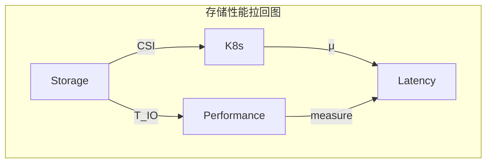

# 一、存储接口的函子化

> **文档版本**：v1.0 **最后更新：2025-11-15 **维护者**：项目团队

---

## 📑 目录

- [一、存储接口的函子化](#一存储接口的函子化)
  - [📑 目录](#-目录)
  - [概述](#概述)
  - [一、存储范畴 S 的定义](#一存储范畴-s-的定义)
    - [1.1 对象（Objects）定义](#11-对象objects定义)
    - [1.2 态射（Morphisms）定义](#12-态射morphisms定义)
    - [1.3 态射复合律](#13-态射复合律)
  - [二、CSI 函子映射](#二csi-函子映射)
    - [2.1 CSI 函子定义](#21-csi-函子定义)
    - [2.2 CSI 操作类型](#22-csi-操作类型)
    - [2.3 CSI 函子的自然性](#23-csi-函子的自然性)
  - [三、存储卷的类型论构造](#三存储卷的类型论构造)
    - [3.1 访问模式的和类型](#31-访问模式的和类型)
    - [3.2 卷模式的和类型](#32-卷模式的和类型)
    - [3.3 依赖类型证明](#33-依赖类型证明)
  - [四、性能范畴的拉回构造](#四性能范畴的拉回构造)
    - [4.1 拉回图定义](#41-拉回图定义)
    - [4.2 测度函子](#42-测度函子)
    - [4.3 性能映射](#43-性能映射)
  - [五、形式化验证](#五形式化验证)
    - [5.1 类型安全性验证](#51-类型安全性验证)
    - [5.2 访问模式验证](#52-访问模式验证)
  - [相关文档](#相关文档)

---

## 概述

本文档从**范畴论**和**类型论**的视角形式化分析虚拟化容器化集群管理中的存储系统，
将存储卷、存储接口、IO 路径等概念抽象为范畴论中的对象、态射、函子等数学结构，建
立严格的数学模型。

**为什么使用范畴论和类型论分析存储系统？**

范畴论和类型论提供了统一的数学框架来描述存储系统的结构和行为：

1. **统一抽象**：将存储卷、存储接口、存储操作等抽象为范畴中的对象和态射，实现统
   一的数学描述
2. **结构保持**：通过函子保持存储操作的结构，确保存储转换的正确性
3. **类型安全**：通过类型论确保存储卷的访问模式和卷模式的类型安全性

**范畴论和类型论在存储系统中的应用**：

- **对象（Objects）**：存储卷、持久化卷、持久化卷声明、存储类、卷快照、卷附加
- **态射（Morphisms）**：存储操作，如创建卷、删除卷、附加卷、分离卷、挂载卷、卸
  载卷、创建快照、恢复快照
- **函子（Functors）**：CSI 驱动，将存储卷映射到 Kubernetes
- **类型（Types）**：访问模式、卷模式的和类型

**核心内容**：

1. **存储范畴 S**：定义存储卷、存储接口、存储操作等为范畴对象和态射
2. **CSI 函子映射**：CSI 驱动作为函子 `CSI: S → K8s`
3. **存储卷的类型论构造**：访问模式、卷模式的和类型
4. **性能范畴的拉回构造**：存储 IO 性能通过拉回函子映射
5. **形式化验证**：类型安全性、访问模式验证

---

## 一、存储范畴 S 的定义

### 1.1 对象（Objects）定义

**存储范畴** **S** 的对象为存储卷：

```haskell
-- 存储卷类型
data Volume = Volume {
    volumeId :: VolumeId,
    capacity :: Capacity,
    accessMode :: AccessMode,
    volumeMode :: VolumeMode
}

-- 存储对象类型
data StorageObject =
    PersistentVolume PVId
  | PersistentVolumeClaim PVCId
  | StorageClass SCId
  | VolumeSnapshot SnapshotId
  | VolumeAttachment AttachmentId
```

**形式化定义**：

```text
Obj(S) = {Volume, PersistentVolume, PersistentVolumeClaim, StorageClass, VolumeSnapshot, VolumeAttachment}
```

其中：

- **Volume**：存储卷，包含卷 ID、容量、访问模式、卷模式
- **PersistentVolume**：持久化卷，集群级别的存储资源
- **PersistentVolumeClaim**：持久化卷声明，用户对存储的请求
- **StorageClass**：存储类，描述存储的"类别"
- **VolumeSnapshot**：卷快照，存储卷的时间点副本
- **VolumeAttachment**：卷附加，将卷附加到节点

**为什么将存储卷定义为范畴对象？**

将存储卷定义为范畴对象有以下优势：

1. **统一抽象**：所有存储实体都在同一个数学结构中，便于统一分析和验证
2. **关系明确**：通过态射，我们可以明确描述存储卷之间的关系
3. **组合性**：通过态射复合，我们可以描述复杂的存储操作

**存储对象的数学性质**：

存储对象具有以下数学性质：

1. **唯一性**：每个存储对象都有唯一的标识符（如 VolumeId、PVId、PVCId 等）
2. **可组合性**：存储对象可以通过态射组合形成复杂的存储操作
3. **可验证性**：存储对象的性质可以通过形式化方法验证

**存储对象的实际应用**：

存储对象在实际应用中有以下用途：

1. **存储管理**：通过存储对象，我们可以管理存储资源
2. **存储操作**：通过存储对象，我们可以执行存储操作
3. **存储验证**：通过存储对象，我们可以验证存储系统的正确性

### 1.2 态射（Morphisms）定义

**态射**：存储操作 `StorageOperation: StorageObject → StorageObject`

```haskell
-- 存储操作态射
data StorageMorphism =
    CreateVolume VolumeSpec -> Volume
  | DeleteVolume VolumeId -> ()
  | AttachVolume (VolumeId, NodeId) -> VolumeAttachment
  | DetachVolume VolumeAttachment -> ()
  | MountVolume (VolumeId, Path) -> MountPoint
  | UnmountVolume MountPoint -> ()
  | CreateSnapshot VolumeId -> VolumeSnapshot
  | RestoreSnapshot VolumeSnapshot -> Volume
```

**态射类型**：

| **态射名称**        | **类型签名**                      | **实现技术** | **范畴论解释** |
| ------------------- | --------------------------------- | ------------ | -------------- |
| **CreateVolume**    | `VolumeSpec → Volume`             | CSI Create   | 创建存储卷     |
| **DeleteVolume**    | `VolumeId → ()`                   | CSI Delete   | 删除存储卷     |
| **AttachVolume**    | `(VolumeId, NodeId) → Attachment` | CSI Attach   | 将卷附加到节点 |
| **DetachVolume**    | `Attachment → ()`                 | CSI Detach   | 从节点分离卷   |
| **MountVolume**     | `(VolumeId, Path) → MountPoint`   | CSI Mount    | 挂载卷到路径   |
| **UnmountVolume**   | `MountPoint → ()`                 | CSI Unmount  | 卸载卷         |
| **CreateSnapshot**  | `VolumeId → Snapshot`             | CSI Snapshot | 创建卷快照     |
| **RestoreSnapshot** | `Snapshot → Volume`               | CSI Restore  | 从快照恢复卷   |

**态射复合律**：

```text
UnmountVolume ∘ MountVolume ∘ AttachVolume: VolumeId → MountPoint
```

**为什么态射复合律重要？**

态射复合律允许我们描述复杂的存储操作，例如：

1. **卷附加路径**：`AttachVolume: (VolumeId, NodeId) → VolumeAttachment`
2. **卷挂载路
   径**：`MountVolume ∘ AttachVolume: (VolumeId, NodeId, Path) → MountPoint`
3. **完整的存储路
   径**：`UnmountVolume ∘ MountVolume ∘ AttachVolume: VolumeId → MountPoint`

**态射复合的数学性质**：

态射复合满足以下数学性质：

1. **结合律**：对于任意态射 `f: A → B`、`g: B → C`、`h: C → D`，有
   `(h ∘ g) ∘ f = h ∘ (g ∘ f)`
2. **单位律**：对于任意对象 `A`，存在单位态射 `id_A: A → A`，使得对于任意态射
   `f: A → B`，有 `f ∘ id_A = f = id_B ∘ f`

**态射复合的实际应用**：

态射复合在实际应用中有以下用途：

1. **存储操作描述**：通过态射复合，我们可以描述复杂的存储操作
2. **存储路径分析**：通过态射复合，我们可以分析存储操作的路径
3. **存储性能优化**：通过态射复合，我们可以优化存储操作的性能

### 1.3 态射复合律

**存储路径的态射复合**：

```haskell
-- 容器存储路径
containerPath :: VolumeId -> NodeId -> Path -> MountPoint
containerPath = unmount ∘ mount ∘ attach ∘ create

-- 虚拟机存储路径
vmPath :: VolumeId -> NodeId -> Path -> MountPoint
vmPath = unmount ∘ mount ∘ stage ∘ attach ∘ create
```

**形式化表示**：

```text
容器存储：CreateVolume ∘ AttachVolume ∘ MountVolume: VolumeSpec → MountPoint
虚拟机存储：CreateVolume ∘ AttachVolume ∘ NodeStage ∘ MountVolume: VolumeSpec → MountPoint
```

**交换律验证**：

```text
∀v ∈ Volume, n ∈ Node:
MountVolume(AttachVolume(CreateVolume(v), n)) = MountPoint
```

---

## 二、CSI 函子映射

### 2.1 CSI 函子定义

**CSI 函子** `CSI: Storage → Kubernetes`：

```haskell
-- CSI 函子类型
data CSIFunctor = CSI {
    createVolume :: VolumeCapability -> IO Volume,
    deleteVolume :: VolumeId -> IO (),
    controllerPublish :: (VolumeId, NodeId) -> IO (),
    controllerUnpublish :: (VolumeId, NodeId) -> IO (),
    nodeStage :: (VolumeId, StagePath) -> IO MountPoint,
    nodeUnstage :: (VolumeId, StagePath) -> IO (),
    nodePublish :: (MountPoint, TargetPath) -> IO (),
    nodeUnpublish :: (MountPoint, TargetPath) -> IO ()
}

-- CSI 函子实例
instance Functor CSI where
    fmap f (CSI create delete attach detach stage unstage mount unmount) =
        CSI (f . create) delete attach detach stage unstage mount unmount
```

**函子映射关系**：

```text
CSI: Storage → Kubernetes
CSI(Volume) = (PV, PVC, Pod)
```

其中：

- **输入对象**：`Storage`（存储卷）
- **输出对象**：`Kubernetes`（K8s 资源）

### 2.2 CSI 操作类型

**CSI 操作类型签名**：

```ocaml
(* CSI接口的类型签名 *)
type CSIOperation =
  | CreateVolume of VolumeCapability -> Volume
  | DeleteVolume of VolumeId -> unit
  | ControllerPublish of (VolumeId, NodeId) -> unit
  | ControllerUnpublish of (VolumeId, NodeId) -> unit
  | NodeStage of (VolumeId, StagePath) -> MountPoint
  | NodeUnstage of (VolumeId, StagePath) -> unit
  | NodePublish of (MountPoint, TargetPath) -> unit
  | NodeUnpublish of (MountPoint, TargetPath) -> unit
```

**容器存储路径**：

```ocaml
(* 容器存储路径 *)
let container_path =
  CSI.NodePublish(vol, "/var/lib/kubelet/pods/...")
```

**虚拟机存储路径**：

```ocaml
(* 虚拟机存储路径 *)
let vm_path =
  CSI.NodeStage(vol, "/var/lib/libvirt/images")
  >> QEMU.Mount(virtio_blk, "/dev/vda")
```

### 2.3 CSI 函子的自然性

**CSI 函子的自然性**：

```text
∀v₁, v₂ ∈ Volume:
CSI(v₁ ∘ v₂) = CSI(v₁) ∘ CSI(v₂)
```

**CSI 函子映射图**：


---

## 三、存储卷的类型论构造

### 3.1 访问模式的和类型

**访问模式的和类型**：

```haskell
-- 访问模式和类型
data AccessMode =
    ReadWriteOnce  -- RWO：单节点读写
  | ReadOnlyMany   -- ROM：多节点只读
  | ReadWriteMany  -- RWM：多节点读写
```

**形式化定义**：

```text
AccessMode = ReadWriteOnce | ReadOnlyMany | ReadWriteMany
```

**类型安全性证明**：

```haskell
-- 依赖类型确保访问安全
mount :: (v: Volume) -> (m: AccessMode) ->
         {p: Path | validMode(v, m)} -> IO ()
```

### 3.2 卷模式的和类型

**卷模式的和类型**：

```haskell
-- 卷模式和类型
data VolumeMode =
    Filesystem  -- 文件系统模式
  | Block       -- 块设备模式
```

**形式化定义**：

```text
VolumeMode = Filesystem | Block
```

**类型安全性证明**：

```coq
(* 存储卷的类型安全性 *)
Inductive VolumeSafe : VolumeMode -> Type :=
| FilesystemSafe : forall fs, mounted fs -> VolumeSafe Filesystem
| BlockSafe : forall dev, exclusiveAccess dev -> VolumeSafe Block

(* 容器卷挂载证明 *)
Theorem container_mount_safe :
  forall vol, VolumeSafe (BlockMode vol) ->
  exists c, containerCanMount c vol.

(* 虚拟机磁盘附加证明 *)
Theorem vm_attach_safe :
  forall vol, VolumeSafe (BlockMode vol) ->
  exists vm, vmCanAttach vm vol.
```

### 3.3 依赖类型证明

**依赖类型签名**：

```haskell
-- 依赖类型确保访问安全
mount :: (v: Volume) -> (m: AccessMode) ->
         {p: Path | validMode(v, m)} -> IO ()
```

**形式化验证**：

```text
∀v ∈ Volume, m ∈ AccessMode:
validMode(v, m) ⇒ ∃p ∈ Path, mount(v, m, p) 成功
```

---

## 四、性能范畴的拉回构造

### 4.1 拉回图定义

**性能范畴的拉回（Pullback）**：存储 IO 性能通过拉回函子
`Pullback(CSI) → Performance` 映射：



**形式化定义**：

```text
           T_IO
S ---------> Perf
|            |
| CSI        | measure
v            v
K8s --------> Latency
           μ
```

其中：

- **S**：存储范畴
- **K8s**：Kubernetes 范畴
- **Perf**：性能范畴
- **Latency**：延迟范畴
- **T_IO**：IO 性能映射函子
- **μ**：测度函子

### 4.2 测度函子

**测度函子** `μ: Performance → Latency`：

```haskell
-- 测度函子类型
data MeasureFunctor = Measure {
    measure :: Performance -> Latency,
    distribution :: Latency -> Distribution
}

-- 测度函子实例
instance Functor Measure where
    fmap f (Measure measure distribution) =
        Measure (f . measure) distribution
```

**形式化定义**：

```text
μ: Performance → Latency
μ(p) = ∫ latency(p) dμ
```

### 4.3 性能映射

**IO 性能映射函子** `T_IO: Storage → Performance`：

```haskell
-- IO 性能映射函子类型
data IOPerformanceFunctor = IOPerf {
    mapIO :: Storage -> Performance,
    measureLatency :: Storage -> Latency
}

-- IO 性能映射函子实例
instance Functor IOPerf where
    fmap f (IOPerf mapIO measureLatency) =
        IOPerf (f . mapIO) (f . measureLatency)
```

**形式化定义**：

```text
T_IO: Storage → Performance
T_IO(s) = (throughput(s), latency(s), iops(s))
```

---

## 五、形式化验证

### 5.1 类型安全性验证

**类型安全性定理**：

```text
∀v ∈ Volume, m ∈ AccessMode:
validMode(v, m) ⇒ mount(v, m) 类型安全
```

**证明**：通过依赖类型系统保证访问模式与卷模式的兼容性。

### 5.2 访问模式验证

**访问模式一致性验证**：

```text
□(∀v ∈ Volume, m ∈ AccessMode:
  mounted(v, m) ⇒ validMode(v, m))
```

保证所有已挂载的卷都满足访问模式约束。

**卷模式一致性验证**：

```text
□(∀v ∈ Volume, mode ∈ VolumeMode:
  attached(v, mode) ⇒ validMode(v, mode))
```

保证所有已附加的卷都满足卷模式约束。

---

## 相关文档

- [存储功能同构矩阵](../02-isomorphic-functions/02-storage-isomorphism.md) - 存
  储功能同构分析
- [存储 IO 优化](../09-performance-optimization/03-storage-io-optimization.md) -
  存储 IO 优化策略
- [存储 IO 路径的形式化验证](./02-storage-io-path.md) - 存储 IO 路径验证
- [动态配额控制的范畴论实现](./03-quota-control-category.md) - 配额控制范畴论
- [存储性能测度空间](./04-storage-performance-measure.md) - 存储性能测度分析

---

**最后更新：2025-11-15 **维护者**：项目团队
