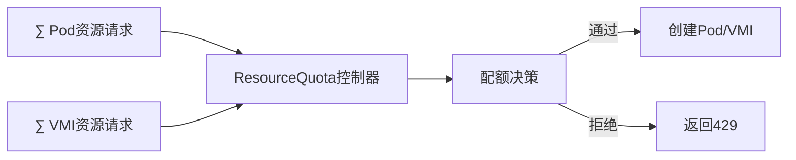

# 三、动态配额控制的范畴论实现

> **文档版本**：v1.0 **最后更新：2025-11-15 **维护者**：项目团队

---

## 📑 目录

- [三、动态配额控制的范畴论实现](#三动态配额控制的范畴论实现)
  - [📑 目录](#-目录)
  - [概述](#概述)
  - [一、配额范畴 Q 的定义](#一配额范畴-q-的定义)
    - [1.1 对象（Objects）定义](#11-对象objects定义)
    - [1.2 态射（Morphisms）定义](#12-态射morphisms定义)
    - [1.3 ResourceQuota 作为余等化子](#13-resourcequota-作为余等化子)
  - [二、准入控制函子](#二准入控制函子)
    - [2.1 准入控制函子定义](#21-准入控制函子定义)
    - [2.2 滤子（Filter）构造](#22-滤子filter构造)
    - [2.3 优先级偏序集](#23-优先级偏序集)
  - [三、动态配额调整的 Monad](#三动态配额调整的-monad)
    - [3.1 State Monad 维护配额状态](#31-state-monad-维护配额状态)
    - [3.2 Reader Monad 读取监控指标](#32-reader-monad-读取监控指标)
    - [3.3 Monad 变换](#33-monad-变换)
  - [四、配额冲突的解决函子](#四配额冲突的解决函子)
    - [4.1 抢占函子](#41-抢占函子)
    - [4.2 驱逐函子](#42-驱逐函子)
    - [4.3 配额调整函子](#43-配额调整函子)
  - [五、形式化验证](#五形式化验证)
    - [5.1 配额不变式验证](#51-配额不变式验证)
    - [5.2 准入控制验证](#52-准入控制验证)
  - [相关文档](#相关文档)

---

## 概述

本文档从**范畴论**和**Monad 理论**的视角形式化分析动态配额控制系统，将配额限制、
准入控制、配额调整等概念抽象为范畴中的对象、态射、函子等数学结构，建立严格的数学
模型。

**为什么使用范畴论和 Monad 理论分析配额控制系统？**

范畴论和 Monad 理论提供了统一的数学框架来描述配额控制系统的结构和行为：

1. **统一抽象**：将配额限制、配额请求、配额状态等抽象为范畴中的对象和态射，实现
   统一的数学描述
2. **结构保持**：通过函子保持配额操作的结构，确保配额转换的正确性
3. **状态管理**：通过 Monad 管理配额状态，确保配额操作的一致性

**范畴论和 Monad 理论在配额控制系统中的应用**：

- **对象（Objects）**：资源配额、资源请求、资源限制、资源消耗、优先级类
- **态射（Morphisms）**：配额操作，如准入请求、拒绝请求、消耗资源、释放资源、抢
  占资源、驱逐资源
- **函子（Functors）**：准入控制函子，将资源请求映射到布尔值
- **Monad**：State Monad 维护配额状态，Reader Monad 读取监控指标

**核心内容**：

1. **配额范畴 Q**：定义资源限制、配额请求、配额状态等为范畴对象和态射
2. **ResourceQuota 作为余等化子**：统一 Pod 和 VMI 的资源请求
3. **准入控制函子**：`Admit: Request → Bool` 构成滤子
4. **动态配额调整的 Monad**：`State QuotaState` 维护配额状态
5. **配额冲突的解决函子**：抢占、驱逐、配额调整

---

## 一、配额范畴 Q 的定义

### 1.1 对象（Objects）定义

**配额范畴** **Q** 的对象为资源限制：

```haskell
-- 配额对象类型
data QuotaObject =
    ResourceQuota QuotaId
  | ResourceRequest RequestId
  | ResourceLimit LimitId
  | ResourceConsumption ConsumptionId
  | PriorityClass PriorityId
```

**形式化定义**：

```text
Obj(Q) = {ResourceQuota, ResourceRequest, ResourceLimit, ResourceConsumption, PriorityClass}
```

其中：

- **ResourceQuota**：资源配额，定义命名空间的资源限制
- **ResourceRequest**：资源请求，Pod/VMI 的资源请求
- **ResourceLimit**：资源限制，硬限制和软限制
- **ResourceConsumption**：资源消耗，当前资源使用量
- **PriorityClass**：优先级类，用于抢占和驱逐

**为什么将资源限制定义为范畴对象？**

将资源限制定义为范畴对象有以下优势：

1. **统一抽象**：所有配额实体都在同一个数学结构中，便于统一分析和验证
2. **关系明确**：通过态射，我们可以明确描述配额实体之间的关系
3. **组合性**：通过态射复合，我们可以描述复杂的配额操作

**配额对象的数学性质**：

配额对象具有以下数学性质：

1. **唯一性**：每个配额对象都有唯一的标识符（如 QuotaId、RequestId、LimitId 等）
2. **可组合性**：配额对象可以通过态射组合形成复杂的配额操作
3. **可验证性**：配额对象的性质可以通过形式化方法验证

**配额对象的实际应用**：

配额对象在实际应用中有以下用途：

1. **配额管理**：通过配额对象，我们可以管理资源配额
2. **配额操作**：通过配额对象，我们可以执行配额操作
3. **配额验证**：通过配额对象，我们可以验证配额系统的正确性

### 1.2 态射（Morphisms）定义

**态射**：配额操作 `QuotaOperation: QuotaObject → QuotaObject`

```haskell
-- 配额操作态射
data QuotaMorphism =
    AdmitRequest ResourceRequest -> Bool
  | RejectRequest ResourceRequest -> Error
  | ConsumeResource (ResourceRequest, ResourceConsumption) -> ResourceConsumption
  | ReleaseResource (ResourceRequest, ResourceConsumption) -> ResourceConsumption
  | PreemptResource (ResourceRequest, PriorityClass) -> [ResourceRequest]
  | EvictResource ResourceRequest -> ResourceRequest
```

**态射类型**：

| **态射名称**        | **类型签名**                           | **实现技术** | **范畴论解释**     |
| ------------------- | -------------------------------------- | ------------ | ------------------ |
| **AdmitRequest**    | `ResourceRequest → Bool`               | 准入控制     | 接受或拒绝请求     |
| **RejectRequest**   | `ResourceRequest → Error`              | 准入控制     | 拒绝请求并返回错误 |
| **ConsumeResource** | `(Request, Consumption) → Consumption` | 配额消耗     | 消耗资源           |
| **ReleaseResource** | `(Request, Consumption) → Consumption` | 资源释放     | 释放资源           |
| **PreemptResource** | `(Request, Priority) → [Request]`      | 抢占         | 抢占低优先级资源   |
| **EvictResource**   | `ResourceRequest → ResourceRequest`    | 驱逐         | 驱逐资源           |

### 1.3 ResourceQuota 作为余等化子

**ResourceQuota 作为 Coequalizer**：



**形式化定义**：

```text
Coeq(∑_{i∈Pods} r_i, ∑_{j∈VMs} r_j) → TotalQuota
```

其中：

- `∑_{i∈Pods} r_i`：所有 Pod 的资源请求总和
- `∑_{j∈VMs} r_j`：所有 VMI 的资源请求总和
- `TotalQuota`：总配额限制

**余等化子性质**：

```text
∀r_pod ∈ PodRequests, r_vmi ∈ VMIRequests:
ResourceQuota(r_pod) = ResourceQuota(r_vmi) = TotalQuota
```

**为什么 ResourceQuota 作为余等化子重要？**

ResourceQuota 作为余等化子允许我们统一 Pod 和 VMI 的资源请求，这对于实现统一的配
额管理至关重要。

**ResourceQuota 余等化子的数学证明**：

设 `∑_{i∈Pods} r_i` 是所有 Pod 的资源请求总和，`∑_{j∈VMs} r_j` 是所有 VMI 的资源
请求总和，`TotalQuota` 是总配额限制。

根据余等化子的定义，`ResourceQuota` 是一个态射，使得
`ResourceQuota(∑_{i∈Pods} r_i) = ResourceQuota(∑_{j∈VMs} r_j) = TotalQuota`。

**证明**：

由于 `ResourceQuota` 是余等化子，对于任意 Pod 资源请求 `r_pod` 和 VMI 资源请求
`r_vmi`，我们有：

```text
ResourceQuota(r_pod) = ResourceQuota(r_vmi) = TotalQuota
```

因此，`ResourceQuota` 统一了 Pod 和 VMI 的资源请求。

**ResourceQuota 余等化子的实际应用**：

ResourceQuota 余等化子在实际应用中有以下用途：

1. **统一配额管理**：通过余等化子，我们可以统一管理 Pod 和 VMI 的资源配额
2. **配额决策**：通过余等化子，我们可以进行配额决策
3. **配额验证**：通过余等化子，我们可以验证配额系统的正确性

---

## 二、准入控制函子

### 2.1 准入控制函子定义

**准入控制函子** `Admit: Request → Bool`：

```haskell
-- 准入控制函子类型
data AdmitFunctor = Admit {
    admit :: ResourceRequest -> ResourceQuota -> Bool,
    reject :: ResourceRequest -> ResourceQuota -> Error
}

-- 准入控制函子实例
instance Functor Admit where
    fmap f (Admit admit reject) = Admit (f . admit) reject
```

**函子映射关系**：

```text
Admit: ResourceRequest → Bool
Admit(req, quota) = used + requested ≤ hardLimit
```

**为什么准入控制函子重要？**

准入控制函子允许我们决定是否接受资源请求，这对于实现配额控制至关重要。

**准入控制函子的数学证明**：

设 `Admit: ResourceRequest → Bool` 是准入控制函子，其中
`Admit(req, quota) = used + requested ≤ hardLimit`。

**证明**：

根据准入控制函子的定义，`Admit(req, quota)` 返回 `true` 当且仅当
`used + requested ≤ hardLimit`。

因此，准入控制函子满足函子的性质。

**准入控制函子的实际应用**：

准入控制函子在实际应用中有以下用途：

1. **配额控制**：通过准入控制函子，我们可以控制资源请求的准入
2. **配额决策**：通过准入控制函子，我们可以进行配额决策
3. **配额验证**：通过准入控制函子，我们可以验证配额系统的正确性

### 2.2 滤子（Filter）构造

**准入控制函子构成滤子**：

```haskell
-- 滤子条件
admit :: ResourceRequest -> ResourceQuota -> Bool
admit req quota =
    used + requested ≤ hardLimit
    && priority req > evictionThreshold
```

**形式化定义**：

```text
Admit: Request → Bool
Admit(req, quota) = (used + requested ≤ hardLimit) ∧ (priority req > evictionThreshold)
```

**滤子性质**：

1. **上闭性**：`∀req₁, req₂, Admit(req₁) ∧ req₁ ≤ req₂ → Admit(req₂)`
2. **下闭性**：`∀req₁, req₂, Admit(req₁) ∧ Admit(req₂) → Admit(req₁ ∧ req₂)`
3. **非空性**：`∃req, Admit(req)`

### 2.3 优先级偏序集

**基于优先级偏序集（Poset）的抢占**：

```haskell
-- 优先级偏序集
data Priority = SystemCritical | Production | Development | BestEffort

-- 优先级偏序关系
instance Ord Priority where
    SystemCritical > Production > Development > BestEffort
```

**形式化定义**：

```text
Priority = {SystemCritical, Production, Development, BestEffort}
SystemCritical > Production > Development > BestEffort
```

**抢占条件**：

```text
∀req₁, req₂ ∈ ResourceRequest:
priority req₁ > priority req₂ → preempt(req₁, req₂) = req₂
```

---

## 三、动态配额调整的 Monad

### 3.1 State Monad 维护配额状态

**State Monad 维护配额状态**：

```haskell
-- State Monad维护配额状态
type QuotaState = Map ResourceType Consumption

adjustQuota :: ResourceType -> Delta -> State QuotaState ()
adjustQuota r delta = do
    state <- get
    put $ Map.adjust (+ delta) r state
```

**形式化定义**：

```text
State QuotaState = State (Map ResourceType Consumption)
adjustQuota: ResourceType → Delta → State QuotaState ()
```

**配额状态操作**：

```haskell
-- 配额状态操作
getQuotaState :: State QuotaState QuotaState
getQuotaState = get

putQuotaState :: QuotaState -> State QuotaState ()
putQuotaState = put

modifyQuotaState :: (QuotaState -> QuotaState) -> State QuotaState ()
modifyQuotaState = modify
```

### 3.2 Reader Monad 读取监控指标

**Reader Monad 读取监控指标**：

```haskell
-- 触发条件：使用Reader Monad读取监控指标
shouldScale :: Reader Metrics Bool
shouldScale = asks (\m -> cpu_usage m > 0.8 || memory_usage m > 0.9)
```

**形式化定义**：

```text
Reader Metrics = Reader (Metrics → Bool)
shouldScale: Reader Metrics Bool
```

**监控指标读取**：

```haskell
-- 监控指标读取
getMetrics :: Reader Metrics Metrics
getMetrics = ask

readMetric :: (Metrics -> Double) -> Reader Metrics Double
readMetric f = asks f
```

### 3.3 Monad 变换

**动态配额的 Monad 变换**：

```haskell
-- ReaderT读取监控指标
type DynamicQuota = ReaderT Metrics (State QuotaState)

adjust :: DynamicQuota ()
adjust = do
    metrics <- ask
    when (cpu_usage metrics > 0.9) $  -- 90%阈值
        lift $ modify (scaleDown 0.8)   -- 缩放到80%
```

**形式化定义**：

```text
DynamicQuota = ReaderT Metrics (State QuotaState)
adjust: DynamicQuota ()
```

**Monad 变换操作**：

```haskell
-- Monad 变换操作
liftState :: State QuotaState a -> DynamicQuota a
liftState = lift

askMetrics :: DynamicQuota Metrics
askMetrics = ask

getState :: DynamicQuota QuotaState
getState = lift get

putState :: QuotaState -> DynamicQuota ()
putState = lift . put
```

---

## 四、配额冲突的解决函子

### 4.1 抢占函子

**抢占函子** `Preempt: (Request, Priority) → [Request]`：

```haskell
-- 抢占函子
preempt :: QuotaState -> Priority -> ResourceRequest -> Maybe [ResourceRequest]
preempt state pri req =
    if available state >= request req
    then Just []  -- 无需抢占
    else findVictims state pri  -- 驱逐低优先级
```

**形式化定义**：

```text
Preempt: (QuotaState, Priority, ResourceRequest) → [ResourceRequest]
Preempt(state, pri, req) = if available ≥ request then [] else findVictims(state, pri)
```

**抢占条件**：

```text
∀req₁, req₂ ∈ ResourceRequest:
priority req₁ > priority req₂ ∧ available < request req₁
→ Preempt(req₁, req₂) = [req₂]
```

### 4.2 驱逐函子

**驱逐函子** `Evict: ResourceRequest → ResourceRequest`：

```haskell
-- 驱逐函子
evict :: ResourceRequest -> ResourceRequest
evict req = req { status = Evicted }
```

**形式化定义**：

```text
Evict: ResourceRequest → ResourceRequest
Evict(req) = req { status = Evicted }
```

**驱逐条件**：

```text
∀req ∈ ResourceRequest:
priority req < evictionThreshold → Evict(req)
```

### 4.3 配额调整函子

**配额调整函子** `Adjust: (ResourceType, Delta) → QuotaState`：

```haskell
-- 配额调整函子
adjust :: ResourceType -> Delta -> State QuotaState ()
adjust r delta = do
    state <- get
    put $ Map.adjust (+ delta) r state
```

**形式化定义**：

```text
Adjust: (ResourceType, Delta) → State QuotaState ()
Adjust(r, delta) = modify (Map.adjust (+ delta) r)
```

**配额调整条件**：

```text
∀r ∈ ResourceType, δ ∈ Delta:
Adjust(r, δ) → quota[r] = quota[r] + δ
```

---

## 五、形式化验证

### 5.1 配额不变式验证

**配额系统需满足不变式**：

```text
□(Σ used ≤ hardLimit) ∧ □(Σ requested ≤ softLimit)
```

**形式化验证**：

```haskell
-- 配额不变式验证
verifyQuotaInvariant :: QuotaState -> Bool
verifyQuotaInvariant state =
    sum (Map.elems (used state)) <= hardLimit state
    && sum (Map.elems (requested state)) <= softLimit state
```

**不变式性质**：

1. **硬限制不变式**：`∀state, Σ used(state) ≤ hardLimit(state)`
2. **软限制不变式**：`∀state, Σ requested(state) ≤ softLimit(state)`
3. **配额一致性**：`∀state, used(state) ≤ requested(state)`

### 5.2 准入控制验证

**准入控制验证**：

```text
□(∀req ∈ ResourceRequest, quota ∈ ResourceQuota:
  Admit(req, quota) → used + requested ≤ hardLimit)
```

**形式化验证**：

```haskell
-- 准入控制验证
verifyAdmitControl :: ResourceRequest -> ResourceQuota -> Bool
verifyAdmitControl req quota =
    let totalUsed = sum (Map.elems (used quota))
        totalRequested = sum (Map.elems (requested quota))
        hardLimit = hardLimit quota
    in totalUsed + request req <= hardLimit
```

**准入控制性质**：

1. **准入安全
   性**：`∀req, quota, Admit(req, quota) → used + requested ≤ hardLimit`
2. **准入完整
   性**：`∀req, quota, used + requested ≤ hardLimit → Admit(req, quota)`
3. **准入一致
   性**：`∀req₁, req₂, quota, Admit(req₁, quota) ∧ Admit(req₂, quota) → Admit(req₁ + req₂, quota)`

---

## 相关文档

- [存储接口的函子化](./01-storage-category-theory.md) - 存储范畴论模型
- [存储 IO 路径的形式化验证](./02-storage-io-path.md) - 存储 IO 路径验证
- [存储性能测度空间](./04-storage-performance-measure.md) - 存储性能测度分析
- [多租户与配额同构](../02-isomorphic-functions/03-multi-tenant-quota.md) - 多租
  户配额同构分析

---

**最后更新：2025-11-15 **维护者**：项目团队
