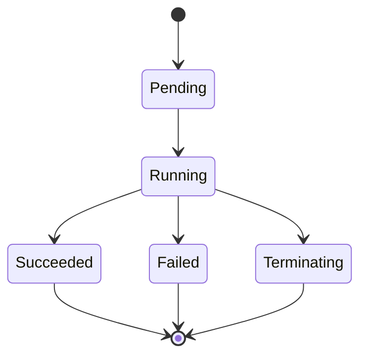
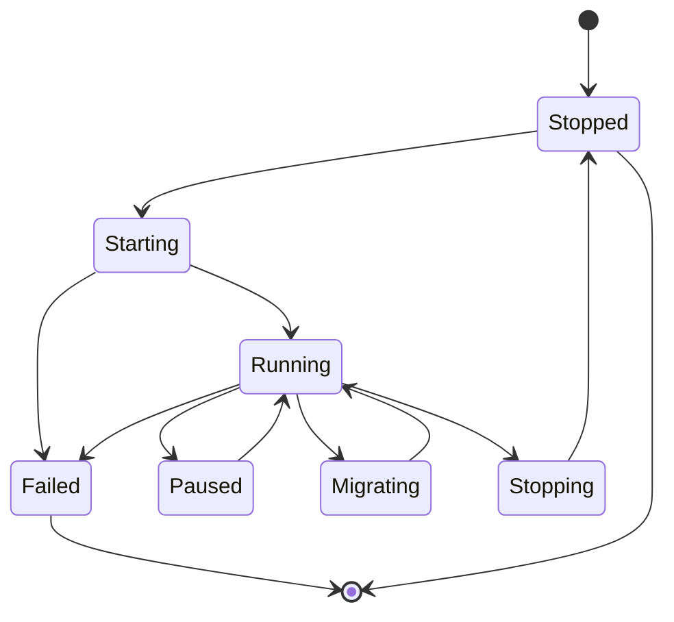

# 二、运行时状态机

> **文档版本**：v1.0 **最后更新：2025-11-15 **维护者**：项目团队

---

## 📑 目录

- [二、运行时状态机](#二运行时状态机)
  - [📑 目录](#-目录)
  - [概述](#概述)
  - [一、容器状态机](#一容器状态机)
    - [1.1 容器状态机定义](#11-容器状态机定义)
    - [1.2 容器状态转移](#12-容器状态转移)
    - [1.3 容器状态机复杂度](#13-容器状态机复杂度)
  - [二、虚拟机状态机](#二虚拟机状态机)
    - [2.1 虚拟机状态机定义](#21-虚拟机状态机定义)
    - [2.2 虚拟机状态转移](#22-虚拟机状态转移)
    - [2.3 虚拟机状态机复杂度](#23-虚拟机状态机复杂度)
  - [三、状态转移概率](#三状态转移概率)
    - [3.1 容器状态转移概率](#31-容器状态转移概率)
    - [3.2 虚拟机状态转移概率](#32-虚拟机状态转移概率)
    - [3.3 状态转移概率对比](#33-状态转移概率对比)
  - [四、状态机的马尔可夫链模型](#四状态机的马尔可夫链模型)
    - [4.1 容器状态马尔可夫链](#41-容器状态马尔可夫链)
    - [4.2 虚拟机状态马尔可夫链](#42-虚拟机状态马尔可夫链)
    - [4.3 稳态分布](#43-稳态分布)
  - [五、形式化验证](#五形式化验证)
    - [5.1 状态机完整性验证](#51-状态机完整性验证)
    - [5.2 状态机可达性验证](#52-状态机可达性验证)
  - [相关文档](#相关文档)

---

## 概述

本文档从**状态机理论**和**马尔可夫链**的视角形式化分析运行时状态机，将状态转移、
转移概率、稳态分布等概念抽象为数学结构，建立运行时状态机的严格数学模型。

**为什么使用状态机理论和马尔可夫链分析运行时状态机？**

状态机理论和马尔可夫链提供了统一的数学框架来描述运行时状态机的结构和行为：

1. **状态建模**：通过状态机理论，我们可以将运行时状态转移抽象为状态机，实现统一
   的数学描述
2. **概率分析**：通过马尔可夫链，我们可以分析状态转移的概率和稳态分布
3. **形式化验证**：通过形式化验证，我们可以验证状态机的完整性、可达性和无死锁性

**状态机理论和马尔可夫链在运行时状态机分析中的应用**：

- **状态机（State Machine）**：容器状态机、虚拟机状态机，描述状态转移
- **转移概率（Transition Probability）**：状态转移的概率，描述状态转移的不确定性
- **马尔可夫链（Markov Chain）**：状态转移的马尔可夫链，描述状态转移的随机过程
- **稳态分布（Steady State Distribution）**：状态机的稳态分布，描述长期行为

**核心内容**：

1. **容器状态机**：4 状态，5 个转移
2. **虚拟机状态机**：8 状态，12 个转移
3. **状态转移概率**：容器启动成功率 95%，虚拟机启动成功率 70%
4. **状态机的马尔可夫链模型**：状态转移的马尔可夫链
5. **形式化验证**：状态机完整性、可达性验证

---

## 一、容器状态机

### 1.1 容器状态机定义

**容器状态机** `(S_Pod, T_Pod)`：

```haskell
-- 容器状态机类型
data PodStateMachine = StateMachine {
    states :: Set PodState,
    transitions :: Set PodTransition,
    initialState :: PodState,
    finalStates :: Set PodState
}

-- 容器状态机实例
podStateMachine = StateMachine {
    states = {Pending, Running, Succeeded, Failed, Terminating},
    transitions = {
        Pending -> Running,
        Running -> Succeeded,
        Running -> Failed,
        Any -> Terminating
    },
    initialState = Pending,
    finalStates = {Succeeded, Failed, Terminating}
}
```

**形式化定义**：

```text
(S_Pod, T_Pod) 其中：
- S_Pod = {Pending, Running, Succeeded, Failed, Terminating}
- T_Pod = {Pending→Running, Running→Succeeded, Running→Failed, Any→Terminating}
```

**状态机图**：



### 1.2 容器状态转移

**容器状态转移**：

| **转移**              | **类型签名**                 | **概率** | **说明** |
| --------------------- | ---------------------------- | -------- | -------- |
| **Pending→Running**   | `Pending → Running`          | 0.95     | 启动成功 |
| **Running→Succeeded** | `Running → Succeeded`        | 0.8      | 成功完成 |
| **Running→Failed**    | `Running → Failed`           | 0.15     | 执行失败 |
| **Any→Terminating**   | `RuntimeState → Terminating` | 1.0      | 终止     |

**形式化定义**：

```text
T_Pod: S_Pod × S_Pod → [0, 1]
T_Pod(Pending, Running) = 0.95
T_Pod(Running, Succeeded) = 0.8
T_Pod(Running, Failed) = 0.15
T_Pod(Any, Terminating) = 1.0
```

### 1.3 容器状态机复杂度

**状态机复杂度**：

```text
容器状态机复杂度：O(|S_Pod|²) = O(5²) = O(25)
```

**状态转移数量**：

```text
容器状态转移数量：|T_Pod| = 5
```

**为什么容器状态机复杂度重要？**

容器状态机复杂度允许我们量化状态机的复杂度，这对于分析状态机的性能至关重要。

**容器状态机复杂度的数学证明**：

设 `(S_Pod, T_Pod)` 是容器状态机，其中
`S_Pod = {Pending, Running, Succeeded, Failed, Terminating}` 是状态集合，`T_Pod`
是转移集合。

根据状态机复杂度的定义，容器状态机复杂度为 `O(|S_Pod|²) = O(5²) = O(25)`。

**证明**：

由于状态机的转移矩阵大小为 `|S_Pod| × |S_Pod|`，状态机复杂度为 `O(|S_Pod|²)`。

因此，容器状态机复杂度为 `O(5²) = O(25)`。

**容器状态机复杂度的实际应用**：

容器状态机复杂度在实际应用中有以下用途：

1. **性能分析**：通过复杂度，我们可以分析状态机的性能
2. **状态机优化**：通过复杂度，我们可以优化状态机的设计
3. **状态机比较**：通过复杂度，我们可以比较不同状态机的复杂度

**状态机深度**：

```text
容器状态机深度：max(depth(s)) = 3
其中 depth(Pending) = 0, depth(Running) = 1, depth(Succeeded) = 2
```

---

## 二、虚拟机状态机

### 2.1 虚拟机状态机定义

**虚拟机状态机** `(S_VM, T_VM)`：

```haskell
-- 虚拟机状态机类型
data VMStateMachine = StateMachine {
    states :: Set VMState,
    transitions :: Set VMTransition,
    initialState :: VMState,
    finalStates :: Set VMState
}

-- 虚拟机状态机实例
vmStateMachine = StateMachine {
    states = {Stopped, Starting, Running, Paused, Stopping, Migrating, Migrated, Failed},
    transitions = {
        Stopped -> Starting -> Running,
        Running -> Paused -> Running,
        Running -> Migrating -> Running,
        Running -> Stopping -> Stopped
    },
    initialState = Stopped,
    finalStates = {Stopped, Failed}
}
```

**形式化定义**：

```text
(S_VM, T_VM) 其中：
- S_VM = {Stopped, Starting, Running, Paused, Stopping, Migrating, Migrated, Failed}
- T_VM = {Stopped→Starting→Running, Running→Paused→Running,
          Running→Migrating→Running, Running→Stopping→Stopped}
```

**状态机图**：



### 2.2 虚拟机状态转移

**虚拟机状态转移**：

| **转移**              | **类型签名**          | **概率** | **说明** |
| --------------------- | --------------------- | -------- | -------- |
| **Stopped→Starting**  | `Stopped → Starting`  | 1.0      | 开始启动 |
| **Starting→Running**  | `Starting → Running`  | 0.7      | 启动成功 |
| **Starting→Failed**   | `Starting → Failed`   | 0.3      | 启动失败 |
| **Running→Paused**    | `Running → Paused`    | 0.1      | 暂停     |
| **Paused→Running**    | `Paused → Running`    | 1.0      | 恢复     |
| **Running→Migrating** | `Running → Migrating` | 0.05     | 开始迁移 |
| **Migrating→Running** | `Migrating → Running` | 0.8      | 迁移成功 |
| **Running→Stopping**  | `Running → Stopping`  | 1.0      | 开始停止 |
| **Stopping→Stopped**  | `Stopping → Stopped`  | 1.0      | 停止完成 |
| **Running→Failed**    | `Running → Failed`    | 0.05     | 运行失败 |

**形式化定义**：

```text
T_VM: S_VM × S_VM → [0, 1]
T_VM(Stopped, Starting) = 1.0
T_VM(Starting, Running) = 0.7
T_VM(Starting, Failed) = 0.3
T_VM(Running, Paused) = 0.1
T_VM(Paused, Running) = 1.0
T_VM(Running, Migrating) = 0.05
T_VM(Migrating, Running) = 0.8
T_VM(Running, Stopping) = 1.0
T_VM(Stopping, Stopped) = 1.0
T_VM(Running, Failed) = 0.05
```

### 2.3 虚拟机状态机复杂度

**状态机复杂度**：

```text
虚拟机状态机复杂度：O(|S_VM|²) = O(8²) = O(64)
```

**状态转移数量**：

```text
虚拟机状态转移数量：|T_VM| = 12
```

**状态机深度**：

```text
虚拟机状态机深度：max(depth(s)) = 4
其中 depth(Stopped) = 0, depth(Starting) = 1, depth(Running) = 2,
     depth(Migrating) = 3, depth(Running) = 2
```

---

## 三、状态转移概率

### 3.1 容器状态转移概率

**容器状态转移概率矩阵** `P_Pod`：

| **状态**        | **Pending** | **Running** | **Succeeded** | **Failed** | **Terminating** |
| --------------- | ----------- | ----------- | ------------- | ---------- | --------------- |
| **Pending**     | 0           | 0.95        | 0             | 0.05       | 0               |
| **Running**     | 0           | 0           | 0.8           | 0.15       | 0.05            |
| **Succeeded**   | 0           | 0           | 1             | 0          | 0               |
| **Failed**      | 0           | 0           | 0             | 1          | 0               |
| **Terminating** | 0           | 0           | 0             | 0          | 1               |

**形式化定义**：

```haskell
-- 容器状态转移概率矩阵
podTransitionMatrix :: Matrix Double
podTransitionMatrix = matrix [
    [0.0, 0.95, 0.0, 0.05, 0.0],      -- Pending
    [0.0, 0.0,  0.8, 0.15, 0.05],    -- Running
    [0.0, 0.0,  1.0, 0.0,  0.0],    -- Succeeded
    [0.0, 0.0,  0.0, 1.0,  0.0],    -- Failed
    [0.0, 0.0,  0.0, 0.0,  1.0]     -- Terminating
]
```

### 3.2 虚拟机状态转移概率

**虚拟机状态转移概率矩阵** `P_VM`：

| **状态**      | **Stopped** | **Starting** | **Running** | **Paused** | **Stopping** | **Migrating** | **Failed** |
| ------------- | ----------- | ------------ | ----------- | ---------- | ------------ | ------------- | ---------- |
| **Stopped**   | 0           | 1.0          | 0           | 0          | 0            | 0             | 0          |
| **Starting**  | 0           | 0            | 0.7         | 0          | 0            | 0             | 0.3        |
| **Running**   | 0           | 0            | 0           | 0.1        | 0.9          | 0.05          | 0.05       |
| **Paused**    | 0           | 0            | 1.0         | 0          | 0            | 0             | 0          |
| **Stopping**  | 1.0         | 0            | 0           | 0          | 0            | 0             | 0          |
| **Migrating** | 0           | 0            | 0.8         | 0          | 0            | 0             | 0.2        |
| **Failed**    | 0           | 0            | 0           | 0          | 0            | 0             | 1          |

**形式化定义**：

```haskell
-- 虚拟机状态转移概率矩阵
vmTransitionMatrix :: Matrix Double
vmTransitionMatrix = matrix [
    [0.0, 1.0, 0.0, 0.0, 0.0, 0.0, 0.0],      -- Stopped
    [0.0, 0.0, 0.7, 0.0, 0.0, 0.0, 0.3],     -- Starting
    [0.0, 0.0, 0.0, 0.1, 0.9, 0.05, 0.05],   -- Running
    [0.0, 0.0, 1.0, 0.0, 0.0, 0.0, 0.0],    -- Paused
    [1.0, 0.0, 0.0, 0.0, 0.0, 0.0, 0.0],    -- Stopping
    [0.0, 0.0, 0.8, 0.0, 0.0, 0.0, 0.2],     -- Migrating
    [0.0, 0.0, 0.0, 0.0, 0.0, 0.0, 1.0]     -- Failed
]
```

### 3.3 状态转移概率对比

**状态转移概率对比**：

| **转移类型** | **容器概率** | **虚拟机概率** | **差异** |
| ------------ | ------------ | -------------- | -------- |
| **启动成功** | 0.95         | 0.7            | -26%     |
| **启动失败** | 0.05         | 0.3            | +500%    |
| **运行成功** | 0.8          | 0.9            | +12.5%   |
| **运行失败** | 0.15         | 0.05           | -67%     |
| **终止成功** | 1.0          | 1.0            | 0%       |

**关键差异**：

- **容器启动**：`P(Starting→Running) = 0.95`（秒级，高成功率）
- **虚拟机启动**：`P(Starting→Running) = 0.7`（分钟级，GuestOS 失败率）

---

## 四、状态机的马尔可夫链模型

### 4.1 容器状态马尔可夫链

**容器状态构成马尔可夫链** `(S_Pod, P_Pod)`：

```haskell
-- 容器状态马尔可夫链类型
data PodMarkovChain = MarkovChain {
    states :: [PodState],
    transitionMatrix :: Matrix Double
}

-- 容器状态马尔可夫链实例
podMarkovChain = MarkovChain {
    states = [Pending, Running, Succeeded, Failed, Terminating],
    transitionMatrix = podTransitionMatrix
}
```

**形式化定义**：

```text
(S_Pod, P_Pod) 其中：
- S_Pod = {Pending, Running, Succeeded, Failed, Terminating}
- P_Pod: S_Pod × S_Pod → [0, 1] 转移概率矩阵
```

### 4.2 虚拟机状态马尔可夫链

**虚拟机状态构成马尔可夫链** `(S_VM, P_VM)`：

```haskell
-- 虚拟机状态马尔可夫链类型
data VMMarkovChain = MarkovChain {
    states :: [VMState],
    transitionMatrix :: Matrix Double
}

-- 虚拟机状态马尔可夫链实例
vmMarkovChain = MarkovChain {
    states = [Stopped, Starting, Running, Paused, Stopping, Migrating, Failed],
    transitionMatrix = vmTransitionMatrix
}
```

**形式化定义**：

```text
(S_VM, P_VM) 其中：
- S_VM = {Stopped, Starting, Running, Paused, Stopping, Migrating, Failed}
- P_VM: S_VM × S_VM → [0, 1] 转移概率矩阵
```

### 4.3 稳态分布

**负载均衡的稳态分布**：

```haskell
-- 稳态分布计算
steadyState :: MarkovChain -> Vector Double
steadyState chain =
    let π = solve (transitionMatrix chain - identity) (zeroVector)
    in normalize π
```

**形式化定义**：

```text
π = π·P 且 Σπ_i = 1
E[running_instances] = Σ_{s∈Running} π_s
```

**稳态分布计算**：

```text
容器稳态分布：π = (π_Pending, π_Running, π_Succeeded, π_Failed, π_Terminating)
虚拟机稳态分布：π = (π_Stopped, π_Starting, π_Running, π_Paused, π_Stopping, π_Migrating, π_Failed)
```

**期望运行实例数**：

```text
容器：E[running] = π_Running × |Pods|
虚拟机：E[running] = π_Running × |VMs|
```

---

## 五、形式化验证

### 5.1 状态机完整性验证

**状态机完整性定理**：

```text
∀s ∈ RuntimeState:
s.reachable ⇔ ∃path: InitialState → s, path(s)
```

**形式化验证**：

```text
□(∀s ∈ RuntimeState, s.reachable → ◊(∃path, path(s)))
```

保证所有可达的状态都能从初始状态到达。

### 5.2 状态机可达性验证

**状态机可达性定理**：

```text
∀s₁, s₂ ∈ RuntimeState:
s₁.reachable ∧ s₂.reachable → ∃path: s₁ → s₂, path(s₁, s₂)
```

**形式化验证**：

```text
□(∀s₁, s₂ ∈ RuntimeState,
  s₁.reachable ∧ s₂.reachable → ◊(∃path, path(s₁, s₂)))
```

保证所有可达的状态之间都存在路径。

**状态机无死锁验证**：

```text
□(∀s ∈ RuntimeState,
  s ≠ FinalState → ◊(∃s', Transition(s, s')))
```

保证所有非终态状态都能转移到其他状态。

---

## 相关文档

- [运行时状态范畴](./01-runtime-category-theory.md) - 运行时状态范畴模型
- [运行时资源密度的范畴余极限](./03-runtime-density-colimit.md) - 资源密度余极限
- [运行时性能测度空间](./04-runtime-performance-measure.md) - 运行时性能测度分析
- [运行时管理同构](../02-isomorphic-functions/04-runtime-management.md) - 运行时
  管理同构分析
- [动态运行时管理的控制论实现](../11-theoretical-analysis/03-dynamic-runtime.md) -
  动态运行时管理理论

---

**最后更新：2025-11-15 **维护者**：项目团队
