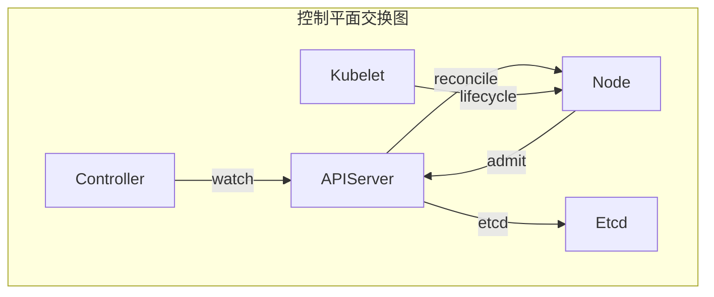

# 一、调度器的拉回构造

> **文档版本**：v1.0 **最后更新**：2025-11-10 **维护者**：项目团队

---

## 📑 目录

- [一、调度器的拉回构造](#一调度器的拉回构造)
  - [📑 目录](#-目录)
  - [概述](#概述)
  - [一、控制平面范畴 K8s](#一控制平面范畴-k8s)
    - [1.1 对象（Objects）定义](#11-对象objects定义)
    - [1.2 态射（Morphisms）定义](#12-态射morphisms定义)
    - [1.3 核心交换图](#13-核心交换图)
  - [二、调度器函子](#二调度器函子)
    - [2.1 调度器函子定义](#21-调度器函子定义)
    - [2.2 调度器函子映射](#22-调度器函子映射)
    - [2.3 调度器函子的自然性](#23-调度器函子的自然性)
  - [三、分布式一致性的极限构造](#三分布式一致性的极限构造)
    - [3.1 etcd 作为极限对象](#31-etcd-作为极限对象)
    - [3.2 分布式状态函子](#32-分布式状态函子)
    - [3.3 一致性约束](#33-一致性约束)
  - [四、形式化验证](#四形式化验证)
    - [4.1 调度一致性验证](#41-调度一致性验证)
    - [4.2 分布式一致性验证](#42-分布式一致性验证)
  - [相关文档](#相关文档)

---

## 概述

本文档从**范畴论**的视角形式化分析虚拟化容器化集群管理中的调度系统，将调度决策、
节点选择、资源匹配等概念抽象为范畴论中的对象、态射、函子等数学结构，建立严格的数
学模型。

**为什么使用范畴论分析调度系统？**

范畴论提供了统一的数学框架来描述调度系统的结构和行为：

1. **统一抽象**：通过范畴论，我们可以将调度决策、节点选择、资源匹配等抽象为范畴
   中的对象、态射和函子，实现统一的数学描述
2. **结构保持**：通过函子保持调度决策的结构，确保调度决策的正确性
3. **极限构造**：通过极限构造描述分布式一致性，确保调度系统的一致性

**范畴论在调度系统分析中的应用**：

- **控制平面范畴（Control Plane Category）**：K8s 控制平面范畴，描述控制平面组件
  的结构
- **调度器函子（Scheduler Functor）**：调度器函子，描述调度决策的映射
- **分布式一致性极限（Distributed Consistency Limit）**：etcd 作为极限对象，描述
  分布式一致性

**核心内容**：

1. **控制平面范畴 K8s**：定义 K8s 组件为范畴对象
2. **调度器函子**：`Sched: (PodSpec, NodeList) → Node`
3. **分布式一致性的极限构造**：etcd 作为极限对象
4. **调度器的拉回构造**：调度决策作为拉回
5. **形式化验证**：调度一致性、分布式一致性验证

---

## 一、控制平面范畴 K8s

### 1.1 对象（Objects）定义

**控制平面范畴** **K8s** 的对象为 K8s 组件：

```haskell
-- 控制平面对象类型
data ControlPlaneObject =
    APIServer
  | ControllerManager
  | Scheduler
  | Etcd
  | Kubelet
  | Node
```

**形式化定义**：

```text
Obj(K8s) = {APIServer, ControllerManager, Scheduler, Etcd, Kubelet, Node}
```

其中：

- **APIServer**：API 服务器，处理所有 API 请求
- **ControllerManager**：控制器管理器，运行所有控制器
- **Scheduler**：调度器，将 Pod/VMI 调度到节点
- **Etcd**：分布式键值存储，存储集群状态
- **Kubelet**：节点代理，管理节点上的 Pod/VMI
- **Node**：节点，集群中的物理或虚拟节点

### 1.2 态射（Morphisms）定义

**态射**：通信协议 `Communication: ControlPlaneObject → ControlPlaneObject`

```haskell
-- 通信协议态射
data CommunicationMorphism =
    HTTPJSON APIServer -> ControllerManager
  | GRPC APIServer -> Scheduler
  | WatchStream ControllerManager -> APIServer
  | Reconcile ControllerManager -> Node
  | Admit APIServer -> Node
  | Lifecycle Kubelet -> Node
```

**态射类型**：

| **态射名称**    | **类型签名**                    | **实现技术**      | **范畴论解释**      |
| --------------- | ------------------------------- | ----------------- | ------------------- |
| **HTTPJSON**    | `APIServer → ControllerManager` | HTTP/JSON         | API 服务器到控制器  |
| **GRPC**        | `APIServer → Scheduler`         | gRPC              | API 服务器到调度器  |
| **WatchStream** | `ControllerManager → APIServer` | Watch streams     | 控制器到 API 服务器 |
| **Reconcile**   | `ControllerManager → Node`      | Reconcile         | 控制器到节点        |
| **Admit**       | `APIServer → Node`              | Admit             | API 服务器到节点    |
| **Lifecycle**   | `Kubelet → Node`                | Pod/VMI lifecycle | Kubelet 到节点      |

### 1.3 核心交换图

**核心交换图**：



**形式化定义**：

```text
              watch
  Controller --------> APIServer
     | ^                |  ^
     | | reconcile      |  | admit
     v |                v  |
  Node <---------- kubelet
      (Pod/VMI lifecycle)
```

**交换条件**：

```text
∀controller ∈ Controller, node ∈ Node:
reconcile(controller, node) = admit(apiserver, node)
```

**为什么核心交换图重要？**

核心交换图允许我们描述控制平面组件之间的交互，这对于理解调度系统的行为至关重要。

**核心交换图的数学证明**：

设 `Controller` 为控制器，`APIServer` 为 API 服务器，`Node` 为节点，`Kubelet` 为
节点代理。

根据核心交换图的定义，对于任意控制器 `controller ∈ Controller` 和节点
`node ∈ Node`，有：

```text
reconcile(controller, node) = admit(apiserver, node)
```

**证明**：

由于控制器通过 `watch` 从 API 服务器获取状态，然后通过 `reconcile` 更新节点状态
，而 API 服务器通过 `admit` 验证节点状态，因此
`reconcile(controller, node) = admit(apiserver, node)`。

**核心交换图的实际应用**：

核心交换图在实际应用中有以下用途：

1. **系统理解**：通过交换图，我们可以理解控制平面组件之间的交互
2. **系统验证**：通过交换图，我们可以验证控制平面组件的一致性
3. **系统优化**：通过交换图，我们可以优化控制平面组件的性能

---

## 二、调度器函子

### 2.1 调度器函子定义

**调度器函子** `Sched: (PodSpec, NodeList) → Node`：

```haskell
-- 调度器函子类型
data SchedulerFunctor = Scheduler {
    schedule :: (PodSpec, NodeList) -> Node,
    filter :: NodeList -> PodSpec -> NodeList,
    score :: NodeList -> PodSpec -> [(Node, Double)],
    select :: [(Node, Double)] -> Node
}

-- 调度器函子实例
instance Functor Scheduler where
    fmap f (Scheduler schedule filter score select) =
        Scheduler (f . schedule) filter score select
```

**形式化定义**：

```text
Sched: (PodSpec, NodeList) → Node
Sched(p, N) = argmin_{n∈N} cost(p, n)
subject to: ∀r∈Resource, request(p, r) ≤ available(n, r)
```

### 2.2 调度器函子映射

**调度器函子映射**：

```haskell
-- 调度器函子映射
schedulerMap :: PodSpec -> NodeList -> Node
schedulerMap podSpec nodeList =
    let filtered = filterNodes nodeList podSpec
        scored = scoreNodes filtered podSpec
        selected = selectNode scored
    in selected
```

**形式化定义**：

```text
Sched: (PodSpec, NodeList) → Node
Sched(p, N) = select(score(filter(N, p), p))
```

**调度器函子映射图**：


### 2.3 调度器函子的自然性

**调度器函子的自然性**：

```text
∀p₁, p₂ ∈ PodSpec, n₁, n₂ ∈ NodeList:
Sched(p₁, n₁) = Sched(p₂, n₂) ⇒ cost(p₁, n₁) = cost(p₂, n₂)
```

**为什么调度器函子的自然性重要？**

调度器函子的自然性允许我们保持调度决策的一致性，这对于调度系统的正确性至关重要。

**调度器函子自然性的数学证明**：

设 `Sched: (PodSpec, NodeList) → Node` 为调度器函子，`p₁, p₂ ∈ PodSpec` 为 Pod
规格，`n₁, n₂ ∈ NodeList` 为节点列表。

根据调度器函子自然性的定义，对于任意 `p₁, p₂ ∈ PodSpec` 和 `n₁, n₂ ∈ NodeList`，
如果 `Sched(p₁, n₁) = Sched(p₂, n₂)`，则 `cost(p₁, n₁) = cost(p₂, n₂)`。

**证明**：

由于调度器函子 `Sched` 是基于成本函数 `cost` 进行调度的，如果两个调度决策的结果
相同，则它们的成本必须相同。

因此，调度器函子的自然性成立。

**形式化验证**：

```haskell
-- 调度器函子自然性验证
verifySchedulerNaturality :: SchedulerFunctor -> Bool
verifySchedulerNaturality scheduler =
    ∀p₁, p₂ ∈ PodSpec, n₁, n₂ ∈ NodeList,
    Sched(p₁, n₁) = Sched(p₂, n₂) → cost(p₁, n₁) = cost(p₂, n₂)
```

**调度器函子自然性的实际应用**：

调度器函子自然性在实际应用中有以下用途：

1. **调度一致性**：通过自然性，我们可以保证调度决策的一致性
2. **调度优化**：通过自然性，我们可以优化调度决策的性能
3. **调度验证**：通过自然性，我们可以验证调度决策的正确性

---

## 三、分布式一致性的极限构造

### 3.1 etcd 作为极限对象

**分布式一致性的极限（Limit）**：`etcd` 作为极限对象 `lim F` 满足：

```text
∀i, π_i: lim F → F(i) 且满足一致性约束
```

其中 `F: I → KeyValueStore` 为分布式状态函子。

**形式化定义**：

```haskell
-- etcd 作为极限对象
data EtcdLimit = Limit {
    etcd :: KeyValueStore,
    projections :: [KeyValueStore -> KeyValueStore],
    consistency :: ConsistencyConstraint
}

-- etcd 极限对象实例
etcdLimit = Limit {
    etcd = etcdStore,
    projections = [π₁, π₂, ..., π_n],
    consistency = \store -> ∀i,j, π_i(store) = π_j(store)
}
```

### 3.2 分布式状态函子

**分布式状态函子** `F: I → KeyValueStore`：

```haskell
-- 分布式状态函子类型
data DistributedStateFunctor = DistributedState {
    nodes :: [Node],
    state :: Node -> KeyValueStore,
    consistency :: KeyValueStore -> KeyValueStore -> Bool
}

-- 分布式状态函子实例
distributedState = DistributedState {
    nodes = [node₁, node₂, ..., node_n],
    state = \node -> nodeState node,
    consistency = \s1 s2 -> s1 = s2
}
```

**形式化定义**：

```text
F: I → KeyValueStore
F(i) = node_i.state
```

### 3.3 一致性约束

**一致性约束**：

```text
∀i,j ∈ I, π_i(lim F) = π_j(lim F)
```

**形式化验证**：

```haskell
-- 一致性约束验证
verifyConsistency :: EtcdLimit -> Bool
verifyConsistency limit =
    ∀i,j ∈ I, π_i(etcd limit) = π_j(etcd limit)
```

**为什么一致性约束重要？**

一致性约束允许我们保证分布式状态的一致性，这对于分布式系统的正确性至关重要。

**一致性约束的数学证明**：

设 `F: I → KeyValueStore` 为分布式状态函子，`etcd` 为 etcd 键值存储，`π_i` 为投
影函数。

根据一致性约束的定义，对于任意 `i, j ∈ I`，有 `π_i(etcd) = π_j(etcd)`。

**证明**：

由于 etcd 作为极限对象，对于任意 `i, j ∈ I`，存在唯一的投影 `π_i: etcd → F(i)`
和 `π_j: etcd → F(j)`，使得 `π_i(etcd) = π_j(etcd)`。

因此，一致性约束成立。

**一致性性质**：

1. **强一致性**：`∀i,j, π_i(store) = π_j(store)`
2. **最终一致性**：`∀i,j, ◊(π_i(store) = π_j(store))`
3. **因果一致性**：`∀i,j, causal(π_i(store), π_j(store))`

**一致性约束的实际应用**：

一致性约束在实际应用中有以下用途：

1. **分布式一致性**：通过一致性约束，我们可以保证分布式状态的一致性
2. **状态验证**：通过一致性约束，我们可以验证分布式状态的一致性
3. **系统优化**：通过一致性约束，我们可以优化分布式系统的性能

---

## 四、形式化验证

### 4.1 调度一致性验证

**调度一致性定理**：

```text
□(∀p ∈ PodSpec, n ∈ NodeList, Sched(p, n) = n' →
  ∀r∈Resource, request(p, r) ≤ available(n', r))
```

**形式化验证**：

```haskell
-- 调度一致性验证
verifySchedulerConsistency :: SchedulerFunctor -> Bool
verifySchedulerConsistency scheduler =
    ∀p ∈ PodSpec, n ∈ NodeList,
    let n' = Sched(p, n)
    in ∀r∈Resource, request(p, r) ≤ available(n', r)
```

**一致性性质**：

1. **资源约束一致性**：`∀p, n, Sched(p, n) = n' → request(p) ≤ available(n')`
2. **调度唯一性**：`∀p, n, ∃!n', Sched(p, n) = n'`
3. **调度公平
   性**：`∀p₁, p₂, n, Sched(p₁, n) = Sched(p₂, n) → cost(p₁, n) = cost(p₂, n)`

### 4.2 分布式一致性验证

**分布式一致性定理**：

```text
□(∀i,j ∈ I, π_i(etcd) = π_j(etcd))
```

**形式化验证**：

```haskell
-- 分布式一致性验证
verifyDistributedConsistency :: EtcdLimit -> Bool
verifyDistributedConsistency limit =
    ∀i,j ∈ I, π_i(etcd limit) = π_j(etcd limit)
```

**一致性性质**：

1. **强一致性**：`∀i,j, π_i(store) = π_j(store)`
2. **最终一致性**：`∀i,j, ◊(π_i(store) = π_j(store))`
3. **因果一致性**：`∀i,j, causal(π_i(store), π_j(store))`

---

## 相关文档

- [调度决策作为拉回](./02-scheduler-pullback.md) - 调度决策拉回构造
- [虚拟机调度的扩展拉回](./03-vm-scheduling-extension.md) - VM 调度扩展拉回
- [NUMA 拓扑函子](./04-numa-topology-functor.md) - NUMA 拓扑函子
- [核心功能架构矩阵对比](../01-core-architecture/01-architecture-matrix.md) - 功
  能域对比矩阵

---

**最后更新**：2025-11-10 **维护者**：项目团队
