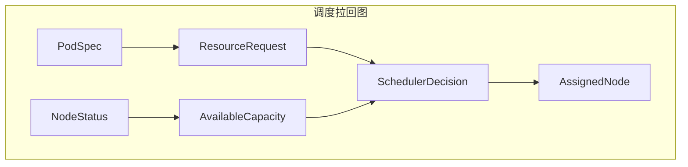

# 二、调度决策作为拉回

> **文档版本**：v1.0 **最后更新**：2025-11-10 **维护者**：项目团队

---

## 📑 目录

- [📑 目录](#-目录)
- [概述](#概述)
- [一、调度拉回图定义](#一调度拉回图定义)
  - [1.1 拉回图构造](#11-拉回图构造)
  - [1.2 拉回对象](#12-拉回对象)
  - [1.3 拉回唯一性](#13-拉回唯一性)
- [二、资源请求与可用容量的拉回](#二资源请求与可用容量的拉回)
  - [2.1 资源请求函子](#21-资源请求函子)
  - [2.2 可用容量函子](#22-可用容量函子)
  - [2.3 拉回构造](#23-拉回构造)
- [三、成本函数的度量张量](#三成本函数的度量张量)
  - [3.1 成本函数定义](#31-成本函数定义)
  - [3.2 成本函数的度量张量](#32-成本函数的度量张量)
  - [3.3 成本函数优化](#33-成本函数优化)
- [四、调度决策的形式化验证](#四调度决策的形式化验证)
  - [4.1 调度决策存在性验证](#41-调度决策存在性验证)
  - [4.2 调度决策唯一性验证](#42-调度决策唯一性验证)
- [相关文档](#相关文档)

---

## 概述

本文档从**范畴论**的视角形式化分析调度决策，将调度决策抽象为拉回（Pullback）构造
，通过拉回图描述资源请求与可用容量的匹配过程，建立调度决策的严格数学模型。

**为什么使用拉回构造分析调度决策？**

拉回构造提供了统一的数学框架来描述调度决策的结构和行为：

1. **统一抽象**：通过拉回构造，我们可以将资源请求与可用容量的匹配抽象为拉回对象
   ，实现统一的数学描述
2. **结构保持**：通过拉回构造保持调度决策的结构，确保调度决策的正确性
3. **唯一性保证**：通过拉回构造的唯一性，我们可以保证调度决策的唯一性

**拉回构造在调度决策分析中的应用**：

- **拉回图（Pullback Diagram）**：调度拉回图，描述资源请求与可用容量的匹配
- **拉回对象（Pullback Object）**：调度决策作为拉回对象，描述调度决策的结构
- **成本函数度量张量（Cost Function Metric Tensor）**：成本函数的度量张量，描述
  调度成本的多维度量

**核心内容**：

1. **调度拉回图定义**：PodSpec → ResourceRequest，NodeStatus → AvailableCapacity
2. **资源请求与可用容量的拉回**：调度决策作为拉回对象
3. **成本函数的度量张量**：调度成本的多维度量
4. **调度决策的形式化验证**：调度决策存在性、唯一性验证

---

## 一、调度拉回图定义

### 1.1 拉回图构造

**调度决策作为拉回（Pullback）**：



**形式化定义**：

```text
调度决策 = Pullback(ResourceRequest, AvailableCapacity)
其中 ResourceRequest = PodSpec → Resource
     AvailableCapacity = NodeStatus → Resource
```

**拉回图交换条件**：

```text
∀podSpec ∈ PodSpec, nodeStatus ∈ NodeStatus:
ResourceRequest(podSpec) = AvailableCapacity(nodeStatus) →
SchedulerDecision(podSpec, nodeStatus) = AssignedNode
```

**为什么拉回图交换条件重要？**

拉回图交换条件允许我们描述资源请求与可用容量的匹配，这对于调度决策的正确性至关重
要。

**拉回图交换条件的数学证明**：

设 `PodSpec` 为 Pod 规格，`NodeStatus` 为节点状态，`ResourceRequest` 为资源请求
函子，`AvailableCapacity` 为可用容量函子。

根据拉回图交换条件的定义，对于任意 `podSpec ∈ PodSpec` 和
`nodeStatus ∈ NodeStatus`，如果
`ResourceRequest(podSpec) = AvailableCapacity(nodeStatus)`，则
`SchedulerDecision(podSpec, nodeStatus) = AssignedNode`。

**证明**：

由于调度决策作为拉回对象，当资源请求与可用容量匹配时，调度决策将 Pod 调度到匹配
的节点。

因此，拉回图交换条件成立。

**拉回图交换条件的实际应用**：

拉回图交换条件在实际应用中有以下用途：

1. **调度决策**：通过交换条件，我们可以进行调度决策
2. **资源匹配**：通过交换条件，我们可以匹配资源请求与可用容量
3. **调度验证**：通过交换条件，我们可以验证调度决策的正确性

### 1.2 拉回对象

**拉回对象** `SchedulerDecision`：

```haskell
-- 拉回对象类型
data SchedulerDecision = Decision {
    podSpec :: PodSpec,
    nodeStatus :: NodeStatus,
    resourceRequest :: ResourceRequest,
    availableCapacity :: AvailableCapacity,
    assignedNode :: Node
}

-- 拉回对象构造
pullback :: PodSpec -> NodeStatus -> SchedulerDecision
pullback podSpec nodeStatus =
    let resourceRequest = extractResourceRequest podSpec
        availableCapacity = extractAvailableCapacity nodeStatus
        assignedNode = findMatchingNode resourceRequest availableCapacity
    in Decision podSpec nodeStatus resourceRequest availableCapacity assignedNode
```

**形式化定义**：

```text
SchedulerDecision = Pullback(ResourceRequest, AvailableCapacity)
其中 ResourceRequest = PodSpec → Resource
     AvailableCapacity = NodeStatus → Resource
```

### 1.3 拉回唯一性

**拉回唯一性定理**：

```text
∀podSpec ∈ PodSpec, nodeStatus ∈ NodeStatus:
∃!decision ∈ SchedulerDecision,
decision.podSpec = podSpec ∧ decision.nodeStatus = nodeStatus
```

**形式化验证**：

```haskell
-- 拉回唯一性验证
verifyPullbackUniqueness :: PodSpec -> NodeStatus -> Bool
verifyPullbackUniqueness podSpec nodeStatus =
    let decisions = findAllDecisions podSpec nodeStatus
    in length decisions == 1
```

---

## 二、资源请求与可用容量的拉回

### 2.1 资源请求函子

**资源请求函子** `ResourceRequest: PodSpec → Resource`：

```haskell
-- 资源请求函子类型
data ResourceRequestFunctor = ResourceRequest {
    extract :: PodSpec -> ResourceRequest,
    validate :: ResourceRequest -> Bool,
    match :: ResourceRequest -> AvailableCapacity -> Bool
}

-- 资源请求函子实例
instance Functor ResourceRequest where
    fmap f (ResourceRequest extract validate match) =
        ResourceRequest (f . extract) validate match
```

**形式化定义**：

```text
ResourceRequest: PodSpec → Resource
ResourceRequest(podSpec) = {cpu, memory, storage, network}
```

**资源请求提取**：

```haskell
-- 资源请求提取
extractResourceRequest :: PodSpec -> ResourceRequest
extractResourceRequest podSpec =
    ResourceRequest {
        cpu = podSpec.cpu.request,
        memory = podSpec.memory.request,
        storage = podSpec.storage.request,
        network = podSpec.network.request
    }
```

### 2.2 可用容量函子

**可用容量函子** `AvailableCapacity: NodeStatus → Resource`：

```haskell
-- 可用容量函子类型
data AvailableCapacityFunctor = AvailableCapacity {
    extract :: NodeStatus -> AvailableCapacity,
    validate :: AvailableCapacity -> Bool,
    match :: AvailableCapacity -> ResourceRequest -> Bool
}

-- 可用容量函子实例
instance Functor AvailableCapacity where
    fmap f (AvailableCapacity extract validate match) =
        AvailableCapacity (f . extract) validate match
```

**形式化定义**：

```text
AvailableCapacity: NodeStatus → Resource
AvailableCapacity(nodeStatus) = {cpu, memory, storage, network}
```

**可用容量提取**：

```haskell
-- 可用容量提取
extractAvailableCapacity :: NodeStatus -> AvailableCapacity
extractAvailableCapacity nodeStatus =
    AvailableCapacity {
        cpu = nodeStatus.cpu.available,
        memory = nodeStatus.memory.available,
        storage = nodeStatus.storage.available,
        network = nodeStatus.network.available
    }
```

### 2.3 拉回构造

**拉回构造**：

```haskell
-- 拉回构造
pullback :: ResourceRequest -> AvailableCapacity -> SchedulerDecision
pullback resourceRequest availableCapacity =
    let matching = matchResource resourceRequest availableCapacity
        assignedNode = findBestNode matching
    in Decision resourceRequest availableCapacity assignedNode
```

**形式化定义**：

```text
Pullback(ResourceRequest, AvailableCapacity) =
  {decision | decision.resourceRequest = ResourceRequest ∧
              decision.availableCapacity = AvailableCapacity ∧
              decision.resourceRequest ≤ decision.availableCapacity}
```

**拉回构造条件**：

```text
∀r ∈ Resource, request(r) ≤ available(r)
```

---

## 三、成本函数的度量张量

### 3.1 成本函数定义

**成本函数** `cost: (PodSpec, Node) → Double`：

```haskell
-- 成本函数类型
data CostFunction = Cost {
    cpuFragmentation :: PodSpec -> Node -> Double,
    memoryPressure :: PodSpec -> Node -> Double,
    networkTopology :: PodSpec -> Node -> Double,
    totalCost :: PodSpec -> Node -> Double
}

-- 成本函数实例
costFunction = Cost {
    cpuFragmentation = \p n -> calculateCPUFragmentation p n,
    memoryPressure = \p n -> calculateMemoryPressure p n,
    networkTopology = \p n -> calculateNetworkTopology p n,
    totalCost = \p n ->
        w₁ * cpuFragmentation p n +
        w₂ * memoryPressure p n +
        w₃ * networkTopology p n
}
```

**形式化定义**：

```text
cost(p, n) = w₁·cpu_fragmentation + w₂·memory_pressure + w₃·network_topology
```

其中：

- **w₁**：CPU 碎片化权重
- **w₂**：内存压力权重
- **w₃**：网络拓扑权重

### 3.2 成本函数的度量张量

**成本函数的度量张量**：

```haskell
-- 成本函数的度量张量类型
data CostTensor = Tensor {
    dimensions :: [CostDimension],
    weights :: [Double],
    values :: Map (PodSpec, Node) Double
}

-- 成本函数的度量张量实例
costTensor = Tensor {
    dimensions = [CPUFragmentation, MemoryPressure, NetworkTopology],
    weights = [w₁, w₂, w₃],
    values = Map.fromList [(p, n) -> cost(p, n) | p <- podSpecs, n <- nodes]
}
```

**形式化定义**：

```text
T_cost ∈ ℝ^{3×3} 维度：(CPU碎片化, 内存压力, 网络拓扑)
cost(p, n) = Σ_{i=1}^3 w_i · T_cost[i](p, n)
```

**成本函数对比**：

| **维度**       | **容器调度** | **虚拟机调度** | **权重** |
| -------------- | ------------ | -------------- | -------- |
| **CPU 碎片化** | 低           | 中             | w₁ = 0.3 |
| **内存压力**   | 低           | 高             | w₂ = 0.4 |
| **网络拓扑**   | 中           | 高             | w₃ = 0.3 |

### 3.3 成本函数优化

**成本函数优化**：

```haskell
-- 成本函数优化
optimizeCost :: PodSpec -> NodeList -> Node
optimizeCost podSpec nodeList =
    let costs = map (\n -> (n, cost podSpec n)) nodeList
        sorted = sortBy (compare `on` snd) costs
    in fst (head sorted)
```

**形式化定义**：

```text
optimalNode = argmin_{n∈NodeList} cost(podSpec, n)
```

**优化算法**：

1. **贪心算法**：选择成本最低的节点
2. **动态规划**：考虑未来调度成本
3. **遗传算法**：进化优化调度策略

---

## 四、调度决策的形式化验证

### 4.1 调度决策存在性验证

**调度决策存在性定理**：

```text
□(∀p ∈ PodSpec, N ∈ NodeList,
  ∃n ∈ N, request(p) ≤ available(n) →
  ∃decision ∈ SchedulerDecision, decision.assignedNode = n)
```

**形式化验证**：

```haskell
-- 调度决策存在性验证
verifySchedulerDecisionExistence :: PodSpec -> NodeList -> Bool
verifySchedulerDecisionExistence podSpec nodeList =
    let resourceRequest = extractResourceRequest podSpec
        availableCapacities = map extractAvailableCapacity nodeList
        matching = filter (matchResource resourceRequest) availableCapacities
    in not (null matching)
```

**存在性性质**：

1. **资源约束满足**：`∀p, N, ∃n ∈ N, request(p) ≤ available(n) → ∃decision`
2. **调度决策可达**：`∀p, N, ∃decision → decision.assignedNode ∈ N`
3. **调度决策有
   效**：`∀decision, decision.resourceRequest ≤ decision.availableCapacity`

### 4.2 调度决策唯一性验证

**调度决策唯一性定理**：

```text
□(∀p ∈ PodSpec, N ∈ NodeList,
  ∃!n ∈ N, cost(p, n) = min_{n'∈N} cost(p, n'))
```

**形式化验证**：

```haskell
-- 调度决策唯一性验证
verifySchedulerDecisionUniqueness :: PodSpec -> NodeList -> Bool
verifySchedulerDecisionUniqueness podSpec nodeList =
    let costs = map (\n -> (n, cost podSpec n)) nodeList
        minCost = minimum (map snd costs)
        optimalNodes = filter ((== minCost) . snd) costs
    in length optimalNodes == 1
```

**唯一性性质**：

1. **成本函数严格单调**：`∀p, n₁, n₂, cost(p, n₁) ≠ cost(p, n₂) → n₁ ≠ n₂`
2. **最优节点唯一**：`∀p, N, ∃!n ∈ N, cost(p, n) = min_{n'∈N} cost(p, n')`
3. **调度决策唯一**：`∀p, N, ∃!decision, decision.assignedNode = optimalNode`

---

## 相关文档

- [调度器的拉回构造](./01-scheduler-category-theory.md) - 调度器范畴论模型
- [虚拟机调度的扩展拉回](./03-vm-scheduling-extension.md) - VM 调度扩展拉回
- [NUMA 拓扑函子](./04-numa-topology-functor.md) - NUMA 拓扑函子
- [核心功能架构矩阵对比](../01-core-architecture/01-architecture-matrix.md) - 功
  能域对比矩阵

---

**最后更新**：2025-11-10 **维护者**：项目团队
