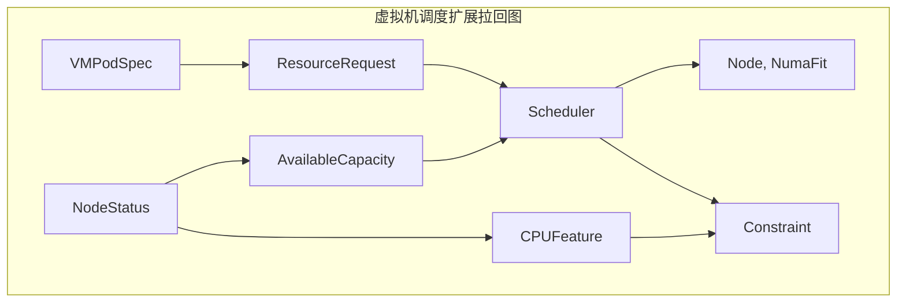
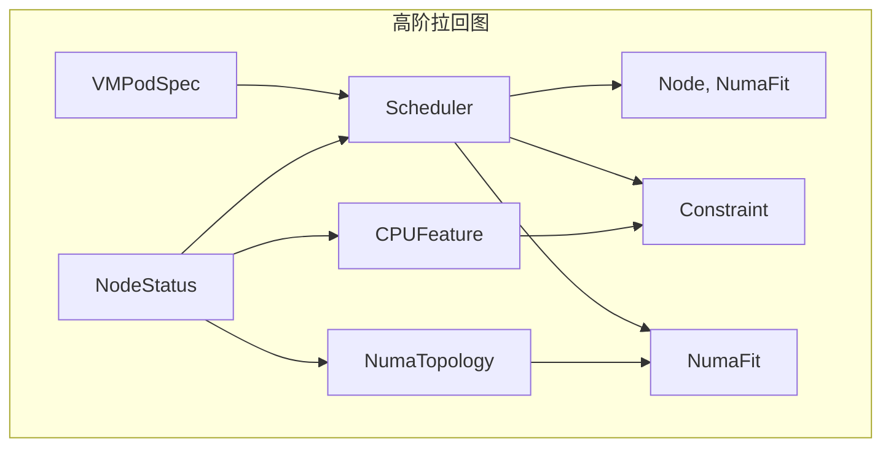

# 三、虚拟机调度的扩展拉回

> **文档版本**：v1.0 **最后更新：2025-11-15 **维护者**：项目团队

---

## 📑 目录

- [三、虚拟机调度的扩展拉回](#三虚拟机调度的扩展拉回)
  - [📑 目录](#-目录)
  - [概述](#概述)
  - [一、虚拟机调度的扩展拉回构造](#一虚拟机调度的扩展拉回构造)
    - [1.1 扩展拉回图定义](#11-扩展拉回图定义)
    - [1.2 CPU 特性函子](#12-cpu-特性函子)
    - [1.3 NUMA 拓扑函子](#13-numa-拓扑函子)
  - [二、高阶拉回构造](#二高阶拉回构造)
    - [2.1 高阶拉回图定义](#21-高阶拉回图定义)
    - [2.2 拉回复合律](#22-拉回复合律)
    - [2.3 拉回唯一性](#23-拉回唯一性)
  - [三、最优节点的极限构造](#三最优节点的极限构造)
    - [3.1 极限对象定义](#31-极限对象定义)
    - [3.2 极限对象存在性](#32-极限对象存在性)
    - [3.3 极限对象唯一性](#33-极限对象唯一性)
  - [四、形式化验证](#四形式化验证)
    - [4.1 扩展拉回交换性验证](#41-扩展拉回交换性验证)
    - [4.2 最优节点存在性验证](#42-最优节点存在性验证)
  - [相关文档](#相关文档)

---

## 概述

本文档从**范畴论**的视角形式化分析虚拟机调度的扩展拉回构造，将 CPU 特性、NUMA 拓
扑等额外约束抽象为函子，通过高阶拉回构造描述虚拟机调度的复杂匹配过程，建立虚拟机
调度的严格数学模型。

**为什么使用扩展拉回构造分析虚拟机调度？**

扩展拉回构造提供了统一的数学框架来描述虚拟机调度的结构和行为：

1. **统一抽象**：通过扩展拉回构造，我们可以将 CPU 特性、NUMA 拓扑等额外约束抽象
   为函子，实现统一的数学描述
2. **结构保持**：通过扩展拉回构造保持虚拟机调度的结构，确保虚拟机调度的正确性
3. **约束满足**：通过扩展拉回构造，我们可以满足 CPU 特性和 NUMA 拓扑等额外约束

**扩展拉回构造在虚拟机调度分析中的应用**：

- **扩展拉回图（Extended Pullback Diagram）**：虚拟机调度扩展拉回图，描述 CPU 特
  性和 NUMA 拓扑的约束
- **CPU 特性函子（CPU Feature Functor）**：CPU 特性函子，描述 CPU 特性的映射
- **NUMA 拓扑函子（NUMA Topology Functor）**：NUMA 拓扑函子，描述 NUMA 拓扑的映
  射

**核心内容**：

1. **虚拟机调度的扩展拉回构造**：CPU 特性函子、NUMA 拓扑函子
2. **高阶拉回构造**：拉回复合律、拉回唯一性
3. **最优节点的极限构造**：极限对象存在性、唯一性
4. **形式化验证**：扩展拉回交换性、最优节点存在性验证

---

## 一、虚拟机调度的扩展拉回构造

### 1.1 扩展拉回图定义

**虚拟机调度的扩展拉回**：VM 调度需额外考虑 **CPU 特性函子**
`CPUFeature: Node → {VT-x, SR-IOV}` 和 **NUMA 拓扑函子**
`Numa: Node → TopologyGraph`，构成**高阶拉回**：



**形式化定义**：

```text
          VMPodSpec
               |
               v
NodeStatus --> Scheduler ---→ (Node, NumaFit)
   |               |
   v               v
CPUFeature ----> Constraint
```

### 1.2 CPU 特性函子

**CPU 特性函子** `CPUFeature: Node → {VT-x, SR-IOV}`：

```haskell
-- CPU 特性函子类型
data CPUFeatureFunctor = CPUFeature {
    extract :: Node -> CPUFeatureSet,
    validate :: CPUFeatureSet -> VMSpec -> Bool,
    match :: CPUFeatureSet -> VMSpec -> Bool
}

-- CPU 特性函子实例
instance Functor CPUFeature where
    fmap f (CPUFeature extract validate match) =
        CPUFeature (f . extract) validate match
```

**形式化定义**：

```text
CPUFeature: Node → {VT-x, SR-IOV}
CPUFeature(node) = {VT-x, SR-IOV, ...}
```

**CPU 特性提取**：

```haskell
-- CPU 特性提取
extractCPUFeature :: Node -> CPUFeatureSet
extractCPUFeature node =
    CPUFeatureSet {
        vtx = hasVTX node,
        sriov = hasSRIOV node,
        numa = hasNUMA node
    }
```

### 1.3 NUMA 拓扑函子

**NUMA 拓扑函子** `Numa: Node → TopologyGraph`：

```haskell
-- NUMA 拓扑函子类型
data NumaTopologyFunctor = NumaTopology {
    extract :: Node -> NumaGraph,
    validate :: NumaGraph -> VMSpec -> Bool,
    match :: NumaGraph -> VMSpec -> Bool
}

-- NUMA 拓扑函子实例
instance Functor NumaTopology where
    fmap f (NumaTopology extract validate match) =
        NumaTopology (f . extract) validate match
```

**形式化定义**：

```text
Numa: Node → TopologyGraph
Numa(node) = {NUMA_0, NUMA_1, ..., NUMA_n}
```

**NUMA 拓扑提取**：

```haskell
-- NUMA 拓扑提取
extractNumaTopology :: Node -> NumaGraph
extractNumaTopology node =
    NumaGraph {
        nodes = numaNodes node,
        distances = numaDistances node,
        topology = numaTopology node
    }
```

---

## 二、高阶拉回构造

### 2.1 高阶拉回图定义

**高阶拉回图**：



**形式化定义**：

```text
VMPodSpec → Scheduler → (Node, NumaFit)
   |            |
   v            v
CPUFeature → Constraint
   |            |
   v            v
NumaTopology → NumaFit
```

### 2.2 拉回复合律

**拉回复合律**：

```text
Pullback(CPUFeature, Constraint) ∘ Pullback(NumaTopology, NumaFit) =
  Pullback(CPUFeature ∘ NumaTopology, Constraint ∘ NumaFit)
```

**形式化定义**：

```haskell
-- 拉回复合律
pullbackComposition :: CPUFeature -> NumaTopology -> Constraint -> NumaFit -> SchedulerDecision
pullbackComposition cpuFeature numaTopology constraint numaFit =
    let cpuConstraint = pullback cpuFeature constraint
        numaFit = pullback numaTopology numaFit
        schedulerDecision = pullback cpuConstraint numaFit
    in schedulerDecision
```

### 2.3 拉回唯一性

**拉回唯一性定理**：

```text
∀vmSpec ∈ VMPodSpec, nodeStatus ∈ NodeStatus:
∃!decision ∈ SchedulerDecision,
decision.vmSpec = vmSpec ∧ decision.nodeStatus = nodeStatus ∧
decision.cpuFeature = CPUFeature(nodeStatus) ∧
decision.numaTopology = NumaTopology(nodeStatus)
```

**形式化验证**：

```haskell
-- 拉回唯一性验证
verifyPullbackUniqueness :: VMPodSpec -> NodeStatus -> Bool
verifyPullbackUniqueness vmSpec nodeStatus =
    let cpuFeature = extractCPUFeature nodeStatus
        numaTopology = extractNumaTopology nodeStatus
        decisions = findAllDecisions vmSpec nodeStatus cpuFeature numaTopology
    in length decisions == 1
```

---

## 三、最优节点的极限构造

### 3.1 极限对象定义

**定理**：存在唯一的极限对象 `OptimalNode` 使得下图交换：

```text
VMPodSpec → Scheduler → Node
   |            |          |
   v            v          v
CPUFeature → Constraint → Bool
```

**形式化定义**：

```haskell
-- 极限对象类型
data OptimalNode = Optimal {
    node :: Node,
    cpuFeature :: CPUFeatureSet,
    numaTopology :: NumaGraph,
    constraint :: Constraint,
    numaFit :: NumaFit
}

-- 极限对象构造
optimalNode :: VMPodSpec -> NodeStatus -> OptimalNode
optimalNode vmSpec nodeStatus =
    let cpuFeature = extractCPUFeature nodeStatus
        numaTopology = extractNumaTopology nodeStatus
        constraint = validateConstraint cpuFeature vmSpec
        numaFit = validateNumaFit numaTopology vmSpec
        node = findOptimalNode vmSpec nodeStatus cpuFeature numaTopology
    in Optimal node cpuFeature numaTopology constraint numaFit
```

### 3.2 极限对象存在性

**极限对象存在性定理**：

```text
□(∀vmSpec ∈ VMPodSpec, nodeStatus ∈ NodeStatus,
  ∃optimalNode ∈ OptimalNode,
  optimalNode.vmSpec = vmSpec ∧ optimalNode.nodeStatus = nodeStatus)
```

**形式化验证**：

```haskell
-- 极限对象存在性验证
verifyOptimalNodeExistence :: VMPodSpec -> NodeStatus -> Bool
verifyOptimalNodeExistence vmSpec nodeStatus =
    let cpuFeature = extractCPUFeature nodeStatus
        numaTopology = extractNumaTopology nodeStatus
        constraint = validateConstraint cpuFeature vmSpec
        numaFit = validateNumaFit numaTopology vmSpec
        optimalNodes = findOptimalNodes vmSpec nodeStatus cpuFeature numaTopology
    in not (null optimalNodes)
```

### 3.3 极限对象唯一性

**极限对象唯一性定理**：

```text
□(∀vmSpec ∈ VMPodSpec, nodeStatus ∈ NodeStatus,
  ∃!optimalNode ∈ OptimalNode,
  optimalNode.vmSpec = vmSpec ∧ optimalNode.nodeStatus = nodeStatus)
```

**形式化验证**：

```haskell
-- 极限对象唯一性验证
verifyOptimalNodeUniqueness :: VMPodSpec -> NodeStatus -> Bool
verifyOptimalNodeUniqueness vmSpec nodeStatus =
    let cpuFeature = extractCPUFeature nodeStatus
        numaTopology = extractNumaTopology nodeStatus
        constraint = validateConstraint cpuFeature vmSpec
        numaFit = validateNumaFit numaTopology vmSpec
        optimalNodes = findOptimalNodes vmSpec nodeStatus cpuFeature numaTopology
    in length optimalNodes == 1
```

---

## 四、形式化验证

### 4.1 扩展拉回交换性验证

**扩展拉回交换性定理**：

```text
□(∀vmSpec ∈ VMPodSpec, nodeStatus ∈ NodeStatus,
  Scheduler(vmSpec, nodeStatus) = OptimalNode →
  CPUFeature(nodeStatus) = Constraint(vmSpec) ∧
  NumaTopology(nodeStatus) = NumaFit(vmSpec))
```

**形式化验证**：

```haskell
-- 扩展拉回交换性验证
verifyExtendedPullbackCommutativity :: VMPodSpec -> NodeStatus -> Bool
verifyExtendedPullbackCommutativity vmSpec nodeStatus =
    let schedulerDecision = Scheduler(vmSpec, nodeStatus)
        cpuFeature = extractCPUFeature nodeStatus
        numaTopology = extractNumaTopology nodeStatus
        constraint = validateConstraint cpuFeature vmSpec
        numaFit = validateNumaFit numaTopology vmSpec
    in cpuFeature == constraint && numaTopology == numaFit
```

### 4.2 最优节点存在性验证

**最优节点存在性定理**：

```text
□(∀vmSpec ∈ VMPodSpec, nodeStatus ∈ NodeStatus,
  ∃optimalNode ∈ OptimalNode,
  optimalNode.cost = min_{n∈NodeList} cost(vmSpec, n))
```

**形式化验证**：

```haskell
-- 最优节点存在性验证
verifyOptimalNodeExistence :: VMPodSpec -> NodeList -> Bool
verifyOptimalNodeExistence vmSpec nodeList =
    let costs = map (\n -> (n, cost vmSpec n)) nodeList
        minCost = minimum (map snd costs)
        optimalNodes = filter ((== minCost) . snd) costs
    in not (null optimalNodes)
```

---

## 相关文档

- [调度器的拉回构造](./01-scheduler-category-theory.md) - 调度器范畴论模型
- [调度决策作为拉回](./02-scheduler-pullback.md) - 调度决策拉回构造
- [NUMA 拓扑函子](./04-numa-topology-functor.md) - NUMA 拓扑函子
- [核心功能架构矩阵对比](../01-core-architecture/01-architecture-matrix.md) - 功
  能域对比矩阵

---

**最后更新：2025-11-15 **维护者**：项目团队
