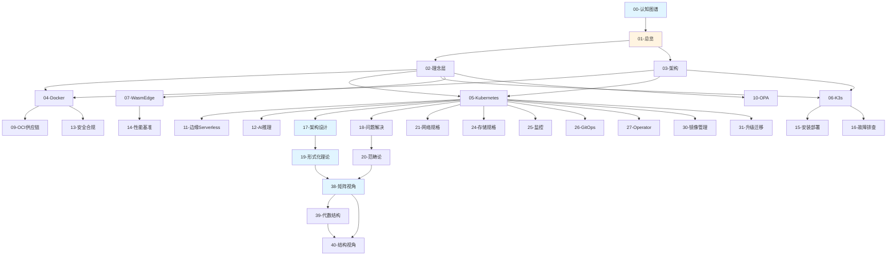

# 文档索引

## 📑 目录

- [文档索引](#文档索引)
  - [📑 目录](#-目录)
  - [📋 完整文档列表](#-完整文档列表)
  - [📚 按编号索引](#-按编号索引)
  - [📂 按分类索引](#-按分类索引)
    - [导航类（2 个）](#导航类2-个)
    - [理念类（1 个）](#理念类1-个)
    - [架构类（7 个）](#架构类7-个)
    - [技术类（6 个）](#技术类6-个)
    - [安全类（2 个）](#安全类2-个)
    - [场景类（2 个）](#场景类2-个)
    - [实践类（5 个）](#实践类5-个)
    - [设计类（2 个）](#设计类2-个)
    - [理论类（5 个）](#理论类5-个)
    - [规格类（9 个）](#规格类9-个)
    - [参考类（5 个）](#参考类5-个)
  - [🗺️ 文档关系图](#️-文档关系图)
  - [📖 按使用场景索引](#-按使用场景索引)
    - [快速入门](#快速入门)
    - [技术学习](#技术学习)
      - [容器技术](#容器技术)
      - [运行时技术](#运行时技术)
      - [策略管理](#策略管理)
    - [实践应用](#实践应用)
      - [安装部署](#安装部署)
      - [性能优化](#性能优化)
      - [安全合规](#安全合规)
    - [架构设计](#架构设计)
    - [技术规格](#技术规格)
      - [网络](#网络)
      - [存储](#存储)
      - [监控](#监控)
      - [交付](#交付)
      - [扩展](#扩展)
      - [运维](#运维)
    - [理论分析](#理论分析)
    - [参考查询](#参考查询)
  - [🎯 按角色索引](#-按角色索引)
    - [架构师](#架构师)
    - [开发者](#开发者)
    - [运维工程师](#运维工程师)
    - [DevOps 工程师](#devops-工程师)
  - [📊 文档统计](#-文档统计)
  - [🔗 快速链接](#-快速链接)

---

## 📋 完整文档列表

本文档提供所有文档的完整索引，按文档编号、分类和用途组织。

## 📚 按编号索引

| 编号 | 文档名称            | 路径                                                                                                                    | 核心内容                                     | 分类 |
| ---- | ------------------- | ----------------------------------------------------------------------------------------------------------------------- | -------------------------------------------- | ---- |
| 00   | 认知图谱            | [00-knowledge-map](COGNITIVE/01-core-foundations/knowledge-map/knowledge-map.md)                                        | 知识地图和学习路径                           | 导航 |
| 01   | 总览                | [01-overview](COGNITIVE/01-core-foundations/overview/overview.md)                                                       | 技术栈定位和决策树                           | 导航 |
| 02   | 理念层              | [02-principles](COGNITIVE/01-core-foundations/principles/principles.md)                                                 | 云原生核心理念                               | 理念 |
| 03   | 架构与对象模型      | [03-architecture](COGNITIVE/02-architecture-design/architecture/architecture.md)                                        | 系统架构设计                                 | 架构 |
| 04   | Docker              | [00-docker](TECHNICAL/01-core-foundations/docker/docker.md)                                                             | Docker 技术规范                              | 技术 |
| 05   | Kubernetes          | [01-kubernetes](TECHNICAL/01-core-foundations/kubernetes/kubernetes.md)                                                 | K8s 架构与实践                               | 技术 |
| 06   | K3s                 | [02-k3s](TECHNICAL/01-core-foundations/k3s/k3s.md)                                                                      | K3s 轻量级架构                               | 技术 |
| 07   | WasmEdge            | [03-wasm-edge](TECHNICAL/02-runtime-policy/wasm-edge/wasmedge.md)                                                       | WasmEdge 集成指南                            | 技术 |
| 08   | 编排运行时          | [04-orchestration-runtime](TECHNICAL/02-runtime-policy/orchestration-runtime/orchestration-runtime.md)                  | CRI 与 RuntimeClass                          | 技术 |
| 09   | OCI 供应链          | [05-oci-supply-chain](TECHNICAL/02-runtime-policy/oci-supply-chain/oci-supply-chain.md)                                 | OCI 与供应链安全                             | 安全 |
| 10   | OPA 策略即代码      | [06-policy-opa](TECHNICAL/02-runtime-policy/policy-opa/policy-opa.md)                                                   | OPA 策略即代码                               | 技术 |
| 11   | 边缘 Serverless     | [07-edge-serverless](TECHNICAL/03-application-scenarios/edge-serverless/edge-serverless.md)                             | 边缘与 Serverless                            | 场景 |
| 12   | AI 推理             | [08-ai-inference](TECHNICAL/03-application-scenarios/ai-inference/ai-inference.md)                                      | AI 推理应用                                  | 场景 |
| 13   | 安全合规            | [09-security-compliance](TECHNICAL/07-security-compliance/security-compliance/security-compliance.md)                   | 安全与合规最佳实践                           | 安全 |
| 14   | 性能基准            | [04-benchmarks](COGNITIVE/05-decision-analysis/benchmarks/benchmarks.md)                                                | 性能基线                                     | 实践 |
| 15   | 安装部署            | [10-installation](TECHNICAL/05-devops/installation/installation.md)                                                     | 安装和最小示例                               | 实践 |
| 16   | 故障排查            | [11-troubleshooting](TECHNICAL/05-devops/troubleshooting/troubleshooting.md)                                            | 故障排查                                     | 实践 |
| 17   | 全局架构设计        | [17-architecture-design](COGNITIVE/02-architecture-design/architecture-design/architecture-design.md)                   | 技术组合和架构决策                           | 设计 |
| 18   | 问题解决方案        | [18-problem-solution-matrix](COGNITIVE/02-architecture-design/problem-solution-matrix/problem-solution-matrix.md)       | 技术问题分类和解决                           | 设计 |
| 19   | 形式化理论          | [19-formal-theory](COGNITIVE/03-theoretical-perspectives/formal-theory/formal-theory.md)                                | 结构同构和关系等价                           | 理论 |
| 20   | 范畴论视角          | [20-category-theory](COGNITIVE/03-theoretical-perspectives/category-theory/category-theory.md)                          | 对象、态射与函子                             | 理论 |
| 21   | 网络技术规格堆栈    | [21-network-stack](TECHNICAL/04-infrastructure-stack/network-stack/network-stack.md)                                    | CNI、Service、Ingress 技术规范               | 规格 |
| 22   | 缩写词汇表          | [22-acronyms-glossary](TECHNICAL/10-reference-trends/acronyms-glossary/acronyms-glossary.md)                            | 所有缩写词定义与关系                         | 参考 |
| 23   | 主题清单            | [23-theme-inventory](TECHNICAL/10-reference-trends/theme-inventory/theme-inventory.md)                                  | 全面梳理所有主题与子主题                     | 参考 |
| 24   | 存储技术规格堆栈    | [24-storage-stack](TECHNICAL/04-infrastructure-stack/storage-stack/storage-stack.md)                                    | CSI、PV/PVC、存储类型规格                    | 规格 |
| 25   | 监控与可观测性      | [25-observability](TECHNICAL/04-infrastructure-stack/observability/observability.md)                                    | Metrics、Logging、Tracing 技术规范           | 规格 |
| 26   | GitOps 和持续交付   | [26-gitops-cicd](TECHNICAL/05-devops/gitops-cicd/gitops-cicd.md)                                                        | GitOps/CI/CD 技术规范                        | 规格 |
| 27   | Operator 和 CRD     | [27-operator-crd](TECHNICAL/05-devops/operator-crd/operator-crd.md)                                                     | Operator/CRD 开发规范                        | 规格 |
| 28   | 架构框架            | [28-architecture-framework](TECHNICAL/08-architecture-analysis/architecture-framework/architecture-framework.md)        | 多维度架构体系与技术规范                     | 架构 |
| 29   | 服务网格            | [29-service-mesh](TECHNICAL/06-advanced-features/service-mesh/service-mesh.md)                                          | 服务网格技术规范（可选）                     | 规格 |
| 30   | 多集群管理          | [30-multi-cluster](TECHNICAL/06-advanced-features/multi-cluster/multi-cluster.md)                                       | 多集群管理技术规范（可选）                   | 规格 |
| 31   | 镜像仓库和镜像管理  | [31-image-registry](TECHNICAL/06-advanced-features/image-registry/image-registry.md)                                    | 镜像仓库与管理技术规范                       | 规格 |
| 32   | 升级和迁移          | [32-upgrade-migration](TECHNICAL/05-devops/upgrade-migration/upgrade-migration.md)                                      | 升级和迁移技术规范                           | 规格 |
| 33   | 开发和调试工具      | [33-dev-tools](TECHNICAL/05-devops/dev-tools/dev-tools.md)                                                              | 开发和调试工具规范                           | 实践 |
| 34   | 成本优化            | [34-cost-optimization](TECHNICAL/09-optimization-practices/cost-optimization/cost-optimization.md)                      | 成本优化技术规范（可选）                     | 实践 |
| 35   | 社区生态和最佳实践  | [35-community-best-practices](TECHNICAL/09-optimization-practices/community-best-practices/community-best-practices.md) | 社区生态和最佳实践（可选）                   | 参考 |
| 36   | 文档体系分析与改进  | [36-analysis-improvement](TECHNICAL/09-optimization-practices/analysis-improvement/analysis-improvement.md)             | 批判性分析和改进计划                         | 参考 |
| 37   | 2025 年技术趋势汇总 | [37-2025-trends](TECHNICAL/10-reference-trends/2025-trends/2025-trends.md)                                              | 2025 年最新技术趋势和版本信息                | 参考 |
| 38   | 矩阵视角            | [38-matrix-perspective](COGNITIVE/03-theoretical-perspectives/matrix-perspective/README.md)                             | 云原生技术栈的矩阵力学                       | 理论 |
| 39   | 代数结构视角        | [39-algebraic-structure](COGNITIVE/03-theoretical-perspectives/algebraic-structure/README.md)                           | 算子理论与代数结构                           | 理论 |
| 40   | 结构视角            | [40-structural-perspective](COGNITIVE/03-theoretical-perspectives/structural-perspective/README.md)                     | 计算结构、控制结构、信息结构（结构主义视角） | 理论 |
| 41   | AI/ML 架构视角      | [41-ai-ml-architecture-view](ARCHITECTURE/01-views/ai-ml-architecture-view.md)                                          | LLM 推理与容器编排集成                       | 架构 |
| 42   | 边缘计算架构视角    | [42-edge-computing-view](ARCHITECTURE/01-views/edge-computing-view.md)                                                  | 5G MEC 架构、离线自治、热更新                | 架构 |
| 43   | 文档对标分析        | [43-documentation-benchmark-analysis](DOCUMENTATION-BENCHMARK-ANALYSIS.md)                                              | 全面对标分析和改进建议                       | 参考 |
| 44   | 对标分析执行摘要    | [44-benchmark-executive-summary](BENCHMARK-EXECUTIVE-SUMMARY.md)                                                        | 关键发现和行动计划快速参考                   | 参考 |
| 45   | 对标改进检查清单    | [45-benchmark-improvement-checklist](BENCHMARK-IMPROVEMENT-CHECKLIST.md)                                                | 具体改进任务清单                             | 参考 |
| 46   | 理论严谨性改进总结  | [46-theoretical-rigor-improvement-summary](THEORETICAL-RIGOR-IMPROVEMENT-SUMMARY.md)                                    | 理论严谨性改进成果总结                       | 参考 |
| 47   | 实践案例补充计划    | [47-practical-case-supplement-plan](PRACTICAL-CASE-SUPPLEMENT-PLAN.md)                                                  | 实践案例补充工作计划                         | 参考 |

**说明**：文档编号 28 为架构框架文档（多维度架构体系与技术规范）。文档编号 29-30
为可选文档（服务网格、多集群管理），34 为可选文档（成本优化）。37 为趋势文档
（2025 年技术趋势汇总）。38 为矩阵视角理论文档（在
COGNITIVE/03-theoretical-perspectives/matrix-perspective 目录下）。

## 📂 按分类索引

### 导航类（2 个）

- [00. 认知图谱](COGNITIVE/01-core-foundations/knowledge-map/knowledge-map.md) -
  快速认知指南
- [01. 总览](COGNITIVE/01-core-foundations/overview/overview.md) - 技术栈总览

### 理念类（1 个）

- [02. 理念层](COGNITIVE/01-core-foundations/principles/principles.md) - 云原生
  核心理念

### 架构类（7 个）

- [03. 架构与对象模型](COGNITIVE/02-architecture-design/architecture/architecture.md) -
  系统架构设计
- [28. 架构框架](TECHNICAL/08-architecture-analysis/architecture-framework/architecture-framework.md) -
  多维度架构体系与技术规范
- [架构视角文档](../architecture_view.md) ⭐ v2.0 - 从软件架构视角看虚拟化容器化
  沙盒化（已重构）
- [系统视角文档](../system_view.md) ⭐ - 从系统视角（7 层 4 域模型）梳理虚拟化、
  容器化、沙盒化
- [结构视角文档](../structure_view.md) ⭐ - 从抽象结构（计算结构、控制结构、信息
  结构）视角看虚拟化容器化沙盒化
- [技术社会视角文档](../tech_view.md) ⭐ - 从技术和社会的视角（基础设施史、风险
  社会学、发展经济学、人类学）
- [eBPF/OTLP 视角文档](../ebpf_otlp_view.md) ⭐ - 从 eBPF 和 OTLP 的视角看虚拟化
  容器化（横纵耦合定位模型、智能系统能力架构）
- [41. AI/ML 架构视角](ARCHITECTURE/01-views/ai-ml-architecture-view.md) ⭐ 新增
  （2025-11-07） - LLM 推理与容器编排集成
- [42. 边缘计算架构视角](ARCHITECTURE/01-views/edge-computing-view.md) ⭐ 新增
  （2025-11-07） - 5G MEC 架构、离线自治、热更新

### 技术类（6 个）

- [04. Docker](TECHNICAL/01-core-foundations/docker/docker.md) - Docker 容器技术
- [05. Kubernetes](TECHNICAL/01-core-foundations/kubernetes/kubernetes.md) -
  Kubernetes 编排系统
- [06. K3s](TECHNICAL/01-core-foundations/k3s/k3s.md) - K3s 轻量级 Kubernetes
- [07. WasmEdge](TECHNICAL/02-runtime-policy/wasm-edge/wasmedge.md) - WasmEdge
  WebAssembly 运行时
- [08. 编排运行时](TECHNICAL/02-runtime-policy/orchestration-runtime/orchestration-runtime.md) -
  CRI 和 RuntimeClass
- [10. OPA 策略即代码](TECHNICAL/02-runtime-policy/policy-opa/policy-opa.md) -
  Open Policy Agent

### 安全类（2 个）

- [09. OCI 供应链](TECHNICAL/02-runtime-policy/oci-supply-chain/oci-supply-chain.md) -
  OCI 标准和供应链安全
- [13. 安全合规](TECHNICAL/07-security-compliance/security-compliance/security-compliance.md) -
  安全与合规最佳实践

### 场景类（2 个）

- [11. 边缘 Serverless](TECHNICAL/03-application-scenarios/edge-serverless/edge-serverless.md) -
  边缘计算和 Serverless
- [12. AI 推理](TECHNICAL/03-application-scenarios/ai-inference/ai-inference.md) -
  AI 推理应用

### 实践类（5 个）

- [04. 性能基准](COGNITIVE/05-decision-analysis/benchmarks/benchmarks.md) - 性能
  指标和基准测试
- [15. 安装部署](TECHNICAL/05-devops/installation/installation.md) - 安装和最小
  示例
- [16. 故障排查](TECHNICAL/05-devops/troubleshooting/troubleshooting.md) - 故障
  排查
- [33. 开发和调试工具](TECHNICAL/05-devops/dev-tools/dev-tools.md) - 开发和调试
  工具规范
- [34. 成本优化](TECHNICAL/09-optimization-practices/cost-optimization/cost-optimization.md) -
  成本优化技术规范（可选）

### 设计类（2 个）

- [17. 全局架构设计](COGNITIVE/02-architecture-design/architecture-design/architecture-design.md) -
  技术组合和架构决策
- [18. 问题解决方案](COGNITIVE/02-architecture-design/problem-solution-matrix/problem-solution-matrix.md) -
  技术问题分类和解决

### 理论类（5 个）

- [19. 形式化理论](COGNITIVE/03-theoretical-perspectives/formal-theory/formal-theory.md) -
  结构同构和关系等价
- [20. 范畴论视角](COGNITIVE/03-theoretical-perspectives/category-theory/category-theory.md) -
  范畴论分析方法
- [38. 矩阵视角](COGNITIVE/03-theoretical-perspectives/matrix-perspective/README.md) -
  云原生技术栈的矩阵力学
- [39. 代数结构视角](COGNITIVE/03-theoretical-perspectives/algebraic-structure/README.md) -
  算子理论与代数结构
- [40. 结构视角](COGNITIVE/03-theoretical-perspectives/structural-perspective/README.md)
  ⭐ - 计算结构、控制结构、信息结构（结构主义视角）

### 规格类（9 个）

- [21. 网络技术规格堆栈](TECHNICAL/04-infrastructure-stack/network-stack/network-stack.md) -
  CNI、Service、Ingress 技术规范
- [24. 存储技术规格堆栈](TECHNICAL/04-infrastructure-stack/storage-stack/storage-stack.md) -
  CSI、PV/PVC、存储类型规格
- [25. 监控与可观测性](TECHNICAL/04-infrastructure-stack/observability/observability.md) -
  Metrics、Logging、Tracing 技术规范
- [32. eBPF/OTLP 扩展技术分析](TECHNICAL/08-architecture-analysis/ebpf-otlp-analysis/ebpf-otlp-analysis.md)
  ⭐ - eBPF/OTLP 扩展技术分析；架构设计、性能分析、实践指南（2025-11-07）
- [26. GitOps 和持续交付](TECHNICAL/05-devops/gitops-cicd/gitops-cicd.md) -
  GitOps/CI/CD 技术规范
- [27. Operator 和 CRD](TECHNICAL/05-devops/operator-crd/operator-crd.md) -
  Operator/CRD 开发规范
- [29. 服务网格](TECHNICAL/06-advanced-features/service-mesh/service-mesh.md) -
  服务网格技术规范（可选）
- [30. 多集群管理](TECHNICAL/06-advanced-features/multi-cluster/multi-cluster.md) -
  多集群管理技术规范（可选）
- [31. 镜像仓库和镜像管理](TECHNICAL/06-advanced-features/image-registry/image-registry.md) -
  镜像仓库与管理技术规范
- [31. eBPF 技术堆栈](TECHNICAL/04-infrastructure-stack/ebpf-stack/ebpf-stack.md)
  ⭐ - eBPF 内核可编程技术堆栈；网络加速、可观测性、服务网格、安全应用
  （2025-11-07）
- [32. 升级和迁移](TECHNICAL/05-devops/upgrade-migration/upgrade-migration.md) -
  升级和迁移技术规范
- [32. eBPF/OTLP 扩展技术分析](TECHNICAL/08-architecture-analysis/ebpf-otlp-analysis/ebpf-otlp-analysis.md)
  ⭐ - eBPF/OTLP 扩展技术分析；架构设计、性能分析、实践指南；技术规范对齐、虚拟
  化/容器化/沙盒化架构（2025-11-07）

### 参考类（5 个）

- [22. 缩写词汇表](TECHNICAL/10-reference-trends/acronyms-glossary/acronyms-glossary.md) -
  所有缩写词定义与关系
- [23. 主题清单](TECHNICAL/10-reference-trends/theme-inventory/theme-inventory.md) -
  全面梳理所有主题与子主题
- [35. 社区生态和最佳实践](TECHNICAL/09-optimization-practices/community-best-practices/community-best-practices.md) -
  社区生态和最佳实践（可选）
- [36. 文档体系分析与改进](TECHNICAL/09-optimization-practices/analysis-improvement/analysis-improvement.md) -
  批判性分析和改进计划
- [37. 2025 年技术趋势汇总](TECHNICAL/10-reference-trends/2025-trends/2025-trends.md) -
  2025 年最新技术趋势和版本信息

## 🗺️ 文档关系图

## 📖 按使用场景索引

### 快速入门

1. [00. 认知图谱](COGNITIVE/01-core-foundations/knowledge-map/knowledge-map.md) -
   了解知识结构
2. [01. 总览](COGNITIVE/01-core-foundations/overview/overview.md) - 了解技术栈全
   貌
3. [02. 理念层](COGNITIVE/01-core-foundations/principles/principles.md) - 理解核
   心理念

### 技术学习

#### 容器技术

1. [04. Docker](TECHNICAL/01-core-foundations/docker/docker.md) - Docker 基础
2. [05. Kubernetes](TECHNICAL/01-core-foundations/kubernetes/kubernetes.md) -
   Kubernetes 编排
3. [06. K3s](TECHNICAL/01-core-foundations/k3s/k3s.md) - K3s 轻量级

#### 运行时技术

1. [07. WasmEdge](TECHNICAL/02-runtime-policy/wasm-edge/wasmedge.md) - WasmEdge
   运行时
2. [08. 编排运行时](TECHNICAL/02-runtime-policy/orchestration-runtime/orchestration-runtime.md) -
   CRI 和 RuntimeClass

#### 策略管理

1. [10. OPA 策略即代码](TECHNICAL/02-runtime-policy/policy-opa/policy-opa.md) -
   OPA 策略管理

### 实践应用

#### 安装部署

1. [15. 安装部署](TECHNICAL/05-devops/installation/installation.md) - 快速上手
2. [16. 故障排查](TECHNICAL/05-devops/troubleshooting/troubleshooting.md) - 问题
   解决

#### 性能优化

1. [04. 性能基准](COGNITIVE/05-decision-analysis/benchmarks/benchmarks.md) - 性
   能基线

#### 安全合规

1. [09. OCI 供应链](TECHNICAL/02-runtime-policy/oci-supply-chain/oci-supply-chain.md) -
   供应链安全
2. [13. 安全合规](TECHNICAL/07-security-compliance/security-compliance/security-compliance.md) -
   安全最佳实践

### 架构设计

1. [03. 架构与对象模型](COGNITIVE/02-architecture-design/architecture/architecture.md) -
   系统架构设计
2. [架构视角文档](../architecture_view.md) ⭐ v2.0 - 从软件架构视角看虚拟化容器
   化沙盒化（已重构）
3. [系统视角文档](../system_view.md) ⭐ - 从系统视角（7 层 4 域模型）梳理虚拟化
   、容器化、沙盒化
4. [结构视角文档](../structure_view.md) ⭐ - 从抽象结构（计算结构、控制结构、信
   息结构）视角看虚拟化容器化沙盒化
5. [技术社会视角文档](../tech_view.md) ⭐ - 从技术和社会的视角（基础设施史、风险
   社会学、发展经济学、人类学）看虚拟化容器化沙盒化
6. [架构文档集](ARCHITECTURE/README.md) ⭐ - 架构视角文档集（理论论证、实现细节
   、架构视图）
7. [28. 架构框架](TECHNICAL/08-architecture-analysis/architecture-framework/architecture-framework.md) -
   多维度架构体系与技术规范
8. [17. 全局架构设计](COGNITIVE/02-architecture-design/architecture-design/architecture-design.md) -
   技术组合和决策
9. [18. 问题解决方案](COGNITIVE/02-architecture-design/problem-solution-matrix/problem-solution-matrix.md) -
   问题分类和解决
10. [41. AI/ML 架构视角](ARCHITECTURE/01-views/ai-ml-architecture-view.md) ⭐ 新
    增（2025-11-07） - LLM 推理与容器编排集成
11. [42. 边缘计算架构视角](ARCHITECTURE/01-views/edge-computing-view.md) ⭐ 新增
    （2025-11-07） - 5G MEC 架构、离线自治、热更新

### 技术规格

#### 网络

1. [21. 网络技术规格堆栈](TECHNICAL/04-infrastructure-stack/network-stack/network-stack.md) -
   CNI、Service、Ingress

#### 存储

1. [24. 存储技术规格堆栈](TECHNICAL/04-infrastructure-stack/storage-stack/storage-stack.md) -
   CSI、PV/PVC

#### 监控

1. [25. 监控与可观测性](TECHNICAL/04-infrastructure-stack/observability/observability.md) -
   Metrics、Logging、Tracing
2. [32. eBPF/OTLP 扩展技术分析](TECHNICAL/08-architecture-analysis/ebpf-otlp-analysis/ebpf-otlp-analysis.md)
   ⭐ - eBPF/OTLP 扩展技术分析；架构设计、性能分析、实践指南（2025-11-07）

#### 交付

1. [26. GitOps 和持续交付](TECHNICAL/05-devops/gitops-cicd/gitops-cicd.md) -
   GitOps/CI/CD

#### 扩展

1. [27. Operator 和 CRD](TECHNICAL/05-devops/operator-crd/operator-crd.md) -
   Operator 开发

#### 运维

1. [30. 镜像仓库和镜像管理](TECHNICAL/06-advanced-features/image-registry/image-registry.md) -
   镜像管理
2. [31. 升级和迁移](TECHNICAL/05-devops/upgrade-migration/upgrade-migration.md) -
   升级迁移

### 理论分析

1. [19. 形式化理论](COGNITIVE/03-theoretical-perspectives/formal-theory/formal-theory.md) -
   结构同构和关系等价
2. [20. 范畴论视角](COGNITIVE/03-theoretical-perspectives/category-theory/category-theory.md) -
   范畴论分析
3. [38. 矩阵视角](COGNITIVE/03-theoretical-perspectives/matrix-perspective/README.md) -
   矩阵力学与数学建模
4. [39. 代数结构视角](COGNITIVE/03-theoretical-perspectives/algebraic-structure/README.md) -
   算子理论与代数结构
5. [40. 结构视角](COGNITIVE/03-theoretical-perspectives/structural-perspective/README.md)
   ⭐ - 计算结构、控制结构、信息结构（结构主义视角）

### 参考查询

1. [22. 缩写词汇表](TECHNICAL/10-reference-trends/acronyms-glossary/acronyms-glossary.md) -
   缩写查询
2. [23. 主题清单](TECHNICAL/10-reference-trends/theme-inventory/theme-inventory.md) -
   主题查询
3. [文档一致性分析](DOCUMENTATION-CONSISTENCY-ANALYSIS.md) - 文档一致性分析报告
4. [文档一致性总结](DOCUMENTATION-CONSISTENCY-SUMMARY.md) - 文档一致性修复完成总
   结
5. [文档一致性检查清单](DOCUMENTATION-CONSISTENCY-CHECKLIST.md) ⭐ - 文档一致性
   检查清单（快速参考）
6. [REFERENCES.md](REFERENCES.md) - 参考资源

## 🎯 按角色索引

### 架构师

**核心文档**：

- [17. 全局架构设计](COGNITIVE/02-architecture-design/architecture-design/architecture-design.md)
- [03. 架构与对象模型](COGNITIVE/02-architecture-design/architecture/architecture.md)
- [19. 形式化理论](COGNITIVE/03-theoretical-perspectives/formal-theory/formal-theory.md)
- [20. 范畴论视角](COGNITIVE/03-theoretical-perspectives/category-theory/category-theory.md)
- [38. 矩阵视角](COGNITIVE/03-theoretical-perspectives/matrix-perspective/README.md)
- [39. 代数结构视角](COGNITIVE/03-theoretical-perspectives/algebraic-structure/README.md)
- [40. 结构视角](COGNITIVE/03-theoretical-perspectives/structural-perspective/README.md)
  ⭐

**参考文档**：

- [21-32. 技术规格文档](TECHNICAL/04-infrastructure-stack/network-stack/network-stack.md)
- [18. 问题解决方案](COGNITIVE/02-architecture-design/problem-solution-matrix/problem-solution-matrix.md)

### 开发者

**核心文档**：

- [04. Docker](TECHNICAL/01-core-foundations/docker/docker.md)
- [05. Kubernetes](TECHNICAL/01-core-foundations/kubernetes/kubernetes.md)
- [06. K3s](TECHNICAL/01-core-foundations/k3s/k3s.md)
- [07. WasmEdge](TECHNICAL/02-runtime-policy/wasm-edge/wasmedge.md)
- [27. Operator 和 CRD](TECHNICAL/05-devops/operator-crd/operator-crd.md)

**参考文档**：

- [21-32. 技术规格文档](TECHNICAL/04-infrastructure-stack/network-stack/network-stack.md)
- [15. 安装部署](TECHNICAL/05-devops/installation/installation.md)

### 运维工程师

**核心文档**：

- [15. 安装部署](TECHNICAL/05-devops/installation/installation.md)
- [16. 故障排查](TECHNICAL/05-devops/troubleshooting/troubleshooting.md)
- [25. 监控与可观测性](TECHNICAL/04-infrastructure-stack/observability/observability.md)
- [31. 升级和迁移](TECHNICAL/05-devops/upgrade-migration/upgrade-migration.md)

**参考文档**：

- [30. 镜像仓库和镜像管理](TECHNICAL/06-advanced-features/image-registry/image-registry.md)
- [26. GitOps 和持续交付](TECHNICAL/05-devops/gitops-cicd/gitops-cicd.md)

### DevOps 工程师

**核心文档**：

- [26. GitOps 和持续交付](TECHNICAL/05-devops/gitops-cicd/gitops-cicd.md)
- [30. 镜像仓库和镜像管理](TECHNICAL/06-advanced-features/image-registry/image-registry.md)
- [09. OCI 供应链](TECHNICAL/02-runtime-policy/oci-supply-chain/oci-supply-chain.md)
- [10. OPA 策略即代码](TECHNICAL/02-runtime-policy/policy-opa/policy-opa.md)

**参考文档**：

- [13. 安全合规](TECHNICAL/07-security-compliance/security-compliance/security-compliance.md)
- [15. 安装部署](TECHNICAL/05-devops/installation/installation.md)

## 📊 文档统计

- **总文档数**：43 个核心文档（含可选文档和分析文档，新增 AI/ML 架构视角、边缘计
  算架构视角）
- **主题覆盖度**：98.2%（113/115 主题）
- **技术规范覆盖度**：100%（27/27 规范）
- **文档分类**：11 大类（导航、理念、架构、技术、安全、场景、实践、设计、理论、
  规格、参考）
- **理论类文档**：5 个（形式化理论、范畴论视角、矩阵视角、代数结构视角、结构视角
  ）

## 🔗 快速链接

- [README.md](README.md) - 文档入口
- [REFERENCES.md](REFERENCES.md) - 参考资源
- [00. 认知图谱](COGNITIVE/01-core-foundations/knowledge-map/knowledge-map.md) -
  快速认知
- [01. 总览](COGNITIVE/01-core-foundations/overview/overview.md) - 技术栈总览
- [22. 缩写词汇表](TECHNICAL/10-reference-trends/acronyms-glossary/acronyms-glossary.md) -
  缩写查询
- [23. 主题清单](TECHNICAL/10-reference-trends/theme-inventory/theme-inventory.md) -
  主题查询

---

**最后更新**：2025-11-07
**文档状态**：✅ 完整 | 📊 包含 2025 年最新趋势 | 🎯 生产就绪技术组合
**维护者**：项目团队

> **📊 2025 年技术趋势参考**：详细技术状态和版本信息请查看
> [27. 2025 年技术趋势汇总](TECHNICAL/10-reference-trends/2025-trends/2025-trends.md)
