# 文档索引

## 📋 完整文档列表

本文档提供所有文档的完整索引，按文档编号、分类和用途组织。

## 📚 按编号索引

| 编号 | 文档名称            | 路径                                                                                             | 核心内容                           | 分类 |
| ---- | ------------------- | ------------------------------------------------------------------------------------------------ | ---------------------------------- | ---- |
| 00   | 认知图谱            | [00-knowledge-map](COGNITIVE/00-knowledge-map/knowledge-map.md)                                  | 知识地图和学习路径                 | 导航 |
| 01   | 总览                | [01-overview](COGNITIVE/01-overview/overview.md)                                                 | 技术栈定位和决策树                 | 导航 |
| 02   | 理念层              | [02-principles](COGNITIVE/02-principles/principles.md)                                           | 云原生核心理念                     | 理念 |
| 03   | 架构与对象模型      | [03-architecture](COGNITIVE/03-architecture/architecture.md)                                     | 系统架构设计                       | 架构 |
| 04   | Docker              | [00-docker](TECHNICAL/00-docker/docker.md)                                                       | Docker 技术规范                    | 技术 |
| 05   | Kubernetes          | [01-kubernetes](TECHNICAL/01-kubernetes/kubernetes.md)                                           | K8s 架构与实践                     | 技术 |
| 06   | K3s                 | [02-k3s](TECHNICAL/02-k3s/k3s.md)                                                                | K3s 轻量级架构                     | 技术 |
| 07   | WasmEdge            | [03-wasm-edge](TECHNICAL/03-wasm-edge/wasmedge.md)                                               | WasmEdge 集成指南                  | 技术 |
| 08   | 编排运行时          | [04-orchestration-runtime](TECHNICAL/04-orchestration-runtime/orchestration-runtime.md)          | CRI 与 RuntimeClass                | 技术 |
| 09   | OCI 供应链          | [05-oci-supply-chain](TECHNICAL/05-oci-supply-chain/oci-supply-chain.md)                         | OCI 与供应链安全                   | 安全 |
| 10   | OPA 策略即代码      | [06-policy-opa](TECHNICAL/06-policy-opa/policy-opa.md)                                           | OPA 策略即代码                     | 技术 |
| 11   | 边缘 Serverless     | [07-edge-serverless](TECHNICAL/07-edge-serverless/edge-serverless.md)                            | 边缘与 Serverless                  | 场景 |
| 12   | AI 推理             | [08-ai-inference](TECHNICAL/08-ai-inference/ai-inference.md)                                     | AI 推理应用                        | 场景 |
| 13   | 安全合规            | [09-security-compliance](TECHNICAL/09-security-compliance/security-compliance.md)                | 安全与合规最佳实践                 | 安全 |
| 14   | 性能基准            | [04-benchmarks](COGNITIVE/04-benchmarks/benchmarks.md)                                           | 性能基线                           | 实践 |
| 15   | 安装部署            | [10-installation](TECHNICAL/10-installation/installation.md)                                     | 安装和最小示例                     | 实践 |
| 16   | 故障排查            | [11-troubleshooting](TECHNICAL/11-troubleshooting/troubleshooting.md)                            | 故障排查                           | 实践 |
| 17   | 全局架构设计        | [17-architecture-design](COGNITIVE/05-architecture-design/architecture-design.md)                | 技术组合和架构决策                 | 设计 |
| 18   | 问题解决方案        | [18-problem-solution-matrix](COGNITIVE/06-problem-solution-matrix/problem-solution-matrix.md)    | 技术问题分类和解决                 | 设计 |
| 19   | 形式化理论          | [19-formal-theory](COGNITIVE/07-formal-theory/formal-theory.md)                                  | 结构同构和关系等价                 | 理论 |
| 20   | 范畴论视角          | [20-category-theory](COGNITIVE/08-category-theory/category-theory.md)                            | 对象、态射与函子                   | 理论 |
| 21   | 网络技术规格堆栈    | [21-network-stack](TECHNICAL/12-network-stack/network-stack.md)                                  | CNI、Service、Ingress 技术规范     | 规格 |
| 22   | 缩写词汇表          | [22-acronyms-glossary](TECHNICAL/13-acronyms-glossary/acronyms-glossary.md)                      | 所有缩写词定义与关系               | 参考 |
| 23   | 主题清单            | [23-theme-inventory](TECHNICAL/14-theme-inventory/theme-inventory.md)                            | 全面梳理所有主题与子主题           | 参考 |
| 24   | 存储技术规格堆栈    | [24-storage-stack](TECHNICAL/15-storage-stack/storage-stack.md)                                  | CSI、PV/PVC、存储类型规格          | 规格 |
| 25   | 监控与可观测性      | [25-observability](TECHNICAL/16-observability/observability.md)                                  | Metrics、Logging、Tracing 技术规范 | 规格 |
| 26   | GitOps 和持续交付   | [26-gitops-cicd](TECHNICAL/17-gitops-cicd/gitops-cicd.md)                                        | GitOps/CI/CD 技术规范              | 规格 |
| 27   | Operator 和 CRD     | [27-operator-crd](TECHNICAL/18-operator-crd/operator-crd.md)                                     | Operator/CRD 开发规范              | 规格 |
| 28   | 架构框架            | [28-architecture-framework](TECHNICAL/28-architecture-framework/architecture-framework.md)       | 多维度架构体系与技术规范           | 架构 |
| 29   | 服务网格            | [29-service-mesh](TECHNICAL/19-service-mesh/service-mesh.md)                                     | 服务网格技术规范（可选）           | 规格 |
| 30   | 多集群管理          | [30-multi-cluster](TECHNICAL/20-multi-cluster/multi-cluster.md)                                  | 多集群管理技术规范（可选）         | 规格 |
| 31   | 镜像仓库和镜像管理  | [31-image-registry](TECHNICAL/21-image-registry/image-registry.md)                               | 镜像仓库与管理技术规范             | 规格 |
| 32   | 升级和迁移          | [32-upgrade-migration](TECHNICAL/22-upgrade-migration/upgrade-migration.md)                      | 升级和迁移技术规范                 | 规格 |
| 33   | 开发和调试工具      | [33-dev-tools](TECHNICAL/23-dev-tools/dev-tools.md)                                              | 开发和调试工具规范                 | 实践 |
| 34   | 成本优化            | [34-cost-optimization](TECHNICAL/24-cost-optimization/cost-optimization.md)                      | 成本优化技术规范（可选）           | 实践 |
| 35   | 社区生态和最佳实践  | [35-community-best-practices](TECHNICAL/25-community-best-practices/community-best-practices.md) | 社区生态和最佳实践（可选）         | 参考 |
| 36   | 文档体系分析与改进  | [36-analysis-improvement](TECHNICAL/26-analysis-improvement/analysis-improvement.md)             | 批判性分析和改进计划               | 参考 |
| 37   | 2025 年技术趋势汇总 | [37-2025-trends](TECHNICAL/27-2025-trends/2025-trends.md)                                        | 2025 年最新技术趋势和版本信息      | 参考 |
| 38   | 矩阵视角            | [38-matrix-perspective](COGNITIVE/09-matrix-perspective/README.md)                               | 云原生技术栈的矩阵力学             | 理论 |
| 39   | 代数结构视角        | [39-algebraic-structure](COGNITIVE/11-algebraic-structure/README.md)                             | 算子理论与代数结构                 | 理论 |
| 40   | 结构视角            | [40-structural-perspective](COGNITIVE/12-structural-perspective/README.md)                        | 计算结构、控制结构、信息结构（结构主义视角） | 理论 |

**说明**：文档编号 28 为架构框架文档（多维度架构体系与技术规范）。文档编号 29-30
为可选文档（服务网格、多集群管理），34 为可选文档（成本优化）。37 为趋势文档
（2025 年技术趋势汇总）。38 为矩阵视角理论文档（在
COGNITIVE/09-matrix-perspective 目录下）。

## 📂 按分类索引

### 导航类（2 个）

- [00. 认知图谱](COGNITIVE/00-knowledge-map/knowledge-map.md) - 快速认知指南
- [01. 总览](COGNITIVE/01-overview/overview.md) - 技术栈总览

### 理念类（1 个）

- [02. 理念层](COGNITIVE/02-principles/principles.md) - 云原生核心理念

### 架构类（5 个）

- [03. 架构与对象模型](COGNITIVE/03-architecture/architecture.md) - 系统架构设计
- [28. 架构框架](TECHNICAL/28-architecture-framework/architecture-framework.md) -
  多维度架构体系与技术规范
- [架构视角文档](../architecture_view.md) ⭐ v2.0 - 从软件架构视角看虚拟化容器化
  沙盒化（已重构）
- [系统视角文档](../system_view.md) ⭐ - 从系统视角（7 层 4 域模型）梳理虚拟化、
  容器化、沙盒化
- [结构视角文档](../structure_view.md) ⭐ - 从抽象结构（计算结构、控制结构、信息
  结构）视角看虚拟化容器化沙盒化
- [技术社会视角文档](../tech_view.md) ⭐ - 从技术和社会的视角（基础设施史、风险
  社会学、发展经济学、人类学）看虚拟化容器化沙盒化

### 技术类（6 个）

- [04. Docker](TECHNICAL/00-docker/docker.md) - Docker 容器技术
- [05. Kubernetes](TECHNICAL/01-kubernetes/kubernetes.md) - Kubernetes 编排系统
- [06. K3s](TECHNICAL/02-k3s/k3s.md) - K3s 轻量级 Kubernetes
- [07. WasmEdge](TECHNICAL/03-wasm-edge/wasmedge.md) - WasmEdge WebAssembly 运行
  时
- [08. 编排运行时](TECHNICAL/04-orchestration-runtime/orchestration-runtime.md) -
  CRI 和 RuntimeClass
- [10. OPA 策略即代码](TECHNICAL/06-policy-opa/policy-opa.md) - Open Policy
  Agent

### 安全类（2 个）

- [09. OCI 供应链](TECHNICAL/05-oci-supply-chain/oci-supply-chain.md) - OCI 标准
  和供应链安全
- [13. 安全合规](TECHNICAL/09-security-compliance/security-compliance.md) - 安全
  与合规最佳实践

### 场景类（2 个）

- [11. 边缘 Serverless](TECHNICAL/07-edge-serverless/edge-serverless.md) - 边缘
  计算和 Serverless
- [12. AI 推理](TECHNICAL/08-ai-inference/ai-inference.md) - AI 推理应用

### 实践类（5 个）

- [04. 性能基准](COGNITIVE/04-benchmarks/benchmarks.md) - 性能指标和基准测试
- [15. 安装部署](TECHNICAL/10-installation/installation.md) - 安装和最小示例
- [16. 故障排查](TECHNICAL/11-troubleshooting/troubleshooting.md) - 故障排查
- [33. 开发和调试工具](TECHNICAL/23-dev-tools/dev-tools.md) - 开发和调试工具规范
- [34. 成本优化](TECHNICAL/24-cost-optimization/cost-optimization.md) - 成本优化
  技术规范（可选）

### 设计类（2 个）

- [17. 全局架构设计](COGNITIVE/05-architecture-design/architecture-design.md) -
  技术组合和架构决策
- [18. 问题解决方案](COGNITIVE/06-problem-solution-matrix/problem-solution-matrix.md) -
  技术问题分类和解决

### 理论类（5 个）

- [19. 形式化理论](COGNITIVE/07-formal-theory/formal-theory.md) - 结构同构和关系
  等价
- [20. 范畴论视角](COGNITIVE/08-category-theory/category-theory.md) - 范畴论分析
  方法
- [38. 矩阵视角](COGNITIVE/09-matrix-perspective/README.md) - 云原生技术栈的矩阵
  力学
- [39. 代数结构视角](COGNITIVE/11-algebraic-structure/README.md) - 算子理论与代
  数结构
- [40. 结构视角](COGNITIVE/12-structural-perspective/README.md) ⭐ - 计算结构、控制结构、信息结构（结构主义视角）

### 规格类（9 个）

- [21. 网络技术规格堆栈](TECHNICAL/12-network-stack/network-stack.md) -
  CNI、Service、Ingress 技术规范
- [24. 存储技术规格堆栈](TECHNICAL/15-storage-stack/storage-stack.md) -
  CSI、PV/PVC、存储类型规格
- [25. 监控与可观测性](TECHNICAL/16-observability/observability.md) -
  Metrics、Logging、Tracing 技术规范
- [26. GitOps 和持续交付](TECHNICAL/17-gitops-cicd/gitops-cicd.md) -
  GitOps/CI/CD 技术规范
- [27. Operator 和 CRD](TECHNICAL/18-operator-crd/operator-crd.md) -
  Operator/CRD 开发规范
- [29. 服务网格](TECHNICAL/19-service-mesh/service-mesh.md) - 服务网格技术规范（
  可选）
- [30. 多集群管理](TECHNICAL/20-multi-cluster/multi-cluster.md) - 多集群管理技术
  规范（可选）
- [31. 镜像仓库和镜像管理](TECHNICAL/21-image-registry/image-registry.md) - 镜像
  仓库与管理技术规范
- [32. 升级和迁移](TECHNICAL/22-upgrade-migration/upgrade-migration.md) - 升级和
  迁移技术规范

### 参考类（5 个）

- [22. 缩写词汇表](TECHNICAL/13-acronyms-glossary/acronyms-glossary.md) - 所有缩
  写词定义与关系
- [23. 主题清单](TECHNICAL/14-theme-inventory/theme-inventory.md) - 全面梳理所有
  主题与子主题
- [35. 社区生态和最佳实践](TECHNICAL/25-community-best-practices/community-best-practices.md) -
  社区生态和最佳实践（可选）
- [36. 文档体系分析与改进](TECHNICAL/26-analysis-improvement/analysis-improvement.md) -
  批判性分析和改进计划
- [37. 2025 年技术趋势汇总](TECHNICAL/27-2025-trends/2025-trends.md) - 2025 年最
  新技术趋势和版本信息

## 🗺️ 文档关系图

```mermaid
graph TB
    A[00-认知图谱] --> B[01-总览]
    B --> C[02-理念层]
    B --> D[03-架构]

    C --> E[04-Docker]
    C --> F[05-Kubernetes]
    C --> G[06-K3s]
    C --> H[07-WasmEdge]
    C --> I[10-OPA]

    D --> E
    D --> F
    D --> G

    E --> J[09-OCI供应链]
    E --> K[13-安全合规]

    F --> L[11-边缘Serverless]
    F --> M[12-AI推理]

    G --> N[15-安装部署]
    G --> O[16-故障排查]

    H --> P[14-性能基准]

    F --> Q[17-架构设计]
    F --> R[18-问题解决]

    Q --> S[19-形式化理论]
    R --> T[20-范畴论]
    S --> UU[38-矩阵视角]
    T --> UU
    UU --> VV[39-代数结构]
    UU --> WW[40-结构视角]
    VV --> WW

    F --> U[21-网络规格]
    F --> V[24-存储规格]
    F --> W[25-监控]
    F --> X[26-GitOps]
    F --> Y[27-Operator]
    F --> Z[30-镜像管理]
    F --> AA[31-升级迁移]

    style A fill:#e1f5ff
    style B fill:#fff4e1
    style Q fill:#e1f5ff
    style S fill:#e1f5ff
    style UU fill:#e1f5ff
```

## 📖 按使用场景索引

### 快速入门

1. [00. 认知图谱](COGNITIVE/00-knowledge-map/knowledge-map.md) - 了解知识结构
2. [01. 总览](COGNITIVE/01-overview/overview.md) - 了解技术栈全貌
3. [02. 理念层](COGNITIVE/02-principles/principles.md) - 理解核心理念

### 技术学习

#### 容器技术

1. [04. Docker](TECHNICAL/00-docker/docker.md) - Docker 基础
2. [05. Kubernetes](TECHNICAL/01-kubernetes/kubernetes.md) - Kubernetes 编排
3. [06. K3s](TECHNICAL/02-k3s/k3s.md) - K3s 轻量级

#### 运行时技术

1. [07. WasmEdge](TECHNICAL/03-wasm-edge/wasmedge.md) - WasmEdge 运行时
2. [08. 编排运行时](TECHNICAL/04-orchestration-runtime/orchestration-runtime.md) -
   CRI 和 RuntimeClass

#### 策略管理

1. [10. OPA 策略即代码](TECHNICAL/06-policy-opa/policy-opa.md) - OPA 策略管理

### 实践应用

#### 安装部署

1. [15. 安装部署](TECHNICAL/10-installation/installation.md) - 快速上手
2. [16. 故障排查](TECHNICAL/11-troubleshooting/troubleshooting.md) - 问题解决

#### 性能优化

1. [04. 性能基准](COGNITIVE/04-benchmarks/benchmarks.md) - 性能基线

#### 安全合规

1. [09. OCI 供应链](TECHNICAL/05-oci-supply-chain/oci-supply-chain.md) - 供应链
   安全
2. [13. 安全合规](TECHNICAL/09-security-compliance/security-compliance.md) - 安
   全最佳实践

### 架构设计

1. [03. 架构与对象模型](COGNITIVE/03-architecture/architecture.md) - 系统架构设
   计
2. [架构视角文档](../architecture_view.md) ⭐ v2.0 - 从软件架构视角看虚拟化容器
   化沙盒化（已重构）
3. [系统视角文档](../system_view.md) ⭐ - 从系统视角（7 层 4 域模型）梳理虚拟化
   、容器化、沙盒化
4. [结构视角文档](../structure_view.md) ⭐ - 从抽象结构（计算结构、控制结构、信
   息结构）视角看虚拟化容器化沙盒化
5. [技术社会视角文档](../tech_view.md) ⭐ - 从技术和社会的视角（基础设施史、风险
   社会学、发展经济学、人类学）看虚拟化容器化沙盒化
6. [架构文档集](ARCHITECTURE/README.md) ⭐ - 架构视角文档集（理论论证、实现细节
   、架构视图）
7. [28. 架构框架](TECHNICAL/28-architecture-framework/architecture-framework.md) -
   多维度架构体系与技术规范
8. [17. 全局架构设计](COGNITIVE/05-architecture-design/architecture-design.md) -
   技术组合和决策
9. [18. 问题解决方案](COGNITIVE/06-problem-solution-matrix/problem-solution-matrix.md) -
   问题分类和解决

### 技术规格

#### 网络

1. [21. 网络技术规格堆栈](TECHNICAL/12-network-stack/network-stack.md) -
   CNI、Service、Ingress

#### 存储

1. [24. 存储技术规格堆栈](TECHNICAL/15-storage-stack/storage-stack.md) -
   CSI、PV/PVC

#### 监控

1. [25. 监控与可观测性](TECHNICAL/16-observability/observability.md) -
   Metrics、Logging、Tracing

#### 交付

1. [26. GitOps 和持续交付](TECHNICAL/17-gitops-cicd/gitops-cicd.md) -
   GitOps/CI/CD

#### 扩展

1. [27. Operator 和 CRD](TECHNICAL/18-operator-crd/operator-crd.md) - Operator
   开发

#### 运维

1. [30. 镜像仓库和镜像管理](TECHNICAL/21-image-registry/image-registry.md) - 镜
   像管理
2. [31. 升级和迁移](TECHNICAL/22-upgrade-migration/upgrade-migration.md) - 升级
   迁移

### 理论分析

1. [19. 形式化理论](COGNITIVE/07-formal-theory/formal-theory.md) - 结构同构和关
   系等价
2. [20. 范畴论视角](COGNITIVE/08-category-theory/category-theory.md) - 范畴论分
   析
3. [38. 矩阵视角](COGNITIVE/09-matrix-perspective/README.md) - 矩阵力学与数学建
   模

### 参考查询

1. [22. 缩写词汇表](TECHNICAL/13-acronyms-glossary/acronyms-glossary.md) - 缩写
   查询
2. [23. 主题清单](TECHNICAL/14-theme-inventory/theme-inventory.md) - 主题查询
3. [REFERENCES.md](REFERENCES.md) - 参考资源

## 🎯 按角色索引

### 架构师

**核心文档**：

- [17. 全局架构设计](COGNITIVE/05-architecture-design/architecture-design.md)
- [03. 架构与对象模型](COGNITIVE/03-architecture/architecture.md)
- [19. 形式化理论](COGNITIVE/07-formal-theory/formal-theory.md)
- [20. 范畴论视角](COGNITIVE/08-category-theory/category-theory.md)
- [38. 矩阵视角](COGNITIVE/09-matrix-perspective/README.md)
- [39. 代数结构视角](COGNITIVE/11-algebraic-structure/README.md)
- [40. 结构视角](COGNITIVE/12-structural-perspective/README.md) ⭐

**参考文档**：

- [21-32. 技术规格文档](TECHNICAL/12-network-stack/network-stack.md)
- [18. 问题解决方案](COGNITIVE/06-problem-solution-matrix/problem-solution-matrix.md)

### 开发者

**核心文档**：

- [04. Docker](TECHNICAL/00-docker/docker.md)
- [05. Kubernetes](TECHNICAL/01-kubernetes/kubernetes.md)
- [06. K3s](TECHNICAL/02-k3s/k3s.md)
- [07. WasmEdge](TECHNICAL/03-wasm-edge/wasmedge.md)
- [27. Operator 和 CRD](TECHNICAL/18-operator-crd/operator-crd.md)

**参考文档**：

- [21-32. 技术规格文档](TECHNICAL/12-network-stack/network-stack.md)
- [15. 安装部署](TECHNICAL/10-installation/installation.md)

### 运维工程师

**核心文档**：

- [15. 安装部署](TECHNICAL/10-installation/installation.md)
- [16. 故障排查](TECHNICAL/11-troubleshooting/troubleshooting.md)
- [25. 监控与可观测性](TECHNICAL/16-observability/observability.md)
- [31. 升级和迁移](TECHNICAL/22-upgrade-migration/upgrade-migration.md)

**参考文档**：

- [30. 镜像仓库和镜像管理](TECHNICAL/21-image-registry/image-registry.md)
- [26. GitOps 和持续交付](TECHNICAL/17-gitops-cicd/gitops-cicd.md)

### DevOps 工程师

**核心文档**：

- [26. GitOps 和持续交付](TECHNICAL/17-gitops-cicd/gitops-cicd.md)
- [30. 镜像仓库和镜像管理](TECHNICAL/21-image-registry/image-registry.md)
- [09. OCI 供应链](TECHNICAL/05-oci-supply-chain/oci-supply-chain.md)
- [10. OPA 策略即代码](TECHNICAL/06-policy-opa/policy-opa.md)

**参考文档**：

- [13. 安全合规](TECHNICAL/09-security-compliance/security-compliance.md)
- [15. 安装部署](TECHNICAL/10-installation/installation.md)

## 📊 文档统计

- **总文档数**：41 个核心文档（含可选文档和分析文档，新增结构视角）
- **主题覆盖度**：98.2%（113/115 主题）
- **技术规范覆盖度**：100%（27/27 规范）
- **文档分类**：11 大类（导航、理念、架构、技术、安全、场景、实践、设计、理论、
  规格、参考）
- **理论类文档**：5 个（形式化理论、范畴论视角、矩阵视角、代数结构视角、结构视角）

## 🔗 快速链接

- [README.md](README.md) - 文档入口
- [REFERENCES.md](REFERENCES.md) - 参考资源
- [00. 认知图谱](COGNITIVE/00-knowledge-map/knowledge-map.md) - 快速认知
- [01. 总览](COGNITIVE/01-overview/overview.md) - 技术栈总览
- [22. 缩写词汇表](TECHNICAL/13-acronyms-glossary/acronyms-glossary.md) - 缩写查
  询
- [23. 主题清单](TECHNICAL/14-theme-inventory/theme-inventory.md) - 主题查询

---

**最后更新**：2025-11-05 **维护者**：项目团队
