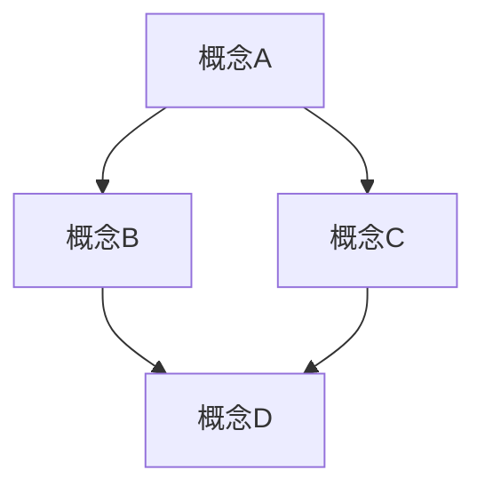

# 认知增强工具模板库

> **创建日期**：2025-11-15
> **最后更新**：2025-11-15
> **状态**：已建立
> **维护者**：文档团队

---

## 📋 模板库概述

本文档库提供认知增强工具的标准模板，包括思维导图、多维矩阵、知识图谱、形象化解释、专家观点等。

### 工具分类

1. **思维导图模板**
2. **多维矩阵模板**
3. **知识图谱模板**
4. **形象化解释模板**
5. **专家观点模板**

---

## 1. 思维导图模板

### 模板结构

```markdown
### X.X 思维导图

**核心结构**：

```mermaid
mindmap
  root(([核心主题]))
    分支1
      子分支1.1
      子分支1.2
    分支2
      子分支2.1
      子分支2.2
    分支3
      子分支3.1
      子分支3.2
```

**说明**：

- 分支1：[说明]
- 分支2：[说明]
- 分支3：[说明]

```

---

## 2. 多维矩阵模板

### 模板结构

```markdown
### X.X 多维矩阵

**矩阵名称**：[矩阵名称]

| 维度1 | 维度2 | 维度3 | 维度4 |
|-------|-------|-------|-------|
| 值1   | 值2   | 值3   | 值4   |
| 值5   | 值6   | 值7   | 值8   |

**说明**：
- 维度1：[说明]
- 维度2：[说明]
- 维度3：[说明]
- 维度4：[说明]
```

---

## 3. 知识图谱模板

### 模板结构

```markdown
### X.X 知识图谱

**概念关系网络**：



**关系说明**：

- A → B：[关系说明]
- A → C：[关系说明]
- B → D：[关系说明]
- C → D：[关系说明]

```

---

## 4. 形象化解释模板

### 模板结构

```markdown
### X.X 形象化解释

#### 类比1：[类比名称]

**类比描述**：
[类比描述]

**映射关系**：
- [技术概念1] ↔ [类比对象1]
- [技术概念2] ↔ [类比对象2]
- [技术概念3] ↔ [类比对象3]

**价值**：
[类比的价值和帮助理解的作用]
```

---

## 5. 专家观点模板

### 模板结构

```markdown
### X.X 专家观点

#### 观点1：[专家姓名/机构]

**观点内容**：
> [专家观点引用]

**来源**：
- [来源链接]
- [来源说明]

**价值**：
[观点的价值和论证作用]
```

---

## 📋 使用指南

### 何时使用

1. **思维导图**：展示文档核心结构和知识体系
2. **多维矩阵**：对比不同概念、技术、场景的多维度特征
3. **知识图谱**：展示概念之间的复杂关系网络
4. **形象化解释**：帮助理解抽象概念和技术原理
5. **专家观点**：提供权威论证和理论支撑

### 质量标准

1. **思维导图**：
   - 结构清晰，层次分明
   - 覆盖核心内容
   - 使用 Mermaid 格式

2. **多维矩阵**：
   - 维度选择合理
   - 数据准确完整
   - 对比清晰明确

3. **知识图谱**：
   - 关系准确
   - 结构清晰
   - 使用 Mermaid 格式

4. **形象化解释**：
   - 类比贴切
   - 映射清晰
   - 易于理解

5. **专家观点**：
   - 来源权威
   - 引用准确
   - 论证有力

---

## 🔗 相关文档

- [认知增强工具补充计划](../COGNITIVE-ENHANCEMENT-SUPPLEMENT-PLAN.md)
- [认知增强工具完成报告](../COGNITIVE-ENHANCEMENT-COMPLETION-REPORT.md)
- [文档模板库](DOCUMENT-TEMPLATES.md)

---

**最后更新**：2025-11-15
**维护者**：文档团队
