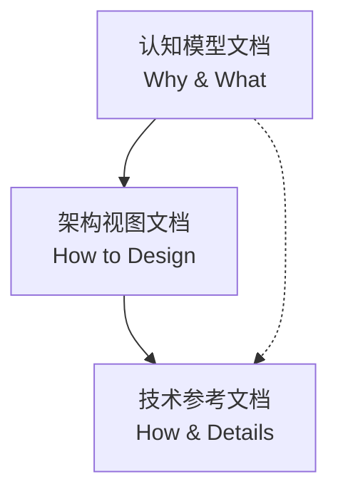

# 文档类型说明

> **创建日期**：2025-11-15
> **最后更新**：2025-11-15
> **状态**：已建立
> **维护者**：文档团队

---

## 📋 文档类型概述

本文档说明项目中不同文档类型的特征、定位和使用场景。

### 文档分类

1. **认知模型文档**（Cognitive Model Documents）
2. **架构视图文档**（Architecture View Documents）
3. **技术参考文档**（Technical Reference Documents）

---

## 1. 认知模型文档

### 定位

构建技术栈的认知框架和推理模型，帮助理解技术本质和演进逻辑。

### 特征

- 📊 **理念导向**：强调"为什么"（Why）而非"怎么做"（How）
- 🧠 **认知工具**：大量使用类比、思维导图、矩阵等认知工具
- 📈 **演进主线**：提供技术演进的时间轴和逻辑链
- 🔗 **论证推理**：每个技术选择都有"问题 → 解法 → 副作用 → 再演化"的论证

### 核心内容

- 技术演进主线
- 理念层和认知框架
- 知识结构和学习路径
- 理论分析和论证

### 认知增强工具

- 思维导图
- 多维矩阵
- 知识图谱
- 形象化解释
- 专家观点

### 典型文档

- `ai_view.md` - 认知视角
- `algebra_view.md` - 代数视角
- `system_view.md` - 系统视角
- `structure_view.md` - 结构视角

---

## 2. 架构视图文档

### 定位

从软件架构的视角系统梳理虚拟化、容器化、沙盒化以及 Service Mesh、OPA 等现代云原生架构技术。

### 特征

- 🏗️ **架构拆解**：从架构拆解与组合的视角理解技术
- 📐 **多视角视图**：提供多视角架构视图
- 🔧 **组合模式**：包含分层架构模型、组合模式、案例研究
- 📚 **理论论证**：包含形式化理论论证

### 核心内容

- 架构拆解与组合
- 分层架构模型
- 组合模式
- 案例研究
- 形式化理论论证

### 典型文档

- `architecture_view.md` - 架构视角
- `docs/ARCHITECTURE/00-theory/` - 理论论证
- `docs/ARCHITECTURE/01-implementation/` - 实现细节
- `docs/ARCHITECTURE/architecture-view/` - 架构视图文档集

---

## 3. 技术参考文档

### 定位

提供详细的技术规格、接口定义和实践指南，作为认知模型的技术支撑。

### 特征

- 📝 **技术细节**：包含完整的技术规范、API 定义、配置选项
- 🔧 **实践指导**：提供 YAML 示例、命令、故障排查步骤
- ✅ **最佳实践**：总结生产环境的最佳实践和注意事项
- 🚀 **可操作性**：读者可以直接按照文档实施

### 核心内容

- 技术规格和接口定义
- 安装和配置指南
- 实践示例和代码
- 故障排查和最佳实践

### 典型文档

- `docs/TECHNICAL/01-core-foundations/docker/` - Docker 技术规范
- `docs/TECHNICAL/01-core-foundations/kubernetes/` - Kubernetes 架构与实践
- `docs/TECHNICAL/05-devops/troubleshooting/` - 故障排查

---

## 📊 三类文档的关系

### 关系图

### 使用策略

1. **新手推荐**：
   - 认知模型文档 → 架构视图文档 → 技术参考文档

2. **按需查阅**：
   - 需要理解理念 → 查阅认知模型文档
   - 需要架构设计 → 查阅架构视图文档
   - 需要技术细节 → 查阅技术参考文档

---

## 🔗 相关文档

- [文档模板库](DOCUMENT-TEMPLATES.md)
- [认知增强工具模板库](COGNITIVE-ENHANCEMENT-TOOL-TEMPLATES.md)
- [文档总览](../README.md)

---

**最后更新**：2025-11-15
**维护者**：文档团队
