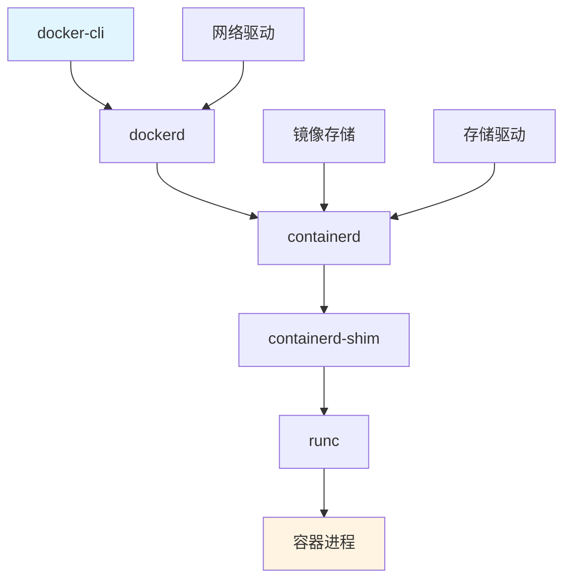
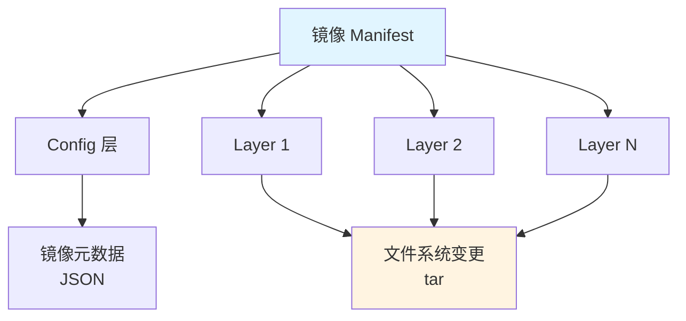
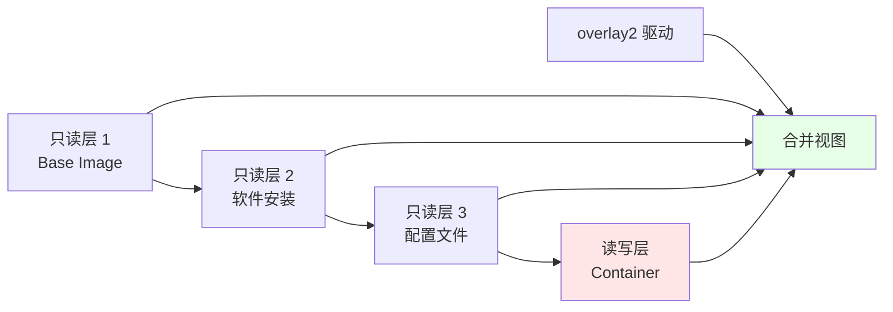
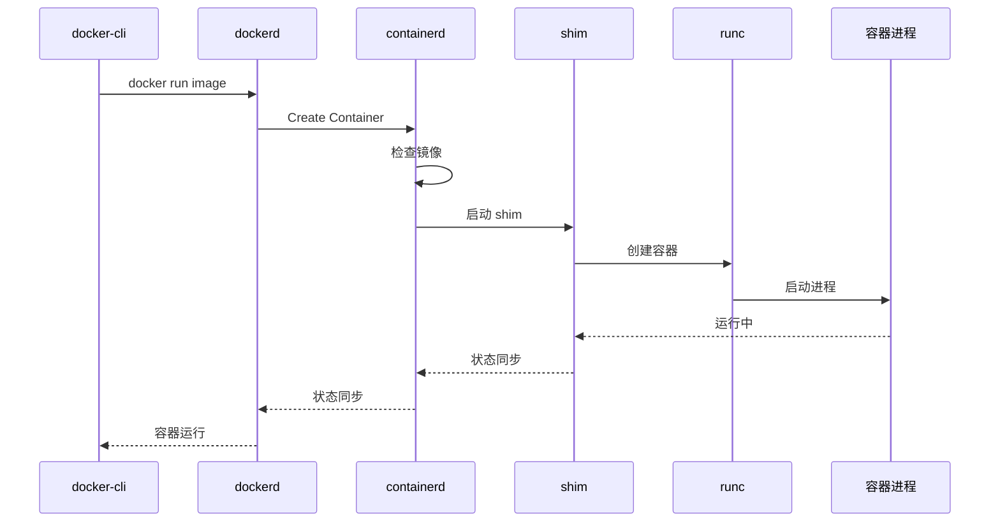
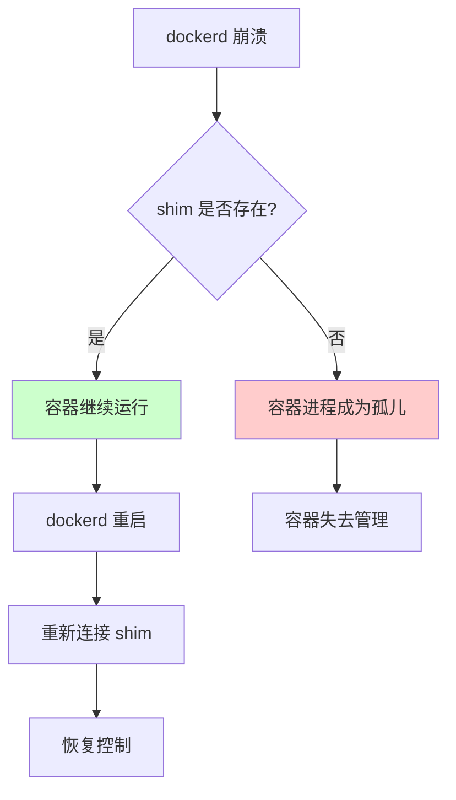
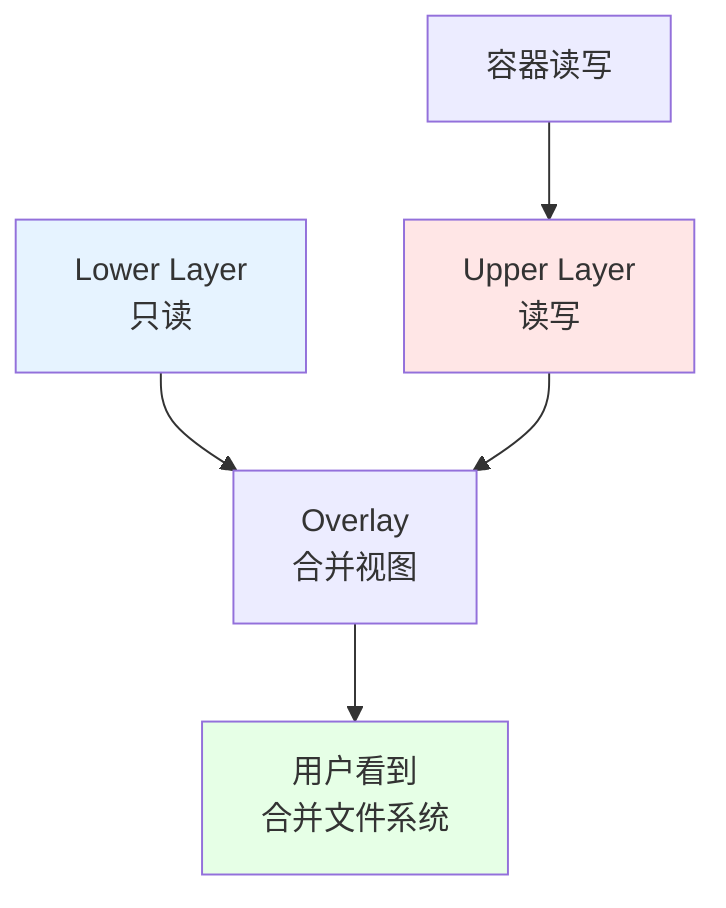
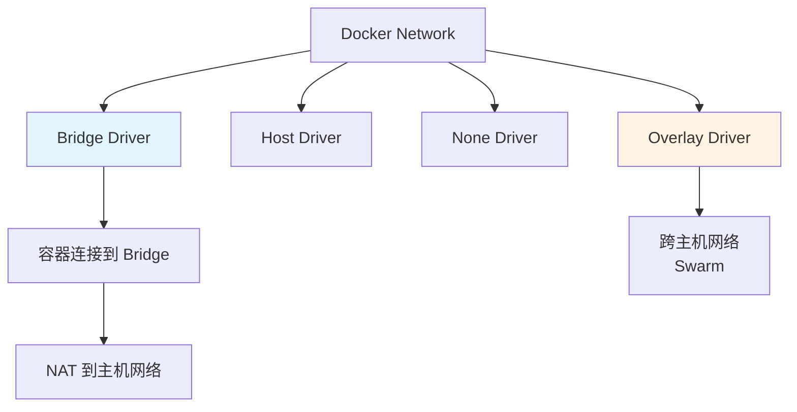

# 00. Docker：容器化引擎技术规范

## 📑 目录

- [📑 目录](#-目录)
- [00.1 文档定位](#001-文档定位)
- [00.2 核心组件](#002-核心组件)
  - [00.2.1 技术栈架构](#0021-技术栈架构)
  - [00.2.2 核心组件说明](#0022-核心组件说明)
  - [00.2.3 架构设计论证](#0023-架构设计论证)
- [00.3 OCI Image Spec](#003-oci-image-spec)
  - [00.3.1 镜像结构](#0031-镜像结构)
  - [00.3.2 镜像寻址](#0032-镜像寻址)
  - [00.3.3 镜像层存储](#0033-镜像层存储)
  - [00.3.4 镜像模型论证](#0034-镜像模型论证)
- [00.4 控制路径详解](#004-控制路径详解)
  - [00.4.1 容器启动流程](#0041-容器启动流程)
  - [00.4.2 Shim 的必要性](#0042-shim-的必要性)
  - [00.4.3 控制路径论证](#0043-控制路径论证)
- [00.5 存储驱动：overlay2](#005-存储驱动overlay2)
  - [00.5.1 OverlayFS 原理](#0051-overlayfs-原理)
  - [00.5.2 存储驱动对比](#0052-存储驱动对比)
  - [00.5.3 存储场景与决策](#0053-存储场景与决策)
- [00.6 网络模型：CNM](#006-网络模型cnm)
  - [00.6.1 网络架构](#0061-网络架构)
  - [00.6.2 网络驱动对比](#0062-网络驱动对比)
  - [00.6.3 网络场景与决策](#0063-网络场景与决策)
- [00.7 镜像构建最佳实践](#007-镜像构建最佳实践)
  - [00.7.1 多阶段构建](#0071-多阶段构建)
  - [00.7.2 镜像优化策略](#0072-镜像优化策略)
  - [00.7.3 分层规范](#0073-分层规范)
  - [00.7.4 构建场景与决策](#0074-构建场景与决策)
- [00.8 数据管理](#008-数据管理)
  - [00.8.1 Volume vs Bind Mount](#0081-volume-vs-bind-mount)
  - [00.8.2 Volume 管理](#0082-volume-管理)
  - [00.8.3 数据场景与决策](#0083-数据场景与决策)
- [00.9 安全最佳实践](#009-安全最佳实践)
  - [00.9.1 镜像安全](#0091-镜像安全)
  - [00.9.2 运行时安全](#0092-运行时安全)
  - [00.9.3 安全场景与决策](#0093-安全场景与决策)
- [00.10 性能优化](#0010-性能优化)
  - [00.10.1 构建优化](#00101-构建优化)
  - [00.10.2 运行时优化](#00102-运行时优化)
  - [00.10.3 性能场景与决策](#00103-性能场景与决策)
- [00.11 技术场景分析](#0011-技术场景分析)
  - [00.11.1 开发环境场景](#00111-开发环境场景)
  - [00.11.2 生产环境场景](#00112-生产环境场景)
  - [00.11.3 CI/CD 场景](#00113-cicd-场景)
- [00.12 决策依据与思路](#0012-决策依据与思路)
  - [00.12.1 存储驱动选择决策树](#00121-存储驱动选择决策树)
  - [00.12.2 网络驱动选择决策树](#00122-网络驱动选择决策树)
  - [00.12.3 数据管理选择决策树](#00123-数据管理选择决策树)
  - [00.12.4 构建策略选择决策树](#00124-构建策略选择决策树)
- [00.13 形式化总结](#0013-形式化总结)
  - [00.13.1 Docker 架构模型形式化](#00131-docker-架构模型形式化)
  - [00.13.2 镜像体积模型](#00132-镜像体积模型)
  - [00.13.3 构建性能模型](#00133-构建性能模型)
  - [00.13.4 缓存命中率模型](#00134-缓存命中率模型)
- [00.14 实际部署案例](#0014-实际部署案例)
  - [00.14.1 案例 1：多阶段构建优化镜像](#00141-案例-1多阶段构建优化镜像)
  - [00.14.2 案例 2：Docker Compose 多容器应用](#00142-案例-2docker-compose-多容器应用)
  - [00.14.3 案例 3：Docker 网络配置](#00143-案例-3docker-网络配置)
- [00.15 Docker 综合最佳实践](#0015-docker-综合最佳实践)
  - [00.15.1 生产环境部署最佳实践](#00151-生产环境部署最佳实践)
  - [00.15.2 Docker 检查清单](#00152-docker-检查清单)
- [00.16 Docker 故障排查](#0016-docker-故障排查)
  - [00.16.1 常见问题](#00161-常见问题)
- [00.17 参考](#0017-参考)
  - [00.17.1 隔离栈相关文档](#00171-隔离栈相关文档)
  - [00.17.2 Docker 相关文档](#00172-docker-相关文档)
  - [00.17.3 其他相关文档](#00173-其他相关文档)
  - [00.17.4 外部参考](#00174-外部参考)

---

## 00.1 文档定位

本文档深入解析 Docker 的核心技术、架构设计和最佳实践，以及不同技术场景下的决策依
据和决策思路。

**文档结构**：

- **架构设计**：Docker 技术栈架构和控制路径
- **镜像模型**：OCI Image Spec、镜像层存储、镜像寻址
- **存储网络**：overlay2 存储驱动、CNM 网络模型
- **最佳实践**：镜像构建、数据管理、安全配置、性能优化
- **技术场景**：开发环境、生产环境、CI/CD
- **决策分析**：架构选择、存储网络选择、构建策略选择

## 00.2 核心组件

> **💡 隔离层次关联**：Docker 使用 runc 作为 OCI 运行时，属于 L-3 容器化层，提供
> 进程级隔离。详细的技术解析请参考：
>
> - **[29. 隔离栈](../29-isolation-stack/isolation-stack.md)** - 完整的隔离栈技
>   术解析
> - **[L-3 容器化层](../29-isolation-stack/layers/L-3-containerization.md)** -
>   runc、containerd、Docker 详细文档
> - **[隔离层次对比文档](../29-isolation-stack/layers/isolation-comparison.md)** -
>   容器化层性能对比和技术选型

### 00.2.1 技术栈架构



**架构层次分析**：

1. **用户接口层**（docker-cli）：命令行工具，REST API 客户端
2. **守护进程层**（dockerd）：Docker 守护进程，镜像管理、网络管理
3. **运行时接口层**（containerd）：容器运行时接口，管理容器生命周期
4. **运行时层**（runc）：OCI 运行时，创建容器进程
5. **容器层**（容器进程）：实际运行的容器进程

### 00.2.2 核心组件说明

| 组件                | 职责            | 技术规范                               |
| ------------------- | --------------- | -------------------------------------- |
| **docker-cli**      | 用户命令行接口  | REST API 客户端                        |
| **dockerd**         | Docker 守护进程 | 镜像管理、网络管理、API 服务           |
| **containerd**      | 容器运行时接口  | CRI（Container Runtime Interface）实现 |
| **containerd-shim** | 运行时 shim     | 隔离 containerd 与容器生命周期         |
| **runc**            | OCI 运行时      | OCI Runtime Spec 实现                  |
| **overlay2**        | 存储驱动        | 联合文件系统                           |

### 00.2.3 架构设计论证

**为什么采用分层架构？**

**决策依据**：

- ✅ 职责分离：每个组件职责单一，易于维护 [^docker-architecture]
- ✅ 解耦设计：组件间通过接口交互，降低耦合
- ✅ 可扩展性：插件化设计支持扩展

**决策思路**：

```yaml
Docker 架构选择:
  模式: 分层架构
  组件:
    - docker-cli: 用户接口层
    - dockerd: 守护进程层
    - containerd: 运行时接口层
    - runc: 运行时层
  优势: 职责分离、解耦设计、可扩展
  权衡: 调用链路较长，性能略低
```

**为什么分离 containerd 和 runc？**

**决策依据**：

- ✅ 标准化：containerd 实现 CRI，runc 实现 OCI
- ✅ 解耦：containerd 与具体运行时解耦
- ✅ 可替换：可以替换不同的 OCI 运行时（runc/crun/runwasi）

**决策思路**：

```yaml
运行时分离:
  containerd: CRI 实现，容器生命周期管理
  runc: OCI 实现，容器进程创建
  优势: 标准化、解耦、可替换
  应用: K8s 通过 containerd 调用 runc
```

## 00.3 OCI Image Spec

### 00.3.1 镜像结构



**镜像结构分析**：

- **Manifest**：镜像清单，包含所有层的信息
- **Config**：镜像配置，包含镜像元数据（CMD、ENV、EXPOSE 等）
- **Layer**：文件系统层，包含文件系统变更（tar 格式）

### 00.3.2 镜像寻址

**Content-addressable 寻址**：

```bash
镜像 ID = SHA256(Manifest)

示例：
sha256:abc123...def456
```

**标签寻址**：

```bash
仓库:标签 = namespace/repository:tag

示例：
docker.io/library/nginx:latest
```

**寻址方式论证**：

- **Content-addressable**：基于内容哈希，保证镜像完整性
- **标签寻址**：便于用户使用，可指向不同版本的镜像
- **标签可变性**：标签可以指向不同的镜像 ID（tag 可更新）

### 00.3.3 镜像层存储



**镜像层存储论证**：

- **只读层**：基础镜像和软件安装层，可共享
- **读写层**：容器运行时写入层，每个容器独立
- **overlay2 合并**：用户看到合并后的文件系统视图

### 00.3.4 镜像模型论证

**为什么采用分层存储？**

**决策依据**：

- ✅ 镜像复用：多个镜像可以共享基础层
- ✅ 体积优化：只存储层差异，不存储完整镜像
- ✅ 构建效率：只重建变更的层，其他层复用

**决策思路**：

```yaml
分层存储策略:
  基础层: 可共享（如 alpine、ubuntu）
  应用层: 独立（如应用代码）
  优势: 镜像复用、体积优化、构建效率
  效果: 镜像体积减少 50-70%
```

**为什么采用 Content-addressable 寻址？**

**决策依据**：

- ✅ 内容完整性：基于内容哈希，保证镜像完整性
- ✅ 去重存储：相同内容的层只存储一次
- ✅ 安全验证：可以通过哈希验证镜像是否被篡改

**决策思路**：

```yaml
Content-addressable 策略:
  寻址: SHA256(Manifest)
  优势: 内容完整性、去重存储、安全验证
  应用: 镜像拉取、镜像推送、镜像验证
```

## 00.4 控制路径详解

### 00.4.1 容器启动流程



**启动流程分析**：

1. **docker-cli → dockerd**：用户命令通过 REST API 发送到 dockerd
2. **dockerd → containerd**：dockerd 调用 containerd API 创建容器
3. **containerd → shim**：containerd 启动 shim 进程
4. **shim → runc**：shim 调用 runc 创建容器进程
5. **runc → 容器进程**：runc 创建并启动容器进程
6. **状态同步**：容器进程状态通过 shim → containerd → dockerd → docker-cli 同步

### 00.4.2 Shim 的必要性

**问题**：runc 创建容器后立即退出，容器进程（init 进程）会失去父进程，变成孤儿进
程。

**解决方案**：shim 作为"轻量级 init"持有 STDIO 和 fifo，使 dockerd 可以重启而不
丢失容器。



**shim 必要性论证**：

- **孤儿进程问题**：runc 创建容器后立即退出，容器进程失去父进程
- **shim 作用**：shim 持有容器进程，避免成为孤儿
- **可恢复性**：dockerd 重启后可以重新连接 shim，恢复容器控制

### 00.4.3 控制路径论证

**为什么采用分层控制路径？**

**决策依据**：

- ✅ 职责分离：每层职责单一，易于维护
- ✅ 标准化：containerd 实现 CRI，runc 实现 OCI
- ✅ 可扩展：可以替换不同组件（如 runc → crun）

**决策思路**：

```yaml
控制路径设计:
  层次: docker-cli → dockerd → containerd → shim → runc
  优势: 职责分离、标准化、可扩展
  权衡: 调用链路较长，性能略低
```

## 00.5 存储驱动：overlay2

### 00.5.1 OverlayFS 原理



**OverlayFS 原理论证**：

- **Lower Layer**：只读层，多个镜像层叠加
- **Upper Layer**：读写层，容器运行时写入
- **合并视图**：用户看到所有层的合并结果
- **Copy-on-Write**：修改时从 Lower 复制到 Upper

### 00.5.2 存储驱动对比

| 驱动             | 性能       | 功能               | 适用场景           |
| ---------------- | ---------- | ------------------ | ------------------ |
| **overlay2**     | ⭐⭐⭐⭐⭐ | 支持 CoW、原子操作 | 推荐使用（默认）   |
| **aufs**         | ⭐⭐⭐     | 不支持             | 旧版本             |
| **devicemapper** | ⭐⭐       | 需要额外设备       | 生产环境（需配置） |
| **btrfs**        | ⭐⭐⭐     | 快照支持           | 特定场景           |

**存储驱动论证**：

- **overlay2**：性能最好，功能完整，推荐使用 [^docker-overlay2]
- **aufs**：旧版本，性能一般，不推荐
- **devicemapper**：需要额外设备，配置复杂
- **btrfs**：支持快照，但性能一般

### 00.5.3 存储场景与决策

**场景 1：开发环境**:

**决策依据**：

- ✅ 性能要求不高
- ✅ 简单易用优先

**决策思路**：

```yaml
存储驱动选择:
  场景: 开发环境
  驱动: overlay2（默认）
  原因: 性能好、简单易用
  权衡: 无特殊要求
```

**场景 2：生产环境**:

**决策依据**：

- ✅ 性能要求高
- ✅ 稳定性要求高

**决策思路**：

```yaml
存储驱动选择:
  场景: 生产环境
  驱动: overlay2（推荐）
  原因: 性能最好、稳定性高
  权衡: 需要内核支持
```

**场景 3：需要快照**:

**决策依据**：

- ✅ 需要文件系统快照
- ✅ 快照性能要求

**决策思路**：

```yaml
存储驱动选择:
  场景: 需要快照
  驱动: btrfs
  原因: 支持文件系统快照
  权衡: 性能相对较低
```

## 00.6 网络模型：CNM

### 00.6.1 网络架构



**网络架构分析**：

- **Bridge**：默认网络驱动，容器通过 NAT 访问主机网络
- **Host**：容器共享主机网络，性能最好
- **None**：无网络，用于自定义网络
- **Overlay**：跨主机网络，用于 Swarm 模式

### 00.6.2 网络驱动对比

| 驱动        | 特点         | 适用场景     |
| ----------- | ------------ | ------------ |
| **Bridge**  | 默认、NAT    | 单机容器通信 |
| **Host**    | 共享主机网络 | 性能敏感     |
| **None**    | 无网络       | 自定义网络   |
| **Overlay** | 跨主机网络   | Swarm 模式   |

**网络驱动论证**：

- **Bridge**：默认选择，适合大多数场景 [^docker-network]
- **Host**：性能最好，但网络隔离性差
- **None**：无网络，需要手动配置网络
- **Overlay**：跨主机网络，适合 Swarm 集群

### 00.6.3 网络场景与决策

**场景 1：单机容器通信**:

**决策依据**：

- ✅ 容器间需要通信
- ✅ 不需要外部访问

**决策思路**：

```yaml
网络方案选择:
  场景: 单机容器通信
  驱动: Bridge（默认）
  原因: 简单易用，自动 NAT
  权衡: 性能略低（NAT 开销）
```

**场景 2：性能敏感应用**:

**决策依据**：

- ✅ 网络延迟要求低
- ✅ 不需要网络隔离

**决策思路**：

```yaml
网络方案选择:
  场景: 性能敏感应用
  驱动: Host
  原因: 零 NAT 开销，性能最好
  权衡: 网络隔离性差
```

**场景 3：Swarm 集群**:

**决策依据**：

- ✅ 跨主机容器通信
- ✅ 需要服务发现

**决策思路**：

```yaml
网络方案选择:
  场景: Swarm 集群
  驱动: Overlay
  原因: 支持跨主机网络和服务发现
  权衡: 配置相对复杂
```

## 00.7 镜像构建最佳实践

### 00.7.1 多阶段构建

```dockerfile
# 构建阶段
FROM golang:1.21-alpine AS builder
WORKDIR /build
COPY . .
RUN go build -o app .

# 运行阶段
FROM alpine:latest
RUN apk --no-cache add ca-certificates
WORKDIR /app
COPY --from=builder /build/app .
CMD ["./app"]
```

**多阶段构建论证**：

- **分离构建和运行环境**：构建阶段包含编译工具，运行阶段只包含运行时
- **体积优化**：最终镜像不包含构建工具，体积减少 50-70%
- **安全优化**：运行阶段工具链少，攻击面小

### 00.7.2 镜像优化策略

| 策略                   | 方法               | 效果            |
| ---------------------- | ------------------ | --------------- |
| **多阶段构建**         | 分离构建和运行环境 | 减小体积 50-70% |
| **Distroless/Scratch** | 最小化基础镜像     | 减小体积 80-90% |
| **层合并**             | 合并 RUN 指令      | 减少层数        |
| **.dockerignore**      | 排除无关文件       | 减小构建上下文  |

**优化策略论证**：

- **多阶段构建**：分离构建和运行环境，减小最终镜像体积
- **Distroless/Scratch**：最小化基础镜像，减小攻击面
- **层合并**：减少镜像层数，提高拉取速度
- **.dockerignore**：排除无关文件，减小构建上下文

### 00.7.3 分层规范

```dockerfile
# ❌ 错误：频繁变化的层在底层
FROM alpine
COPY app.py /app/app.py    # 每次代码变更都重建这一层
RUN pip install -r requirements.txt

# ✅ 正确：稳定层在底层，变化层在顶层
FROM alpine
RUN pip install -r requirements.txt  # 依赖稳定
COPY app.py /app/app.py              # 代码变化只影响这一层
```

**分层规范论证**：

- **稳定层在底层**：基础镜像和依赖安装层，变化少
- **变化层在顶层**：应用代码层，变化频繁
- **缓存利用**：只有顶层变化时，底层可以复用缓存

### 00.7.4 构建场景与决策

**场景 1：开发环境构建**:

**决策依据**：

- ✅ 构建速度优先
- ✅ 镜像体积不重要

**决策思路**：

```yaml
开发环境构建策略:
  基础镜像: 完整基础镜像（如 alpine/node）
  构建方式: 单阶段构建
  层顺序: 优化缓存利用
  镜像体积: 可接受较大
```

**场景 2：生产环境构建**:

**决策依据**：

- ✅ 镜像体积优先
- ✅ 安全要求高

**决策思路**：

```yaml
生产环境构建策略:
  基础镜像: Distroless 或 Scratch
  构建方式: 多阶段构建
  层顺序: 稳定层在底层
  镜像体积: 最小化
```

**场景 3：CI/CD 构建**:

**决策依据**：

- ✅ 构建速度关键
- ✅ 可重复性重要

**决策思路**：

```yaml
CI/CD 构建策略:
  构建工具: BuildKit（并行构建）
  缓存策略: 分层缓存
  多阶段构建: 必须使用
  构建上下文: .dockerignore 优化
```

## 00.8 数据管理

### 00.8.1 Volume vs Bind Mount

| 方式           | 特点                | 适用场景             |
| -------------- | ------------------- | -------------------- |
| **Volume**     | Docker 管理、可备份 | 持久化数据、数据共享 |
| **Bind Mount** | 直接映射主机路径    | 开发环境、配置文件   |
| **tmpfs**      | 内存文件系统        | 临时数据、敏感数据   |

**数据管理论证**：

- **Volume**：Docker 管理，可备份，适合生产环境
- **Bind Mount**：直接映射主机路径，适合开发环境
- **tmpfs**：内存文件系统，速度快但不持久化

### 00.8.2 Volume 管理

```bash
# 创建命名卷
docker volume create my-volume

# 使用卷
docker run -v my-volume:/data nginx

# 备份卷
docker run --rm -v my-volume:/data -v $(pwd):/backup \
  alpine tar czf /backup/backup.tar.gz /data
```

### 00.8.3 数据场景与决策

**场景 1：持久化数据**:

**决策依据**：

- ✅ 数据需要持久化
- ✅ 数据需要备份

**决策思路**：

```yaml
数据方案选择:
  方式: Volume
  原因: Docker 管理，可备份
  适用: 数据库、日志、配置文件
```

**场景 2：开发环境数据**:

**决策依据**：

- ✅ 需要直接访问主机文件
- ✅ 需要实时同步

**决策思路**：

```yaml
数据方案选择:
  方式: Bind Mount
  原因: 直接映射主机路径，实时同步
  适用: 开发环境、配置文件
```

**场景 3：临时数据**:

**决策依据**：

- ✅ 数据不需要持久化
- ✅ 性能要求高

**决策思路**：

```yaml
数据方案选择:
  方式: tmpfs
  原因: 内存文件系统，性能最好
  适用: 临时文件、缓存
```

## 00.9 安全最佳实践

### 00.9.1 镜像安全

| 措施         | 方法                 | 说明           |
| ------------ | -------------------- | -------------- |
| **镜像签名** | Docker Content Trust | 验证镜像完整性 |
| **漏洞扫描** | Trivy/Clair          | 检测已知 CVE   |
| **最小权限** | 非 root 用户运行     | 减少攻击面     |
| **最小镜像** | Distroless/Scratch   | 减少攻击面     |

**镜像安全论证**：

- **镜像签名**：验证镜像完整性和来源，防止镜像被篡改
- **漏洞扫描**：检测镜像中的已知漏洞，及时修复
- **最小权限**：以非 root 用户运行容器，减少攻击面
- **最小镜像**：使用 Distroless/Scratch，减少攻击面

### 00.9.2 运行时安全

```yaml
# Docker Compose 安全配置示例
services:
  app:
    image: myapp:latest
    user: "1000:1000" # 非 root
    read_only: true # 只读文件系统
    tmpfs:
      - /tmp
      - /run
    security_opt:
      - no-new-privileges:true
    cap_drop:
      - ALL
    cap_add:
      - NET_BIND_SERVICE
```

**运行时安全论证**：

- **非 root 用户**：减少攻击面，限制容器权限
- **只读文件系统**：防止容器修改系统文件
- **Capability 限制**：只授予必要的权限
- **no-new-privileges**：防止权限提升

### 00.9.3 安全场景与决策

**场景 1：开发环境**:

**决策依据**：

- ✅ 安全要求相对较低
- ✅ 调试便利性优先

**决策思路**：

```yaml
开发环境安全配置:
  用户: root（默认）
  文件系统: 可读写
  Capability: 默认权限
  原因: 调试便利性优先
```

**场景 2：生产环境**:

**决策依据**：

- ✅ 安全要求高
- ✅ 最小权限原则

**决策思路**：

```yaml
生产环境安全配置:
  用户: 非 root（必须）
  文件系统: 只读（read_only: true）
  Capability: 最小权限（cap_drop: ALL）
  原因: 最小权限原则
```

**场景 3：高安全要求**:

**决策依据**：

- ✅ 最高安全要求
- ✅ 合规要求

**决策思路**：

```yaml
高安全配置:
  用户: 非 root + 最小 UID
  文件系统: 只读 + tmpfs
  Capability: 只授予必要权限
  镜像: Distroless + 镜像签名
  扫描: 定期漏洞扫描
```

## 00.10 性能优化

### 00.10.1 构建优化

| 优化点         | 方法                  | 效果         |
| -------------- | --------------------- | ------------ |
| **构建缓存**   | 合理顺序的 Dockerfile | 加速构建     |
| **并行构建**   | BuildKit 并行阶段     | 减少构建时间 |
| **构建上下文** | .dockerignore         | 减小上传大小 |
| **多阶段构建** | 只复制必要文件        | 减小最终镜像 |

**构建优化论证**：

- **构建缓存**：合理顺序的 Dockerfile 可以最大化缓存命中率
- **并行构建**：BuildKit 支持并行构建多个阶段
- **构建上下文**：.dockerignore 排除无关文件，减小上传大小
- **多阶段构建**：只复制必要文件，减小最终镜像体积

### 00.10.2 运行时优化

| 优化点       | 方法             | 效果         |
| ------------ | ---------------- | ------------ |
| **资源限制** | --memory, --cpus | 避免资源竞争 |
| **存储驱动** | overlay2         | 最佳性能     |
| **网络模式** | host（如适用）   | 减少延迟     |

**运行时优化论证**：

- **资源限制**：限制容器资源使用，避免资源竞争
- **存储驱动**：overlay2 性能最好，推荐使用
- **网络模式**：host 模式减少 NAT 开销，性能最好

### 00.10.3 性能场景与决策

**场景 1：构建性能优化**:

**决策依据**：

- ✅ 构建速度关键
- ✅ 缓存利用重要

**决策思路**：

```yaml
构建性能优化:
  工具: BuildKit
  策略: 分层缓存 + 并行构建
  Dockerfile: 优化层顺序
  效果: 构建时间减少 50-70%
```

**场景 2：运行性能优化**:

**决策依据**：

- ✅ 运行性能要求高
- ✅ 资源受限

**决策思路**：

```yaml
运行性能优化:
  存储驱动: overlay2
  网络模式: host（如适用）
  资源限制: 精确设置
  效果: 性能提升 20-30%
```

**场景 3：镜像体积优化**:

**决策依据**：

- ✅ 镜像体积关键
- ✅ 拉取速度重要

**决策思路**：

```yaml
镜像体积优化:
  基础镜像: Distroless/Scratch
  构建方式: 多阶段构建
  层优化: 合并层、减少层数
  效果: 镜像体积减少 80-90%
```

## 00.11 技术场景分析

### 00.11.1 开发环境场景

**场景描述**：本地开发需要快速迭代和调试

**架构挑战**：

1. **构建速度**：需要快速构建和启动
2. **调试能力**：需要调试工具和日志
3. **开发效率**：需要热重载和实时同步

**架构决策**：

```yaml
开发环境配置:
  基础镜像: 完整基础镜像（alpine/node）
  构建方式: 单阶段构建
  数据管理: Bind Mount（代码实时同步）
  安全配置: 默认配置（root 用户）
  网络模式: Bridge（默认）
  优化目标: 开发效率 > 体积 > 性能
```

**决策依据**：

- ✅ 开发效率优先：快速迭代比体积优化更重要
- ✅ 调试能力：需要完整的工具链
- ✅ 实时同步：Bind Mount 实现代码实时同步

### 00.11.2 生产环境场景

**场景描述**：生产环境需要安全、稳定、高性能

**架构挑战**：

1. **安全性**：最小攻击面、镜像签名、漏洞扫描
2. **稳定性**：资源限制、健康检查、自动重启
3. **性能**：存储驱动、网络模式、资源优化

**架构决策**：

```yaml
生产环境配置:
  基础镜像: Distroless/Scratch
  构建方式: 多阶段构建
  数据管理: Volume（持久化）
  安全配置: 最小权限（非 root + 只读文件系统）
  网络模式: Bridge（默认）或 Host（性能敏感）
  镜像签名: 必须签名
  漏洞扫描: 定期扫描
  优化目标: 安全 > 性能 > 体积
```

**决策依据**：

- ✅ 安全优先：最小权限、镜像签名、漏洞扫描
- ✅ 稳定性：资源限制、健康检查、自动重启
- ✅ 性能优化：overlay2、host 网络（如适用）

### 00.11.3 CI/CD 场景

**场景描述**：CI/CD 需要快速构建和可重复性

**架构挑战**：

1. **构建速度**：并行构建、缓存利用
2. **可重复性**：固定版本、缓存策略
3. **资源效率**：构建资源优化

**架构决策**：

```yaml
CI/CD 配置:
  构建工具: BuildKit（并行构建）
  缓存策略: 分层缓存 + 构建缓存
  多阶段构建: 必须使用
  构建上下文: .dockerignore 优化
  版本固定: 基础镜像版本固定
  优化目标: 构建速度 > 可重复性 > 体积
```

**决策依据**：

- ✅ 构建速度：并行构建、缓存利用
- ✅ 可重复性：固定版本、缓存策略
- ✅ 资源效率：构建资源优化

## 00.12 决策依据与思路

### 00.12.1 存储驱动选择决策树

```yaml
存储驱动选择:
  if 内核支持 overlay2: 选择 overlay2（推荐）
  elif 需要快照: 选择 btrfs
  elif 生产环境: 选择 devicemapper（需配置）
  else: 选择 overlay2（默认）
```

### 00.12.2 网络驱动选择决策树

```yaml
网络驱动选择:
  if 性能敏感 and 不需要网络隔离: 选择 Host
  elif Swarm 集群: 选择 Overlay
  elif 自定义网络: 选择 None
  else: 选择 Bridge（默认）
```

### 00.12.3 数据管理选择决策树

```yaml
数据管理选择:
  if 需要持久化 and 生产环境: 选择 Volume
  elif 开发环境 and 需要实时同步: 选择 Bind Mount
  elif 临时数据 and 性能要求高: 选择 tmpfs
  else: 选择 Volume（默认）
```

### 00.12.4 构建策略选择决策树

```yaml
构建策略选择:
  if 生产环境: 多阶段构建 + Distroless
  elif CI/CD: BuildKit + 多阶段构建 + 缓存
  elif 开发环境: 单阶段构建 + 完整基础镜像
  else: 多阶段构建（默认）
```

## 00.13 形式化总结

### 00.13.1 Docker 架构模型形式化

设 Docker 架构为 $D = \{C, D, R\}$，其中：

- $C$ = 控制路径（Control Path）
- $D$ = 数据存储（Data Storage）
- $R$ = 运行时（Runtime）

**Docker 架构**：
$$D = \{docker-cli \rightarrow dockerd \rightarrow containerd \rightarrow shim \rightarrow runc, overlay2, runc\}$$

### 00.13.2 镜像体积模型

**镜像体积函数**： $$V(I) = V(\text{base}) + \sum_{i=1}^{n} V(L_i)$$

其中：

- $V(I)$ = 镜像体积
- $V(\text{base})$ = 基础镜像体积
- $V(L_i)$ = 第 $i$ 层体积
- $n$ = 层数

**优化目标**：
$$\min_{I} V(I) = \min_{I} \left(V(\text{base}) + \sum_{i=1}^{n} V(L_i)\right)$$

### 00.13.3 构建性能模型

**构建时间函数**：
$$T(B) = T(\text{download}) + T(\text{build}) + T(\text{upload})$$

其中：

- $T(B)$ = 总构建时间
- $T(\text{download})$ = 拉取基础镜像时间
- $T(\text{build})$ = 构建时间（受缓存影响）
- $T(\text{upload})$ = 推送镜像时间

**优化目标**：
$$\min_{B} T(B) = \min_{B} \left(T(\text{download}) + T(\text{build}) + T(\text{upload})\right)$$

### 00.13.4 缓存命中率模型

**缓存命中率**： $$H(C) = \frac{\text{缓存命中的层数}}{\text{总层数}}$$

**优化目标**： $$\max_{C} H(C)$$

**实现方法**：

- 稳定层在底层
- 变化层在顶层
- 合理顺序的 Dockerfile

## 00.14 实际部署案例

### 00.14.1 案例 1：多阶段构建优化镜像

**场景**：构建一个 Go Web 应用，优化镜像体积

**优化前 Dockerfile**：

```dockerfile
FROM golang:1.21
WORKDIR /app
COPY . .
RUN go build -o app .
CMD ["./app"]
```

**优化后 Dockerfile（多阶段构建）**：

```dockerfile
# 构建阶段
FROM golang:1.21 AS builder
WORKDIR /app
COPY go.mod go.sum ./
RUN go mod download
COPY . .
RUN CGO_ENABLED=0 GOOS=linux go build -o app .

# 运行阶段
FROM distroless/base:nonroot
WORKDIR /app
COPY --from=builder /app/app .
USER nonroot:nonroot
CMD ["./app"]
```

**优化效果**：

- **镜像体积**：从 ~800MB 减少到 ~20MB（减少 97.5%）
- **安全性**：使用 distroless 基础镜像，最小攻击面
- **权限**：使用非 root 用户运行

### 00.14.2 案例 2：Docker Compose 多容器应用

**场景**：部署包含 Web 应用、数据库和 Redis 的完整应用栈

**docker-compose.yml**：

```yaml
version: "3.8"

services:
  web:
    build: .
    ports:
      - "8080:8080"
    environment:
      - DATABASE_URL=postgres://db:5432/myapp
      - REDIS_URL=redis://redis:6379
    depends_on:
      - db
      - redis
    networks:
      - app-network
    volumes:
      - app-data:/app/data

  db:
    image: postgres:15-alpine
    environment:
      - POSTGRES_DB=myapp
      - POSTGRES_USER=myapp
      - POSTGRES_PASSWORD=secret
    volumes:
      - postgres-data:/var/lib/postgresql/data
    networks:
      - app-network

  redis:
    image: redis:7-alpine
    command: redis-server --appendonly yes
    volumes:
      - redis-data:/data
    networks:
      - app-network

volumes:
  app-data:
  postgres-data:
  redis-data:

networks:
  app-network:
    driver: bridge
```

**部署命令**：

```bash
# 启动所有服务
docker-compose up -d

# 查看服务状态
docker-compose ps

# 查看日志
docker-compose logs -f web

# 停止所有服务
docker-compose down
```

### 00.14.3 案例 3：Docker 网络配置

**场景**：配置自定义网络，实现容器间通信和网络隔离

**创建自定义网络**：

```bash
# 创建 bridge 网络
docker network create --driver bridge \
  --subnet=172.20.0.0/16 \
  --gateway=172.20.0.1 \
  my-network

# 创建 overlay 网络（Swarm 模式）
docker network create --driver overlay \
  --attachable \
  my-overlay-network
```

**使用自定义网络**：

```bash
# 运行容器并连接到网络
docker run -d --name app1 \
  --network my-network \
  nginx:alpine

docker run -d --name app2 \
  --network my-network \
  nginx:alpine

# 容器间可以通过容器名通信
docker exec app1 ping app2
```

## 00.15 Docker 综合最佳实践

### 00.15.1 生产环境部署最佳实践

**镜像管理**：

- ✅ 使用多阶段构建减小镜像体积
- ✅ 使用 distroless 或 scratch 基础镜像
- ✅ 固定基础镜像版本（避免使用 latest）
- ✅ 定期更新基础镜像和安全补丁

**安全配置**：

- ✅ 使用非 root 用户运行容器
- ✅ 设置只读文件系统（read-only root filesystem）
- ✅ 限制容器能力（capabilities）
- ✅ 使用镜像签名验证（Docker Content Trust）
- ✅ 定期扫描镜像漏洞

**资源管理**：

- ✅ 为容器设置 CPU 和内存限制
- ✅ 使用健康检查（healthcheck）
- ✅ 配置自动重启策略
- ✅ 监控容器资源使用情况

**数据管理**：

- ✅ 使用命名卷（named volumes）管理数据
- ✅ 定期备份重要数据
- ✅ 避免使用 Bind Mount（生产环境）
- ✅ 使用 tmpfs 存储临时数据

### 00.15.2 Docker 检查清单

**镜像构建检查**：

- [ ] 使用多阶段构建（如适用）
- [ ] 基础镜像版本固定（不使用 latest）
- [ ] 镜像体积合理（< 500MB 优先）
- [ ] 使用 .dockerignore 排除不必要的文件
- [ ] Dockerfile 层顺序合理（稳定层在底层）
- [ ] 减少层数（合并 RUN 命令）

**安全配置检查**：

- [ ] 使用非 root 用户运行容器
- [ ] 设置只读文件系统（如适用）
- [ ] 限制容器能力（capabilities）
- [ ] 镜像已签名（如适用）
- [ ] 镜像已扫描漏洞
- [ ] 不使用特权模式（privileged）

**运行时配置检查**：

- [ ] CPU 和内存限制已设置
- [ ] 健康检查已配置
- [ ] 自动重启策略已设置
- [ ] 日志配置合理（日志驱动、日志大小限制）
- [ ] 网络配置正确（网络模式、端口映射）
- [ ] 数据卷配置正确（Volume 或 Bind Mount）

**监控和维护检查**：

- [ ] 监控工具已配置（如 Prometheus）
- [ ] 日志收集已配置（如 ELK Stack）
- [ ] 备份策略已制定
- [ ] 更新策略已制定
- [ ] 灾难恢复计划已制定

---

## 00.16 Docker 故障排查

### 00.16.1 常见问题

**问题 1：容器无法启动**:

```bash
# 检查容器日志
docker logs <container-id>

# 检查容器详细信息
docker inspect <container-id>

# 检查 Docker daemon 日志
journalctl -u docker -f

# 检查容器启动命令
docker run --rm <image> <command>
```

**问题 2：镜像构建失败**:

```bash
# 检查构建日志
docker build --progress=plain -t test:latest .

# 使用 --no-cache 重新构建
docker build --no-cache -t test:latest .

# 检查 Dockerfile 语法
docker build --target builder -t test:latest .

# 检查构建上下文
docker build --progress=plain -f Dockerfile .
```

**问题 3：容器无法访问网络**:

```bash
# 检查容器网络配置
docker inspect <container-id> | grep -A 20 NetworkSettings

# 检查 Docker 网络
docker network ls
docker network inspect <network-name>

# 检查防火墙规则
iptables -L -n | grep DOCKER

# 测试容器间通信
docker exec <container-id> ping <other-container>
```

**问题 4：容器磁盘空间不足**:

```bash
# 检查 Docker 磁盘使用
docker system df

# 清理未使用的资源
docker system prune -a

# 检查特定容器磁盘使用
docker exec <container-id> df -h

# 检查镜像和容器大小
docker images --format "table {{.Repository}}\t{{.Tag}}\t{{.Size}}"
docker ps -a --format "table {{.Names}}\t{{.Size}}"
```

**问题 5：容器性能问题**:

```bash
# 检查容器资源使用
docker stats <container-id>

# 检查容器进程
docker top <container-id>

# 检查存储驱动性能
docker info | grep -i storage

# 检查网络性能
docker exec <container-id> iperf3 -c <target>
```

---

## 00.17 参考

### 00.17.1 隔离栈相关文档

- **[29. 隔离栈](../29-isolation-stack/isolation-stack.md)** - 完整的隔离栈技术
  解析，包括 Docker 和 runc
- **[L-3 容器化层](../29-isolation-stack/layers/L-3-containerization.md)** -
  runc、containerd、Docker 详细文档
- **[隔离层次对比文档](../29-isolation-stack/layers/isolation-comparison.md)** -
  容器化层性能对比和技术选型

### 00.17.2 Docker 相关文档

- **[01. Kubernetes](../01-kubernetes/kubernetes.md)** - Kubernetes 架构与实践
- **[04. 编排运行时](../04-orchestration-runtime/orchestration-runtime.md)** -
  CRI 和 RuntimeClass 配置

### 00.17.3 其他相关文档

- **[10. 技术决策模型](../../COGNITIVE/10-decision-models/decision-models.md)** -
  技术选型决策框架
- **[10. 快速参考指南](../../COGNITIVE/10-decision-models/QUICK-REFERENCE.md)** -
  设备访问（USB/PCI/GPU）和内核特性决策快速参考
- **[28. 架构框架](../28-architecture-framework/architecture-framework.md)** -
  多维度架构体系与技术规范

### 00.17.4 外部参考

[^docker-architecture]:
    [Docker Architecture](https://docs.docker.com/get-started/overview/)

[^docker-overlay2]:
    [Docker Storage Drivers](https://docs.docker.com/storage/storagedriver/)

[^docker-network]: [Docker Network](https://docs.docker.com/network/)

> 完整参考列表见 [REFERENCES.md](../REFERENCES.md)

---

**最后更新**：2025-11-06 **维护者**：项目团队
