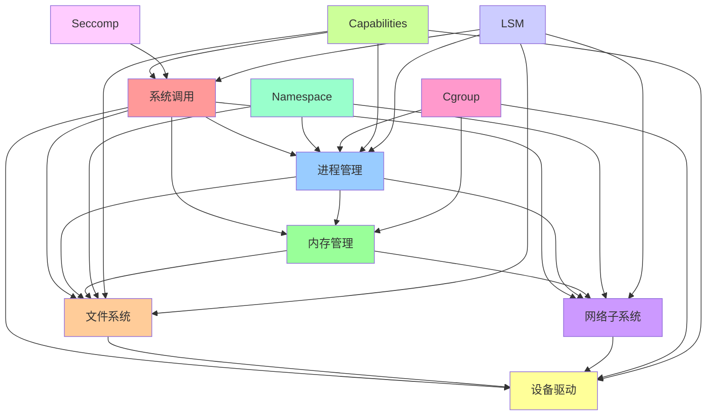
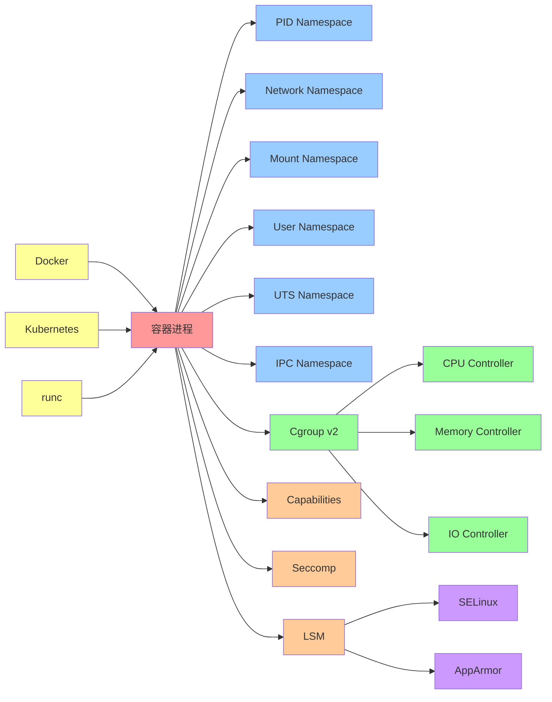
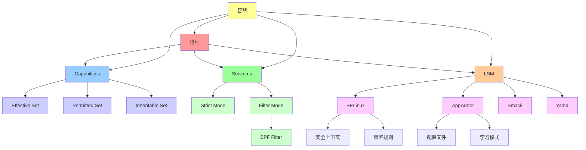
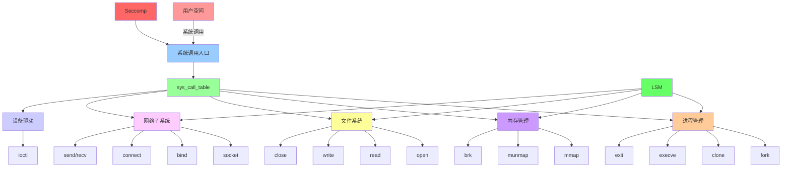
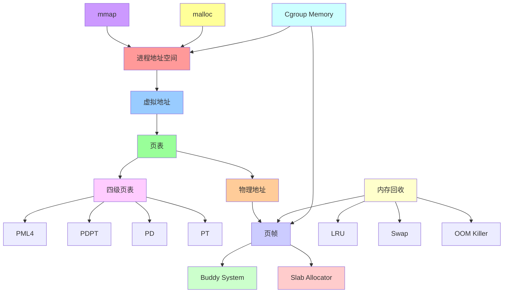

# 内核机制关系图

## 📑 目录

- [内核机制关系图](#内核机制关系图)
  - [📑 目录](#-目录)
  - [1 内核机制依赖关系图](#1-内核机制依赖关系图)
  - [2 容器化机制关系图](#2-容器化机制关系图)
  - [3 安全机制关系图](#3-安全机制关系图)
  - [4 系统调用关系图](#4-系统调用关系图)
  - [5 内存管理关系图](#5-内存管理关系图)

---

## 1 内核机制依赖关系图

**关系说明**：

- **红色**：系统调用（核心接口）
- **蓝色**：进程管理
- **绿色**：内存管理
- **橙色**：文件系统
- **紫色**：网络子系统
- **黄色**：设备驱动
- **青色**：容器化机制
- **粉色**：安全机制

---

## 2 容器化机制关系图

**关系说明**：

- **红色**：容器进程（核心）
- **蓝色**：Namespace（隔离机制）
- **绿色**：Cgroup（资源限制）
- **橙色**：安全机制（权限控制）
- **紫色**：LSM 模块
- **黄色**：容器运行时

---

## 3 安全机制关系图

**关系说明**：

- **红色**：进程（核心）
- **蓝色**：Capabilities（权限控制）
- **绿色**：Seccomp（系统调用过滤）
- **橙色**：LSM（强制访问控制）
- **黄色**：容器（应用场景）

---

## 4 系统调用关系图

**关系说明**：

- **红色**：用户空间
- **蓝色**：系统调用入口
- **绿色**：系统调用表
- **橙色/紫色/黄色**：各子系统
- **深红色**：Seccomp（过滤）
- **深绿色**：LSM（安全检查）

---

## 5 内存管理关系图

**关系说明**：

- **红色**：进程地址空间
- **蓝色**：虚拟地址
- **绿色**：页表
- **橙色**：物理地址
- **紫色/黄色**：内存分配
- **青色**：内存回收
- **浅青色**：Cgroup 限制

---

**最后更新**：2025-11-07
**文档状态**：✅ 完整 | 📊 包含关系图谱 | 🎯 生产就绪
**维护者**：项目团队
