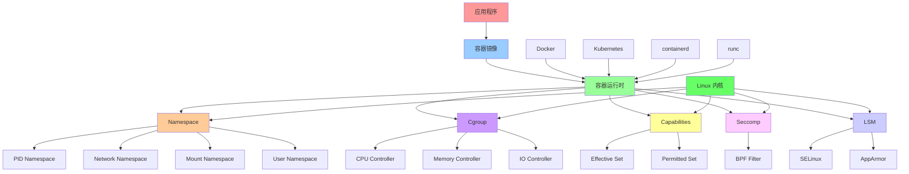
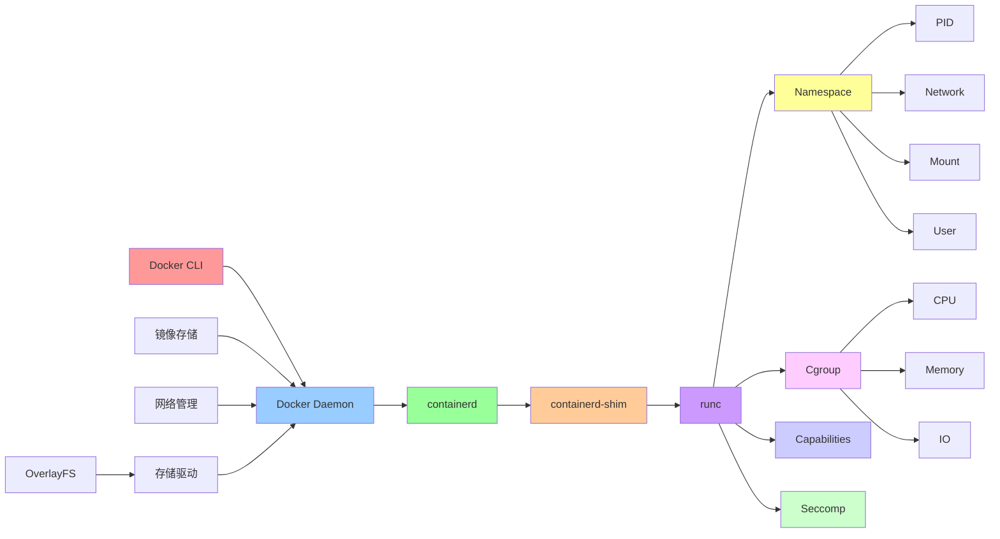
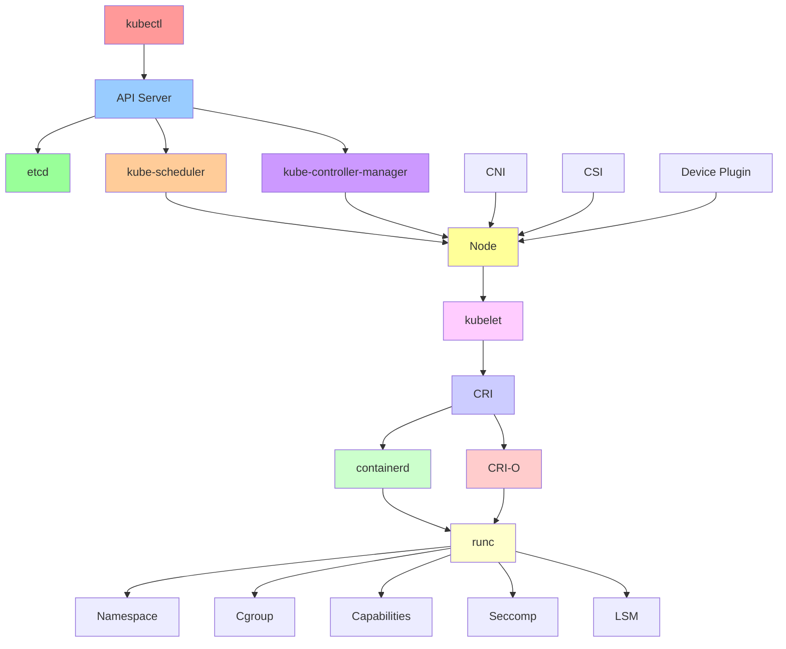
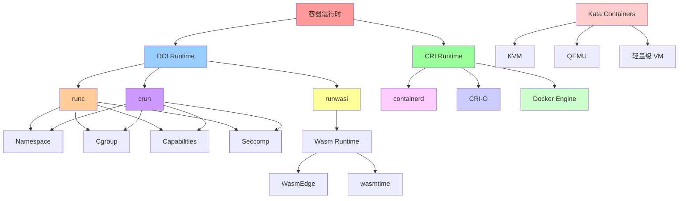
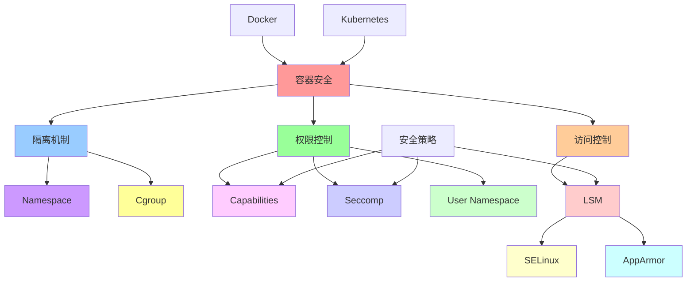

# 容器化技术栈关系图

## 📑 目录

- [容器化技术栈关系图](#容器化技术栈关系图)
  - [📑 目录](#-目录)
  - [1 容器化技术栈全景](#1-容器化技术栈全景)
  - [2 Docker 技术栈关系图](#2-docker-技术栈关系图)
  - [3 Kubernetes 技术栈关系图](#3-kubernetes-技术栈关系图)
  - [4 容器运行时关系图](#4-容器运行时关系图)

---

## 1 容器化技术栈全景

---

## 2 Docker 技术栈关系图

---

## 3 Kubernetes 技术栈关系图

---

## 4 容器运行时关系图

---

## 5 安全机制关系图

---

**最后更新**：2025-11-07
**文档状态**：✅ 完整 | 📊 包含技术栈关系图 | 🎯 生产就绪
**维护者**：项目团队
