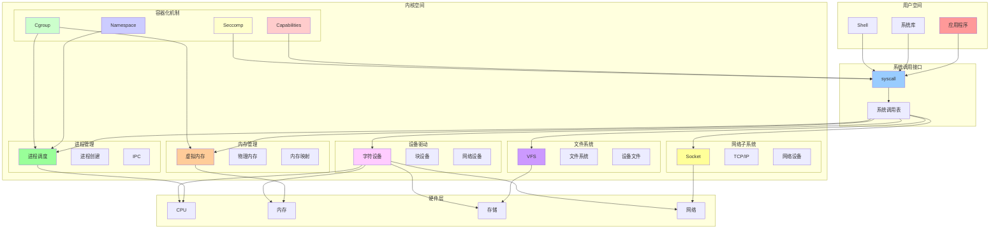
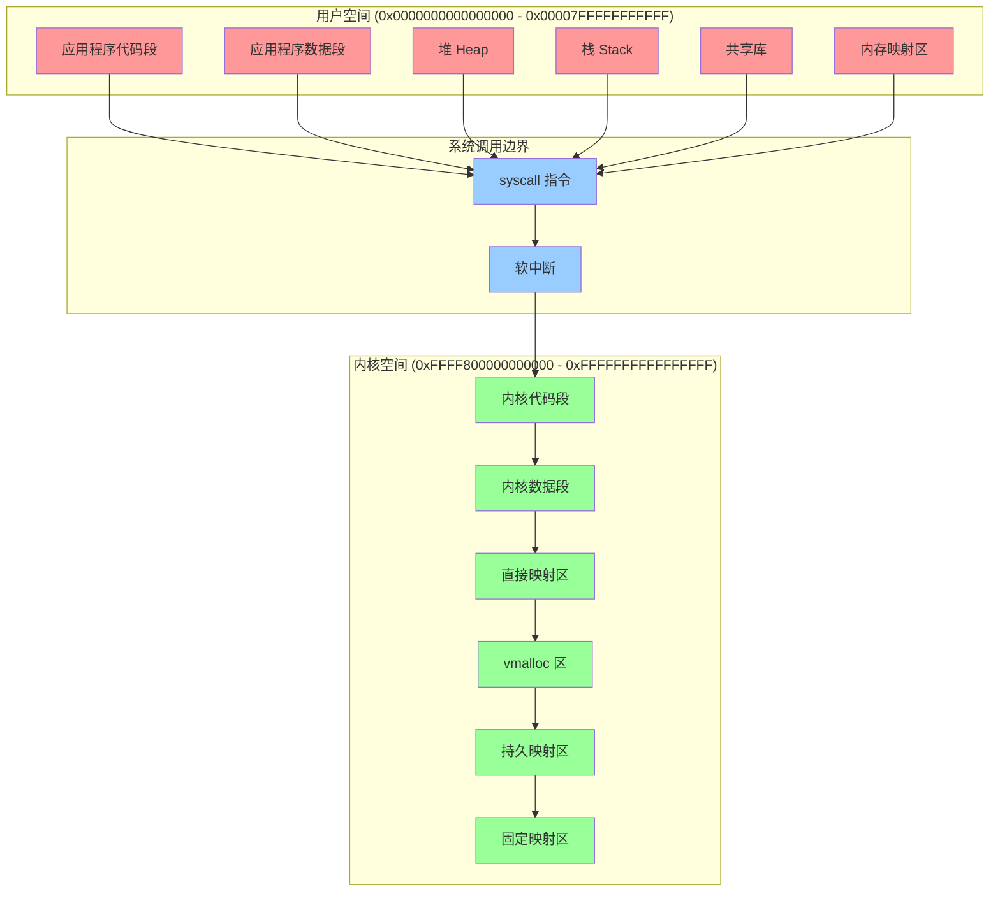
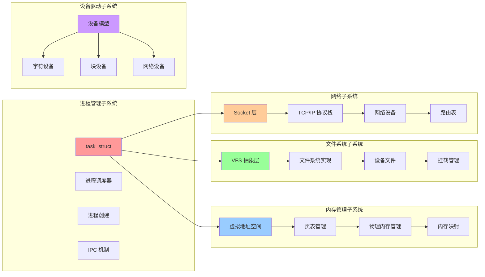
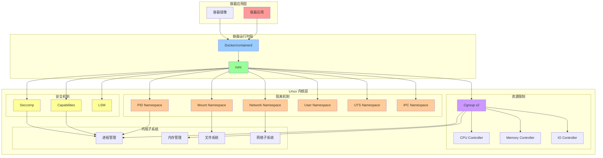

# 内核架构图

## 📑 目录

- [内核架构图](#内核架构图)
  - [📑 目录](#-目录)
  - [1 Linux 内核整体架构](#1-linux-内核整体架构)
  - [2 内核空间与用户空间](#2-内核空间与用户空间)
  - [3 内核子系统架构](#3-内核子系统架构)
  - [4 容器化架构](#4-容器化架构)

---

## 1 Linux 内核整体架构

---

## 2 内核空间与用户空间

---

## 3 内核子系统架构

---

## 4 容器化架构

---

**最后更新**：2025-11-07
**文档状态**：✅ 完整 | 📊 包含架构图 | 🎯 生产就绪
**维护者**：项目团队
