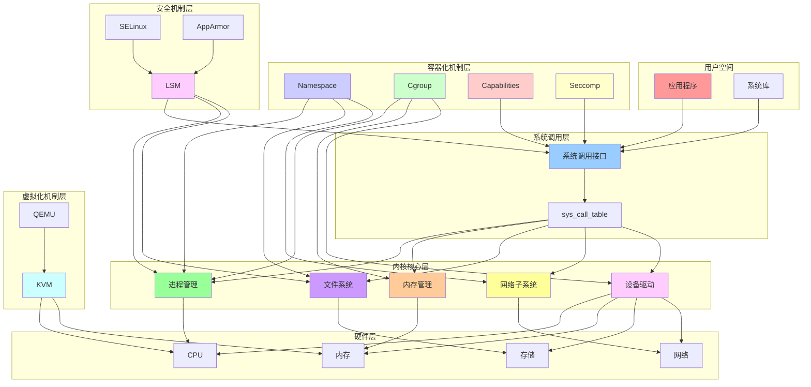
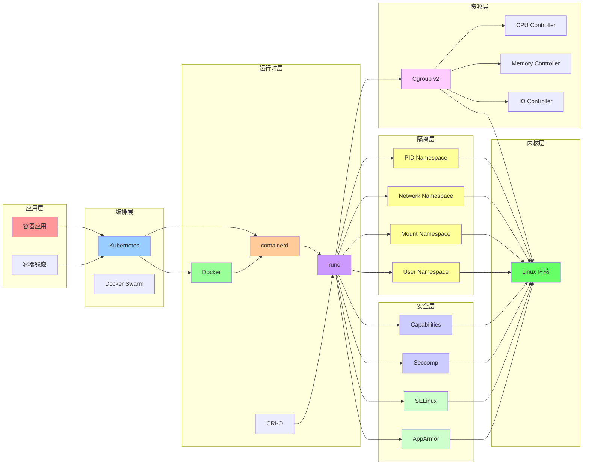
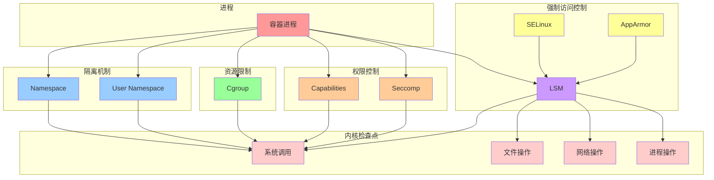
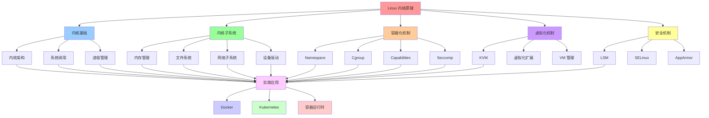
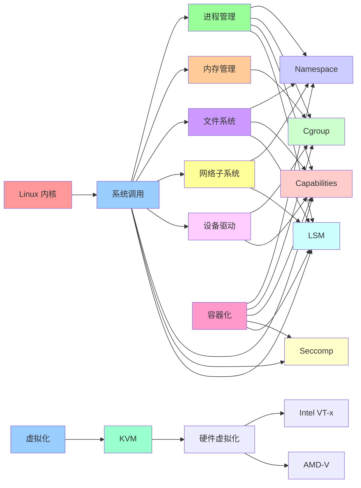

# 综合关系图谱

## 📑 目录

- [综合关系图谱](#综合关系图谱)
  - [📑 目录](#-目录)
  - [1 Linux 内核全景关系图](#1-linux-内核全景关系图)
  - [2 容器化技术栈全景图](#2-容器化技术栈全景图)
  - [3 安全机制全景图](#3-安全机制全景图)
  - [4 学习路径关系图](#4-学习路径关系图)

---

## 1 Linux 内核全景关系图

---

## 2 容器化技术栈全景图

---

## 3 安全机制全景图

---

## 4 学习路径关系图

---

## 5 机制依赖关系图

---

**最后更新**：2025-11-07
**文档状态**：✅ 完整 | 📊 包含综合关系图谱 | 🎯 生产就绪
**维护者**：项目团队
