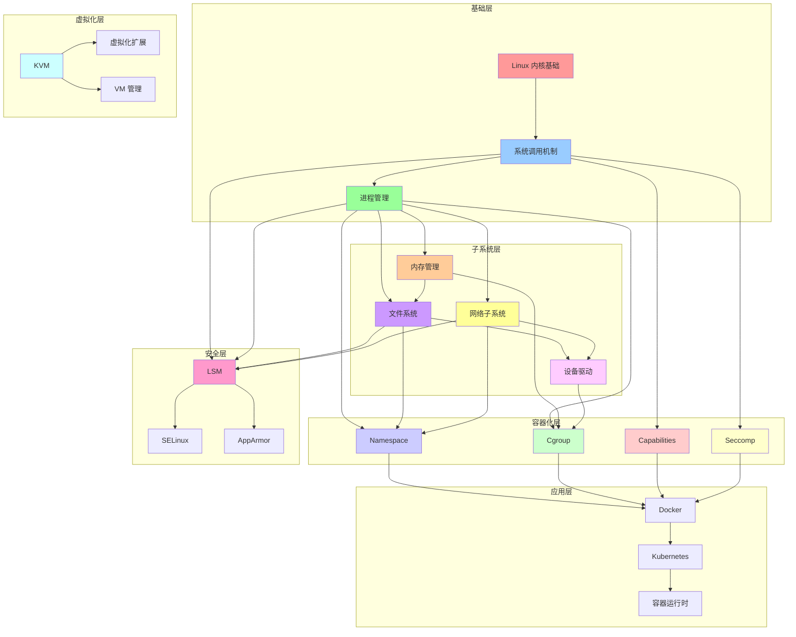
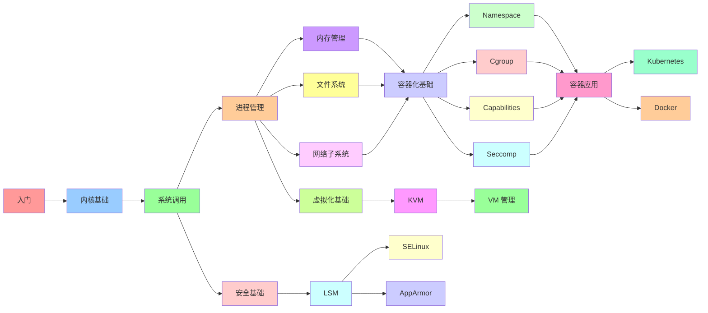
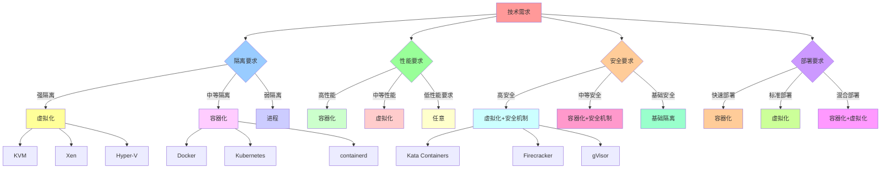
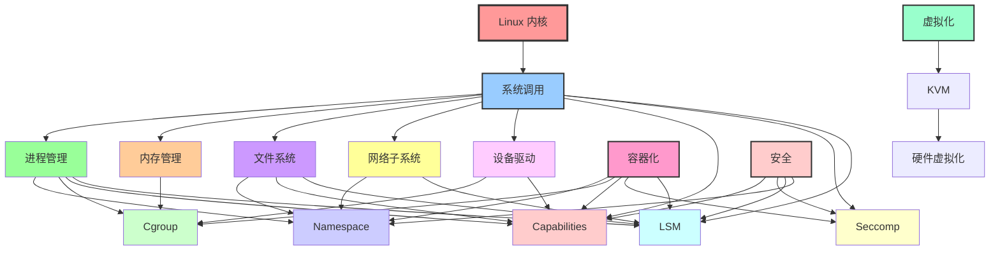
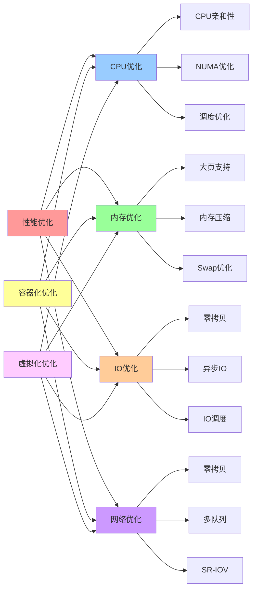

# Linux 内核原理知识地图

## 📑 目录

- [Linux 内核原理知识地图](#linux-内核原理知识地图)
  - [📑 目录](#-目录)
  - [1 知识地图全景](#1-知识地图全景)
  - [2 学习路径地图](#2-学习路径地图)
  - [3 技术选型地图](#3-技术选型地图)
  - [4 机制依赖关系地图](#4-机制依赖关系地图)
  - [5 性能优化地图](#5-性能优化地图)

---

## 1 知识地图全景

---

## 2 学习路径地图

---

## 3 技术选型地图

---

## 4 机制依赖关系地图

---

## 5 性能优化地图

---

**最后更新**：2025-11-07
**文档状态**：✅ 完整 | 📊 包含知识地图 | 🎯 生产就绪
**维护者**：项目团队
