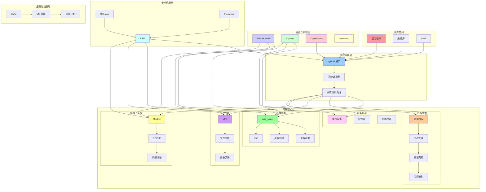
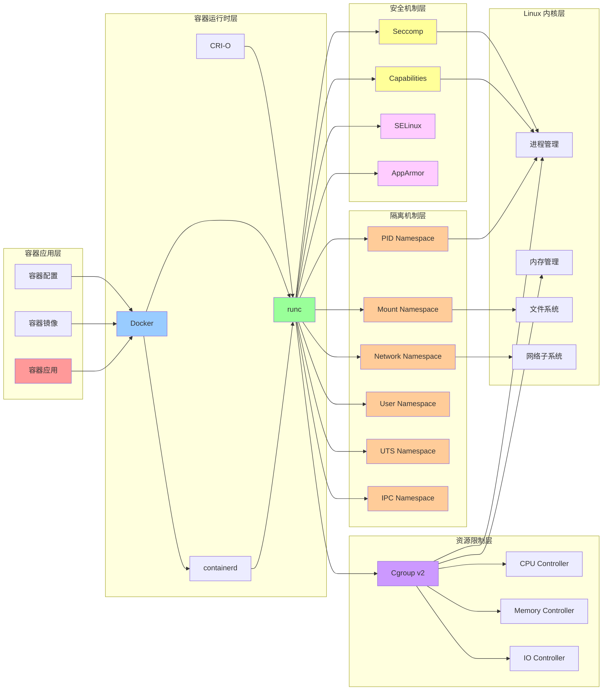
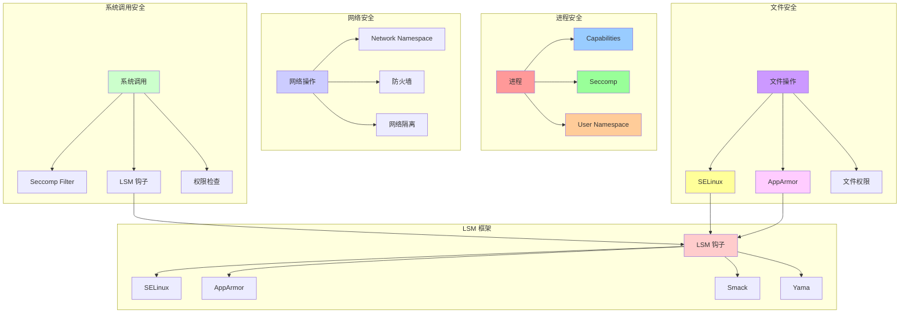
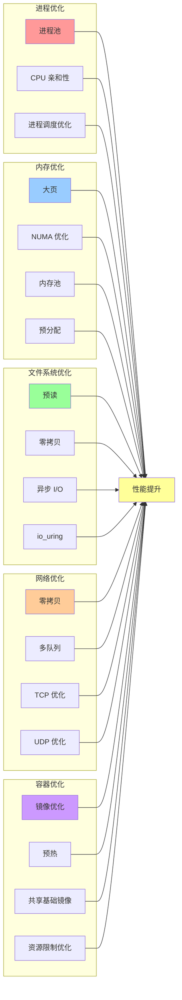

# Linux 内核原理综合知识地图

## 📑 目录

- [Linux 内核原理综合知识地图](#linux-内核原理综合知识地图)
  - [📑 目录](#-目录)
  - [1 内核原理知识地图](#1-内核原理知识地图)
  - [2 容器化技术知识地图](#2-容器化技术知识地图)
  - [3 安全机制知识地图](#3-安全机制知识地图)
  - [4 性能优化知识地图](#4-性能优化知识地图)

---

## 1 内核原理知识地图

---

## 2 容器化技术知识地图

---

## 3 安全机制知识地图

---

## 4 性能优化知识地图

---

**最后更新**：2025-11-07
**文档状态**：✅ 完整 | 📊 包含综合知识地图 | 🎯 生产就绪
**维护者**：项目团队

