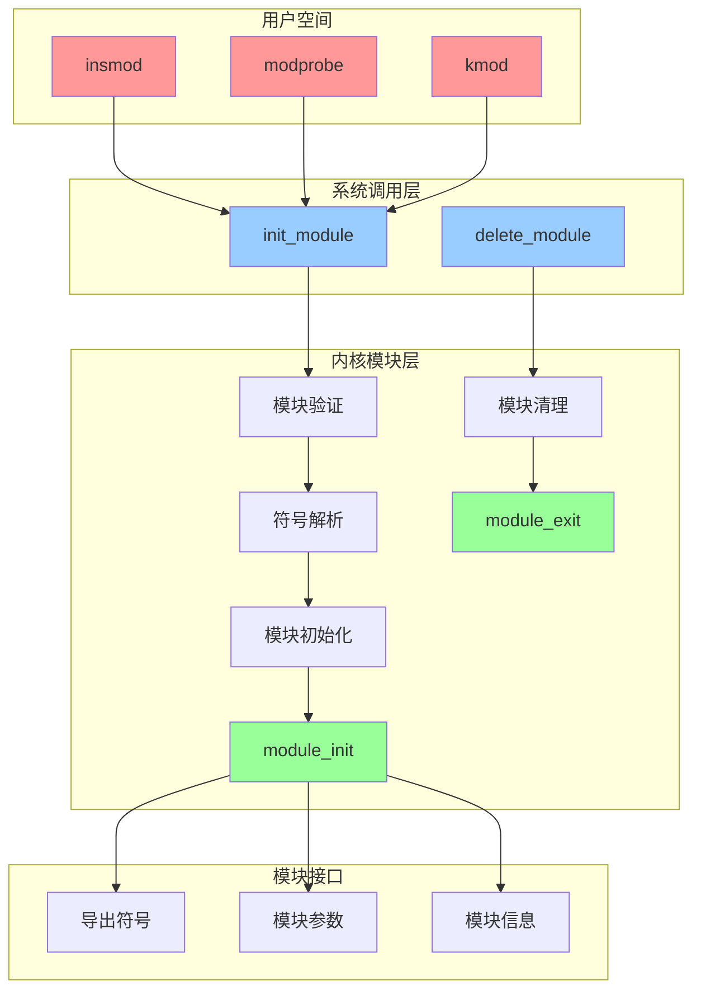
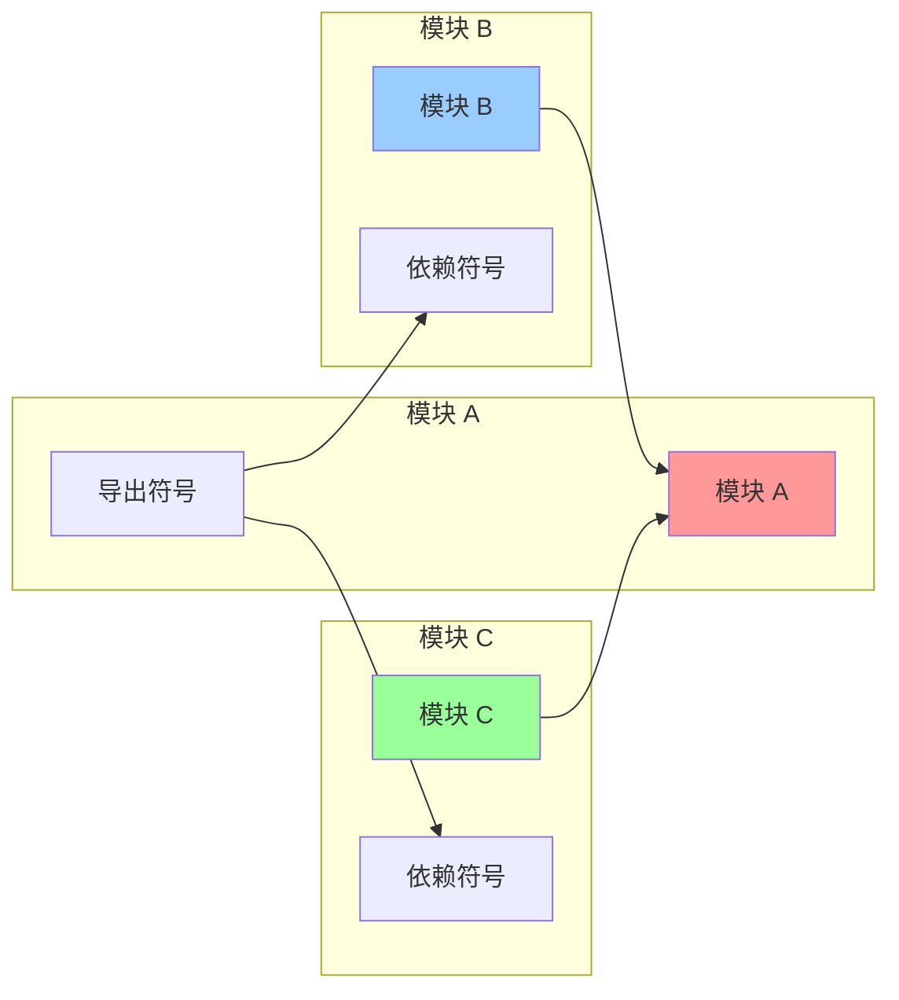
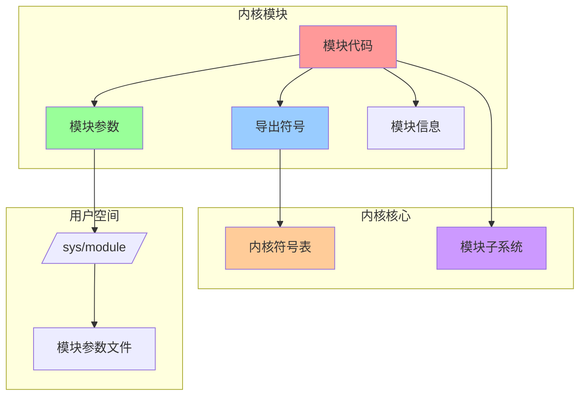
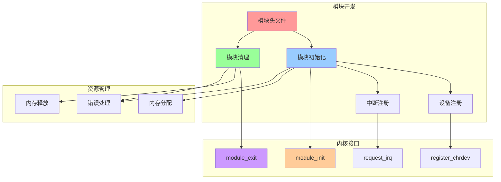

# 内核模块关系图

## 📑 目录

- [内核模块关系图](#内核模块关系图)
  - [📑 目录](#-目录)
  - [1 模块加载关系图](#1-模块加载关系图)
  - [2 模块依赖关系图](#2-模块依赖关系图)
  - [3 模块接口关系图](#3-模块接口关系图)
  - [4 模块开发关系图](#4-模块开发关系图)

---

## 1 模块加载关系图

---

## 2 模块依赖关系图

---

## 3 模块接口关系图

---

## 4 模块开发关系图

---

**最后更新**：2025-11-07
**文档状态**：✅ 完整 | 📊 包含内核模块关系图 | 🎯 生产就绪
**维护者**：项目团队
