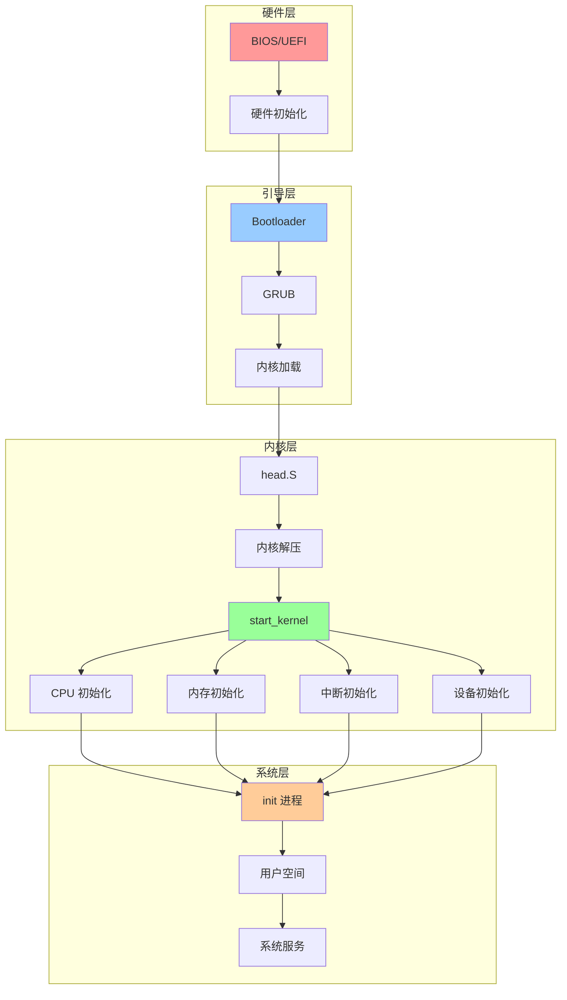
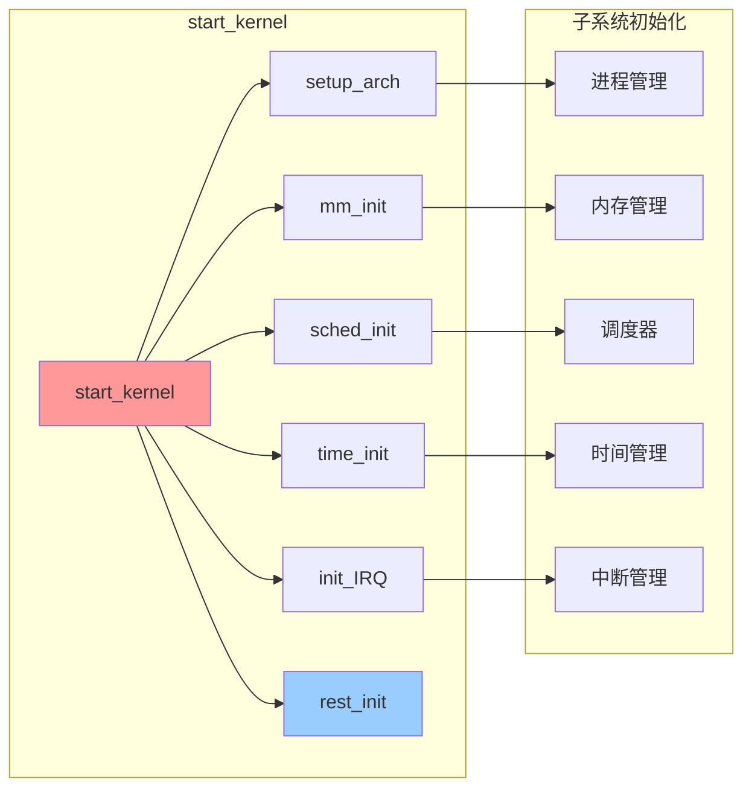
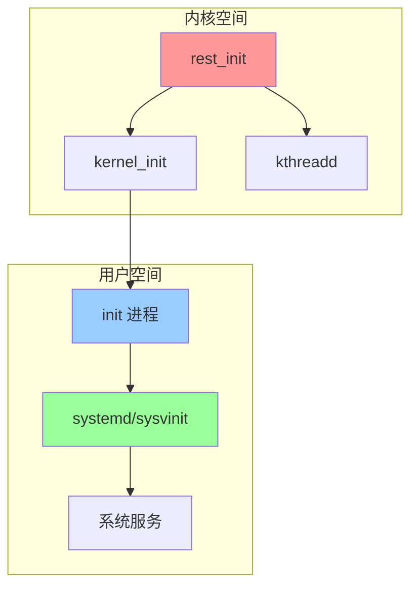

# 内核启动流程关系图

## 📑 目录

- [内核启动流程关系图](#内核启动流程关系图)
  - [📑 目录](#-目录)
  - [1 完整启动流程关系图](#1-完整启动流程关系图)
  - [2 内核初始化关系图](#2-内核初始化关系图)
  - [3 系统初始化关系图](#3-系统初始化关系图)

---

## 1 完整启动流程关系图

---

## 2 内核初始化关系图

---

## 3 系统初始化关系图

---

**最后更新**：2025-11-07
**文档状态**：✅ 完整 | 📊 包含内核启动流程关系图 | 🎯 生产就绪
**维护者**：项目团队
