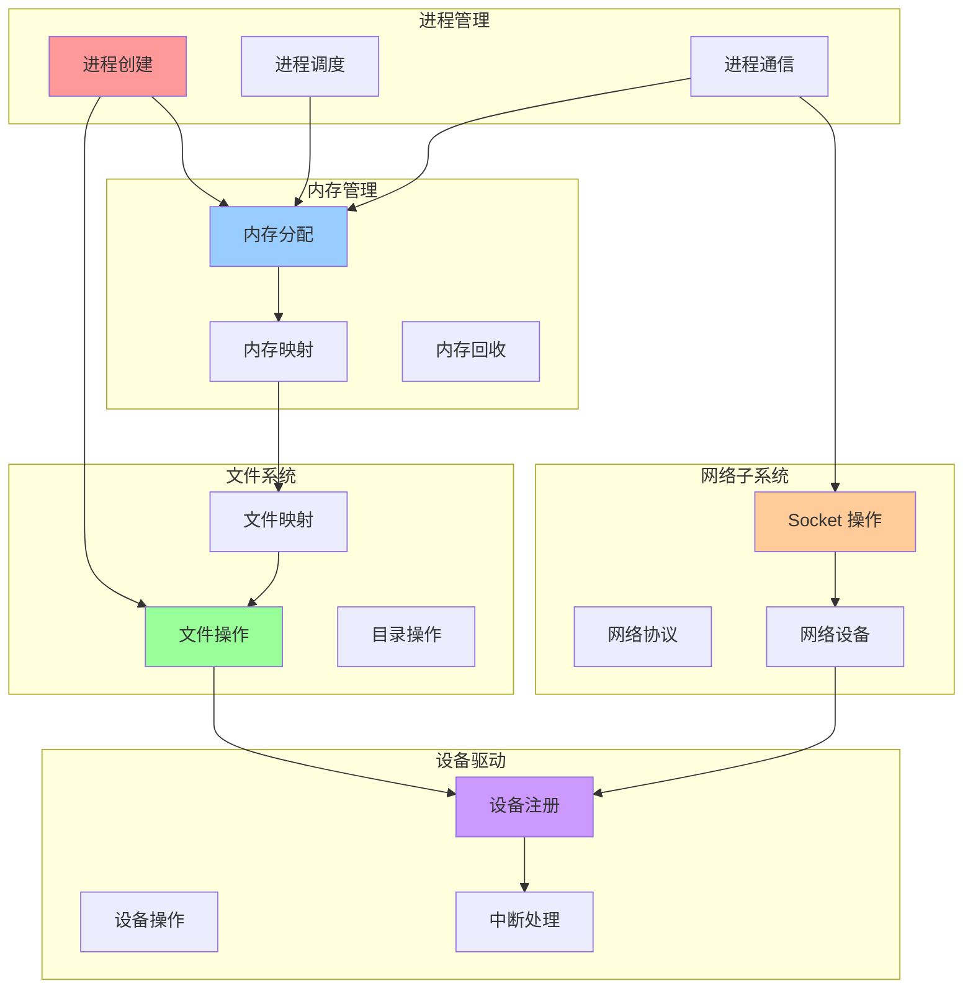
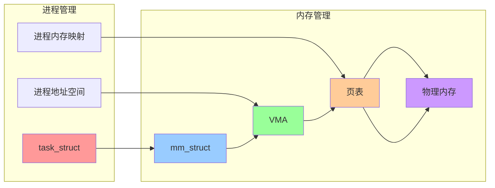
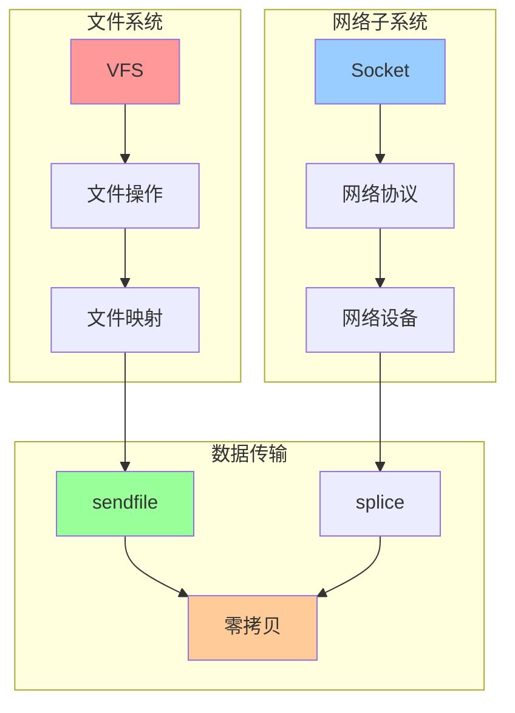
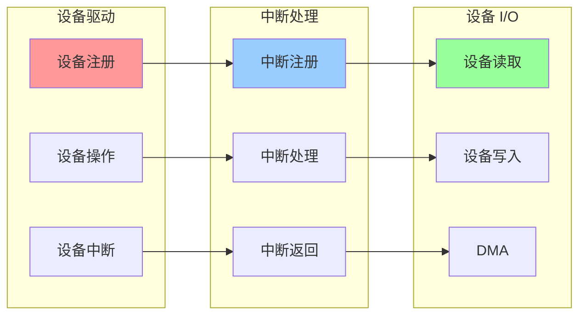

# 内核子系统集成关系图

## 📑 目录

- [内核子系统集成关系图](#内核子系统集成关系图)
  - [📑 目录](#-目录)
  - [1 内核子系统集成全景](#1-内核子系统集成全景)
  - [2 进程与内存集成关系图](#2-进程与内存集成关系图)
  - [3 文件系统与网络集成关系图](#3-文件系统与网络集成关系图)
  - [4 设备与中断集成关系图](#4-设备与中断集成关系图)

---

## 1 内核子系统集成全景

---

## 2 进程与内存集成关系图

---

## 3 文件系统与网络集成关系图

---

## 4 设备与中断集成关系图

---

**最后更新**：2025-11-07
**文档状态**：✅ 完整 | 📊 包含内核子系统集成关系图 | 🎯 生产就绪
**维护者**：项目团队
