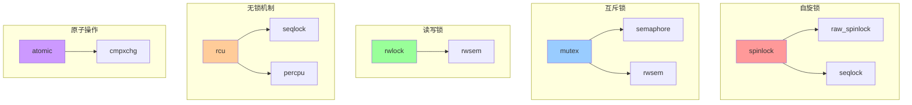
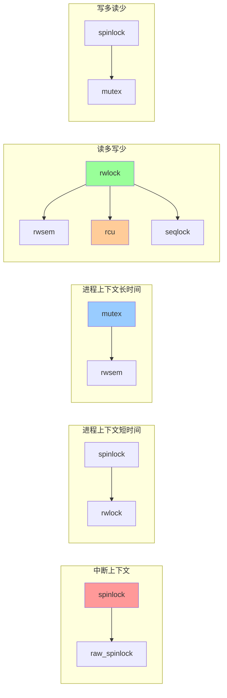
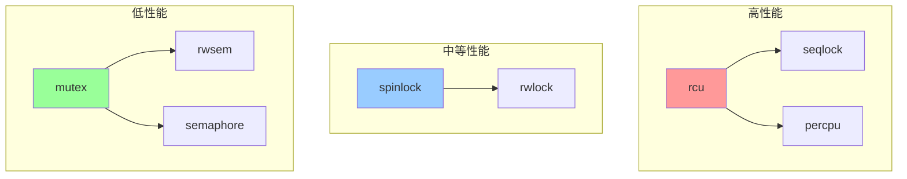

# 内核锁机制关系图

## 📑 目录

- [内核锁机制关系图](#内核锁机制关系图)
  - [📑 目录](#-目录)
  - [1 锁机制分类关系图](#1-锁机制分类关系图)
  - [2 锁使用场景关系图](#2-锁使用场景关系图)
  - [3 锁性能关系图](#3-锁性能关系图)

---

## 1 锁机制分类关系图

---

## 2 锁使用场景关系图

---

## 3 锁性能关系图

---

**最后更新**：2025-11-07
**文档状态**：✅ 完整 | 📊 包含内核锁机制关系图 | 🎯 生产就绪
**维护者**：项目团队
