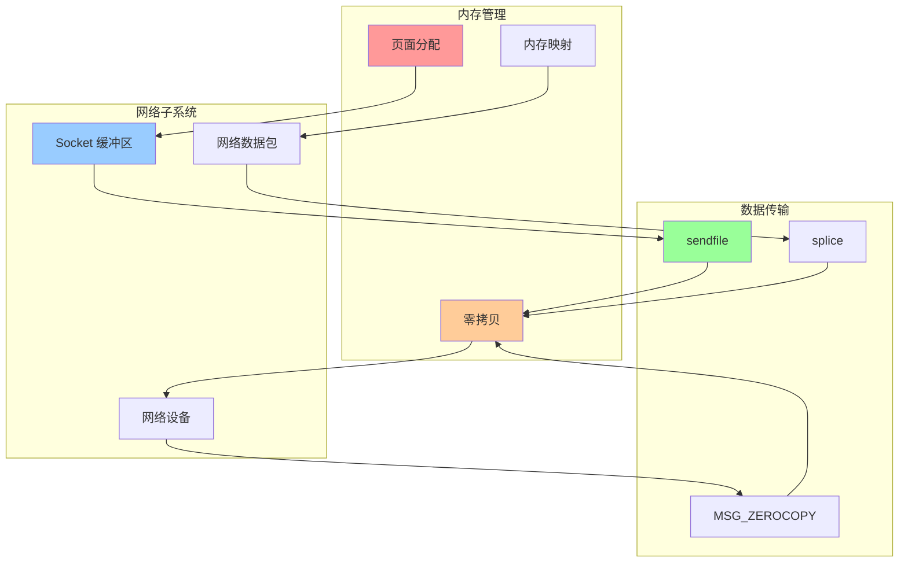
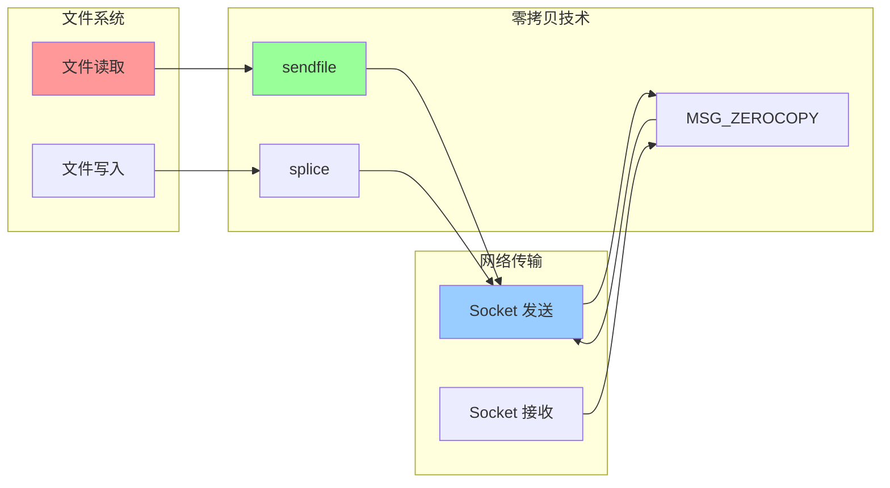
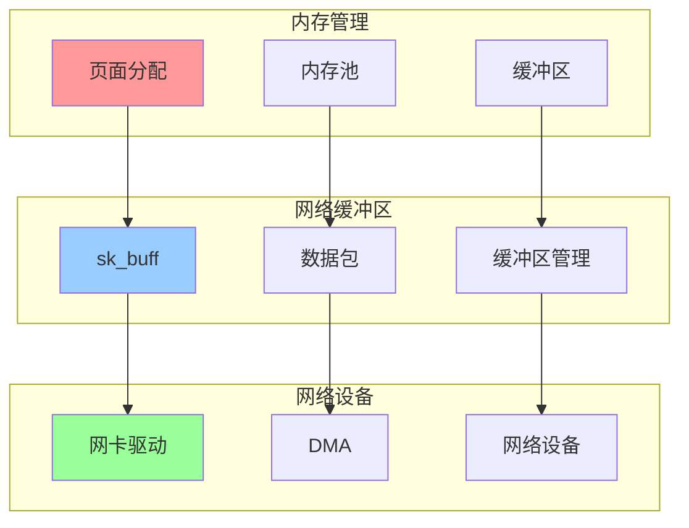

# 内核内存与网络集成关系图

## 📑 目录

- [内核内存与网络集成关系图](#内核内存与网络集成关系图)
  - [📑 目录](#-目录)
  - [1 内存与网络集成全景](#1-内存与网络集成全景)
  - [2 零拷贝技术关系图](#2-零拷贝技术关系图)
  - [3 网络缓冲区管理关系图](#3-网络缓冲区管理关系图)

---

## 1 内存与网络集成全景

---

## 2 零拷贝技术关系图

---

## 3 网络缓冲区管理关系图

---

**最后更新**：2025-11-07
**文档状态**：✅ 完整 | 📊 包含内核内存与网络集成关系图 | 🎯 生产就绪
**维护者**：项目团队
