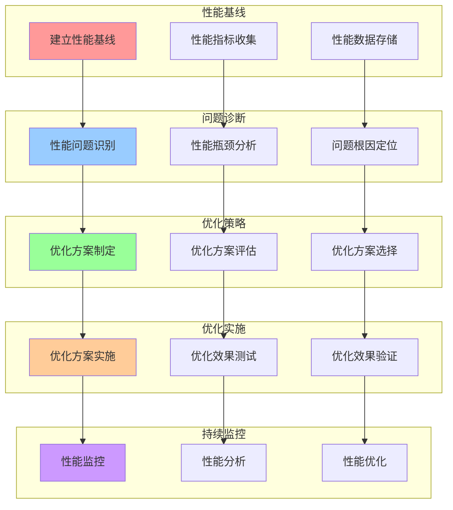
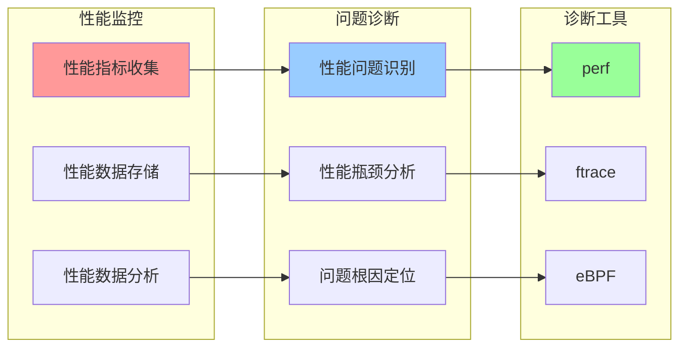
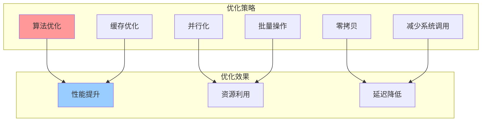

# 内核性能优化流程关系图

## 📑 目录

- [内核性能优化流程关系图](#内核性能优化流程关系图)
  - [📑 目录](#-目录)
  - [1 性能优化流程全景](#1-性能优化流程全景)
  - [2 性能诊断流程关系图](#2-性能诊断流程关系图)
  - [3 性能优化策略关系图](#3-性能优化策略关系图)

---

## 1 性能优化流程全景

---

## 2 性能诊断流程关系图

---

## 3 性能优化策略关系图

---

**最后更新**：2025-11-07
**文档状态**：✅ 完整 | 📊 包含内核性能优化流程关系图 | 🎯 生产就绪
**维护者**：项目团队
