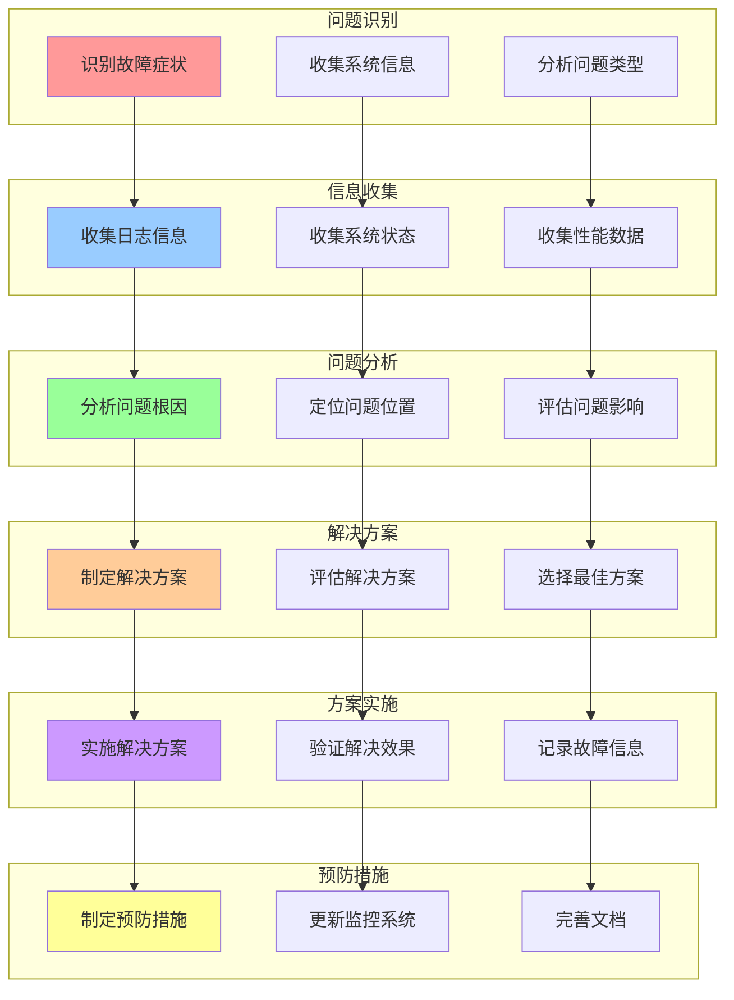
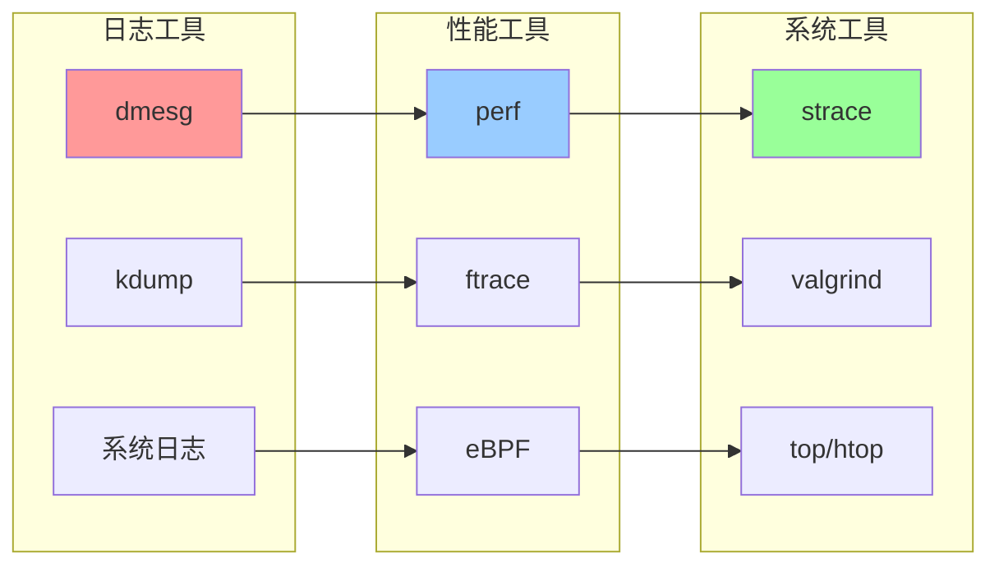
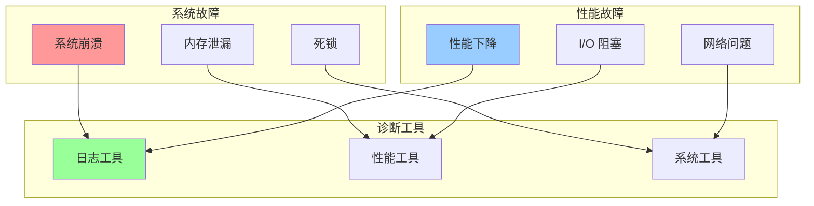

# 内核故障诊断流程关系图

## 📑 目录

- [内核故障诊断流程关系图](#内核故障诊断流程关系图)
  - [📑 目录](#-目录)
  - [1 故障诊断流程全景](#1-故障诊断流程全景)
  - [2 故障诊断工具关系图](#2-故障诊断工具关系图)
  - [3 故障类型关系图](#3-故障类型关系图)

---

## 1 故障诊断流程全景

---

## 2 故障诊断工具关系图

---

## 3 故障类型关系图

---

**最后更新**：2025-11-07
**文档状态**：✅ 完整 | 📊 包含内核故障诊断流程关系图 | 🎯 生产就绪
**维护者**：项目团队
