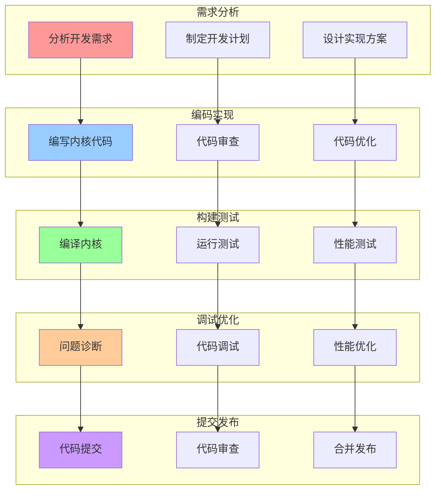
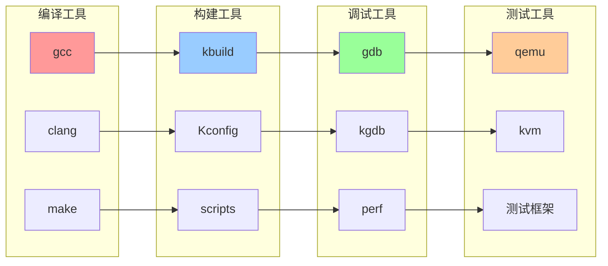
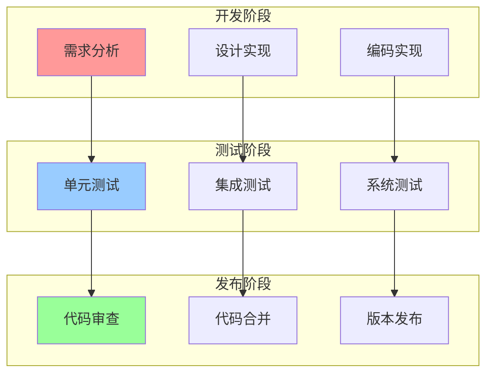

# 内核开发工作流关系图

## 📑 目录

- [内核开发工作流关系图](#内核开发工作流关系图)
  - [📑 目录](#-目录)
  - [1 开发工作流全景](#1-开发工作流全景)
  - [2 开发工具关系图](#2-开发工具关系图)
  - [3 开发流程关系图](#3-开发流程关系图)

---

## 1 开发工作流全景

---

## 2 开发工具关系图

---

## 3 开发流程关系图

---

**最后更新**：2025-11-07
**文档状态**：✅ 完整 | 📊 包含内核开发工作流关系图 | 🎯 生产就绪
**维护者**：项目团队
