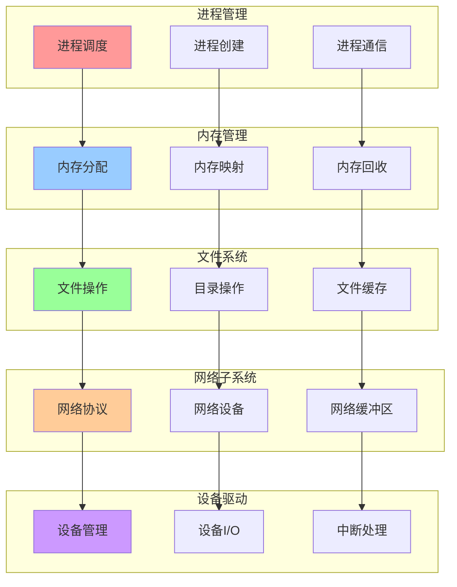
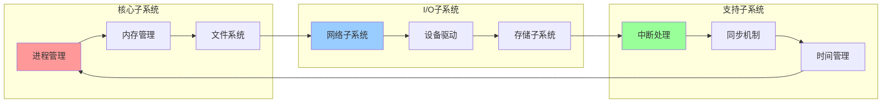
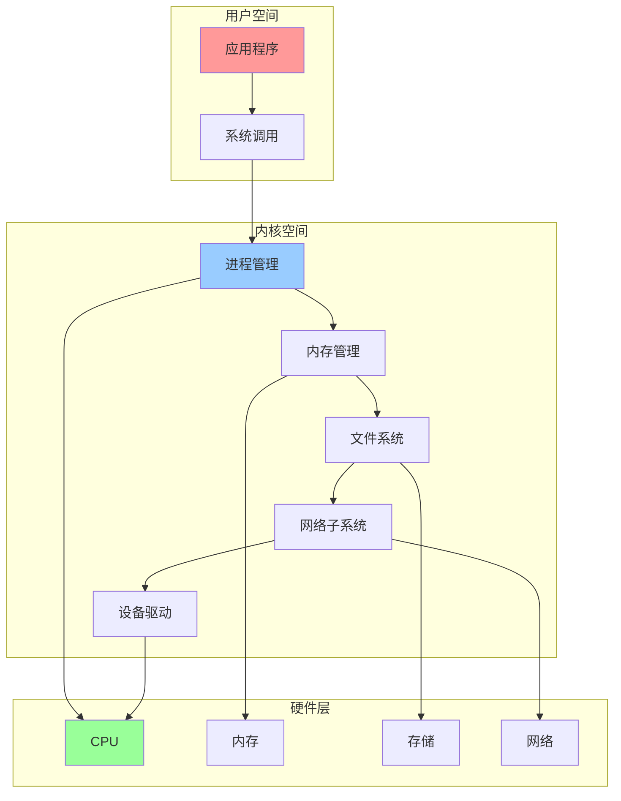

# 内核子系统综合集成关系图

## 📑 目录

- [内核子系统综合集成关系图](#内核子系统综合集成关系图)
  - [📑 目录](#-目录)
  - [1 子系统集成全景](#1-子系统集成全景)
  - [2 子系统交互关系图](#2-子系统交互关系图)
  - [3 子系统数据流关系图](#3-子系统数据流关系图)

---

## 1 子系统集成全景

---

## 2 子系统交互关系图

---

## 3 子系统数据流关系图

---

**最后更新**：2025-11-07
**文档状态**：✅ 完整 | 📊 包含内核子系统综合集成关系图 | 🎯 生产就绪
**维护者**：项目团队
