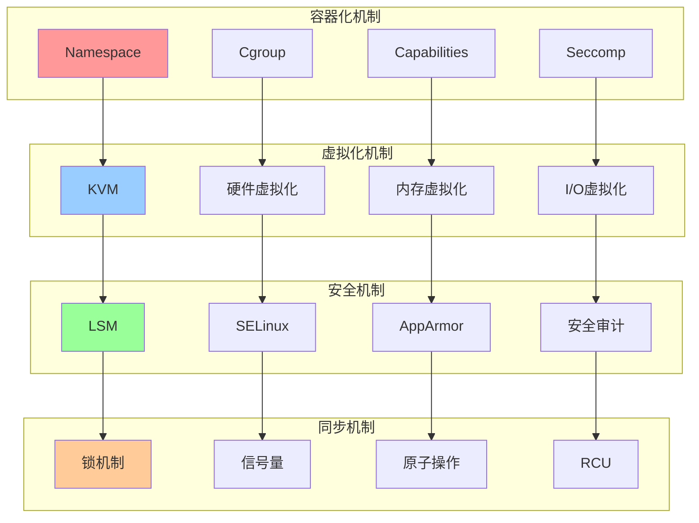
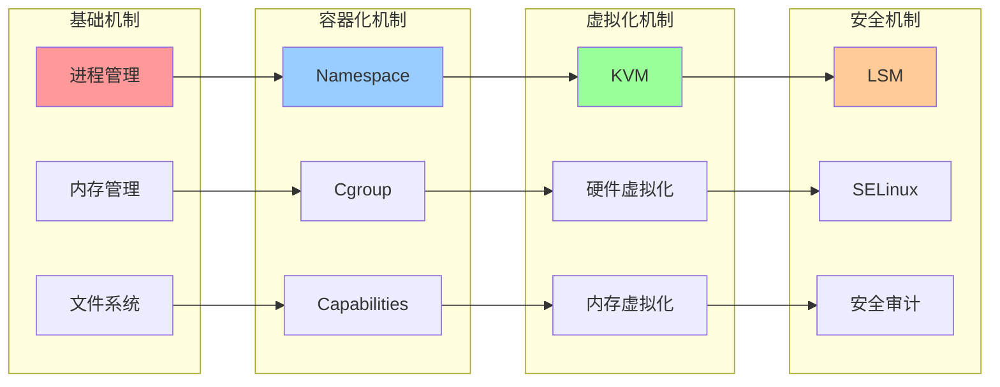
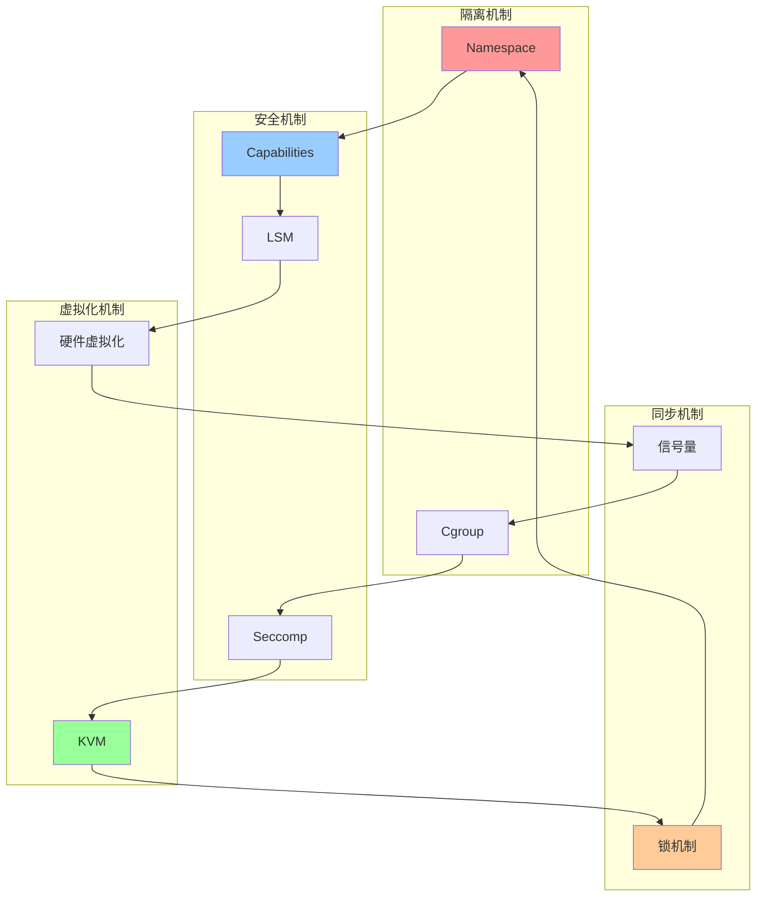

# 内核机制综合关系图

## 📑 目录

- [内核机制综合关系图](#内核机制综合关系图)
  - [📑 目录](#-目录)
  - [1 机制关系全景](#1-机制关系全景)
  - [2 机制依赖关系图](#2-机制依赖关系图)
  - [3 机制交互关系图](#3-机制交互关系图)

---

## 1 机制关系全景

---

## 2 机制依赖关系图

---

## 3 机制交互关系图

---

**最后更新**：2025-11-07
**文档状态**：✅ 完整 | 📊 包含内核机制综合关系图 | 🎯 生产就绪
**维护者**：项目团队
